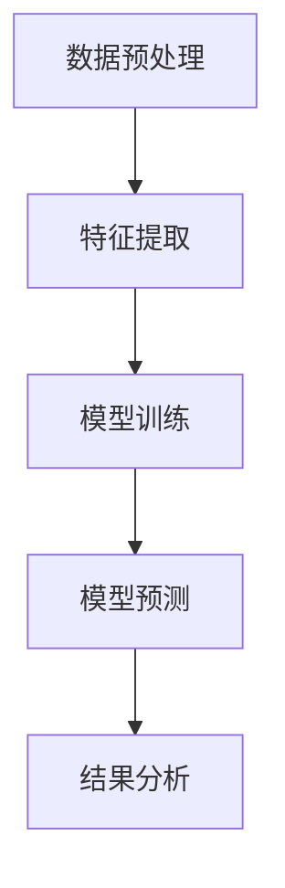
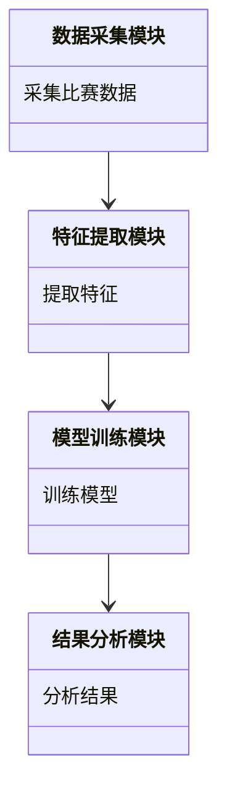
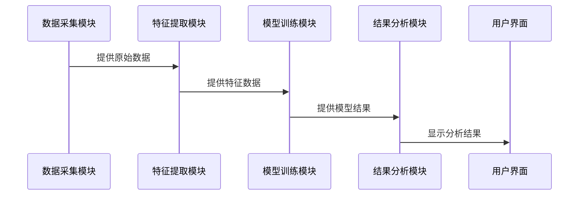

                 


# AI Agent在智能体育赛事分析中的角色

> **关键词**: AI Agent, 体育赛事分析, 智能系统, 数据分析, 机器学习, 深度学习

> **摘要**: AI Agent在智能体育赛事分析中扮演着越来越重要的角色。通过AI Agent，可以实时采集和处理海量体育数据，利用机器学习和深度学习算法进行分析和预测，辅助教练和运动员做出更科学的决策。本文详细探讨了AI Agent在体育赛事分析中的核心概念、技术原理、系统设计以及实际应用，并通过具体案例分析展示了其在提升体育训练和比赛表现中的巨大潜力。

---

# 第一部分: AI Agent在智能体育赛事分析中的角色概述

## 第1章: AI Agent的基本概念与背景

### 1.1 AI Agent的定义与核心概念

#### 1.1.1 AI Agent的定义
AI Agent（人工智能代理）是指能够感知环境、自主决策并执行任务的智能实体。在体育赛事分析中，AI Agent通常以软件或算法的形式存在，用于处理复杂的数据和信息。

#### 1.1.2 AI Agent的核心特征
- **自主性**: 能够自主执行任务，无需人工干预。
- **反应性**: 能够实时感知环境变化并做出反应。
- **学习能力**: 通过机器学习算法不断优化自身的分析和决策能力。
- **协作性**: 能够与其他系统或AI Agent协同工作。

#### 1.1.3 AI Agent与传统数据分析的区别
AI Agent不仅仅是数据处理工具，它具有更强的自主性和学习能力，能够主动优化分析结果并提供实时反馈。

### 1.2 智能体育赛事分析的背景与需求

#### 1.2.1 体育赛事分析的现状
传统体育分析主要依赖人工经验，存在效率低、主观性强、数据处理能力有限等问题。

#### 1.2.2 智能化分析的需求
随着体育行业的快速发展，对数据分析的实时性、精准性和全面性提出了更高的要求。AI Agent能够满足这些需求。

#### 1.2.3 AI Agent在体育赛事分析中的优势
- **高效性**: 能够快速处理海量数据。
- **准确性**: 利用机器学习算法提高分析结果的准确性。
- **实时性**: 实时监控比赛动态并提供即时反馈。

### 1.3 本章小结
本章介绍了AI Agent的基本概念及其在体育赛事分析中的重要性，为后续内容奠定了基础。

---

## 第2章: AI Agent的核心技术原理

### 2.1 AI Agent的感知机制

#### 2.1.1 数据采集与处理
AI Agent通过多种传感器和数据源采集体育比赛中的各项数据，包括球员动作、比赛节奏等。

#### 2.1.2 数据特征提取
利用特征工程方法提取关键特征，例如球员的位置、速度、加速度等。

#### 2.1.3 数据分析与建模
通过机器学习模型对数据进行分析和建模，提取有用的模式和规律。

### 2.2 AI Agent的决策机制

#### 2.2.1 策略生成与优化
基于分析结果，生成最优的比赛策略并不断优化。

#### 2.2.2 多目标优化算法
在复杂场景下，利用多目标优化算法平衡多个目标，例如进攻与防守的平衡。

#### 2.2.3 决策树与强化学习
使用决策树和强化学习方法，模拟人类教练的决策过程。

### 2.3 AI Agent的执行机制

#### 2.3.1 行动规划与执行
根据决策结果，制定具体的行动计划并执行。

#### 2.3.2 动态调整与反馈
实时监控执行效果并根据反馈动态调整策略。

#### 2.3.3 执行结果的评估与优化
对执行结果进行评估，并根据评估结果进一步优化策略。

### 2.4 本章小结
本章详细介绍了AI Agent在感知、决策和执行三个阶段的核心技术原理，为后续章节的系统设计和项目实战奠定了理论基础。

---

## 第3章: AI Agent在体育赛事分析中的数学模型与算法

### 3.1 数据预处理与特征提取

#### 3.1.1 数据清洗与标准化
通过数据清洗去除噪声数据，并进行标准化处理，确保数据的一致性。

#### 3.1.2 特征选择与降维
利用特征选择方法筛选出对分析结果影响较大的特征，并通过降维技术减少计算复杂度。

#### 3.1.3 时间序列数据处理
对时间序列数据进行分解和预测，例如使用ARIMA模型。

### 3.2 机器学习模型的构建

#### 3.2.1 监督学习模型
- **线性回归**: 用于预测比赛结果。
- **支持向量机(SVM)**: 用于分类任务，例如判断比赛胜负。

#### 3.2.2 无监督学习模型
- **聚类分析**: 将球员分为不同类别，分析其表现特点。
- **主成分分析(PCA)**: 降维技术，提取数据中的主要特征。

#### 3.2.3 深度学习模型
- **卷积神经网络(CNN)**: 用于图像识别，例如分析球员动作。
- **循环神经网络(RNN)**: 用于时间序列分析，例如预测比赛走势。

### 3.3 算法流程图


### 3.4 本章小结
本章通过具体的数学模型和算法，详细讲解了AI Agent在体育赛事分析中的技术实现过程。

---

## 第4章: AI Agent的系统分析与架构设计

### 4.1 系统功能设计

#### 4.1.1 数据采集模块
负责采集比赛数据，包括球员位置、速度、加速度等。

#### 4.1.2 特征提取模块
对采集到的数据进行特征提取和处理。

#### 4.1.3 模型训练模块
利用机器学习算法对数据进行建模和训练。

#### 4.1.4 结果分析模块
对模型输出的结果进行分析和解读。

### 4.2 系统架构设计

#### 4.2.1 系统架构图


#### 4.2.2 接口交互图


### 4.3 本章小结
本章从系统架构的角度，详细讲解了AI Agent在体育赛事分析中的整体设计和模块划分。

---

## 第5章: AI Agent的项目实战

### 5.1 项目环境配置

#### 5.1.1 数据集准备
需要准备包含比赛数据的结构化数据集，例如球员的运动轨迹数据。

#### 5.1.2 环境安装
安装必要的开发工具和库，例如Python、TensorFlow、Keras等。

### 5.2 系统核心实现

#### 5.2.1 数据预处理代码
```python
import pandas as pd
import numpy as np

# 读取数据
data = pd.read_csv('sports_data.csv')

# 数据清洗
data.dropna(inplace=True)

# 标准化处理
from sklearn.preprocessing import StandardScaler
scaler = StandardScaler()
scaled_data = scaler.fit_transform(data[['speed', 'acceleration']])
```

#### 5.2.2 模型训练代码
```python
from sklearn.model_selection import train_test_split
from sklearn.ensemble import RandomForestClassifier

# 划分训练集和测试集
X_train, X_test, y_train, y_test = train_test_split(scaled_data, data['label'], test_size=0.2)

# 训练模型
model = RandomForestClassifier()
model.fit(X_train, y_train)

# 预测结果
y_pred = model.predict(X_test)
```

#### 5.2.3 结果分析代码
```python
from sklearn.metrics import accuracy_score, confusion_matrix

print("Accuracy:", accuracy_score(y_test, y_pred))
print("Confusion Matrix:", confusion_matrix(y_test, y_pred))
```

### 5.3 实际案例分析

#### 5.3.1 案例背景
以一场足球比赛为例，分析球员的运动数据。

#### 5.3.2 案例分析
通过AI Agent分析，发现某球员在比赛中的跑位规律，帮助教练优化其战术安排。

### 5.4 本章小结
本章通过具体项目实战，详细讲解了AI Agent在体育赛事分析中的具体实现步骤和应用效果。

---

## 第6章: 总结与展望

### 6.1 研究总结
本文详细探讨了AI Agent在智能体育赛事分析中的角色，从技术原理到系统设计再到项目实战，全面展示了其在体育领域的应用潜力。

### 6.2 研究热点与未来展望
当前的研究主要集中在如何提高AI Agent的决策能力和实时性。未来的研究方向包括开发更高效的算法、优化系统架构以及拓展更多的应用场景。

### 6.3 最佳实践 tips
- 数据质量是AI Agent分析的基础，需重视数据的清洗和预处理。
- 模型的可解释性是实际应用的关键，需注重模型的解释能力。
- 注意数据隐私保护，确保运动员信息的安全。

### 6.4 本章小结
本文总结了AI Agent在体育赛事分析中的应用，并展望了未来的发展方向。

---

# 作者：AI天才研究院/AI Genius Institute & 禅与计算机程序设计艺术 /Zen And The Art of Computer Programming

---

这篇文章系统地介绍了AI Agent在智能体育赛事分析中的角色，从基本概念到技术实现再到实际应用，为读者提供了一个全面的视角。希望对您有所帮助！

