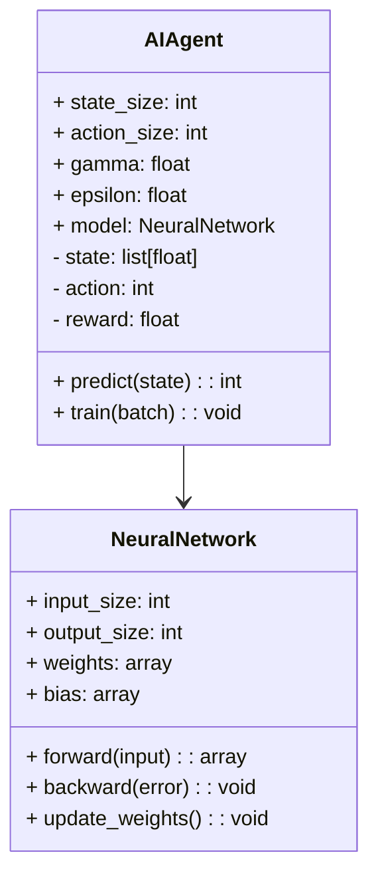
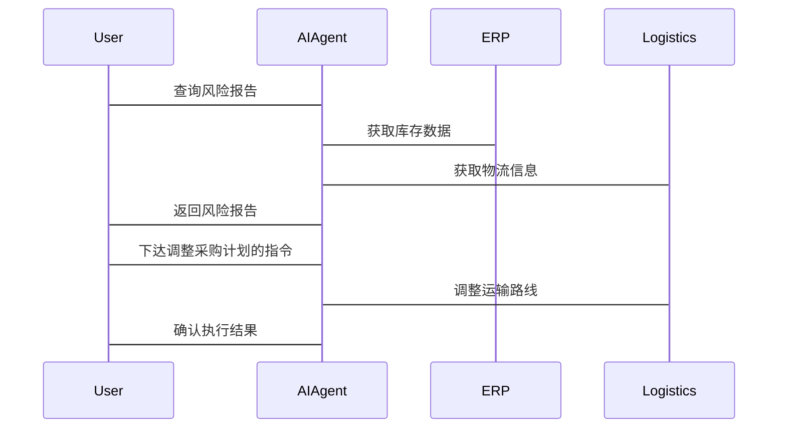

                 


# AI Agent在智能供应链风险预警中的应用

## 关键词：AI Agent, 智能供应链, 风险预警, 供应链管理, 人工智能, 供应链优化

## 摘要：AI Agent（人工智能代理）在智能供应链风险预警中的应用，通过实时数据分析和智能决策，帮助企业提前识别和应对潜在风险，优化供应链管理。本文详细探讨AI Agent在供应链中的角色，分析其核心算法和系统架构，并通过实战案例展示其在风险预警中的具体应用和价值。

---

# AI Agent在智能供应链风险预警中的应用

## 第一部分: AI Agent与智能供应链概述

### 第1章: AI Agent与供应链管理概述

#### 1.1 供应链管理的现状与挑战

- **1.1.1 供应链管理的基本概念**
  供应链管理是指协调从原材料采购到最终产品交付的整个过程，涉及采购、生产、物流等多个环节。
  
- **1.1.2 供应链中的主要风险类型**
  - 供应风险：供应商延迟交货或原材料短缺。
  - 生产风险：生产过程中设备故障或工人罢工。
  - 物流风险：运输延误或货物损坏。
  - 市场风险：需求预测不准确或市场价格波动。

- **1.1.3 传统供应链管理的局限性**
  - 依赖人工监控，效率低且容易出错。
  - 风险响应滞后，难以实时调整策略。

#### 1.2 AI Agent的基本概念与特点

- **1.2.1 AI Agent的定义**
  AI Agent是一种智能代理，能够感知环境、自主决策并执行任务，无需人类干预。

- **1.2.2 AI Agent的核心特征**
  - 自主性：无需外部指令，自主决策。
  - 反应性：实时感知环境变化并做出反应。
  - 学习能力：通过数据和经验不断优化性能。

- **1.2.3 AI Agent与传统自动化的区别**
  AI Agent具备学习和决策能力，而传统自动化仅执行预设任务。

#### 1.3 AI Agent在供应链中的应用前景

- **1.3.1 AI Agent在供应链管理中的优势**
  - 提高效率：自动化处理大量数据，减少人工干预。
  - 实时监控：快速识别潜在风险，及时采取措施。

- **1.3.2 AI Agent在供应链风险预警中的潜力**
  - 通过预测模型，提前识别潜在风险，优化资源配置。
  - 提供数据驱动的决策支持，降低供应链中断风险。

- **1.3.3 企业采用AI Agent的挑战与机遇**
  - 挑战：数据隐私、技术门槛、成本投入。
  - 机遇：提升竞争力，增强客户满意度，降低运营成本。

### 第2章: 智能供应链风险预警的核心概念

#### 2.1 供应链风险预警的定义与目标

- **2.1.1 供应链风险预警的定义**
  供应链风险预警是指通过监测供应链各环节的潜在风险，提前发出警报并采取应对措施。

- **2.1.2 风险预警的目标与意义**
  - 目标：最小化供应链中断带来的损失，确保供应链稳定运行。
  - 意义：提高企业应对不确定性的能力，增强供应链的弹性。

- **2.1.3 风险预警的实施步骤**
  1. 数据收集：整合供应链各环节的数据，如供应商交货时间、库存水平、市场需求。
  2. 风险识别：通过数据分析和机器学习模型，识别潜在风险。
  3. 风险评估：评估风险的严重性和影响范围。
  4. 风险缓解：制定应对策略，如调整采购计划、增加库存或寻找替代供应商。

#### 2.2 AI Agent在供应链风险预警中的角色

- **2.2.1 AI Agent作为风险预警工具的定位**
  AI Agent作为核心工具，负责数据处理、风险识别和决策制定。

- **2.2.2 AI Agent在风险识别中的作用**
  - 实时监控供应链数据，识别异常情况。
  - 通过历史数据分析，预测潜在风险。

- **2.2.3 AI Agent在风险缓解中的应用**
  - 自动调整采购订单，避免库存短缺。
  - 优化物流路线，减少运输时间。

#### 2.3 供应链风险预警的核心要素

- **2.3.1 数据来源与处理**
  - 数据来源：传感器、ERP系统、市场报告。
  - 数据处理：清洗、整合、分析。

- **2.3.2 风险评估模型**
  - 采用机器学习算法，如随机森林、支持向量机（SVM）。
  - 模型输出：风险概率和影响程度。

- **2.3.3 风险缓解策略**
  - 多级库存管理：设置安全库存，应对潜在短缺。
  - 多源采购：分散供应链风险，降低依赖单一供应商的风险。

---

## 第二部分: AI Agent的风险预警机制与算法原理

### 第3章: AI Agent的风险预警机制

#### 3.1 风险预警机制的流程

1. **数据收集**：整合供应链各环节的数据，包括供应商信息、库存数据、物流信息和市场动态。
2. **风险识别**：通过机器学习模型，识别潜在风险。
3. **风险评估**：评估风险的严重性和影响范围。
4. **决策制定**：根据评估结果，制定应对策略。
5. **执行反馈**：监控决策执行效果，优化模型。

#### 3.2 AI Agent的决策模型

- **强化学习**：通过试错学习，优化决策策略。
  - 状态空间：供应链各环节的状态，如库存水平、交货时间。
  - 动作空间：可能的决策，如增加订单、调整物流路线。
  - 奖励函数：衡量决策效果，如成本降低、交货准时。

- **监督学习**：基于历史数据，分类和预测风险。
  - 数据标注：标记历史数据中的风险事件。
  - 分类模型：如逻辑回归、神经网络，预测未来风险。

#### 3.3 算法原理与数学模型

- **强化学习算法：深度Q学习**
  - 状态表示：$s_t$ 表示当前供应链状态。
  - 动作选择：$\alpha_t$ 通过策略网络选择动作。
  - 奖励计算：$r_{t+1}$ 根据执行动作的效果计算奖励。
  - 模型更新：通过经验回放和目标网络更新策略网络。

  ```mermaid
  graph TD
      A[状态 s_t] --> B[动作选择 α_t]
      B --> C[奖励 r_{t+1}]
      C --> D[模型更新]
  ```

  ```python
  # 简单的Q-learning算法
  import numpy as np
  import random

  class AIAgent:
      def __init__(self, state_size, action_size):
          self.state_size = state_size
          self.action_size = action_size
          self.gamma = 0.99
          self.epsilon = 0.1
          self.model = self.build_model()

      def build_model(self):
          # 构建神经网络模型
          pass

      def act(self, state):
          if random.random() < self.epsilon:
              return random.randint(0, self.action_size-1)
          return np.argmax(self.model.predict(state))

      def remember(self, state, action, reward, next_state):
          # 存储经验
          pass

      def replay(self, batch_size):
          # 回放经验并更新模型
          pass
  ```

---

## 第三部分: 系统分析与架构设计

### 第4章: 供应链风险预警系统的架构设计

#### 4.1 系统功能设计

- **风险识别模块**：实时监控供应链数据，识别潜在风险。
- **风险评估模块**：评估风险的严重性和影响范围。
- **决策制定模块**：基于评估结果，制定应对策略。
- **执行反馈模块**：监控决策执行效果，优化模型。

#### 4.2 系统架构设计



#### 4.3 系统接口设计

- **数据接口**：与ERP系统、传感器等集成，获取实时数据。
- **用户接口**：提供风险预警报告和决策建议。
- **外部接口**：与其他系统（如物流管理系统）集成，执行决策。

#### 4.4 系统交互设计



---

## 第四部分: 项目实战与优化

### 第5章: 供应链风险预警系统的实现

#### 5.1 环境安装与配置

- **安装Python环境**：使用Anaconda或virtualenv。
- **安装依赖库**：如TensorFlow、Keras、numpy、pandas。
- **数据集准备**：收集供应链相关数据，清洗和预处理。

#### 5.2 核心代码实现

```python
# 简单的AI Agent实现
import numpy as np
import pandas as pd

class AIAgent:
    def __init__(self, input_dim):
        self.input_dim = input_dim
        self.model = self.build_model()

    def build_model(self):
        from tensorflow.keras import layers
        model = layers.Sequential()
        model.add(layers.Dense(64, activation='relu', input_dim=self.input_dim))
        model.add(layers.Dense(1, activation='sigmoid'))
        model.compile(optimizer='adam', loss='binary_crossentropy', metrics=['accuracy'])
        return model

    def train(self, x_train, y_train, epochs=100):
        self.model.fit(x_train, y_train, epochs=epochs, batch_size=32)

    def predict(self, x_test):
        return self.model.predict(x_test)

# 示例数据
data = pd.read_csv('supply_chain_data.csv')
x_train = data[['inventory', 'lead_time', 'demand']]
y_train = data['risk_flag']
agent = AIAgent(input_dim=3)
agent.train(x_train, y_train)
```

#### 5.3 实际案例分析与优化

- **案例分析**：某公司通过AI Agent预测供应商交货延迟，提前调整采购计划，降低库存成本。
- **优化建议**：结合实时数据，动态调整模型参数，提高预测精度。

---

## 第五部分: 总结与展望

### 第6章: 总结与展望

#### 6.1 总结

- AI Agent在供应链风险预警中的应用显著提升了供应链的稳定性和效率。
- 通过实时数据分析和智能决策，企业能够快速响应风险，降低损失。

#### 6.2 展望

- **多智能体协作**：未来，多个AI Agent可以在供应链的不同环节协同工作，形成更加智能的供应链网络。
- **边缘计算的应用**：通过边缘计算，AI Agent可以在供应链的各个节点实时处理数据，减少延迟，提高响应速度。
- **可持续发展**：AI Agent可以帮助企业优化资源利用，减少浪费，推动绿色供应链的发展。

---

## 作者：AI天才研究院 & 禅与计算机程序设计艺术

---

以上目录大纲和内容概述展示了《AI Agent在智能供应链风险预警中的应用》的核心内容，涵盖了从概念到实践的各个方面，结合理论分析和实际案例，帮助读者全面理解AI Agent在供应链管理中的应用价值和实现方法。

