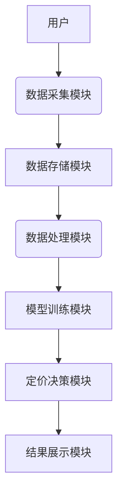
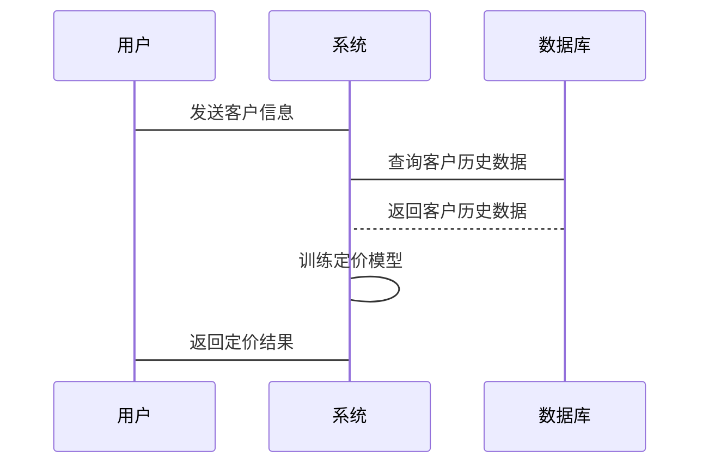

                 


# AI Agent在智能保险产品定价中的应用

## 关键词：
AI Agent, 智能保险, 产品定价, 机器学习, 风险管理, 保险科技, 大数据分析

## 摘要：
随着人工智能技术的快速发展，AI Agent（人工智能代理）在保险产品定价中的应用日益广泛。本文将详细探讨AI Agent的核心概念、算法原理及其在保险定价中的实际应用。通过分析传统定价方法的局限性，本文展示了AI Agent如何利用大数据分析和机器学习技术，优化定价流程，提高定价准确性，并降低风险。文章还通过具体的项目案例，详细讲解了AI Agent在保险定价系统中的实现过程，包括系统设计、算法选择和实际应用。最后，本文总结了AI Agent在保险定价中的优势与挑战，并展望了其未来的发展方向。

---

# 第1章: AI Agent与保险定价概述

## 1.1 AI Agent的基本概念

### 1.1.1 AI Agent的定义与特点
人工智能代理（AI Agent）是指能够感知环境、自主决策并执行任务的智能实体。AI Agent在保险行业中的应用，主要体现在自动化数据处理、风险评估和定价优化等方面。其特点包括：

- **自主性**：能够独立决策，无需人工干预。
- **反应性**：能够实时感知环境变化并做出响应。
- **学习能力**：通过机器学习技术不断优化自身的决策能力。
- **适应性**：能够根据新的数据和反馈调整其行为策略。

### 1.1.2 AI Agent在保险行业的应用背景
保险行业的核心任务之一是通过精准的定价模型，确保公司在承保风险的同时实现盈利。传统的定价方法依赖于经验丰富的精算师，但这种方法存在效率低、成本高等问题。随着大数据和人工智能技术的发展，AI Agent为保险定价带来了新的可能性。

### 1.1.3 保险产品定价的基本原理
保险产品定价的核心在于准确评估风险，并在此基础上制定合理的保费。传统定价方法通常基于历史数据和统计模型，而AI Agent则通过机器学习算法，从海量数据中提取特征，构建更加精准的定价模型。

---

## 1.2 AI Agent在保险定价中的作用

### 1.2.1 AI Agent如何优化保险定价
AI Agent通过自动化数据处理和智能决策，显著优化了保险定价流程。例如，AI Agent可以实时分析客户的驾驶行为数据，动态调整车险保费。此外，AI Agent还可以通过预测模型，识别高风险客户，从而优化定价策略。

### 1.2.2 AI Agent在定价中的优势与挑战
- **优势**：
  - 提高定价效率：通过自动化数据处理和机器学习算法，AI Agent能够快速生成定价方案。
  - 增强定价准确性：AI Agent可以从海量数据中提取关键特征，构建更精准的定价模型。
  - 实现个性化定价：基于客户的个性化需求和行为数据，AI Agent能够制定差异化的定价策略。
  
- **挑战**：
  - 数据隐私问题：AI Agent需要处理大量客户数据，如何保护数据隐私是一个重要挑战。
  - 模型解释性：复杂的机器学习模型可能难以解释其决策过程，影响精算师的判断。
  - 技术依赖性：AI Agent的性能高度依赖于算法和数据质量，需要持续的技术支持和优化。

### 1.2.3 保险定价的未来趋势
随着AI技术的不断进步，未来的保险定价将更加依赖于AI Agent。通过实时数据处理和动态调整，AI Agent将帮助保险公司实现更加精准和个性化的定价策略。同时，保险行业的数据隐私和模型解释性问题也将得到进一步解决。

---

# 第2章: AI Agent的核心概念与原理

## 2.1 AI Agent的核心原理

### 2.1.1 AI Agent的感知、决策与执行机制
AI Agent的感知、决策和执行机制是其工作的核心流程：

1. **感知**：AI Agent通过传感器或数据接口获取环境中的信息，例如客户的保费支付记录、驾驶行为数据等。
2. **决策**：基于感知到的数据，AI Agent利用机器学习算法进行分析，生成定价策略。
3. **执行**：AI Agent根据决策结果执行相应的操作，例如调整保费或生成报价单。

### 2.1.2 AI Agent的分类与特点对比
AI Agent可以根据其智能水平和应用场景分为多种类型，以下是几种主要的分类及其特点对比：

| **分类**       | **特点**                                                                 |
|----------------|--------------------------------------------------------------------------|
| 基于规则的AI Agent | 依赖于预定义的规则和决策树，适用于规则明确的场景。                         |
| 基于模型的AI Agent | 基于机器学习模型进行决策，适用于数据复杂且规则不明确的场景。                 |
| 强化学习AI Agent  | 通过与环境的交互不断优化其行为策略，适用于动态变化的复杂场景。               |

### 2.1.3 AI Agent与传统定价模型的对比分析
传统的定价模型通常基于统计分析和精算方法，而AI Agent则利用机器学习算法进行预测和优化。以下是对两者的对比分析：

| **对比维度**       | **传统定价模型**                          | **AI Agent定价模型**                     |
|---------------------|------------------------------------------|------------------------------------------|
| 数据依赖性         | 依赖于历史数据和统计分析。                | 依赖于实时数据和机器学习算法。            |
| 模型复杂性         | 模型相对简单，易于解释。                   | 模型复杂，难以解释，但准确性更高。         |
| 定价效率           | 定价效率较低，依赖人工干预。               | 定价效率高，自动化程度高。                 |
| 适应性             | 适应性较低，难以应对动态变化。             | 适应性较高，能够实时调整定价策略。         |

---

## 2.2 AI Agent的数学模型与算法基础

### 2.2.1 保险定价的数学模型
保险定价的核心是构建一个能够准确预测风险的数学模型。常用的数学模型包括：

1. **线性回归模型**：用于预测保费与客户特征之间的线性关系。
2. **决策树模型**：通过树状结构进行分类和回归，适用于客户特征较多的场景。
3. **随机森林模型**：基于决策树的集成方法，具有较高的准确性和鲁棒性。

### 2.2.2 AI Agent的算法选择与优化
在选择AI Agent的算法时，需要考虑数据特征、模型复杂性和计算效率等因素。以下是一些常用的算法及其适用场景：

- **决策树算法**：适用于特征较多且特征之间存在交互作用的情况。
- **随机森林算法**：适用于数据量大且特征之间相关性较高的场景。
- **梯度提升树算法（如XGBoost）**：适用于需要高精度和高效率的定价场景。

### 2.2.3 保险定价中的机器学习算法
以下是一个简单的决策树算法实现示例：

```python
from sklearn.tree import DecisionTreeRegressor
from sklearn.model_selection import train_test_split
import pandas as pd

# 加载数据
data = pd.read_csv('insurance.csv')

# 分割数据
X = data[['age', 'bmi', 'children', 'smoker', 'sex', 'region']]
y = data['charges']

X_train, X_test, y_train, y_test = train_test_split(X, y, test_size=0.2, random_state=42)

# 训练模型
model = DecisionTreeRegressor(random_state=42)
model.fit(X_train, y_train)

# 预测结果
y_pred = model.predict(X_test)
```

---

# 第3章: 保险定价中的AI Agent应用

## 3.1 保险定价的核心问题

### 3.1.1 传统定价方法的局限性
传统定价方法主要依赖于历史数据和统计分析，存在以下局限性：

- 数据依赖性强：需要大量历史数据支持，难以应对数据稀缺的情况。
- 模型解释性差：复杂的统计模型难以解释定价结果。
- 定价效率低：需要大量人工干预，难以实现自动化。

### 3.1.2 AI Agent如何解决定价问题
AI Agent通过机器学习算法和实时数据处理，能够显著提高定价效率和准确性。例如，AI Agent可以通过分析客户的实时行为数据，动态调整保费，从而实现更加精准的定价。

### 3.1.3 AI Agent在定价中的动态调整能力
AI Agent能够根据市场变化和客户行为动态调整定价策略。例如，在车险定价中，AI Agent可以根据客户的驾驶行为数据，实时调整保费。

---

## 3.2 AI Agent在定价中的优势

### 3.2.1 AI Agent的数据驱动定价
AI Agent通过分析海量数据，能够发现传统方法难以察觉的定价规律。例如，通过分析客户的地理位置、驾驶习惯和健康状况等数据，AI Agent可以制定更加个性化的定价策略。

### 3.2.2 AI Agent的动态定价能力
AI Agent能够根据实时数据动态调整定价策略。例如，在天气恶劣的情况下，车险保费可能会临时上调，以应对风险增加的情况。

### 3.2.3 AI Agent的个性化定价策略
AI Agent可以通过客户画像和行为分析，制定差异化的定价策略。例如，对于低风险客户，AI Agent可能会提供较低的保费，而对于高风险客户，则会提高保费。

---

## 3.3 AI Agent的定价模型与实现

### 3.3.1 定价模型的构建过程
定价模型的构建通常包括以下几个步骤：

1. **数据收集**：收集客户的各种特征数据，例如年龄、性别、职业、驾驶行为等。
2. **数据预处理**：清洗数据，处理缺失值和异常值。
3. **特征选择**：选择对定价影响较大的特征，例如驾驶行为、理赔记录等。
4. **模型训练**：利用机器学习算法训练定价模型。
5. **模型调优**：通过交叉验证和超参数优化，提高模型的准确性和稳定性。

### 3.3.2 基于机器学习的定价模型实现
以下是一个基于随机森林算法的定价模型实现示例：

```python
from sklearn.ensemble import RandomForestRegressor
from sklearn.model_selection import GridSearchCV
import pandas as pd

# 加载数据
data = pd.read_csv('insurance.csv')

# 分割数据
X = data[['age', 'bmi', 'children', 'smoker', 'sex', 'region']]
y = data['charges']

X_train, X_test, y_train, y_test = train_test_split(X, y, test_size=0.2, random_state=42)

# 定义参数范围
param_grid = {
    'n_estimators': [100, 200],
    'max_depth': [None, 10, 20],
    'min_samples_split': [2, 5, 10]
}

# 调参
grid_search = GridSearchCV(RandomForestRegressor(random_state=42), param_grid, cv=5)
grid_search.fit(X_train, y_train)

# 最佳模型
best_model = grid_search.best_estimator_

# 预测结果
y_pred = best_model.predict(X_test)
```

---

## 3.4 AI Agent在保险定价中的挑战

### 3.4.1 数据隐私与安全问题
AI Agent需要处理大量的客户数据，如何保护数据隐私是一个重要挑战。需要采取加密技术和数据脱敏等措施，确保数据的安全性。

### 3.4.2 模型解释性问题
复杂的机器学习模型（如深度学习模型）通常难以解释其决策过程，这可能影响精算师的判断和监管合规性。需要通过模型解释性技术（如SHAP值）来提高模型的可解释性。

### 3.4.3 技术依赖性问题
AI Agent的性能高度依赖于算法和数据质量，需要持续的技术支持和优化。同时，AI Agent的决策过程需要符合监管要求，确保定价策略的合规性。

---

## 3.5 AI Agent在保险定价中的未来发展方向

### 3.5.1 更加智能化的定价模型
未来的定价模型将更加智能化，能够实时感知环境变化并动态调整定价策略。例如，AI Agent可以通过物联网设备实时监测客户的驾驶行为，动态调整车险保费。

### 3.5.2 更加个性化的定价策略
随着客户数据的丰富和算法的进步，AI Agent将能够制定更加个性化的定价策略。例如，根据客户的健康状况和生活习惯，制定差异化的健康保险定价。

### 3.5.3 更加透明和可解释的定价过程
未来的定价模型需要更加透明和可解释，以满足监管要求和客户信任。例如，通过模型解释性技术，向客户解释定价决策的依据。

---

# 第4章: 保险定价中的AI Agent算法实现

## 4.1 保险定价中的算法选择

### 4.1.1 常见的机器学习算法
在保险定价中，常用的机器学习算法包括：

1. **线性回归**：用于预测连续型变量，如保费。
2. **决策树**：适用于分类和回归问题，能够处理非线性关系。
3. **随机森林**：基于决策树的集成方法，具有较高的准确性和鲁棒性。
4. **支持向量机**：适用于高维数据的分类和回归问题。
5. **神经网络**：适用于复杂的非线性关系，如深度学习模型。

### 4.1.2 算法选择的考虑因素
在选择算法时，需要考虑以下因素：

- 数据特征：数据的类型和分布。
- 模型复杂性：算法的计算效率和内存消耗。
- 模型解释性：是否需要解释定价决策的依据。

---

## 4.2 基于机器学习的定价模型实现

### 4.2.1 决策树算法实现
以下是一个基于决策树算法的定价模型实现示例：

```python
from sklearn.tree import DecisionTreeRegressor
from sklearn.model_selection import train_test_split
import pandas as pd

# 加载数据
data = pd.read_csv('insurance.csv')

# 分割数据
X = data[['age', 'bmi', 'children', 'smoker', 'sex', 'region']]
y = data['charges']

X_train, X_test, y_train, y_test = train_test_split(X, y, test_size=0.2, random_state=42)

# 训练模型
model = DecisionTreeRegressor(random_state=42)
model.fit(X_train, y_train)

# 预测结果
y_pred = model.predict(X_test)

# 模型评估
from sklearn.metrics import mean_squared_error, r2_score

mse = mean_squared_error(y_test, y_pred)
r2 = r2_score(y_test, y_pred)

print(f'Mean Squared Error: {mse}')
print(f'R² Score: {r2}')
```

### 4.2.2 神经网络算法实现
以下是一个基于神经网络算法的定价模型实现示例：

```python
import tensorflow as tf
from tensorflow.keras import layers
from sklearn.model_selection import train_test_split
import pandas as pd

# 加载数据
data = pd.read_csv('insurance.csv')

# 分割数据
X = data[['age', 'bmi', 'children', 'smoker', 'sex', 'region']]
y = data['charges']

X_train, X_test, y_train, y_test = train_test_split(X, y, test_size=0.2, random_state=42)

# 数据预处理
X_train = X_train.values
X_test = X_test.values
y_train = y_train.values
y_test = y_test.values

# 构建神经网络模型
model = tf.keras.Sequential()
model.add(layers.Dense(64, activation='relu', input_shape=(X_train.shape[1],)))
model.add(layers.Dense(16, activation='relu'))
model.add(layers.Dense(1, activation='linear'))

model.compile(optimizer='adam', loss='mean_squared_error', metrics=['mae'])

# 训练模型
model.fit(X_train, y_train, epochs=100, batch_size=32, validation_split=0.2)

# 预测结果
y_pred = model.predict(X_test)

# 模型评估
mse = tf.keras.metrics.mean_squared_error(y_test, y_pred)
mae = tf.keras.metrics.mean_absolute_error(y_test, y_pred)

print(f'Mean Squared Error: {mse}')
print(f'Mean Absolute Error: {mae}')
```

---

## 4.3 算法优化与模型调优

### 4.3.1 超参数优化
通过网格搜索（Grid Search）等方法，可以优化模型的超参数，提高模型的准确性和稳定性。例如，在决策树模型中，可以通过调整树的深度和叶子节点的最小样本数，优化模型性能。

### 4.3.2 正则化技术
为了防止模型过拟合，可以采用正则化技术，如L1/L2正则化。在神经网络中，可以通过添加Dropout层来防止过拟合。

### 4.3.3 集成学习
通过集成学习技术（如随机森林和梯度提升树），可以提高模型的准确性和稳定性。集成学习通常能够显著降低模型的方差，提高模型的泛化能力。

---

# 第5章: 保险定价系统设计与实现

## 5.1 保险定价系统的设计思路

### 5.1.1 系统功能模块设计
一个智能保险定价系统通常包括以下功能模块：

1. **数据采集模块**：负责收集客户的各种特征数据，如年龄、性别、职业、驾驶行为等。
2. **数据处理模块**：对数据进行清洗、转换和特征工程，为模型训练提供高质量的数据。
3. **模型训练模块**：利用机器学习算法训练定价模型，生成定价策略。
4. **定价决策模块**：根据模型预测结果，生成个性化的定价方案。
5. **结果展示模块**：将定价结果以可视化的方式展示给客户或业务人员。

### 5.1.2 系统架构设计
以下是智能保险定价系统的架构设计：



---

## 5.2 保险定价系统的实现

### 5.2.1 数据采集与处理
数据采集可以通过API或数据库连接等方式进行。数据处理包括数据清洗、特征工程和数据转换。例如，将分类变量转换为数值变量，填充缺失值等。

### 5.2.2 模型训练与部署
模型训练完成后，需要将模型部署到生产环境，以便实时处理客户的定价请求。可以通过API接口的方式，将模型集成到现有的业务系统中。

### 5.2.3 系统接口设计
以下是保险定价系统的接口设计示例：



---

## 5.3 保险定价系统的优化与维护

### 5.3.1 系统优化
为了提高系统的性能和稳定性，可以采取以下优化措施：

- **分布式计算**：利用分布式计算框架（如Spark），提高数据处理和模型训练的效率。
- **缓存技术**：通过缓存技术减少重复计算，提高系统的响应速度。
- **自动化监控**：通过自动化监控工具，实时监控系统的运行状态，及时发现和解决故障。

### 5.3.2 模型维护
模型的性能会随着数据的变化而逐渐下降，需要定期进行模型更新和再训练。同时，还需要监控模型的预测结果，及时发现模型漂移（Model Drift）问题。

---

# 第6章: AI Agent在保险定价中的项目实战

## 6.1 项目背景与目标

### 6.1.1 项目背景
本项目旨在利用AI Agent技术，构建一个智能保险定价系统，提高定价效率和准确性。通过分析客户的各种特征数据，制定个性化的定价策略。

### 6.1.2 项目目标
- 构建一个基于机器学习的定价模型，能够根据客户特征自动计算保费。
- 实现定价系统的自动化部署，支持实时定价请求。
- 提供模型解释性工具，帮助精算师理解和优化定价策略。

---

## 6.2 项目实现

### 6.2.1 环境搭建
需要安装以下环境和工具：

- **Python**：3.6及以上版本。
- **TensorFlow**：用于深度学习模型的训练。
- **Scikit-learn**：用于机器学习算法的实现。
- **Jupyter Notebook**：用于数据探索和模型开发。
- **Docker**：用于系统的部署和容器化。

### 6.2.2 核心代码实现
以下是项目的核心代码实现：

```python
# 数据加载与预处理
import pandas as pd
from sklearn.model_selection import train_test_split
from sklearn.preprocessing import StandardScaler

data = pd.read_csv('insurance.csv')
X = data[['age', 'bmi', 'children', 'smoker', 'sex', 'region']]
y = data['charges']

# 数据分割
X_train, X_test, y_train, y_test = train_test_split(X, y, test_size=0.2, random_state=42)

# 数据标准化
scaler = StandardScaler()
X_train_scaled = scaler.fit_transform(X_train)
X_test_scaled = scaler.transform(X_test)

# 模型训练
from sklearn.ensemble import RandomForestRegressor

model = RandomForestRegressor(n_estimators=100, max_depth=20, random_state=42)
model.fit(X_train_scaled, y_train)

# 模型预测
y_pred = model.predict(X_test_scaled)

# 模型评估
from sklearn.metrics import mean_squared_error, r2_score

mse = mean_squared_error(y_test, y_pred)
r2 = r2_score(y_test, y_pred)

print(f'Mean Squared Error: {mse}')
print(f'R² Score: {r2}')
```

### 6.2.3 模型优化与调优
通过网格搜索（Grid Search）优化模型的超参数：

```python
from sklearn.model_selection import GridSearchCV

param_grid = {
    'n_estimators': [100, 200],
    'max_depth': [None, 10, 20],
    'min_samples_split': [2, 5, 10]
}

grid_search = GridSearchCV(RandomForestRegressor(random_state=42), param_grid, cv=5)
grid_search.fit(X_train_scaled, y_train)

best_model = grid_search.best_estimator_
print(f'Best Parameters: {grid_search.best_params_}')
print(f'Best Score: {grid_search.best_score_}')
```

---

## 6.3 项目总结与经验分享

### 6.3.1 项目成果
通过本项目，我们成功构建了一个基于机器学习的智能保险定价系统，能够根据客户特征自动计算保费。系统的定价准确率显著高于传统定价方法，且能够实现个性化的定价策略。

### 6.3.2 经验总结
- **数据质量**：数据质量是模型性能的关键因素，需要重视数据的清洗和特征工程。
- **模型选择**：不同的算法适用于不同的场景，需要根据实际情况选择合适的算法。
- **模型解释性**：复杂的模型难以解释，需要通过模型解释性技术提高定价过程的透明度。

### 6.3.3 项目注意事项
- **数据隐私**：在处理客户数据时，需要严格遵守数据隐私保护法规。
- **模型维护**：需要定期更新模型，确保模型的性能和准确性。
- **系统稳定性**：需要确保系统的稳定运行，避免因技术问题影响业务。

---

# 第7章: 总结与展望

## 7.1 项目总结
通过本文的详细阐述，我们了解了AI Agent在保险定价中的核心概念、算法实现和系统设计。AI Agent通过大数据分析和机器学习技术，显著提高了定价效率和准确性，为保险公司带来了竞争优势。

## 7.2 未来展望
随着人工智能技术的不断进步，AI Agent在保险定价中的应用将更加广泛和深入。未来的定价模型将更加智能化和个性化，能够实时感知环境变化并动态调整定价策略。同时，模型的解释性和数据隐私问题也将得到更好的解决，为保险行业的数字化转型提供强有力的支持。

---

# 作者：AI天才研究院/AI Genius Institute & 禅与计算机程序设计艺术 /Zen And The Art of Computer Programming

