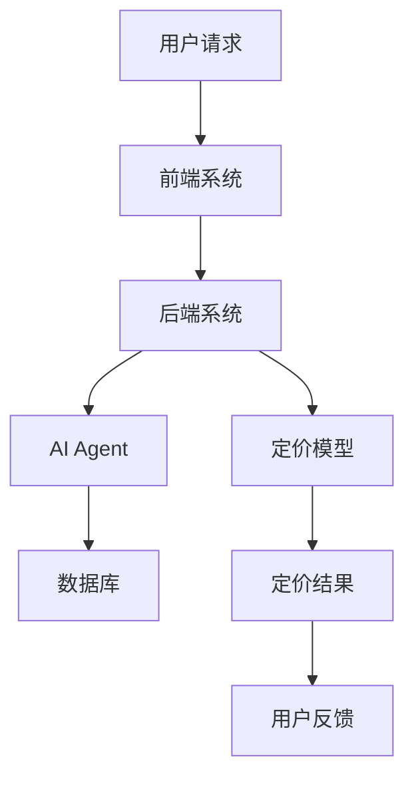

                 


```markdown
# AI Agent在智能保险定价中的角色

> **关键词**：AI Agent，智能保险定价，人工智能，机器学习，保险科技，风险管理，定价模型

> **摘要**：随着人工智能技术的迅速发展，AI Agent在智能保险定价中的应用日益广泛。本文将深入探讨AI Agent如何通过数据驱动的方法优化保险定价流程，分析其在保险行业中的角色及其对传统定价模式的颠覆性影响。文章从AI Agent的基本概念入手，详细讲解其核心技术与算法原理，结合实际案例分析其在保险定价中的应用场景，并总结AI Agent在智能保险定价中的优势与挑战。

---

## 第1章: AI Agent与智能保险定价概述

### 1.1 AI Agent的基本概念
#### 1.1.1 AI Agent的定义与特点
AI Agent（人工智能代理）是指能够感知环境、自主决策并执行任务的智能实体。它具备以下特点：
- **自主性**：无需外部干预，自主完成任务。
- **反应性**：能够实时感知环境变化并做出响应。
- **目标导向**：基于预设目标进行决策和行动。
- **学习能力**：通过数据和经验不断优化自身行为。

#### 1.1.2 AI Agent的核心技术与实现原理
AI Agent的核心技术包括：
- **机器学习**：通过数据训练模型，实现模式识别和预测。
- **自然语言处理（NLP）**：处理和理解人类语言，应用于客服和文档分析。
- **计算机视觉（CV）**：通过图像识别技术处理视觉信息，如车牌识别。

#### 1.1.3 AI Agent在保险行业的应用潜力
AI Agent在保险行业的潜力体现在：
- **自动化服务**：通过智能客服为用户提供24/7的保险咨询。
- **风险管理**：利用数据分析识别高风险客户，降低赔付风险。
- **个性化定价**：基于用户行为和历史数据实现精准定价。

### 1.2 智能保险定价的基本概念
#### 1.2.1 保险定价的基本原理
保险定价是根据风险评估、市场环境和客户需求等因素，确定保险产品的价格。传统定价依赖经验数据和精算模型。

#### 1.2.2 智能保险定价的定义与特点
智能保险定价利用AI技术和大数据分析，实现更精准、动态的定价策略。其特点包括：
- **数据驱动**：依赖大量数据进行分析和预测。
- **实时更新**：根据实时数据动态调整价格。
- **个性化**：基于用户特征提供差异化定价。

#### 1.2.3 智能保险定价的市场需求与发展趋势
市场需求方面，消费者期望更低的价格和更优质的服务。技术发展趋势包括AI技术的不断进步和数据量的爆炸式增长。

### 1.3 AI Agent在智能保险定价中的角色定位
#### 1.3.1 AI Agent作为智能保险定价的核心驱动力
AI Agent通过数据分析和模型预测，为保险定价提供科学依据，成为智能定价的核心驱动力。

#### 1.3.2 AI Agent在保险定价中的具体应用场景
- **客户画像构建**：通过机器学习算法分析客户数据，构建精准的客户画像。
- **风险评估与定价**：利用AI Agent评估客户风险，并据此制定定价策略。
- **动态调整定价**：根据市场变化和客户行为实时调整价格。

#### 1.3.3 AI Agent对保险行业传统模式的颠覆与创新
AI Agent的引入颠覆了传统保险定价模式，使得定价更加动态化、个性化和数据化。

### 1.4 本章小结
本章介绍了AI Agent的基本概念、核心技术及其在保险行业的应用潜力，重点阐述了AI Agent在智能保险定价中的角色定位及其对传统定价模式的颠覆性影响。

---

## 第2章: AI Agent的核心技术与实现原理

### 2.1 AI Agent的核心技术
#### 2.1.1 机器学习算法
- **监督学习**：利用标记数据训练模型，如线性回归、决策树。
- **无监督学习**：处理未标记数据，如聚类分析。
- **强化学习**：通过试错学习优化决策策略。

#### 2.1.2 自然语言处理（NLP）
- **文本分类**：识别文本所属类别，如客户投诉分类。
- **实体识别**：从文本中提取关键实体信息。
- **情感分析**：分析客户对保险产品的评价情感。

#### 2.1.3 计算机视觉（CV）
- **图像识别**：识别保险相关图像，如车牌识别。
- **视频分析**：监控视频中的异常行为。

#### 2.1.4 强化学习（Reinforcement Learning）
- **Q-Learning**：通过奖励机制优化决策。
- **Deep Q-Networks (DQN)**：深度强化学习，应用于复杂环境。

### 2.2 AI Agent的实现原理
#### 2.2.1 数据采集与处理
- **数据来源**：包括客户数据、市场数据和历史数据。
- **数据清洗**：去除噪声数据，确保数据质量。
- **数据预处理**：转换数据格式，适合模型训练。

#### 2.2.2 模型训练与优化
- **模型选择**：根据任务选择合适的算法。
- **参数调优**：通过网格搜索或随机搜索优化模型参数。
- **模型评估**：使用交叉验证评估模型性能。

#### 2.2.3 系统集成与部署
- **系统架构设计**：设计模块化架构，便于扩展和维护。
- **API接口开发**：提供RESTful API，方便与其他系统集成。
- **部署与监控**：在云平台上部署模型，并实时监控性能。

### 2.3 AI Agent的类型与应用场景
#### 2.3.1 基于规则的AI Agent
- **规则简单明确**：适用于规则明确的场景。
- **决策速度快**：基于预设规则快速做出决策。

#### 2.3.2 基于机器学习的AI Agent
- **数据驱动**：依赖大量数据进行训练。
- **决策灵活**：能够适应数据变化，提供个性化服务。

#### 2.3.3 基于强化学习的AI Agent
- **自我优化**：通过试错不断优化决策策略。
- **适应性强**：适用于复杂多变的环境。

### 2.4 本章小结
本章详细介绍了AI Agent的核心技术，包括机器学习、NLP、CV和强化学习，并探讨了不同类型的AI Agent及其应用场景。

---

## 第3章: AI Agent在智能保险定价中的算法与模型

### 3.1 保险定价的基本数学模型
#### 3.1.1 线性回归模型
- **简单线性回归**：$y = \beta_0 + \beta_1 x + \epsilon$
- **多元线性回归**：$y = \beta_0 + \beta_1 x_1 + \beta_2 x_2 + \dots + \beta_n x_n + \epsilon$

#### 3.1.2 决策树模型
- **ID3算法**：基于信息增益构建树。
- **C4.5算法**：基于信息增益率构建树。
- **随机森林**：集成多个决策树，降低过拟合风险。

#### 3.1.3 支持向量机（SVM）
- **线性SVM**：适用于线性可分数据。
- **非线性SVM**：通过核函数处理非线性数据。

### 3.2 基于机器学习的保险定价算法
#### 3.2.1 线性回归算法
- **优点**：简单易懂，计算速度快。
- **缺点**：假设变量之间线性相关，可能不适用于复杂场景。

#### 3.2.2 决策树算法
- **优点**：易于解释，适用于非线性关系。
- **缺点**：容易过拟合，需要大量参数 tuning。

#### 3.2.3 随机森林算法
- **优点**：集成多个决策树，抗过拟合能力强。
- **缺点**：计算资源消耗较大。

#### 3.2.4 神经网络算法
- **优点**：能够处理复杂非线性关系。
- **缺点**：训练时间长，参数多，容易过拟合。

### 3.3 基于强化学习的保险定价算法
#### 3.3.1 强化学习的基本原理
- **状态（State）**：环境中的当前情况。
- **动作（Action）**：AI Agent的决策。
- **奖励（Reward）**：对决策的反馈。

#### 3.3.2 Q-learning算法
- **公式**：$Q(s, a) = Q(s, a) + \alpha [r + \max Q(s', a') - Q(s, a)]$
- **应用**：适用于动态环境中的定价策略优化。

#### 3.3.3 Deep Q-Networks（DQN）算法
- **网络结构**：包括输入层、隐藏层和输出层。
- **应用**：处理高维状态空间，实现复杂决策。

### 3.4 算法的优缺点对比
| 算法类型      | 优点                           | 缺点                           |
|---------------|--------------------------------|--------------------------------|
| 线性回归       | 简单易懂，计算速度快           | 假设线性关系，适用性有限       |
| 决策树         | 易于解释，处理非线性关系       | 易过拟合，参数 tuning 贵       |
| 随机森林       | 高精度，抗过拟合               | 计算资源消耗大                 |
| 神经网络       | 处理复杂模式                   | 训练时间长，参数多，容易过拟合 |

### 3.5 本章小结
本章详细探讨了保险定价中的算法与模型，分析了各种算法的优缺点及其应用场景。

---

## 第4章: AI Agent在智能保险定价中的项目实战

### 4.1 项目背景与目标
#### 4.1.1 项目背景
- **行业痛点**：传统定价模式效率低，难以应对个性化需求。
- **技术优势**：AI Agent能够提高定价效率和精准度。

#### 4.1.2 项目目标
- **构建智能定价系统**：利用AI Agent实现动态、个性化的保险定价。
- **优化定价流程**：降低运营成本，提升客户满意度。

### 4.2 系统功能设计
#### 4.2.1 客户画像模块
- **功能**：基于客户数据构建画像，分析客户特征。
- **实现**：使用机器学习算法对客户数据进行分类和聚类。

#### 4.2.2 风险评估模块
- **功能**：评估客户风险，提供风险等级。
- **实现**：基于历史数据和实时数据，构建风险评估模型。

#### 4.2.3 定价策略模块
- **功能**：根据客户画像和风险评估结果，制定个性化定价策略。
- **实现**：结合多种算法，优化定价模型。

### 4.3 系统架构设计


### 4.4 系统实现与代码
#### 4.4.1 环境安装
- **Python**：安装Python 3.8及以上版本。
- **库依赖**：安装numpy、pandas、scikit-learn、tensorflow等库。

#### 4.4.2 核心代码实现
```python
import numpy as np
from sklearn.tree import DecisionTreeRegressor
from sklearn.ensemble import RandomForestRegressor
from sklearn.metrics import mean_squared_error

# 数据加载与预处理
data = pd.read_csv('insurance.csv')
X = data[['age', 'bmi', 'children', 'sex', 'smoker', 'region']]
y = data['charges']

# 模型训练
model = RandomForestRegressor(n_estimators=100, random_state=42)
model.fit(X, y)

# 模型预测
y_pred = model.predict(X)
print('均方误差:', mean_squared_error(y, y_pred))
```

#### 4.4.3 案例分析与结果解读
- **案例背景**：假设一位30岁吸烟者，BMI为30，家庭成员数为2。
- **模型预测**：预测其保险费用为5000元。
- **结果解读**：基于模型预测，该客户的风险较高，需调整定价策略。

### 4.5 项目小结
本章通过实际案例展示了AI Agent在智能保险定价中的应用，详细讲解了系统设计与实现过程，并分析了模型的优缺点。

---

## 第5章: 总结与展望

### 5.1 本章总结
AI Agent通过数据驱动的方法，显著提升了保险定价的效率和精准度。其核心技术包括机器学习、NLP和计算机视觉，为保险行业带来了新的机遇。

### 5.2 对未来的展望
未来，AI Agent在保险定价中的应用将更加广泛和深入。可能的发展方向包括：
- **更复杂的定价模型**：结合深度学习和强化学习，实现更高精度的定价。
- **实时定价**：基于实时数据实现动态定价，提升客户体验。
- **多场景应用**：拓展AI Agent在保险领域的应用场景，如理赔、风险管理等。

### 5.3 注意事项与建议
- **数据隐私保护**：确保客户数据的安全和隐私。
- **模型解释性**：提高模型的透明度，便于监管和客户理解。
- **多技术融合**：结合多种AI技术，提升系统的整体性能。

---

## 作者

**作者：AI天才研究院/AI Genius Institute & 禅与计算机程序设计艺术 /Zen And The Art of Computer Programming**
```

