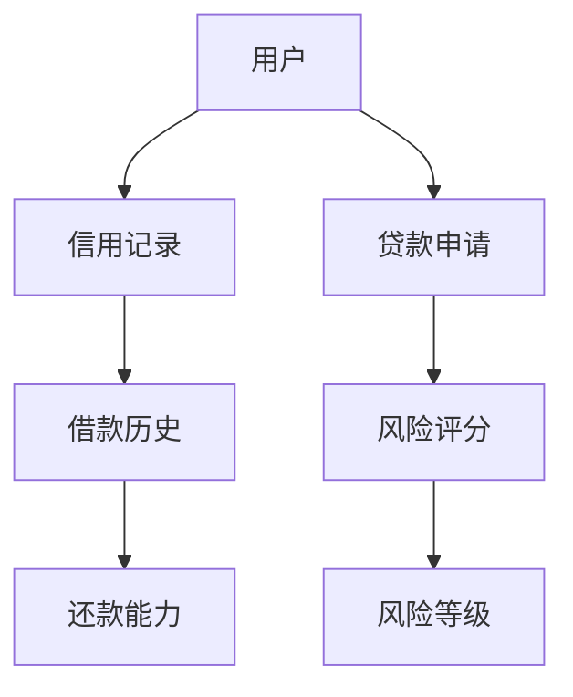

                 


# AI Agent在智能信用风险评估中的应用

> 关键词：AI Agent，信用风险评估，人工智能，金融，风险管理

> 摘要：本文详细探讨了AI Agent在智能信用风险评估中的应用，分析了其核心概念、算法原理、系统架构及实际案例，结合技术细节和实际操作，总结了最佳实践和未来发展方向。

---

## 第一部分: AI Agent与信用风险评估的背景介绍

### 第1章: AI Agent的基本概念与应用背景

#### 1.1 AI Agent的定义与核心概念

- **1.1.1 从传统算法到AI Agent的演进**  
  AI Agent的演进过程从传统的基于规则的系统逐步向自主学习和自适应的智能系统转变，具备感知、决策和行动能力。

- **1.1.2 AI Agent的核心特征与优势**  
  AI Agent的核心特征包括自主性、反应性、目标导向性和社会性。其优势在于能够实时处理复杂数据，提供动态决策支持。

- **1.1.3 AI Agent在金融领域的应用潜力**  
  AI Agent在金融领域的潜力主要体现在实时数据分析、风险预警和个性化服务等方面。

#### 1.2 信用风险评估的背景与挑战

- **1.2.1 信用风险的定义与分类**  
  信用风险是指债务人或交易对手未能履行其合同义务的可能性。常见的分类包括主权风险、零售风险和市场风险。

- **1.2.2 传统信用风险评估方法的局限性**  
  传统方法依赖于静态数据和简单的统计模型，难以应对复杂的金融环境和动态变化。

- **1.2.3 人工智能在信用风险评估中的应用价值**  
  AI技术能够处理非结构化数据，发现潜在风险因素，提高评估精度和效率。

#### 1.3 AI Agent在信用风险评估中的应用价值

- **1.3.1 提高风险评估的准确性**  
  AI Agent通过深度学习和自然语言处理技术，可以从多源数据中提取关键信息，提升评估准确性。

- **1.3.2 提升风险评估的效率**  
  AI Agent能够快速处理大量数据，显著缩短评估时间。

- **1.3.3 优化风险监控与预警机制**  
  AI Agent可以通过实时数据监控，提前识别潜在风险，优化预警机制。

### 第2章: AI Agent在信用风险评估中的核心概念与联系

#### 2.1 AI Agent的核心原理

- **2.1.1 AI Agent的感知模块**  
  感知模块通过数据采集和特征提取，获取信用评估所需的信息。

- **2.1.2 AI Agent的决策模块**  
  决策模块基于感知数据，利用机器学习算法进行风险评估和预测。

- **2.1.3 AI Agent的执行模块**  
  执行模块根据决策结果，输出风险评分或触发预警机制。

#### 2.2 AI Agent与信用风险评估的核心联系

- **2.2.1 数据输入与特征提取**  
  AI Agent通过多源数据输入，进行特征提取和数据清洗，为后续分析提供高质量数据。

- **2.2.2 风险评估模型的构建**  
  利用机器学习算法，构建风险评估模型，对信用风险进行量化评估。

- **2.2.3 风险预警与决策优化**  
  AI Agent通过实时监控和动态调整模型，优化风险预警和决策过程。

#### 2.3 AI Agent与传统信用评估方法的对比分析

- **2.3.1 传统信用评估方法的优缺点**  
  传统方法具有规则明确、易于解释的优点，但存在数据依赖性强、适应性差的缺点。

- **2.3.2 AI Agent在信用评估中的创新点**  
  AI Agent引入了自动化、智能化和动态适应的特点，能够处理复杂和动态的金融环境。

- **2.3.3 AI Agent与传统方法的协同应用**  
  结合传统方法的解释性和AI Agent的预测能力，可以构建更加 robust 的信用评估系统。

#### 2.4 AI Agent在信用风险评估中的ER实体关系图



---

## 第二部分: AI Agent在信用风险评估中的算法原理

### 第3章: AI Agent在信用风险评估中的算法原理

#### 3.1 基础算法原理

- **3.1.1 分类算法**  
  分类算法如逻辑回归和随机森林，用于预测客户信用等级。

- **3.1.2 聚类算法**  
  聚类算法用于识别具有相似信用特征的客户群体。

- **3.1.3 集成学习算法**  
  集成学习算法通过组合多个模型的结果，提高预测准确性和稳定性。

- **3.1.4 深度学习算法**  
  深度学习算法如神经网络，能够从复杂数据中提取高层次特征。

#### 3.2 信用风险评估中的具体算法实现

- **3.2.1 逻辑回归模型**  
  逻辑回归模型通过构建概率模型，预测客户违约风险。

- **3.2.2 支持向量机模型**  
  支持向量机模型在高维数据中表现优异，适合处理非线性分类问题。

- **3.2.3 随机森林模型**  
  随机森林模型通过集成多个决策树，提高预测准确性和鲁棒性。

- **3.2.4 深度学习模型（以神经网络为例）**  
  神经网络模型通过多层结构，自动提取数据特征，提升预测精度。

---

## 第三部分: AI Agent在信用风险评估中的系统架构与设计

### 第4章: AI Agent在信用风险评估中的系统架构设计

#### 4.1 系统功能设计

- **4.1.1 数据采集与预处理**  
  数据采集模块负责从多源数据中获取信用相关信息，并进行清洗和转换。

- **4.1.2 模型训练与部署**  
  模型训练模块基于预处理后的数据，训练AI Agent的信用评估模型，并将其部署到生产环境。

- **4.1.3 实时监控与预警**  
  实时监控模块负责对风险进行实时跟踪，触发预警机制。

#### 4.2 系统架构设计


---

## 第四部分: AI Agent在信用风险评估中的项目实战

### 第5章: 项目实战与案例分析

#### 5.1 项目环境安装与数据准备

- **5.1.1 环境安装**  
  安装Python、TensorFlow、Scikit-learn等必要的开发工具和库。

- **5.1.2 数据获取与预处理**  
  从公开数据集获取信用数据，进行数据清洗和特征工程。

#### 5.2 系统核心实现

- **5.2.1 数据预处理代码**  
  ```python
  import pandas as pd
  data = pd.read_csv('credit.csv')
  data.dropna(inplace=True)
  ```

- **5.2.2 模型训练代码**  
  ```python
  from sklearn.model import LogisticRegression
  model = LogisticRegression()
  model.fit(X_train, y_train)
  ```

#### 5.3 实际案例分析

- **5.3.1 案例分析**  
  以银行客户信用评估为例，展示AI Agent如何帮助银行识别高风险客户。

- **5.3.2 结果分析与优化方向**  
  分析模型预测结果，提出优化方向，如引入更多特征或优化模型结构。

---

## 第五部分: AI Agent在信用风险评估中的最佳实践

### 第6章: 最佳实践与未来展望

#### 6.1 小结与总结

- 本文详细探讨了AI Agent在信用风险评估中的应用，从理论到实践，全面分析了其优势和挑战。

#### 6.2 注意事项与风险提示

- 在实际应用中，需注意数据隐私和模型解释性问题，确保模型的透明性和合规性。

#### 6.3 未来发展方向

- 结合边缘计算和区块链技术，构建更加安全、高效的信用风险评估系统。

---

## 作者信息

作者：AI天才研究院/AI Genius Institute & 禅与计算机程序设计艺术 /Zen And The Art of Computer Programming

