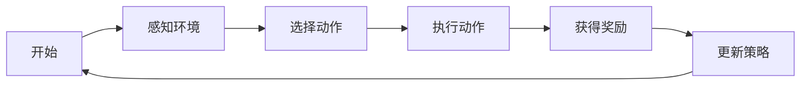
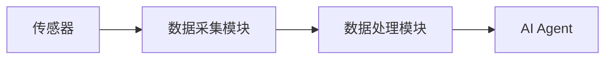
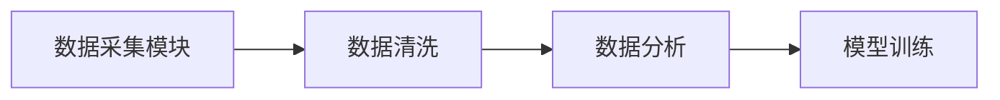
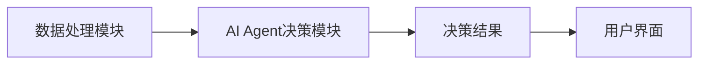
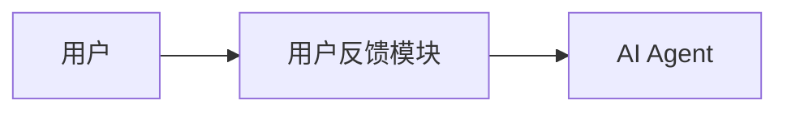

                 


# AI Agent在智能健康监测中的实践

## 关键词：AI Agent，智能健康监测，机器学习，强化学习，医疗健康

## 摘要：  
本文系统地探讨了AI Agent在智能健康监测中的应用与实践。通过背景介绍、核心概念解析、系统设计、算法实现、项目实战等多维度的分析，深入阐述了AI Agent在健康监测中的核心作用及其技术实现路径。文章还结合实际案例，详细讲解了AI Agent在健康监测中的应用场景、算法原理及系统架构设计，为读者提供了从理论到实践的全面指导。

---

# 第一部分：AI Agent与智能健康监测的背景与概念

## 第1章：AI Agent与智能健康监测的背景介绍

### 1.1 AI Agent的基本概念

#### 1.1.1 AI Agent的定义
AI Agent（人工智能代理）是指能够感知环境、自主决策并执行任务的智能实体。它通过传感器获取信息，利用算法进行分析，并通过执行器采取行动。AI Agent的核心目标是通过智能化手段解决复杂问题。

#### 1.1.2 AI Agent的核心特点
- **自主性**：能够自主决策和行动，无需外部干预。
- **反应性**：能够实时感知环境变化并做出响应。
- **学习性**：通过数据和经验不断优化自身的决策能力。
- **协作性**：能够与其他系统或人进行协同工作。

#### 1.1.3 AI Agent与传统AI的区别
| 特性       | 传统AI                      | AI Agent                     |
|------------|-----------------------------|-----------------------------|
| 独立性      | 需要外部指令驱动            | 具有自主性，无需外部指令    |
| 环境交互    | 不与环境交互                | 能够感知并交互环境          |
| 适应性      | 预先编程，难以自适应变化    | 具备学习能力，能自适应变化  |

### 1.2 智能健康监测的背景与现状

#### 1.2.1 智能健康监测的定义
智能健康监测是指通过传感器、物联网（IoT）设备和AI技术，实时采集、分析和反馈个体或群体的健康数据，从而实现疾病早期预警、健康状态评估和个性化健康管理。

#### 1.2.2 当前健康监测的主要挑战
- 数据量大：健康数据种类繁多，包括心率、血压、血糖等。
- 数据异质性：数据来源多样，格式和标准不统一。
- 数据隐私：健康数据涉及个人隐私，数据安全问题突出。
- 决策复杂性：健康监测需要结合多维度数据进行复杂决策。

#### 1.2.3 智能健康监测的潜在价值
- 提高疾病早期发现率，降低医疗成本。
- 实现个性化健康管理，提升用户体验。
- 优化医疗资源分配，提高医疗效率。

### 1.3 AI Agent在智能健康监测中的应用前景

#### 1.3.1 AI Agent在健康监测中的核心作用
AI Agent能够实时处理健康数据，识别异常情况，并提供个性化建议，从而提升健康监测的效率和准确性。

#### 1.3.2 智能健康监测的未来发展趋势
- **实时性**：AI Agent将更加实时地处理健康数据，提供即时反馈。
- **个性化**：基于个体差异，提供定制化的健康管理方案。
- **智能化**：AI Agent将具备更强的学习和自适应能力，能够处理更复杂的健康问题。

#### 1.3.3 AI Agent在健康监测中的边界与外延
AI Agent在健康监测中的应用边界主要集中在数据处理和决策支持，而实际医疗诊断和治疗仍需依赖专业医疗人员。

### 1.4 本章小结
本章介绍了AI Agent的基本概念和智能健康监测的背景与现状，强调了AI Agent在健康监测中的潜力和应用前景。

---

# 第二部分：AI Agent的核心概念与原理

## 第2章：AI Agent的核心概念与原理

### 2.1 AI Agent的核心原理

#### 2.1.1 AI Agent的基本工作原理
AI Agent通过以下步骤实现健康监测：
1. **感知环境**：通过传感器采集健康数据。
2. **数据处理**：对数据进行清洗、分析和建模。
3. **决策制定**：基于分析结果，生成决策建议。
4. **执行行动**：通过执行器（如发送提醒）实现决策。

#### 2.1.2 AI Agent的感知与决策机制
AI Agent的感知机制主要依赖传感器和数据采集设备。决策机制则基于机器学习模型，如强化学习和监督学习。

#### 2.1.3 AI Agent的学习与优化过程
AI Agent通过以下步骤优化自身：
1. **数据收集**：持续收集健康数据。
2. **模型训练**：基于数据训练机器学习模型。
3. **反馈调整**：根据实际效果优化模型参数。

### 2.2 AI Agent与智能健康监测的结合

#### 2.2.1 AI Agent在健康监测中的核心功能
- 数据采集与分析
- 异常检测与预警
- 个性化健康建议

#### 2.2.2 AI Agent与健康数据的关系
AI Agent通过处理健康数据，生成有意义的健康信息，并为用户提供决策支持。

#### 2.2.3 AI Agent在健康监测中的应用场景
- 心理健康监测：通过分析社交网络数据，识别抑郁风险。
- 慢病管理：实时监测血糖、血压等指标，优化治疗方案。
- 运动健康：根据运动数据，提供个性化的运动建议。

### 2.3 AI Agent的核心算法与实现

#### 2.3.1 AI Agent的主要算法类型
- **强化学习**：通过试错优化决策策略。
- **监督学习**：基于标记数据进行分类或回归。
- **无监督学习**：发现数据中的潜在模式。

#### 2.3.2 基于强化学习的AI Agent实现

代码示例：
```python
import numpy as np
from collections import deque

class AIAgent:
    def __init__(self):
        self.memory = deque(maxlen=1000)
        self.gamma = 0.99
        self.epsilon = 1.0

    def remember(self, state, action, reward, next_state):
        self.memory.append((state, action, reward, next_state))

    def act(self, state):
        if np.random.random() < self.epsilon:
            return np.random.randint(0, 4)
        else:
            return np.argmax(self.model.predict(state)[0])

    def replay(self, batch_size):
        mini_batch = random.sample(self.memory, batch_size)
        inputs = []
        targets = []
        for state, action, reward, next_state in mini_batch:
            target = reward
            target[0] = reward + self.gamma * np.max(self.model.predict(next_state)[0])
            inputs.append(state)
            targets.append(target)
        self.model.fit(np.array(inputs), np.array(targets), epochs=1, verbose=0)
        self.epsilon = max(0.01, self.epsilon * 0.99)
```

#### 2.3.3 基于监督学习的AI Agent实现
代码示例：
```python
import numpy as np
from sklearn.linear_model import LinearRegression

class AIAgent:
    def __init__(self):
        self.model = LinearRegression()

    def train(self, X, y):
        self.model.fit(X, y)

    def predict(self, X):
        return self.model.predict(X)
```

### 2.4 本章小结
本章详细讲解了AI Agent的核心原理和主要算法，重点介绍了强化学习和监督学习在健康监测中的应用。

---

# 第三部分：AI Agent在智能健康监测中的系统设计

## 第3章：智能健康监测系统的架构设计

### 3.1 智能健康监测系统的总体架构

#### 3.1.1 系统的分层架构
- **数据采集层**：负责采集健康数据。
- **数据处理层**：对数据进行清洗、分析和建模。
- **应用层**：提供用户界面和决策支持。

#### 3.1.2 系统的主要组成部分
- **传感器**：采集健康数据。
- **数据存储**：存储健康数据。
- **AI Agent**：处理数据并生成决策。
- **用户界面**：展示健康信息和决策结果。

#### 3.1.3 系统的交互流程
1. 传感器采集数据并发送到数据处理层。
2. 数据处理层分析数据并生成决策。
3. 决策结果通过用户界面展示给用户。

### 3.2 AI Agent在系统中的位置与作用

#### 3.2.1 AI Agent在系统架构中的位置
AI Agent位于数据处理层，负责接收数据、分析数据并生成决策。

#### 3.2.2 AI Agent在系统中的功能模块
- 数据分析模块：对健康数据进行分析和建模。
- 决策模块：基于分析结果生成决策建议。
- 反馈模块：根据用户反馈优化决策策略。

#### 3.2.3 AI Agent与其他模块的交互关系
- **传感器**：向AI Agent发送数据。
- **数据存储**：存储AI Agent处理后的数据。
- **用户界面**：展示AI Agent的决策结果。

### 3.3 系统的模块化设计

#### 3.3.1 数据采集模块


#### 3.3.2 数据处理模块


#### 3.3.3 AI Agent决策模块


#### 3.3.4 用户反馈模块


### 3.4 本章小结
本章详细描述了智能健康监测系统的架构设计，重点介绍了AI Agent在系统中的位置和作用。

---

# 第四部分：AI Agent在智能健康监测中的算法实现

## 第4章：AI Agent的核心算法与实现

### 4.1 AI Agent的主要算法类型

#### 4.1.1 强化学习
- **DQN算法**：基于深度强化学习的决策模型。
- **策略梯度法**：通过梯度上升优化策略。

#### 4.1.2 监督学习
- **线性回归**：用于预测健康指标。
- **随机森林**：用于分类和回归任务。

#### 4.1.3 无监督学习
- **聚类分析**：发现健康数据中的潜在模式。

### 4.2 AI Agent的数学模型与公式

#### 4.2.1 强化学习的数学模型
强化学习的目标是最大化累积奖励：
$$ R = r_1 + r_2 + \dots + r_n $$
其中，$r_i$ 是第i步的奖励。

#### 4.2.2 深度学习的数学模型
深度学习通过多层神经网络逼近目标函数：
$$ y = f(x) $$
其中，$f$ 是神经网络模型。

### 4.3 本章小结
本章详细讲解了AI Agent的核心算法，重点介绍了强化学习和监督学习在健康监测中的应用。

---

# 第五部分：AI Agent在智能健康监测中的项目实战

## 第5章：AI Agent在智能健康监测中的项目实战

### 5.1 项目环境安装

#### 5.1.1 安装Python
```bash
python --version
```

#### 5.1.2 安装依赖库
```bash
pip install numpy scikit-learn tensorflow
```

### 5.2 系统核心实现源代码

#### 5.2.1 数据采集模块
```python
import numpy as np

def collect_data():
    # 采集健康数据
    data = np.random.randn(100, 5)
    return data
```

#### 5.2.2 数据处理模块
```python
from sklearn import preprocessing

def preprocess_data(data):
    # 数据标准化
    scaler = preprocessing.StandardScaler().fit(data)
    normalized_data = scaler.transform(data)
    return normalized_data
```

#### 5.2.3 AI Agent实现
```python
import tensorflow as tf
from tensorflow.keras import layers

def build_model(input_shape):
    model = tf.keras.Sequential()
    model.add(layers.Dense(32, activation='relu', input_shape=input_shape))
    model.add(layers.Dense(16, activation='relu'))
    model.add(layers.Dense(1, activation='sigmoid'))
    model.compile(optimizer='adam', loss='binary_crossentropy', metrics=['accuracy'])
    return model
```

### 5.3 实际案例分析与详细讲解

#### 5.3.1 案例背景
假设我们有一个健康监测系统，需要实时监测用户的血糖水平。

#### 5.3.2 数据分析
通过强化学习模型，预测用户的血糖变化趋势。

#### 5.3.3 决策支持
基于模型预测结果，向用户发送提醒，建议调整饮食或运动。

### 5.4 本章小结
本章通过实际案例，详细讲解了AI Agent在智能健康监测中的实现过程。

---

# 第六部分：总结与展望

## 第6章：总结与展望

### 6.1 本章总结
本文系统地探讨了AI Agent在智能健康监测中的应用与实践，通过理论分析和实际案例，深入阐述了AI Agent的核心作用和技术实现路径。

### 6.2 最佳实践 Tips
- 在实际应用中，建议结合具体场景选择合适的算法。
- 数据隐私和安全问题需要重点关注。
- 系统的可解释性和透明性需要进一步优化。

### 6.3 注意事项
- AI Agent的决策结果仅供参考，实际医疗决策需要结合专业医疗人员的意见。
- 系统的鲁棒性和稳定性需要通过大量测试来保证。

### 6.4 拓展阅读
- 《强化学习：理论与应用》
- 《深度学习在医疗健康中的应用》
- 《智能健康监测系统设计与实现》

### 6.5 本章小结
本章总结了全文的主要内容，并提出了未来的研究方向和实践建议。

---

# 作者：AI天才研究院/AI Genius Institute & 禅与计算机程序设计艺术 /Zen And The Art of Computer Programming

---

以上是《AI Agent在智能健康监测中的实践》的技术博客文章的完整目录和内容框架，希望对您有所帮助！

