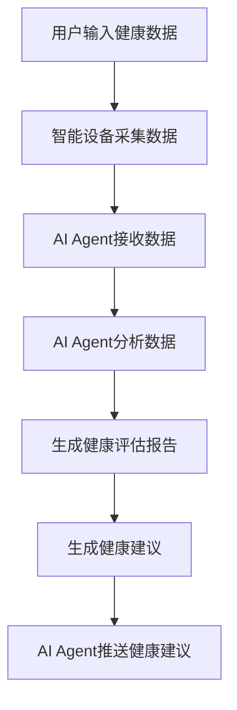

                 


# AI Agent在智能健康管理中的角色

## 关键词：AI Agent，智能健康管理，人工智能，健康管理，医疗健康

## 摘要：  
随着人工智能技术的快速发展，AI Agent（人工智能代理）在智能健康管理中的应用日益广泛。本文将从AI Agent的核心概念出发，详细探讨其在智能健康管理中的角色定位、算法原理、系统架构及实际应用。通过理论分析与实践案例相结合的方式，揭示AI Agent如何赋能智能健康管理，为未来的健康管理提供新的思路与方向。

---

# 第1章 AI Agent与智能健康管理概述

## 1.1 健康管理的发展历程

### 1.1.1 传统健康管理方式的局限性
传统的健康管理方式主要依赖于医生、护士等专业人员，通过面对面的问诊、体检等方式收集健康数据，并根据经验制定健康管理方案。这种方式存在以下问题：
- **效率低**：依赖人工操作，耗时耗力。
- **覆盖范围有限**：难以实现大规模人群的健康管理。
- **个性化不足**：难以针对个体差异提供精准的健康建议。

### 1.1.2 智能化健康管理的兴起
随着信息技术的发展，智能化健康管理逐渐兴起。智能健康管理通过大数据、人工智能、物联网等技术，实现健康数据的自动采集、分析和个性化建议的生成。这种模式不仅提高了管理效率，还能够覆盖更广泛的人群。

### 1.1.3 AI Agent在健康管理中的应用前景
AI Agent（人工智能代理）作为一种能够自主决策、执行任务的智能体，非常适合应用于健康管理领域。通过AI Agent，可以实现健康数据的实时监控、健康风险的预测、个性化健康建议的推送等功能，极大地提升了健康管理的智能化水平。

---

## 1.2 AI Agent的基本概念

### 1.2.1 什么是AI Agent
AI Agent是一种能够感知环境、自主决策、执行任务的智能体。它能够通过传感器或数据接口获取环境信息，并基于预设的目标和规则，采取相应的行动以实现目标。

### 1.2.2 AI Agent的核心特征
AI Agent具有以下核心特征：
- **智能性**：能够通过学习和推理处理复杂问题。
- **自主性**：能够在没有外部干预的情况下自主运行。
- **反应性**：能够实时感知环境变化并做出反应。
- **协作性**：能够与其他系统或人类用户进行协作。

### 1.2.3 AI Agent与传统软件的区别
AI Agent与传统软件的主要区别在于其智能性和自主性。传统软件通常遵循固定的程序逻辑执行任务，而AI Agent能够根据环境反馈动态调整行为。

| 特性         | AI Agent                     | 传统软件系统                  |
|--------------|------------------------------|------------------------------|
| 智能性       | 高                           | 低                           |
| 自适应性     | 强                           | 无                           |
| 学习能力     | 强                           | 无                           |
| 交互方式     | 多样化                       | 单一化                       |

---

## 1.3 AI Agent在健康管理中的角色定位

### 1.3.1 AI Agent作为健康助手的定位
在智能健康管理中，AI Agent可以作为用户的健康助手，帮助用户管理健康数据、监控健康状况、提供健康建议等。

### 1.3.2 AI Agent在健康管理中的功能定位
AI Agent在健康管理中的主要功能包括：
- **数据采集**：通过智能设备采集用户的健康数据（如心率、血压、运动数据等）。
- **数据分析**：对健康数据进行分析，识别健康风险。
- **健康建议**：根据分析结果，提供个性化的健康建议。

### 1.3.3 AI Agent与其他健康管理工具的对比
与传统的健康管理工具相比，AI Agent具有更高的智能化和自主性。例如，AI Agent可以通过机器学习模型自动优化健康建议，而传统工具则需要人工调整。

---

## 1.4 本章小结

本章介绍了AI Agent的基本概念及其在智能健康管理中的角色定位。通过对比传统健康管理方式与智能化健康管理方式，我们看到了AI Agent在提升健康管理效率和个性化水平方面的重要作用。

---

# 第2章 AI Agent的核心概念与健康管理的结合

## 2.1 AI Agent的核心概念与健康管理的结合

### 2.1.1 AI Agent的核心概念
AI Agent的核心概念包括智能性、自主性、反应性和协作性。这些特性使其能够胜任复杂的健康管理任务。

### 2.1.2 AI Agent与健康管理的结合
AI Agent可以通过以下方式与健康管理结合：
- **健康数据的智能分析**：利用机器学习算法对健康数据进行分析，识别健康风险。
- **个性化健康建议**：根据用户的健康状况和生活习惯，提供个性化的健康建议。
- **健康行为的智能引导**：通过自然语言处理技术，为用户提供健康行为的引导。

### 2.1.3 AI Agent在健康管理中的实体关系图
以下是AI Agent在健康管理中的实体关系图：

```mermaid
er
actor: 用户
agent: AI健康助手
health_data: 健康数据
health_assessment: 健康评估
health_recommendation: 健康建议
```

---

## 2.2 AI Agent的核心算法原理

### 2.2.1 算法原理概述
AI Agent的核心算法包括自然语言处理、机器学习和强化学习等技术。

### 2.2.2 自然语言处理（NLP）在AI Agent中的应用
自然语言处理技术用于理解和生成人类语言。例如，AI Agent可以通过NLP技术与用户进行自然对话，了解用户的健康状况。

### 2.2.3 机器学习算法在AI Agent中的应用
机器学习算法用于对健康数据进行分析和预测。例如，可以通过随机森林算法预测用户的健康风险。

### 2.2.4 强化学习在AI Agent中的应用
强化学习用于优化AI Agent的行为策略。例如，AI Agent可以通过强化学习优化健康建议的推荐策略。

---

## 2.3 AI Agent在健康管理中的应用流程

### 2.3.1 应用流程概述
AI Agent在健康管理中的应用流程包括以下步骤：
1. 数据采集：通过智能设备采集用户的健康数据。
2. 数据分析：利用机器学习算法对健康数据进行分析。
3. 健康评估：生成健康评估报告。
4. 健康建议：根据健康评估结果，生成个性化的健康建议。

### 2.3.2 应用流程图
以下是AI Agent在健康管理中的应用流程图：



---

## 2.4 本章小结

本章详细介绍了AI Agent的核心概念与健康管理的结合方式，并探讨了AI Agent在健康管理中的算法原理和应用流程。

---

接下来的章节将围绕AI Agent在健康管理中的系统架构设计、项目实战和最佳实践展开，具体内容包括系统功能设计、系统架构设计、系统接口设计、系统交互设计、项目实战案例分析等。通过这些内容，我们将更深入地了解AI Agent在智能健康管理中的具体应用和实现方式。

