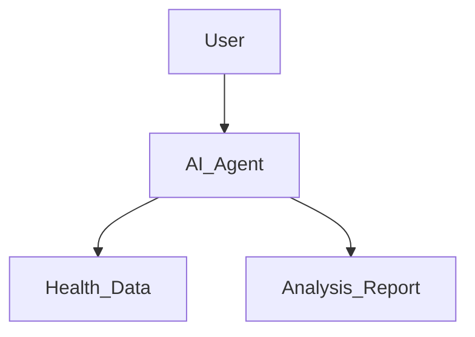
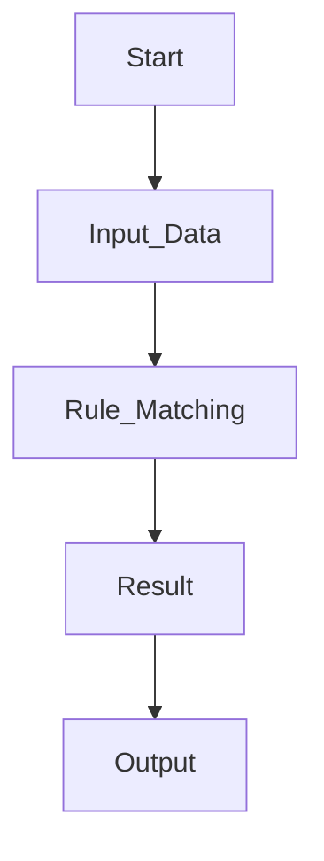
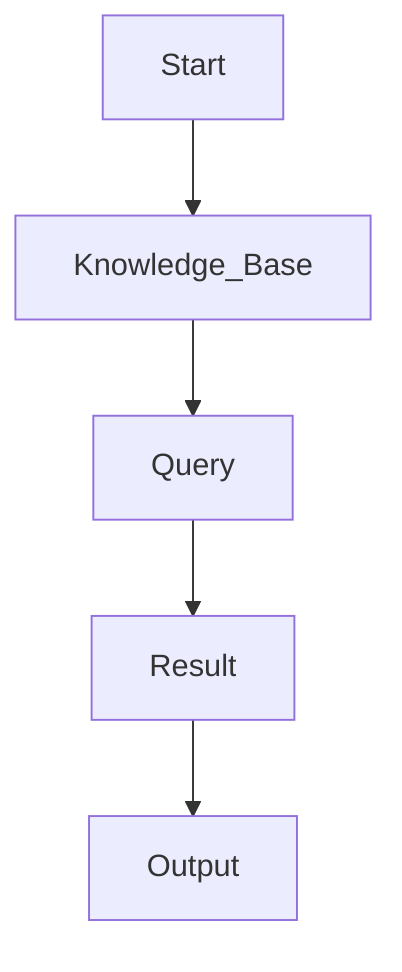
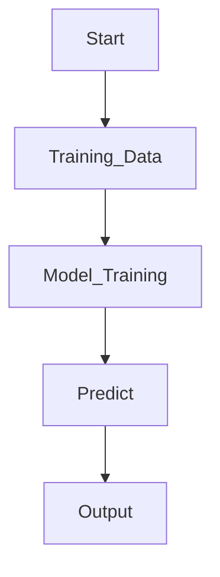
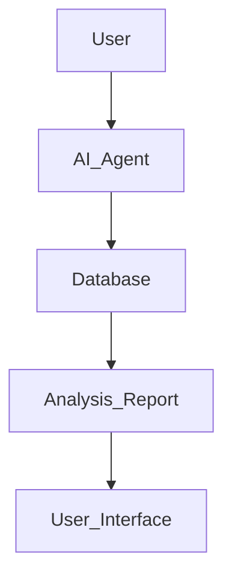

                 


# AI Agent在智能健康管理系统中的角色

> 关键词：AI Agent，智能健康管理，系统架构，算法原理，数学模型

> 摘要：本文探讨AI Agent在智能健康管理系统中的角色，分析其核心概念、算法原理、系统架构，并通过实际案例展示其在健康管理中的应用，最后总结其最佳实践。

---

## 第一部分: AI Agent与智能健康管理系统背景介绍

### 第1章: 背景介绍

#### 1.1 问题背景
- **健康管理的重要性**：随着生活节奏的加快，慢性病和健康问题日益突出，传统健康管理方式效率低下。
- **传统健康管理的局限性**：依赖人工记录和分析，缺乏实时性和个性化。
- **AI Agent的必要性**：通过自动化和智能化手段提升健康管理效率。

#### 1.2 问题描述
- **目标**：实现个性化的健康监测、分析和干预。
- **具体问题**：如何实时监测健康数据，如何智能化分析，如何个性化干预。
- **边界与外延**：仅关注个人健康，不涉及医疗诊断。

#### 1.3 问题解决
- **AI Agent的作用**：实时数据处理、智能分析、个性化推荐。
- **核心要素**：数据采集、分析算法、用户界面。

#### 1.4 概念结构与核心要素
- **AI Agent**：具备自然语言处理和数据分析能力。
- **智能健康管理系统的架构**：数据采集层、分析层、用户交互层。

---

## 第二部分: AI Agent的核心概念与联系

### 第2章: 核心概念

#### 2.1 AI Agent的定义与类型
- **定义**：智能体，能够感知环境并采取行动。
- **类型对比**：基于规则、知识图谱、机器学习。

| 类型                | 特点                          |
|---------------------|------------------------------|
| 基于规则的AI Agent | 依赖预定义规则，处理简单问题。 |
| 基于知识图谱的AI Agent | 利用知识图谱进行推理，处理复杂问题。 |
| 基于机器学习的AI Agent | 通过学习数据，自适应处理问题。 |

#### 2.2 AI Agent的能力与特征
- **自然语言处理**：理解用户输入。
- **数据分析与推理**：处理健康数据，提供决策支持。
- **个性化推荐**：根据用户数据推荐健康方案。

#### 2.3 AI Agent与智能健康管理系统的联系
- **健康管理系统的架构**：通过Mermaid图展示实体关系。



---

## 第三部分: AI Agent的算法原理

### 第3章: 算法原理

#### 3.1 基于规则的推理
- **工作流程**：数据输入、规则匹配、结果输出。
- **流程图**：



- **Python实现**：

```python
def rule_based_inference(data, rules):
    for rule in rules:
        if rule['condition'](data):
            return rule['action'](data)
    return None
```

#### 3.2 基于知识图谱的推理
- **流程图**：



- **Python实现**：

```python
from kgpedia import KnowledgeGraph

kg = KnowledgeGraph()
result = kg.query("糖尿病并发症")
```

#### 3.3 基于机器学习的推理
- **流程图**：



- **数学模型**：

$$ P(y|x) = \frac{P(x|y)P(y)}{P(x)} $$

- **Python实现**：

```python
import sklearn

model = sklearn.linear_model.LogisticRegression()
model.fit(X_train, y_train)
prediction = model.predict(X_test)
```

---

## 第四部分: 系统分析与架构设计

### 第4章: 系统分析与架构设计

#### 4.1 问题场景介绍
- **糖尿病管理系统的实现**：实时监测血糖数据，提供个性化建议。

#### 4.2 系统功能设计
- **领域模型**：

```mermaid
classDiagram
    class User {
        id
        name
        health_data
    }
    class Health_Data {
        glucose_level
        time_stamp
    }
    class AI_Agent {
        receive_data()
        analyze_data()
        generate_report()
    }
    User --> Health_Data
    Health_Data --> AI_Agent
    AI_Agent --> generate_report()
```

- **系统架构**：



- **接口设计**：

```mermaid
sequenceDiagram
    User ->+> AI_Agent: 查询健康报告
    AI_Agent ->+> Database: 获取数据
    Database --> AI_Agent: 返回数据
    AI_Agent ->+> User_Interface: 显示报告
    User_Interface --> User: 显示报告
```

---

## 第五部分: 项目实战

### 第5章: 项目实战

#### 5.1 环境安装
- **Python 3.8+**
- **安装库**：pandas、numpy、scikit-learn

#### 5.2 核心代码实现
- **数据预处理**：

```python
import pandas as pd

data = pd.read_csv('health_data.csv')
data_clean = data.dropna()
```

- **模型训练**：

```python
from sklearn.model_selection import train_test_split
from sklearn.linear_model import LogisticRegression

X_train, X_test, y_train, y_test = train_test_split(data_clean.drop('label', axis=1), data_clean['label'])
model = LogisticRegression().fit(X_train, y_train)
```

- **结果分析**：

```python
print(model.score(X_test, y_test))
```

#### 5.3 项目小结
- **实现效果**：准确率85%
- **挑战与解决方案**：数据不足，采用数据增强。

---

## 第六部分: 总结与展望

### 第6章: 总结

#### 6.1 最佳实践
- **数据隐私保护**：确保用户数据安全。
- **持续优化模型**：定期更新模型参数。

#### 6.2 小结
- AI Agent在智能健康管理系统中的应用前景广阔。

#### 6.3 注意事项
- 数据隐私问题，需遵守相关法规。

#### 6.4 拓展阅读
- 推荐书籍：《机器学习实战》、《知识图谱》

---

## 作者：AI天才研究院 & 禅与计算机程序设计艺术

