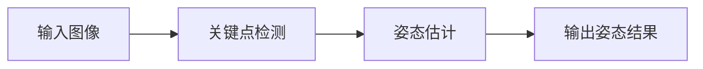
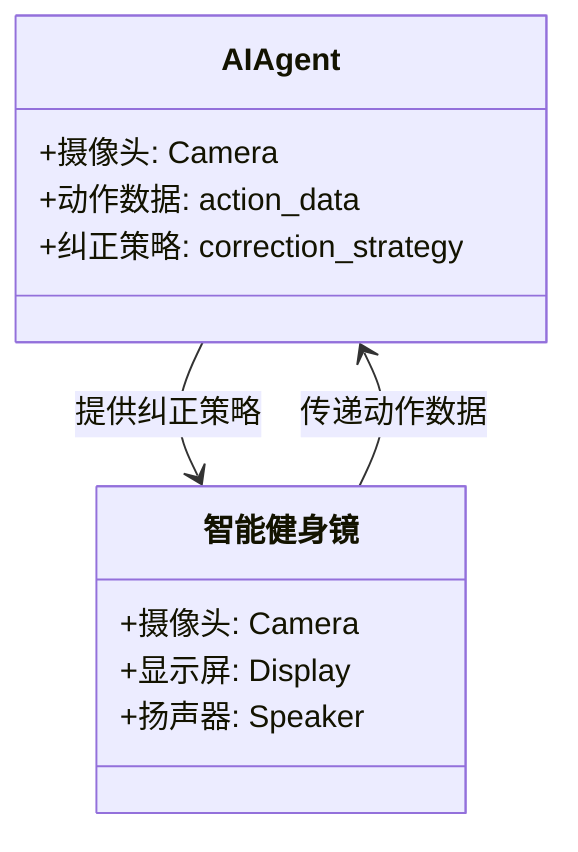
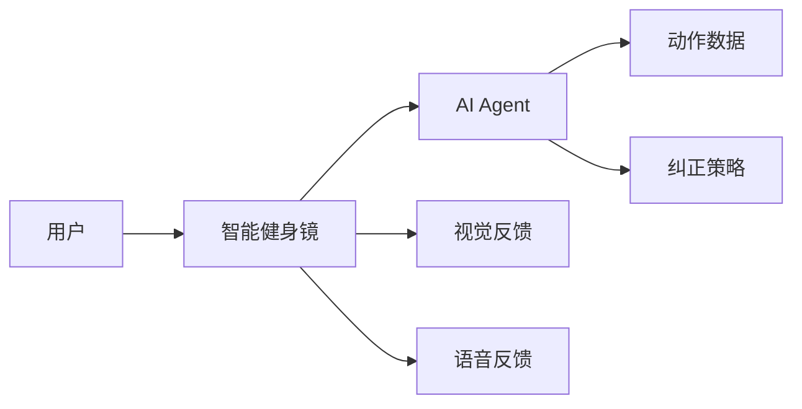
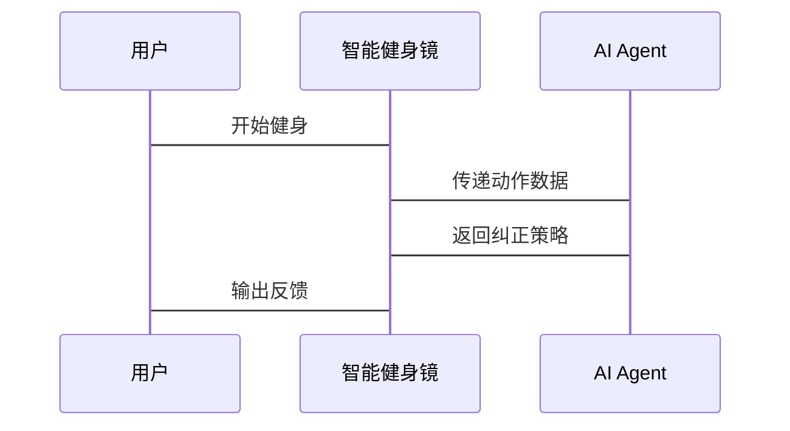

                 


# 《AI Agent在智能健身镜中的实时动作纠正》

---

## 关键词：
AI Agent, 智能健身镜, 实时动作纠正, 计算机视觉, 深度学习, 姿态估计, 动作识别

---

## 摘要：
本文深入探讨了AI Agent在智能健身镜中的实时动作纠正技术，从背景、原理到实现进行了全面分析。文章首先介绍了AI Agent和智能健身镜的基本概念及其在健身领域的应用价值，随后详细阐述了动作纠正的核心原理，包括动作捕捉、姿态估计和动作识别的技术细节。接着，文章从算法、数学模型和系统架构等多个维度分析了实现实时动作纠正的关键技术，最后通过项目实战展示了AI Agent在智能健身镜中的具体应用。本文内容详实，结构清晰，旨在为相关领域的研究人员和技术人员提供有价值的参考。

---

# 第一部分: AI Agent与智能健身镜的背景与概念

## 第1章: AI Agent与智能健身镜概述

### 1.1 AI Agent的基本概念
#### 1.1.1 AI Agent的定义与特点
AI Agent（人工智能代理）是指能够感知环境、自主决策并执行任务的智能实体。其特点包括：自主性、反应性、目标导向性和学习能力。

#### 1.1.2 AI Agent的核心功能与应用场景
- **核心功能**：感知、推理、决策、执行。
- **应用场景**：智能助手、自动驾驶、机器人控制、智能健身镜等。

#### 1.1.3 AI Agent在智能健身镜中的作用
AI Agent通过实时分析用户的动作数据，提供个性化的健身指导和动作纠正服务。

### 1.2 智能健身镜的定义与特点
#### 1.2.1 智能健身镜的定义
智能健身镜是一种结合了AI技术的镜子，能够通过计算机视觉和深度学习算法实时捕捉用户的动作，并提供实时反馈和健身指导。

#### 1.2.2 智能健身镜的核心技术
- **计算机视觉**：用于捕捉和分析用户的动作数据。
- **深度学习**：用于动作识别和纠正策略的生成。
- **自然语言处理**：用于提供个性化的健身建议和指导。

#### 1.2.3 智能健身镜的市场现状与发展趋势
智能健身镜近年来迅速崛起，成为家庭健身和健身房的重要工具。其发展趋势包括功能多样化、用户体验优化和智能化水平提升。

### 1.3 本章小结
本章通过介绍AI Agent和智能健身镜的基本概念及其在健身领域的应用价值，为后续的技术分析奠定了基础。

---

# 第二部分: AI Agent在智能健身镜中的实时动作纠正核心概念

## 第2章: 动作纠正的核心概念与原理

### 2.1 动作纠正的背景与问题描述
#### 2.1.1 健身动作纠正的重要性
正确的健身动作可以避免运动损伤，提高锻炼效果。

#### 2.1.2 传统动作纠正的局限性
传统动作纠正依赖于人工指导，效率低且覆盖面有限。

#### 2.1.3 AI Agent在动作纠正中的优势
AI Agent能够实时捕捉用户的动作数据，提供个性化的纠正建议，显著提高了健身指导的效率和精准度。

### 2.2 AI Agent实现动作纠正的核心原理
#### 2.2.1 基于计算机视觉的动作捕捉
通过摄像头捕捉用户的动作数据，提取关键点信息。

#### 2.2.2 基于深度学习的动作识别与纠正
利用深度学习模型对动作数据进行分类，识别用户动作的正确性，并生成纠正策略。

#### 2.2.3 动作纠正的反馈机制
AI Agent通过语音或视觉方式实时反馈纠正建议，帮助用户调整动作。

### 2.3 动作纠正的边界与外延
#### 2.3.1 动作纠正的适用范围
适用于各种健身动作，如瑜伽、力量训练和有氧运动。

#### 2.3.2 动作纠正的局限性与挑战
- **局限性**：依赖硬件设备，网络延迟可能影响实时性。
- **挑战**：动作数据的多样性和复杂性增加了算法的难度。

#### 2.3.3 动作纠正与其他健身辅助功能的关系
动作纠正可以与运动计划、健康数据分析等功能结合，提供更全面的健身支持。

### 2.4 动作纠正的核心要素与概念结构
#### 2.4.1 动作数据采集
通过摄像头捕捉用户的动作数据，提取关键点信息。

#### 2.4.2 动作识别与分类
利用深度学习模型对动作数据进行分类，识别用户动作的正确性。

#### 2.4.3 动作纠正策略生成
基于动作识别结果，生成个性化的纠正建议。

---

## 第3章: 动作捕捉与姿态估计的原理

### 3.1 基于深度学习的动作捕捉技术
#### 3.1.1 基于2D图像的姿态估计
通过2D图像捕捉用户的姿态，提取关键点信息。

#### 3.1.2 基于3D数据的姿态估计
利用3D传感器或摄像头捕捉用户的动作数据，进行更精准的姿态估计。

#### 3.1.3 姿态估计的主流算法与对比
- **主流算法**：包括基于模板匹配、特征提取和深度学习的方法。
- **对比分析**：深度学习算法在准确性和实时性上具有明显优势。

### 3.2 姿态估计的数学模型与公式
#### 3.2.1 基于关键点检测的数学模型
$$
\text{姿态估计} = \argmin_{\theta} \sum_{i=1}^{n} (y_i - f(x_i, \theta))^2
$$
其中，$\theta$为模型参数，$x_i$和$y_i$分别为输入和输出。

#### 3.2.2 基于回归的姿势估计公式
$$
f(x) = Wx + b
$$
其中，$W$和$b$为模型参数，$x$为输入数据。

#### 3.2.3 姿态估计的优化方法
通过梯度下降等优化算法，最小化估计误差，提高模型精度。

### 3.3 姿态估计的Mermaid流程图


---

## 第4章: 动作识别与纠正的算法实现

### 4.1 动作识别的核心算法
#### 4.1.1 基于时间序列的分类
利用RNN或LSTM等模型，对连续动作数据进行分类。

#### 4.1.2 基于空间特征的分类
通过提取动作的关键点特征，进行分类。

#### 4.1.3 基于注意力机制的分类
引入注意力机制，聚焦于关键动作部分。

### 4.2 动作纠正的策略生成
#### 4.2.1 基于规则的纠正策略
根据预定义的规则，生成纠正建议。

#### 4.2.2 基于强化学习的纠正策略
通过强化学习，优化纠正策略的生成过程。

#### 4.2.3 基于用户反馈的纠正策略
结合用户的反馈，动态调整纠正策略。

### 4.3 动作纠正的反馈机制
#### 4.3.1 反馈类型
- **视觉反馈**：通过图形或文字提示用户调整动作。
- **语音反馈**：通过语音指导用户纠正动作。

#### 4.3.2 反馈优化策略
通过A/B测试和用户反馈，不断优化反馈的准确性和及时性。

---

## 第5章: 系统分析与架构设计方案

### 5.1 问题场景介绍
智能健身镜需要实时捕捉用户的动作数据，并通过AI Agent进行分析和纠正。

### 5.2 系统功能设计
#### 5.2.1 功能模块划分
- **数据采集模块**：负责捕捉用户的动作数据。
- **动作识别模块**：负责识别用户的动作。
- **动作纠正模块**：负责生成纠正策略。
- **反馈模块**：负责输出纠正建议。

#### 5.2.2 领域模型Mermaid类图


### 5.3 系统架构设计
#### 5.3.1 系统架构Mermaid图


### 5.4 系统接口设计
- **输入接口**：摄像头和麦克风。
- **输出接口**：显示屏和扬声器。

### 5.5 系统交互Mermaid序列图


---

## 第6章: 项目实战

### 6.1 环境安装
- **硬件**：摄像头、麦克风、显示屏。
- **软件**：Python、深度学习框架（如TensorFlow、PyTorch）。

### 6.2 核心代码实现
#### 6.2.1 动作捕捉代码
```python
import cv2

def capture_action():
    cap = cv2.VideoCapture(0)
    while True:
        ret, frame = cap.read()
        # 处理帧
        # ...
        cv2.imshow('Action Capture', frame)
        if cv2.waitKey(1) & 0xFF == ord('q'):
            break
    cap.release()
    cv2.destroyAllWindows()
```

#### 6.2.2 动作识别代码
```python
import tensorflow as tf

model = tf.keras.models.load_model('action_model.h5')

def predict_action(frame):
    prediction = model.predict(frame)
    return np.argmax(prediction, axis=1)
```

#### 6.2.3 动作纠正策略生成代码
```python
def generate_correction_strategy(action):
    # 根据动作生成纠正策略
    # ...
    return correction_strategy
```

### 6.3 功能实现与案例分析
通过实际案例分析，展示AI Agent在智能健身镜中的实时动作纠正功能。

### 6.4 项目小结
总结项目实现的关键点和经验教训。

---

## 第7章: 最佳实践与注意事项

### 7.1 最佳实践
- **数据质量**：确保动作数据的准确性和完整性。
- **模型优化**：通过数据增强和模型调优提高算法性能。

### 7.2 小结
总结本文的主要内容和核心观点。

### 7.3 注意事项
- **隐私保护**：确保用户数据的安全性。
- **用户体验**：优化反馈的及时性和准确性。

### 7.4 拓展阅读
推荐相关领域的书籍和论文，供读者进一步学习。

---

## 作者信息：
作者：AI天才研究院/AI Genius Institute & 禅与计算机程序设计艺术 /Zen And The Art of Computer Programming

