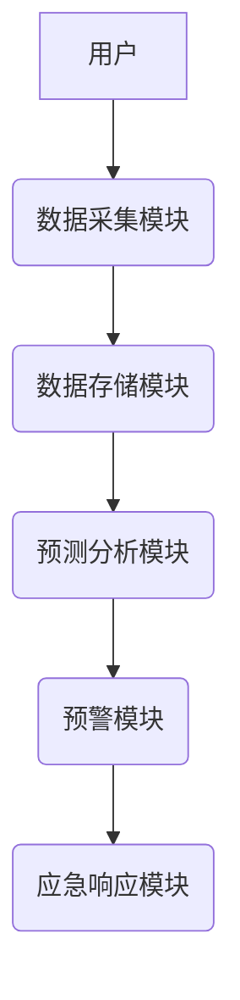
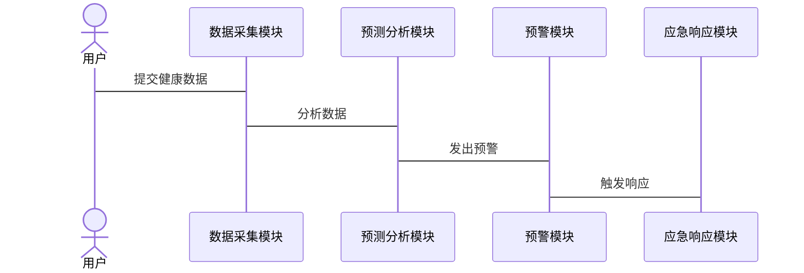

                 


# AI Agent在智能公共卫生监测中的角色

## 关键词：
- AI Agent
- 公共卫生监测
- 疾病预测
- 疫苗管理
- 应急响应
- 多 Agent 协作

## 摘要：
本文探讨AI Agent在智能公共卫生监测中的核心作用，分析其在疾病预测、疫苗管理和应急响应中的应用场景，结合算法原理和系统架构，提出实际项目实现方案，并展望未来发展趋势。

---

## 第一部分: AI Agent与公共卫生监测的背景与概述

### 第1章: AI Agent的基本概念与公共卫生监测的背景

#### 1.1 公共卫生监测的定义与重要性
公共卫生监测是通过收集、分析和解释健康数据，识别和评估健康问题，以采取预防和控制措施。其核心目标是早期发现疾病暴发，减少公共卫生事件的影响。

#### 1.2 AI Agent的定义与核心特征
AI Agent是一种能够感知环境、自主决策并执行任务的智能体，具备知识表示、推理、规划和自然语言处理能力。

#### 1.3 AI Agent在公共卫生监测中的作用
AI Agent可辅助疾病预测、疫苗管理、应急响应，提升公共卫生监测的效率和准确性。

---

### 第2章: AI Agent的核心概念与原理

#### 2.1 AI Agent的核心概念
- **知识表示**：使用知识图谱表示疾病相关知识。
- **推理**：通过逻辑推理和概率推理进行决策。
- **对话系统**：支持自然语言交互，提供健康咨询。

#### 2.2 AI Agent的感知与决策机制
- **感知层**：通过数据收集和分析理解环境。
- **决策层**：基于预测模型做出决策。
- **执行层**：通过API调用外部系统执行任务。

#### 2.3 AI Agent的通信与协作机制
- **通信协议**：使用FIPA协议进行Agent间通信。
- **协作模型**：采用分布式协作架构，实现多Agent任务分配。

---

### 第3章: AI Agent在公共卫生监测中的具体应用

#### 3.1 疾病爆发预测与预警
- **数据处理**：收集历史病例数据。
- **预测模型**：基于LSTM的疾病预测模型。
- **预警系统**：通过阈值触发预警。

#### 3.2 疫苗接种管理与优化
- **需求预测**：预测疫苗需求量。
- **优化算法**：使用遗传算法优化分配。
- **效果评估**：分析疫苗覆盖率。

#### 3.3 公共卫生事件的应急响应
- **自动化流程**：AI Agent自动触发应急响应。
- **协作机制**：多Agent协作处理突发事件。

---

### 第4章: AI Agent的算法原理与数学模型

#### 4.1 知识表示与推理算法
- **知识图谱构建**：使用图嵌入表示疾病关系。
- **逻辑推理**：基于规则的推理系统。
- **概率推理**：贝叶斯网络模型用于疾病预测。

#### 4.2 问题求解与规划算法
- **A*算法**：用于路径规划。
- **规划框架**：使用STRIPS语言定义动作。

#### 4.3 自然语言处理与对话系统
- **NLP模型**：使用BERT进行意图识别。
- **对话管理**：基于DAG的对话流程。

---

## 第二部分: 系统架构与设计

### 第5章: 系统架构设计

#### 5.1 系统功能设计
- **数据采集**：实时采集健康数据。
- **预测分析**：疾病预测模型。
- **应急响应**：触发预警和响应。

#### 5.2 系统架构图


#### 5.3 系统接口设计
- **API接口**：提供RESTful API。
- **通信接口**：使用WebSocket实时通信。

#### 5.4 系统交互流程


---

## 第三部分: 项目实战

### 第6章: 项目实现

#### 6.1 环境安装
- **Python 3.8+**
- **TensorFlow 2.0+**
- **Flask 2.0+**

#### 6.2 核心代码实现
```python
# 疾病预测模型
import tensorflow as tf
from tensorflow.keras import layers

model = tf.keras.Sequential([
    layers.Dense(64, activation='relu', input_shape=(input_dim,)),
    layers.Dense(1, activation='sigmoid')
])

model.compile(optimizer='adam', loss='binary_crossentropy', metrics=['accuracy'])
model.fit(X_train, y_train, epochs=10, batch_size=32)
```

#### 6.3 案例分析
- **案例背景**：某地区流感疫情预测。
- **数据处理**：处理历史病例数据。
- **模型训练**：训练疾病预测模型。
- **结果分析**：评估模型准确率。

---

## 第四部分: 总结与展望

### 7.1 总结
AI Agent在公共卫生监测中的应用显著提升了效率和准确性，但仍需解决数据隐私和模型解释性问题。

### 7.2 展望
未来，AI Agent将在更多公共卫生场景中发挥作用，推动智能公共卫生监测的发展。

---

## 作者：
AI天才研究院  
禅与计算机程序设计艺术

