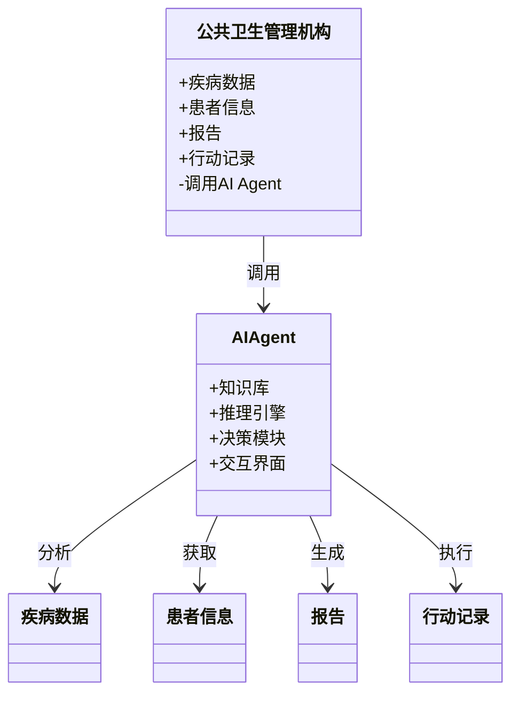
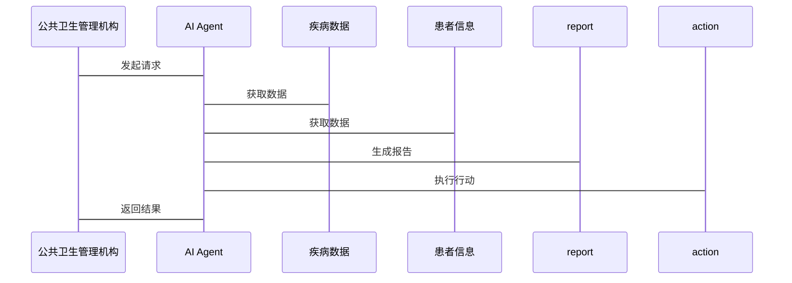

                 


# AI Agent在智能公共卫生管理中的角色

> 关键词：AI Agent, 公共卫生管理, 人工智能, 疾病预测, 人机协作

> 摘要：本文探讨了AI Agent在智能公共卫生管理中的角色与应用，详细分析了AI Agent的核心概念、算法原理、系统架构，以及其在疾病预测、疫情监测、资源分配等方面的具体应用。通过实际案例分析和代码实现，展示了AI Agent如何提升公共卫生管理的效率和精准度。

---

## 第1章: 公共卫生管理的AI Agent背景

### 1.1 AI Agent的基本概念

#### 1.1.1 AI Agent的定义与特点
- AI Agent（人工智能代理）是一种能够感知环境、自主决策并执行任务的智能体。
- 具备学习、推理、规划和自适应能力。
- 特点包括智能化、自主性、协作性和实时性。

#### 1.1.2 公共卫生管理的定义与核心任务
- 公共卫生管理：通过预防、监测和控制疾病，保护公众健康。
- 核心任务包括疾病预防、疫情监测、资源分配和健康教育。

#### 1.1.3 AI Agent在公共卫生管理中的结合意义
- 提高公共卫生管理的效率和精准度。
- 实现数据的实时分析和快速决策。
- 为公共卫生管理提供智能化支持。

### 1.2 公共卫生管理的现状与挑战

#### 1.2.1 当前公共卫生管理的主要问题
- 数据分散，难以整合和分析。
- 疾病预测和疫情监测的准确性不足。
- 资源分配不合理，影响应对效率。

#### 1.2.2 AI技术在公共卫生管理中的应用潜力
- 数据分析与挖掘：利用AI技术处理海量数据，提取有价值的信息。
- 疾病预测与预警：通过机器学习模型预测疾病 outbreak。
- 资源优化配置：AI Agent可以根据需求动态分配医疗资源。

#### 1.2.3 AI Agent在公共卫生管理中的独特价值
- 实现实时监测和动态调整。
- 提供个性化健康建议。
- 支持决策者快速制定应对策略。

### 1.3 本章小结
本章介绍了AI Agent的基本概念和公共卫生管理的核心任务，分析了当前公共卫生管理的挑战，并探讨了AI Agent在其中的应用潜力和独特价值。

---

## 第2章: AI Agent的核心概念与原理

### 2.1 AI Agent的组成与功能

#### 2.1.1 知识表示与推理
- 知识表示：将公共卫生领域的知识转化为计算机可理解的形式。
- 推理：通过逻辑推理得出结论，例如“如果某地区出现病例数激增，则可能存在疫情爆发风险”。

#### 2.1.2 行为决策与规划
- 行为决策：基于当前环境和目标，选择最优行动方案。
- 规划：制定实现目标的具体步骤，例如“在疫情爆发时，优先分配疫苗到高风险区域”。

#### 2.1.3 人机交互与协作
- 人机交互：通过自然语言处理技术实现与人类的高效沟通。
- 协作：AI Agent与公共卫生工作人员协同工作，共同完成任务。

### 2.2 AI Agent与传统公共卫生管理工具的对比

#### 2.2.1 功能对比分析
| 功能 | 传统工具 | AI Agent |
|------|----------|----------|
| 数据分析 | 基于规则的统计分析 | 数据挖掘、机器学习 |
| 决策支持 | 专家经验 | 自主学习与推理 |
| 响应速度 | 人工处理，速度较慢 | 实时响应，快速决策 |

#### 2.2.2 优缺点对比
- 优点：AI Agent具备更强的数据处理能力、自主学习能力和实时响应能力。
- 缺点：AI Agent的开发和维护成本较高，且依赖于高质量的数据输入。

#### 2.2.3 应用场景对比
- 传统工具适用于简单的数据统计和报告生成。
- AI Agent适用于复杂的预测、决策和动态调整。

### 2.3 AI Agent在公共卫生管理中的实体关系分析

#### 2.3.1 ER实体关系图

```mermaid
er
  actor: 公共卫生管理机构
  agent: AI Agent
  disease: 疾病数据
  patient: 患者信息
  report: 报告
  action: 行动记录
  actor --> agent: 调用
  agent --> disease: 分析疾病数据
  agent --> patient: 获取患者信息
  agent --> report: 生成报告
  agent --> action: 执行行动
```

### 2.4 本章小结
本章详细讲解了AI Agent的组成与功能，并通过对比分析突出了其在公共卫生管理中的优势。同时，通过ER实体关系图展示了AI Agent在公共卫生管理中的应用场景。

---

## 第3章: AI Agent的算法原理与数学模型

### 3.1 AI Agent的核心算法

#### 3.1.1 逻辑推理算法
- 基于规则的推理：通过预定义的规则进行推理，例如“如果A，则B”。
- 模糊逻辑推理：处理不确定性和模糊信息，例如“高温天气可能增加疾病传播风险”。

#### 3.1.2 行为决策算法
- Q-Learning算法：通过强化学习优化决策策略。
- 分层 softmax 算法：在多类别决策中选择最优选项。

#### 3.1.3 人机交互算法
- 自然语言处理算法：如BERT模型用于理解用户意图。
- 增量学习算法：根据新输入逐步优化交互策略。

### 3.2 算法原理的数学模型

#### 3.2.1 逻辑推理模型
$$ P(A|B) = \frac{P(B|A)P(A)}{P(B)} $$
- 上式表示在已知B发生的条件下，A发生的概率。

#### 3.2.2 行为决策模型
$$ V(s) = \max_{a} Q(s,a) $$
- 表示在状态s下，选择最优动作a，使得Q值最大。

#### 3.2.3 人机交互模型
$$ I = \sum_{i=1}^{n} w_i x_i $$
- 表示通过加权求和的方式，将用户输入转化为系统响应。

### 3.3 算法实现的Python代码示例

#### 3.3.1 Q-Learning算法实现
```python
import numpy as np

class QLearningAgent:
    def __init__(self, state_space_size, action_space_size):
        self.q_table = np.zeros((state_space_size, action_space_size))
    
    def act(self, state, epsilon=0.1):
        if np.random.random() < epsilon:
            return np.random.randint(0, action_space_size)
        else:
            return np.argmax(self.q_table[state])
    
    def learn(self, state, action, reward, next_state):
        alpha = 0.1
        gamma = 0.9
        self.q_table[state][action] += alpha * (reward + gamma * np.max(self.q_table[next_state]) - self.q_table[state][action])
```

#### 3.3.2 逻辑推理算法实现
```python
def fuzzy_inference(input_value, rule_base):
    result = 0
    for rule in rule_base:
        if rule['antecedent'](input_value):
            result += rule['consequent'](input_value)
    return result / len(rule_base)
```

### 3.4 本章小结
本章详细讲解了AI Agent的核心算法及其数学模型，并通过Python代码示例展示了算法的实现过程。这些算法为公共卫生管理提供了强大的技术支持。

---

## 第4章: 公共卫生管理系统的AI Agent架构

### 4.1 问题场景介绍
- 疫情监测与预测：实时监控疫情动态，预测疾病传播趋势。
- 资源分配与调度：根据疫情发展，动态分配医疗资源。
- 应急响应与协调：在突发公共卫生事件中，快速制定应对方案。

### 4.2 系统功能设计

#### 4.2.1 领域模型类图



#### 4.2.2 系统架构设计


#### 4.2.3 接口设计与交互流程图



### 4.3 本章小结
本章通过系统架构设计和交互流程图，详细展示了AI Agent在公共卫生管理系统中的应用场景和实现方式。

---

## 第5章: AI Agent在公共卫生管理中的项目实战

### 5.1 环境安装与配置

#### 5.1.1 安装Python和相关库
```bash
pip install numpy pandas scikit-learn matplotlib
```

#### 5.1.2 安装AI框架（如TensorFlow或PyTorch）
```bash
pip install tensorflow
```

### 5.2 系统核心功能实现

#### 5.2.1 疾病预测模型实现
```python
from sklearn.ensemble import RandomForestClassifier
import pandas as pd

# 加载数据
data = pd.read_csv('disease.csv')

# 分割特征与标签
X = data.drop('disease', axis=1)
y = data['disease']

# 训练模型
model = RandomForestClassifier().fit(X, y)

# 预测新数据
new_data = pd.DataFrame(...)
prediction = model.predict(new_data)
```

#### 5.2.2 资源分配算法实现
```python
def allocate_resources(needs, available):
    # 根据优先级分配资源
    priorities = sorted(available.keys(), key=lambda x: available[x]['priority'])
    allocation = {}
    for p in priorities:
        if available[p]['quantity'] > 0:
            allocation[p] = min(needs[p], available[p]['quantity'])
    return allocation
```

### 5.3 案例分析与实际应用

#### 5.3.1 疫情监测与预测案例
- 数据来源：某地区疾病报告数据。
- 模型实现：使用随机森林模型预测疾病传播趋势。
- 结果分析：预测结果与实际数据对比，验证模型准确性。

#### 5.3.2 资源分配优化案例
- 案例背景：某地区疫情爆发，医疗资源紧张。
- 实现步骤：根据患者需求和资源可用性，动态分配医院、药品等资源。
- 应用效果：提高了资源利用效率，减少了患者等待时间。

### 5.4 本章小结
本章通过实际案例展示了AI Agent在公共卫生管理中的应用，并详细讲解了系统的实现过程。

---

## 第6章: AI Agent的最佳实践与未来展望

### 6.1 最佳实践 tips
- 数据质量：确保输入数据的准确性和完整性。
- 模型选择：根据具体场景选择合适的算法。
- 人机协作：AI Agent与公共卫生工作人员协同工作，发挥各自优势。

### 6.2 小结
- AI Agent在公共卫生管理中的应用前景广阔。
- 随着技术的进步，AI Agent将更加智能化和自主化。

### 6.3 注意事项
- 数据隐私保护：确保患者数据的安全性和隐私性。
- 系统稳定性：保证AI Agent在关键时刻能够正常运行。
- 可解释性：提高AI决策的透明度，便于人类理解和信任。

### 6.4 拓展阅读
- 推荐阅读《机器学习实战》、《深度学习》等书籍。
- 关注AI在公共卫生领域的最新研究和应用。

---

## 作者：AI天才研究院/AI Genius Institute & 禅与计算机程序设计艺术 /Zen And The Art of Computer Programming

---

通过以上目录和内容安排，您可以按照这个结构撰写一篇完整且详细的博客文章，涵盖AI Agent在智能公共卫生管理中的各个方面。

