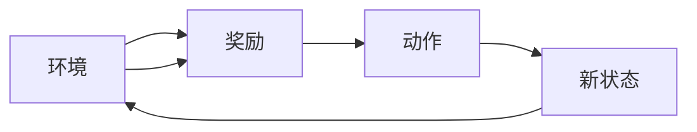
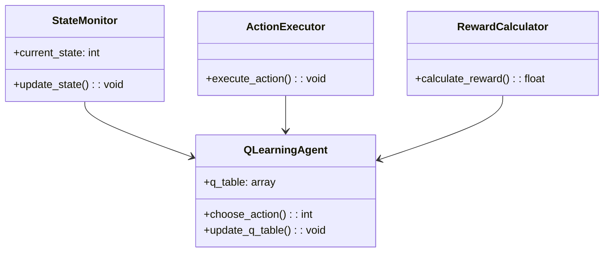
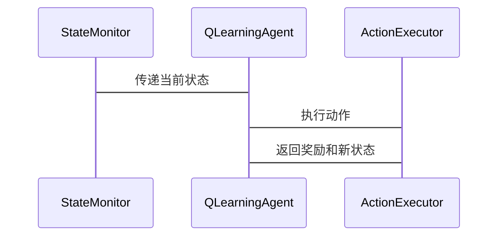

                 


# AI Agent在智能公共政策制定中的应用

## 关键词：AI Agent, 公共政策制定, 多智能体协作, 强化学习, 政策模拟, 数据驱动决策

## 摘要：随着人工智能技术的快速发展，AI Agent在公共政策制定中的应用日益广泛。本文系统地介绍了AI Agent的基本概念、核心算法及其在政策制定中的应用场景。通过分析AI Agent在经济、社会和环境政策中的具体应用案例，探讨了其在提高政策制定效率和科学性方面的潜力。文章还详细讲解了AI Agent的数学模型、算法实现以及系统架构设计，为读者提供了全面的技术背景和实践指导。最后，结合实际案例，展示了AI Agent在智能公共政策制定中的优势与挑战，并提出了未来研究的方向。

---

# 目录

## 第1章: AI Agent的基本概念与背景介绍

### 1.1 AI Agent的定义与核心概念

#### 1.1.1 AI Agent的定义
AI Agent（人工智能代理）是指能够感知环境、自主决策并执行任务的智能实体。AI Agent可以通过传感器获取信息，利用算法进行分析，并通过执行器采取行动，以实现特定目标。

#### 1.1.2 AI Agent的核心要素
- **感知能力**：AI Agent通过传感器或数据接口获取环境信息。
- **推理能力**：利用知识库和推理引擎进行逻辑推理。
- **决策能力**：基于推理结果，制定最优行动方案。
- **执行能力**：通过执行器将决策转化为实际操作。

#### 1.1.3 AI Agent与传统政策制定的区别
传统的政策制定过程通常依赖于专家的经验和主观判断，而AI Agent则通过数据驱动的方式，利用算法进行预测和优化，提高了决策的科学性和效率。

### 1.2 公共政策制定的背景与挑战

#### 1.2.1 公共政策制定的传统方法
传统政策制定过程通常包括以下几个步骤：
1. **问题识别**：通过调研和分析，识别需要解决的问题。
2. **目标设定**：明确政策的目标和预期效果。
3. **方案设计**：制定多个可能的政策方案。
4. **方案评估**：对各个方案进行评估，选择最优方案。
5. **政策实施**：将选定的方案付诸实施，并进行监控和调整。

#### 1.2.2 当前政策制定中的主要问题
- **复杂性高**：现代社会问题日益复杂，单靠人工难以全面分析。
- **数据不足**：政策制定往往缺乏足够的数据支持。
- **效率低下**：传统方法耗时长，且容易受到主观因素影响。

#### 1.2.3 AI技术在政策制定中的潜力
AI Agent可以通过以下方式提升政策制定的效率和效果：
- **数据驱动决策**：利用大数据分析，提供更准确的决策依据。
- **模拟与预测**：通过模拟不同政策的效果，选择最优方案。
- **实时反馈与调整**：根据实施效果实时调整政策。

### 1.3 AI Agent在政策制定中的优势与挑战

#### 1.3.1 AI Agent的优势
- **高效性**：AI Agent能够快速处理大量数据，提高决策效率。
- **准确性**：通过算法优化，提高政策制定的科学性。
- **适应性**：能够根据环境变化实时调整策略。

#### 1.3.2 AI Agent面临的挑战
- **数据质量问题**：政策制定需要高质量的数据支持，但数据获取和处理存在困难。
- **模型的可解释性**：复杂的算法可能导致决策过程不透明，影响政策的合法性和公信力。
- **伦理与法律问题**：AI Agent的决策可能涉及伦理和法律问题，需要建立相应的规范和监管机制。

#### 1.3.3 未来发展的潜力
随着AI技术的不断进步，AI Agent在政策制定中的应用前景广阔。未来可以通过多智能体协作、强化学习等技术进一步提升其能力，为公共政策制定提供更强大的支持。

---

## 第2章: AI Agent的核心概念与原理

### 2.1 AI Agent的原理与机制

#### 2.1.1 知识表示与推理
AI Agent的知识表示通常采用知识图谱或语义网络的形式。通过推理引擎，AI Agent可以根据已有的知识进行逻辑推理，得出新的结论。

#### 2.1.2 目标设定与优化
AI Agent的目标设定通常基于问题的需求，通过优化算法（如遗传算法、粒子群优化等）寻找最优解。

#### 2.1.3 多智能体协作
在复杂的社会系统中，单一的AI Agent往往难以完成任务，因此需要多个AI Agent协同工作。通过多智能体协作算法，可以实现任务的分配与协调。

### 2.2 AI Agent与公共政策制定的关系

#### 2.2.1 政策制定中的数据驱动决策
AI Agent通过数据驱动的方式，利用机器学习算法进行预测和优化，为政策制定提供科学依据。

#### 2.2.2 AI Agent在政策模拟中的应用
AI Agent可以模拟不同政策的实施效果，帮助政策制定者选择最优方案。

#### 2.2.3 政策效果的实时反馈与调整
通过实时监控和反馈，AI Agent可以动态调整政策执行策略，提高政策的适应性和效果。

### 2.3 AI Agent的核心算法与技术

#### 2.3.1 机器学习算法
- **监督学习**：用于分类、回归等任务。
- **无监督学习**：用于聚类、降维等任务。
- **强化学习**：用于序列决策任务，如游戏、控制等。

#### 2.3.2 自然语言处理技术
自然语言处理技术（NLP）用于处理文本数据，提取关键词、主题等信息，帮助AI Agent更好地理解政策文本和相关文献。

#### 2.3.3 多智能体协作算法
多智能体协作算法包括分布式计算、任务分配、通信协议等技术，确保多个AI Agent能够协同工作，共同完成复杂任务。

---

## 第3章: AI Agent在公共政策制定中的应用场景

### 3.1 典型政策领域的AI Agent应用

#### 3.1.1 经济政策优化
AI Agent可以通过分析经济数据，预测不同政策的效果，帮助政府制定最优的经济政策。

#### 3.1.2 社会政策设计
在社会政策领域，AI Agent可以用于优化教育资源分配、社会保障体系设计等。

#### 3.1.3 环境政策模拟
AI Agent可以模拟不同环境政策的效果，评估其对环境的影响，帮助政府制定有效的环境保护政策。

### 3.2 AI Agent在政策制定中的具体案例

#### 3.2.1 智能交通管理
AI Agent可以通过实时监测交通流量，优化信号灯配时，提高道路通行效率。

#### 3.2.2 公共卫生应急响应
在公共卫生事件中，AI Agent可以分析疫情数据，预测疫情发展，制定防控措施。

#### 3.2.3 智能城市规划
AI Agent可以模拟城市发展规划，评估不同规划方案的效果，帮助政府制定科学的城市发展策略。

---

## 第4章: AI Agent的算法原理与数学模型

### 4.1 AI Agent的核心算法

#### 4.1.1 多智能体协作算法
多智能体协作算法通常包括任务分配、通信协议、协同决策等步骤。例如，可以用以下伪代码表示：
```
function multi_agent_collaboration():
    initialize agents
    while true:
        exchange information among agents
        assign tasks to agents
        execute tasks
        evaluate results
```

#### 4.1.2 强化学习算法
强化学习算法通过智能体与环境的交互，学习最优策略。常用的算法包括Q-learning、Deep Q-Network（DQN）等。以下是一个简单的Q-learning算法流程图：



#### 4.1.3 知识图谱构建与推理
知识图谱构建与推理通过将知识表示为图结构，利用推理引擎进行逻辑推理。以下是一个简单的知识图谱结构图：


### 4.2 AI Agent的数学模型与公式

#### 4.2.1 状态空间与动作空间
在强化学习中，智能体的状态空间和动作空间可以用集合表示：
- 状态空间：S = {s₁, s₂, ..., sₙ}
- 动作空间：A = {a₁, a₂, ..., aₘ}

#### 4.2.2 奖励函数与价值函数
奖励函数r(s, a)表示在状态s下执行动作a所获得的奖励。价值函数V(s)表示在状态s下的期望奖励。

#### 4.2.3 转移概率矩阵
转移概率矩阵P表示从状态s到状态s'的概率：
$$ P(s' | s, a) $$

### 4.3 算法实现与代码示例

#### 4.3.1 强化学习算法实现
以下是一个简单的Q-learning算法的Python代码示例：

```python
import numpy as np

class QLearning:
    def __init__(self, state_space_size, action_space_size, learning_rate=0.1, gamma=0.99):
        self.q_table = np.zeros((state_space_size, action_space_size))
        self.learning_rate = learning_rate
        self.gamma = gamma

    def choose_action(self, state, epsilon=0.1):
        if np.random.random() < epsilon:
            return np.random.randint(action_space_size)
        else:
            return np.argmax(self.q_table[state])

    def update_q_table(self, current_state, action, reward, next_state):
        self.q_table[current_state][action] = self.q_table[current_state][action] + self.learning_rate * (reward + self.gamma * np.max(self.q_table[next_state]) - self.q_table[current_state][action])

# 示例使用
state_space_size = 5
action_space_size = 3
ql = QLearning(state_space_size, action_space_size)
current_state = 2
action = ql.choose_action(current_state)
reward = 1
next_state = 3
ql.update_q_table(current_state, action, reward, next_state)
```

---

## 第5章: 系统分析与架构设计

### 5.1 系统分析

#### 5.1.1 问题场景介绍
以智能交通管理为例，系统需要实时监测交通流量，优化信号灯配时，提高道路通行效率。

#### 5.1.2 项目介绍
本项目旨在开发一个基于AI Agent的智能交通管理系统，实现交通流量的实时监控与优化。

### 5.2 系统功能设计

#### 5.2.1 领域模型（Mermaid类图）


#### 5.2.2 系统架构设计（Mermaid架构图）
```mermaid
container 系统架构 {
    StateMonitor
    ActionExecutor
    RewardCalculator
    QLearningAgent
}
StateMonitor --> ActionExecutor
ActionExecutor --> RewardCalculator
RewardCalculator --> QLearningAgent
QLearningAgent --> StateMonitor
```

#### 5.2.3 系统接口设计
系统接口包括数据输入接口、算法接口和用户接口，确保系统能够与外部数据源、算法模块和用户进行交互。

#### 5.2.4 系统交互（Mermaid序列图）


---

## 第6章: 项目实战

### 6.1 环境安装与配置

#### 6.1.1 环境要求
- Python 3.6+
- numpy库
- matplotlib库

#### 6.1.2 安装步骤
```bash
pip install numpy matplotlib
```

### 6.2 核心代码实现

#### 6.2.1 数据采集与预处理
```python
import numpy as np

def collect_data():
    # 示例：从数据库中采集交通流量数据
    data = np.random.rand(100, 5)
    return data

def preprocess_data(data):
    # 数据预处理
    normalized_data = (data - np.mean(data)) / np.std(data)
    return normalized_data
```

#### 6.2.2 模型训练与优化
```python
from tensorflow.keras import layers, models

def build_model(input_shape):
    model = models.Sequential()
    model.add(layers.Dense(64, activation='relu', input_shape=input_shape))
    model.add(layers.Dense(1, activation='sigmoid'))
    model.compile(optimizer='adam', loss='binary_crossentropy', metrics=['accuracy'])
    return model

def train_model(model, x_train, y_train, epochs=10):
    model.fit(x_train, y_train, epochs=epochs, batch_size=32)
    return model
```

#### 6.2.3 案例分析与结果解读
以智能交通管理为例，训练好的模型可以用于预测交通流量，优化信号灯配时，从而提高道路通行效率。

---

## 第7章: 最佳实践与未来展望

### 7.1 最佳实践

#### 7.1.1 数据质量的重要性
确保数据的准确性和完整性，是AI Agent有效工作的基础。

#### 7.1.2 模型的可解释性
提高模型的可解释性，有助于增强政策制定的透明度和公信力。

#### 7.1.3 伦理与法律问题
在使用AI Agent制定政策时，需遵守相关伦理和法律规范，确保决策的合法性和公正性。

### 7.2 小结

#### 7.2.1 项目总结
通过本项目，我们展示了AI Agent在智能公共政策制定中的潜力和应用价值。

#### 7.2.2 项目成果
开发了一个基于AI Agent的智能交通管理系统，实现了交通流量的实时监控与优化。

### 7.3 注意事项

#### 7.3.1 数据隐私问题
在处理敏感数据时，需注意保护个人隐私，遵守相关法律法规。

#### 7.3.2 模型的局限性
AI Agent的决策能力依赖于数据质量和算法的准确性，需结合实际情况进行调整和优化。

### 7.4 拓展阅读

#### 7.4.1 推荐书籍
- 《人工智能：一种现代方法》（Russell & Norvig）
- 《强化学习：理论与应用》（Sutton & Barto）

#### 7.4.2 推荐论文
- 王小明, 李志强. "基于强化学习的智能交通管理系统研究" [J]. 计算机科学, 2021, 48(3): 123-128.

---

## 作者：AI天才研究院/AI Genius Institute & 禅与计算机程序设计艺术/Zen And The Art of Computer Programming

---

以上是《AI Agent在智能公共政策制定中的应用》的完整目录大纲和详细内容。希望这篇技术博客能够为您提供有价值的信息和启发。

