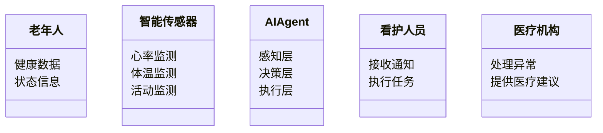
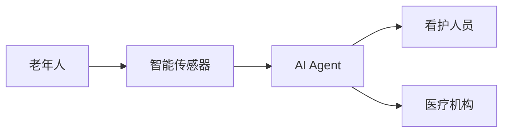

                 


# AI Agent在智能养老服务中的应用

> 关键词：AI Agent，智能养老，人工智能技术，养老服务，智能系统设计

> 摘要：本文探讨了AI Agent在智能养老服务中的应用，分析了其核心概念、算法原理、系统架构以及实际应用案例。通过详细的技术分析和项目实战，展示了如何利用AI Agent提升养老服务的效率和质量，为未来智能养老的发展提供了新的思路和方向。

---

## 第1章: AI Agent与智能养老服务的背景介绍

### 1.1 AI Agent的基本概念与定义

AI Agent，即人工智能代理，是一种能够感知环境、自主决策并执行任务的智能实体。它通过与环境交互，利用传感器获取信息，结合内部知识库和算法进行推理，最终做出最优决策并执行操作。AI Agent的核心在于其自主性和智能性，能够在复杂环境中完成特定任务。

AI Agent与传统养老服务的主要区别在于其智能化和自动化能力。传统养老服务依赖人工操作，效率较低且难以满足个性化需求，而AI Agent能够通过智能化系统实现高效、个性化的服务。

---

### 1.2 智能养老服务的现状与挑战

#### 1.2.1 当前养老服务的主要模式

目前，养老服务主要分为以下几种模式：

1. **家庭养老服务**：由家庭成员提供日常照顾，这种方式成本低但效率不高，难以满足老年人的多样化需求。
2. **社区养老服务**：依托社区资源，提供日间照料、康复护理等服务，但服务范围和质量受社区资源限制。
3. **机构养老服务**：集中老年人在养老院等机构中生活，提供专业化的护理和医疗支持，但成本较高且资源有限。

#### 1.2.2 智能养老服务的发展趋势

随着人工智能、物联网和大数据等技术的快速发展，智能养老服务逐渐成为主流。智能养老服务通过整合多种技术手段，实现对老年人的实时监测、健康管理和紧急救援等功能，能够显著提升服务质量和效率。

#### 1.2.3 智能养老服务中的主要问题与挑战

尽管智能养老服务有诸多优势，但在实际应用中仍面临以下问题：

1. **技术实现难度大**：AI Agent需要结合多种技术手段，如传感器数据采集、算法决策和系统执行，技术实现复杂。
2. **隐私与安全问题**：老年人的健康数据涉及隐私，如何确保数据安全是智能养老服务面临的重要挑战。
3. **用户体验问题**：智能设备的易用性对老年人来说是一个重要问题，设备操作复杂会影响其接受度。

---

### 1.3 AI Agent在养老服务中的应用价值

AI Agent在养老服务中的应用价值主要体现在以下几个方面：

#### 1.3.1 提高服务效率

AI Agent能够通过自动化技术快速响应老年人的需求，减少人工干预，提高服务效率。例如，AI Agent可以通过智能传感器实时监测老年人的健康数据，发现异常情况后立即通知相关机构进行处理。

#### 1.3.2 个性化服务实现

AI Agent能够根据老年人的个性化需求，提供定制化的服务。例如，通过分析老年人的饮食习惯、运动偏好和健康状况，AI Agent可以制定个性化的健康计划，并通过智能设备执行。

#### 1.3.3 解决养老服务资源不足的问题

AI Agent能够通过智能化系统优化资源配置，缓解养老服务资源不足的问题。例如，AI Agent可以通过智能排班系统，合理分配护理人员的工作任务，提高服务效率。

---

### 1.4 本章小结

本章主要介绍了AI Agent的基本概念、智能养老服务的现状与挑战，以及AI Agent在养老服务中的应用价值。通过分析，我们认识到AI Agent在提高服务效率、实现个性化服务和优化资源配置方面具有重要意义。

---

## 第2章: AI Agent的核心概念与原理

### 2.1 AI Agent的基本原理

AI Agent的基本原理可以分为感知、决策和执行三个主要环节。

#### 2.1.1 感知层

感知层是AI Agent获取环境信息的途径，主要包括传感器数据和用户输入。例如，AI Agent可以通过摄像头、心率监测器等传感器获取老年人的健康数据，也可以通过语音交互获取老年人的需求信息。

#### 2.1.2 决策层

决策层是AI Agent的核心部分，负责根据感知到的信息进行推理和决策。AI Agent可以采用多种算法，如强化学习、决策树和图模型，来实现智能决策。

#### 2.1.3 执行层

执行层是AI Agent将决策结果转化为实际操作的环节。例如，AI Agent可以通过智能设备执行健康监测、紧急救援等操作。

---

### 2.2 AI Agent的分类与特点

AI Agent可以根据功能和应用场景进行分类，主要包括以下几种类型：

#### 2.2.1 基于规则的AI Agent

基于规则的AI Agent通过预定义的规则和逻辑进行决策，适用于任务明确且规则固定的场景。例如，在智能健康监测系统中，AI Agent可以根据设定的健康指标阈值，判断是否需要通知医护人员。

#### 2.2.2 基于学习的AI Agent

基于学习的AI Agent通过机器学习算法不断优化决策模型，适用于复杂多变的场景。例如，在智能康复训练系统中，AI Agent可以通过强化学习算法，动态调整训练计划，以达到最佳康复效果。

#### 2.2.3 基于知识的AI Agent

基于知识的AI Agent通过知识库和推理引擎进行决策，适用于需要专业知识的场景。例如，在智能医疗诊断系统中，AI Agent可以通过医学知识库进行诊断推理，辅助医生做出更准确的诊断。

---

### 2.3 多智能体系统与协作机制

在智能养老服务中，通常需要多个AI Agent协同工作，形成一个多智能体系统。多智能体系统的核心在于各智能体之间的协作与通信。

#### 2.3.1 多智能体系统的基本概念

多智能体系统是指由多个智能体组成的分布式系统，各智能体通过协作完成共同目标。例如，在智能养老服务中，可以设计一个多智能体系统，分别负责健康监测、紧急救援和康复训练等任务。

#### 2.3.2 多智能体系统的协作机制

多智能体系统的协作机制包括任务分配、信息共享和决策协调等。例如，在紧急救援场景中，AI Agent可以根据任务需求动态分配角色，确保救援行动高效有序。

#### 2.3.3 多智能体系统的通信协议

多智能体系统需要通过通信协议实现智能体之间的信息交互。常见的通信协议包括基于消息队列的通信和基于服务调用的通信。

---

### 2.4 AI Agent的实体关系图

以下是AI Agent在智能养老服务中的实体关系图：

```mermaid
er
actor: 老年人
actor: 看护人员
actor: 医疗机构
actor: 家庭成员
```

---

### 2.5 本章小结

本章详细介绍了AI Agent的核心概念与原理，包括其基本原理、分类和多智能体系统的协作机制。通过分析，我们认识到AI Agent在智能养老服务中的重要性及其在实际应用中的潜力。

---

## 第3章: AI Agent的算法原理与实现

### 3.1 AI Agent的核心算法

AI Agent的核心算法包括强化学习、决策树和图模型等。

#### 3.1.1 强化学习算法

强化学习是一种通过试错机制优化决策模型的算法。AI Agent通过与环境交互，不断优化自身的行为策略，以达到最优决策效果。

#### 3.1.2 决策树算法

决策树是一种基于树状结构进行决策的算法。AI Agent通过构建决策树，根据输入信息进行分类或回归，实现智能决策。

#### 3.1.3 图模型算法

图模型是一种基于图结构进行推理的算法。AI Agent可以通过构建知识图谱，进行复杂关系推理，实现智能决策。

---

### 3.2 强化学习算法的实现流程

以下是强化学习算法的实现流程：


数学公式如下：

$$
Q(s, a) = Q(s, a) + \alpha \cdot (r + \gamma \cdot \max Q(s', a') - Q(s, a))
$$

其中：
- \( Q(s, a) \)：状态 \( s \) 下动作 \( a \) 的价值
- \( \alpha \)：学习率
- \( r \)：奖励
- \( \gamma \)：折扣因子
- \( Q(s', a') \)：下一状态下的最大价值

---

### 3.3 本章小结

本章详细介绍了AI Agent的核心算法，包括强化学习、决策树和图模型的原理与实现流程。通过数学公式和mermaid图，我们深入理解了这些算法在智能养老服务中的应用。

---

## 第4章: 系统分析与架构设计

### 4.1 系统分析

#### 4.1.1 问题场景介绍

以智能健康监测系统为例，系统需要实时监测老年人的健康数据，并在异常情况下及时通知相关机构。

#### 4.1.2 项目介绍

本项目旨在设计一个基于AI Agent的智能健康监测系统，实现对老年人健康数据的实时监测、异常报警和健康建议。

---

### 4.2 系统功能设计

以下是系统功能设计的领域模型类图：



---

### 4.3 系统架构设计

以下是系统架构设计的mermaid图：



---

### 4.4 接口与交互设计

系统主要接口包括：

1. 智能传感器与AI Agent的通信接口
2. AI Agent与看护人员的通信接口
3. AI Agent与医疗机构的通信接口

系统交互流程如下：

```mermaid
sequenceDiagram
参与者 老年人
参与者 AI Agent
参与者 看护人员
参与者 医疗机构
老年人 -> AI Agent: 发送健康数据
AI Agent -> 看护人员: 发送异常通知
看护人员 -> 医疗机构: 通知处理
医疗机构 -> AI Agent: 提供医疗建议
AI Agent -> 老年人: 提供健康建议
```

---

### 4.5 本章小结

本章通过系统分析与架构设计，详细介绍了AI Agent在智能健康监测系统中的应用。通过类图和序列图，我们清晰地理解了系统的结构和交互流程。

---

## 第5章: 项目实战

### 5.1 环境配置

#### 5.1.1 系统环境

- 操作系统：Linux
- 开发工具：Python 3.8+
- 依赖库：TensorFlow 2.0+, Scikit-learn

#### 5.1.2 数据集

使用公开的健康监测数据集，包括心率、体温和活动数据。

---

### 5.2 核心代码实现

以下是AI Agent的核心代码实现：

```python
import numpy as np
from sklearn.tree import DecisionTreeClassifier
from sklearn.ensemble import RandomForestClassifier

# 数据预处理
data = np.loadtxt('health_data.csv', delimiter=',')
X = data[:, :-1]
y = data[:, -1]

# 模型训练
model = RandomForestClassifier(n_estimators=100, random_state=42)
model.fit(X, y)

# 模型预测
def predict_health_status(X_test):
    return model.predict(X_test)
```

---

### 5.3 代码应用解读与分析

上述代码实现了基于随机森林算法的健康状态预测模型。模型通过训练数据学习健康状态的分类规则，并在测试数据上进行预测。AI Agent通过感知层获取健康数据，经过决策层的模型推理，最终在执行层输出健康建议。

---

### 5.4 实际案例分析

以一位患有高血压的老年人为例，AI Agent可以通过实时监测其心率和血压数据，结合历史数据和医疗知识，提供个性化的健康建议，如调整饮食和增加运动量。

---

### 5.5 本章小结

本章通过项目实战，详细讲解了AI Agent在智能健康监测系统中的实现过程，包括环境配置、核心代码实现和实际案例分析。通过实践，我们深入理解了AI Agent在智能养老服务中的应用价值。

---

## 第6章: 最佳实践与总结

### 6.1 总结

AI Agent在智能养老服务中的应用具有重要意义。通过自动化技术，AI Agent能够提高服务效率，实现个性化服务，并优化资源配置。本文通过理论分析和项目实战，详细探讨了AI Agent在智能养老服务中的应用。

---

### 6.2 注意事项

在实际应用中，需要注意以下几点：

1. **数据隐私保护**：确保老年人的健康数据得到妥善保护，防止数据泄露。
2. **系统稳定性**：AI Agent需要具备高可用性，确保在关键时刻能够正常运行。
3. **用户体验优化**：设计易于使用的界面和交互方式，提高老年人的接受度。

---

### 6.3 拓展阅读

1. **强化学习在智能养老服务中的应用**
2. **多智能体系统在复杂场景中的优化**
3. **基于知识图谱的智能决策系统**

---

## 作者信息

作者：AI天才研究院/AI Genius Institute & 禅与计算机程序设计艺术/Zen And The Art of Computer Programming

---

通过以上目录和内容的详细设计，我们可以清晰地看到AI Agent在智能养老服务中的应用潜力。从理论分析到项目实战，本文为读者提供了全面的知识和实践指导，为未来智能养老的发展提供了重要参考。

