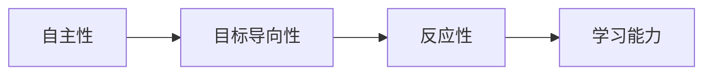
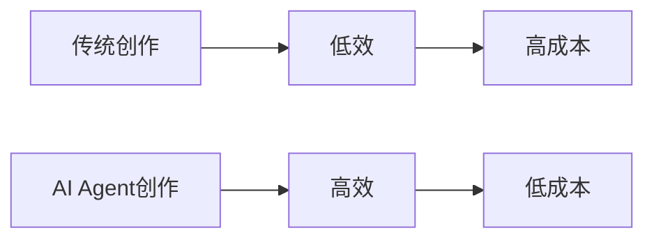
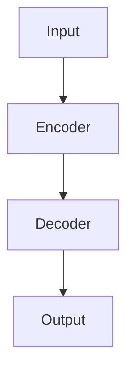
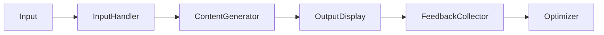
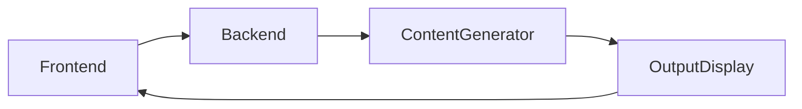

                 


# AI Agent在智能内容创作中的应用

---

## 关键词

- AI Agent
- 智能内容创作
- 生成式AI
- 自然语言处理
- 文本生成
- 机器学习

---

## 摘要

随着人工智能技术的快速发展，AI Agent（人工智能代理）在智能内容创作中的应用越来越广泛。本文将从AI Agent的基本概念出发，详细探讨其在内容创作中的应用场景、算法原理、系统架构设计以及实际项目中的实现。通过分析生成式AI的数学模型和算法流程，结合系统架构设计和项目实战案例，本文将深入解读AI Agent如何推动内容创作的智能化转型，并展望其未来的发展趋势。

---

## 目录大纲

1. [AI Agent的基本概念与内容创作的背景](#ai-agent的基本概念与内容创作的背景)
   1.1 AI Agent的定义与核心特征
   1.2 内容创作的现状与挑战
   1.3 AI Agent在内容创作中的角色与优势

2. [生成式AI的算法原理与数学模型](#生成式ai的算法原理与数学模型)
   2.1 大语言模型的工作机制
   2.2 文本生成的算法流程
   2.3 生成式AI的数学模型与公式

3. [AI Agent驱动的内容创作系统架构](#ai-agent驱动的内容创作系统架构)
   3.1 系统功能设计
   3.2 系统架构图
   3.3 系统接口与交互流程

4. [AI Agent在内容创作中的项目实战](#ai-agent在内容创作中的项目实战)
   4.1 环境搭建与工具安装
   4.2 核心代码实现
   4.3 实际案例分析与解读

5. [AI Agent驱动的内容创作优化与提升](#ai-agent驱动的内容创作优化与提升)
   5.1 内容质量的评估方法
   5.2 多模态技术的应用
   5.3 用户反馈与系统优化

6. [AI Agent在内容创作中的未来展望](#ai-agent在内容创作中的未来展望)
   6.1 生成式AI的发展趋势
   6.2 技术挑战与创新机遇
   6.3 人机协作的未来方向

---

## 正文

### 第1章：AI Agent的基本概念与内容创作的背景

#### 1.1 AI Agent的定义与核心特征

AI Agent（人工智能代理）是一种能够感知环境并采取行动以实现目标的智能系统。它通过接收输入、分析数据、生成输出并执行操作来完成特定任务。AI Agent的核心特征包括：

1. **自主性**：能够独立决策和行动。
2. **反应性**：能够实时感知环境并做出响应。
3. **目标导向性**：所有行动都围绕特定目标展开。
4. **学习能力**：能够通过数据和经验不断优化自身性能。

**图1-1：AI Agent的核心特征**



---

#### 1.2 内容创作的现状与挑战

内容创作是一个复杂的过程，涉及创意、逻辑、语言等多个方面。传统的内容创作方式依赖于人工劳动，效率低下且成本高昂。随着AI技术的发展，AI Agent逐渐成为解决内容创作问题的重要工具。

**图1-2：传统内容创作与AI Agent驱动的内容创作对比**



---

#### 1.3 AI Agent在内容创作中的角色与优势

AI Agent在内容创作中的角色可以是助手、编辑器或内容生成器。它能够通过自然语言处理技术生成高质量的内容，帮助创作者提高效率并降低成本。AI Agent的优势在于：

1. **高效性**：能够在短时间内生成大量内容。
2. **一致性**：确保内容风格和格式的统一。
3. **可扩展性**：能够适应不同领域和语言的需求。

---

### 第2章：生成式AI的算法原理与数学模型

#### 2.1 大语言模型的工作机制

大语言模型是生成式AI的核心技术之一，其工作原理基于Transformer架构。Transformer通过自注意力机制（Self-Attention）捕捉文本中的长距离依赖关系，从而实现对上下文的深度理解。

**图2-1：Transformer模型的自注意力机制**

```mermaid
graph TD
    Encoder --> Attention Head
    Attention Head --> Output
    Output --> Decoder
```

#### 2.2 文本生成的算法流程

文本生成的过程包括编码、解码和采样三个阶段。编码阶段将输入文本转换为向量表示，解码阶段根据向量生成输出文本，采样阶段通过概率分布选择最终的输出结果。

**图2-2：文本生成的算法流程**



#### 2.3 生成式AI的数学模型与公式

生成式AI的数学模型通常基于最大似然估计（MLE）。其目标是最小化生成文本的交叉熵损失：

$$ \text{Loss} = -\sum_{i=1}^{n} \log P(y_i|x_{<i}) $$

其中，$y_i$ 表示生成的第 $i$ 个字符，$x_{<i}$ 表示之前的字符序列。

---

### 第3章：AI Agent驱动的内容创作系统架构

#### 3.1 系统功能设计

AI Agent驱动的内容创作系统通常包括以下几个功能模块：

1. **输入处理模块**：接收用户的输入并解析需求。
2. **内容生成模块**：根据需求生成文本内容。
3. **输出展示模块**：将生成的内容呈现给用户。
4. **反馈优化模块**：根据用户反馈优化生成结果。

**图3-1：系统功能模块**



#### 3.2 系统架构图

系统的总体架构可以分为前端和后端两部分。前端负责用户交互，后端负责内容生成和优化。

**图3-2：系统架构图**



#### 3.3 系统接口与交互流程

系统通过RESTful API与前端进行交互。前端发送请求到后端，后端调用生成式AI模型生成内容并返回结果。

**图3-3：系统交互流程**

```mermaid
graph LR
    Frontend --> Backend
    Backend --> API Gateway
    API Gateway --> ContentGenerator
    ContentGenerator --> OutputDisplay
    OutputDisplay --> Frontend
```

---

### 第4章：AI Agent在内容创作中的项目实战

#### 4.1 环境搭建与工具安装

要实现一个简单的AI Agent驱动的内容创作系统，首先需要安装以下工具：

1. **Python 3.8+**
2. **TensorFlow或PyTorch**
3. **Transformers库**
4. **Flask或Django（用于Web框架）**

#### 4.2 核心代码实现

以下是一个简单的基于Transformers库的文本生成代码示例：

```python
from transformers import GPT2LMHeadModel, GPT2Tokenizer

# 加载预训练模型和分词器
model_name = 'gpt2'
model = GPT2LMHeadModel.from_pretrained(model_name)
tokenizer = GPT2Tokenizer.from_pretrained(model_name)

# 定义生成函数
def generate_text(prompt, max_length=50):
    inputs = tokenizer.encode(prompt, return_tensors='pt')
    outputs = model.generate(inputs, max_length=max_length, do_sample=True)
    return tokenizer.decode(outputs[0], skip_special_tokens=True)

# 示例生成
prompt = "今天天气不错，"
result = generate_text(prompt)
print(result)
```

#### 4.3 实际案例分析与解读

以上代码实现了一个简单的文本生成系统，用户可以通过输入提示词生成续写内容。在实际应用中，可以进一步优化模型、增加多模态支持或集成用户反馈机制。

---

### 第5章：AI Agent驱动的内容创作优化与提升

#### 5.1 内容质量的评估方法

内容质量的评估可以从以下几个方面进行：

1. **语义理解**：生成内容是否准确传达了用户意图。
2. **语言流畅度**：生成文本是否通顺自然。
3. **创意性**：生成内容是否具有创新性和独特性。

#### 5.2 多模态技术的应用

通过结合视觉、听觉等多模态信息，AI Agent可以生成更加丰富和多样化的内容。

#### 5.3 用户反馈与系统优化

用户反馈是优化AI Agent的重要来源。通过收集用户的反馈数据，可以不断改进生成模型和系统架构。

---

### 第6章：AI Agent在内容创作中的未来展望

#### 6.1 生成式AI的发展趋势

随着大语言模型的不断进化，生成式AI将更加智能化和个性化。

#### 6.2 技术挑战与创新机遇

尽管AI Agent在内容创作中取得了显著进展，但仍面临诸多技术挑战，如模型的可解释性、生成内容的真实性等问题。

#### 6.3 人机协作的未来方向

未来的AI Agent将更加注重人机协作，通过与人类创作者的深度互动，共同完成高质量的内容创作。

---

## 作者信息

作者：AI天才研究院/AI Genius Institute & 禅与计算机程序设计艺术/Zen And The Art of Computer Programming

