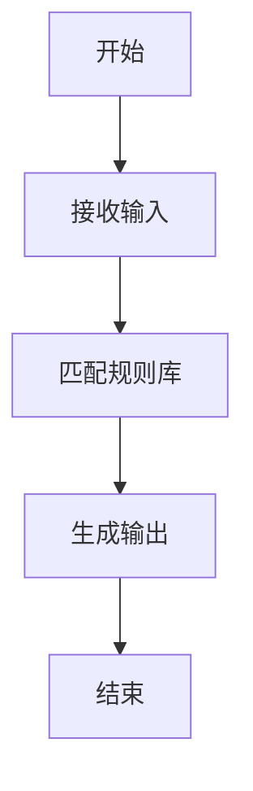
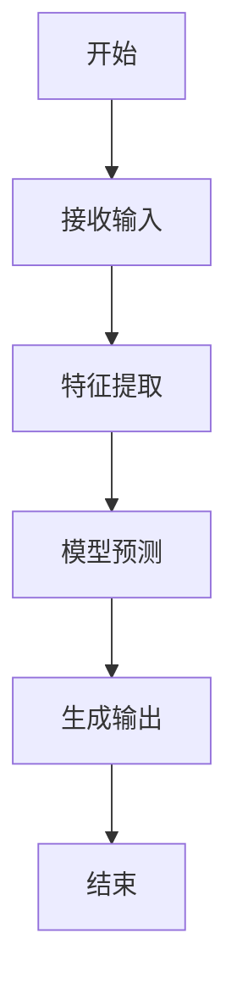
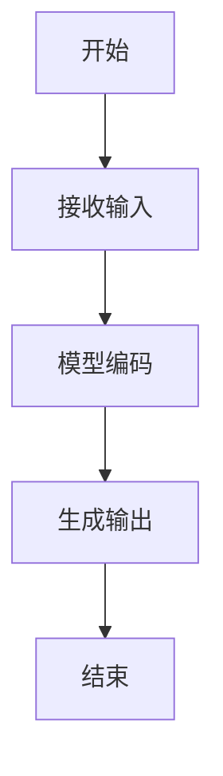
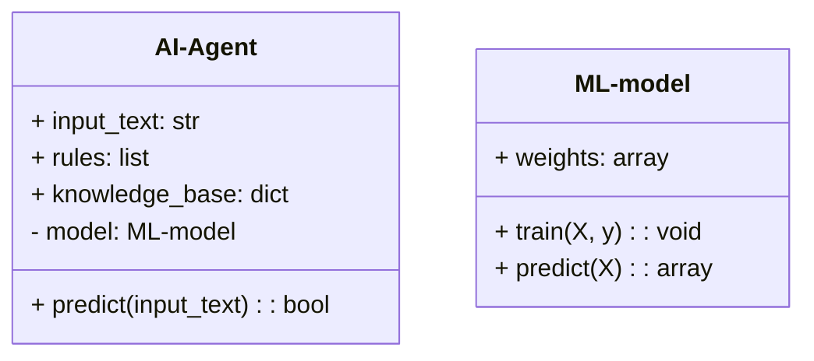
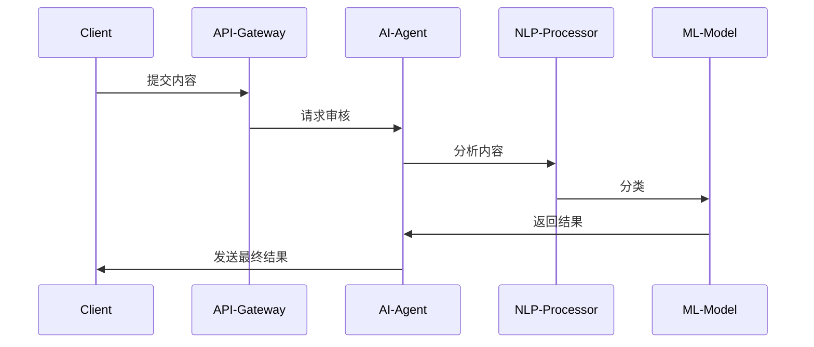

                 


# AI Agent在智能内容审核中的应用

> 关键词：AI Agent, 智能内容审核, 自然语言处理, 机器学习, 知识图谱, 系统架构设计, 项目实战

> 摘要：  
随着人工智能技术的飞速发展，AI Agent（人工智能代理）在智能内容审核中的应用越来越广泛。本文将从AI Agent的基本概念出发，详细探讨其在内容审核中的核心原理、算法实现、系统架构设计以及实际项目中的应用。通过理论与实践相结合的方式，分析AI Agent如何提升内容审核的效率与准确性，解决传统审核方法中的痛点与挑战。

---

# 第1章: AI Agent与智能内容审核概述

## 1.1 AI Agent的基本概念
### 1.1.1 AI Agent的定义与特点
- **AI Agent**：人工智能代理，是一种能够感知环境、自主决策并执行任务的智能系统。
- **特点**：
  - 智能性：能够理解和处理复杂信息。
  - 自主性：无需人工干预，自主完成任务。
  - 适应性：能够根据环境变化调整行为。
  - 可扩展性：支持多种任务和应用场景。

### 1.1.2 AI Agent的核心技术与实现原理
- **核心技术**：
  - 自然语言处理（NLP）：理解文本内容。
  - 机器学习（ML）：从数据中学习模式。
  - 知识图谱：构建领域知识库。
- **实现原理**：
  - 输入：接收需要审核的内容（文本、图像等）。
  - 处理：通过NLP和机器学习模型进行分析。
  - 输出：生成审核结果或执行相关操作。

### 1.1.3 AI Agent与传统内容审核的区别
- **传统审核**：依赖人工或简单的规则匹配。
- **AI Agent**：结合AI技术，实现自动化、智能化的审核。

| 对比维度 | 传统审核 | AI Agent审核 |
|----------|----------|---------------|
| 效率     | 低       | 高             |
| 准确性   | 中       | 高             |
| 可扩展性 | 低       | 高             |

## 1.2 智能内容审核的背景与需求
### 1.2.1 内容审核的现状与挑战
- **现状**：内容爆炸式增长，人工审核效率低、成本高。
- **挑战**：
  - 大规模数据处理的效率问题。
  - 复杂场景下的准确性问题。
  - 不断变化的审核规则。

### 1.2.2 智能化审核的必要性与优势
- **必要性**：应对海量数据和复杂场景。
- **优势**：
  - 提高审核效率。
  - 减少人工误判。
  - 支持多语言、多领域审核。

### 1.2.3 AI Agent在内容审核中的应用场景
- **场景1**：社交媒体内容审核。
- **场景2**：电子商务平台商品描述审核。
- **场景3**：新闻媒体的内容安全审核。

## 1.3 AI Agent在智能内容审核中的演进
### 1.3.1 从人工审核到半自动化审核的演变
- **阶段1**：完全人工审核。
- **阶段2**：引入简单的规则引擎。
- **阶段3**：结合AI技术的半自动化审核。

### 1.3.2 AI技术在内容审核中的应用历程
- **早期**：基于规则的审核工具。
- **中期**：引入机器学习模型。
- **当前**：AI Agent实现智能化审核。

### 1.3.3 AI Agent在智能审核中的角色定位
- **角色**：作为智能代理，负责内容的理解、分析和决策。

## 1.4 本章小结
- 本章介绍了AI Agent的基本概念及其在智能内容审核中的重要性。
- 分析了传统审核与AI Agent审核的区别，以及AI Agent在审核中的应用场景。

---

# 第2章: AI Agent的核心概念与联系

## 2.1 AI Agent的核心概念
### 2.1.1 AI Agent的定义与分类
- **定义**：AI Agent是一种能够感知环境、自主决策并执行任务的智能系统。
- **分类**：
  - **简单反射型**：基于规则的简单响应。
  - **基于模型的反射型**：基于知识库进行推理。
  - **目标驱动型**：根据目标自主决策。

### 2.1.2 AI Agent的属性特征对比
- **属性**：
  - 智能性：理解复杂信息的能力。
  - 自主性：无需外部干预的能力。
  - 适应性：适应环境变化的能力。
  - 可扩展性：支持多种任务的能力。

| 属性 | 描述                   |
|------|-----------------------|
| 智能性 | 理解复杂信息的能力     |
| 自主性 | 无需外部干预的能力     |
| 适应性 | 适应环境变化的能力     |
| 可扩展性 | 支持多种任务的能力     |

### 2.1.3 AI Agent的ER实体关系图
```mermaid
er
actor(AI Agent) --|> content: 审核内容
content --> rule: 审核规则
content --> knowledge_base: 知识库
rule --> action: 行动
```

## 2.2 AI Agent与相关技术的关系
### 2.2.1 AI Agent与自然语言处理的关系
- **关系**：AI Agent依赖NLP技术进行内容理解和生成。
- **应用场景**：文本分类、情感分析。

### 2.2.2 AI Agent与机器学习的关系
- **关系**：AI Agent利用机器学习模型进行模式识别和预测。
- **应用场景**：分类、聚类。

### 2.2.3 AI Agent与知识图谱的关系
- **关系**：AI Agent利用知识图谱进行语义理解和推理。
- **应用场景**：实体识别、关系抽取。

## 2.3 AI Agent的核心原理
### 2.3.1 AI Agent的感知与决策机制
- **感知**：通过传感器或API获取环境信息。
- **决策**：基于感知信息和知识库进行推理，生成决策。

### 2.3.2 AI Agent的推理与学习机制
- **推理**：基于逻辑推理或概率推理。
- **学习**：通过监督学习、强化学习等方法优化模型。

### 2.3.3 AI Agent的自适应与优化机制
- **自适应**：根据环境反馈调整行为。
- **优化**：通过在线学习不断优化模型性能。

## 2.4 本章小结
- 本章详细介绍了AI Agent的核心概念，包括其定义、分类、属性以及与相关技术的关系。
- 描述了AI Agent的核心原理，包括感知、决策、推理和自适应机制。

---

# 第3章: AI Agent的算法原理与数学模型

## 3.1 AI Agent的算法原理
### 3.1.1 基于规则的AI Agent算法
- **流程图**：

- **Python代码示例**：
```python
def rule_based_agent(input_text):
    rules = {
        'profanity': ['bad_word1', 'bad_word2'],
        'copyright': ['plagiarism']
    }
    result = 'allowed'
    for rule in rules:
        if any(word in input_text for word in rules[rule]):
            result = 'rejected'
            break
    return result
```

### 3.1.2 基于机器学习的AI Agent算法
- **流程图**：

- **Python代码示例**：
```python
from sklearn.feature_extraction.text import TfidfVectorizer
from sklearn.svm import SVC

# 假设X为输入特征，y为标签
model = SVC()
model.fit(X, y)

def ml_based_agent(input_text):
    X_new = vectorizer.transform([input_text])
    prediction = model.predict(X_new)
    return 'rejected' if prediction[0] == 1 else 'allowed'
```

### 3.1.3 基于深度学习的AI Agent算法
- **流程图**：

- **Python代码示例**：
```python
import tensorflow as tf
from tensorflow.keras import layers

model = tf.keras.Sequential([
    layers.Embedding(input_dim=10000, output_dim=16),
    layers.LSTM(64),
    layers.Dense(1, activation='sigmoid')
])

model.compile(optimizer='adam', loss='binary_crossentropy', metrics=['accuracy'])
model.fit(X_train, y_train, epochs=10, batch_size=32)
```

## 3.2 AI Agent的数学模型
### 3.2.1 语言模型的数学表示
- **概率模型**：
  - $P(w_i | w_{i-1}, w_{i-2}, ..., w_{i-n})$ 表示在给定前面n个词的情况下，当前词w_i的概率。
  - 常见模型：n-gram模型、循环神经网络（RNN）。

### 3.2.2 分类模型的数学表示
- **逻辑回归**：
  - 概率：$P(y|x) = \frac{e^{w \cdot x + b}}{1 + e^{w \cdot x + b}}$。
  - 损失函数：交叉熵损失。
- **支持向量机（SVM）**：
  - 分离超平面：$w \cdot x + b = 0$。
  - 软边距：$\xi$。

### 3.2.3 强化学习模型的数学表示
- **策略梯度**：
  - 策略函数：$\pi(a|s) = P(a|s)$。
  - 损失函数：$J(\theta) = -\mathbb{E}_{\tau}[ \log \pi(a_t|s_t) \cdot R(\tau)]$。

## 3.3 AI Agent的算法流程图
### 3.3.1 基于规则的AI Agent算法流程图


### 3.3.2 基于机器学习的AI Agent算法流程图


### 3.3.3 基于深度学习的AI Agent算法流程图


## 3.4 本章小结
- 本章介绍了AI Agent的三种主要算法：基于规则的算法、基于机器学习的算法和基于深度学习的算法。
- 详细讲解了每种算法的流程图、Python代码示例以及数学模型。

---

# 第4章: AI Agent的系统架构设计

## 4.1 项目场景介绍
### 4.1.1 项目背景
- 社交媒体平台的内容审核需求。
- 电子商务平台的商品描述审核需求。
- 新闻媒体的内容安全审核需求。

### 4.1.2 项目目标
- 实现智能化的内容审核系统。
- 提高审核效率和准确性。

## 4.2 系统功能设计
### 4.2.1 领域模型设计


### 4.2.2 系统架构设计


### 4.2.3 系统接口设计
- **输入接口**：接收需要审核的内容。
- **输出接口**：返回审核结果或执行操作。

### 4.2.4 系统交互设计


## 4.3 本章小结
- 本章从项目场景出发，设计了AI Agent的系统架构。
- 描述了系统的功能模块、接口设计和交互流程。

---

# 第5章: AI Agent的项目实战

## 5.1 环境安装与配置
### 5.1.1 环境需求
- Python 3.6+
- TensorFlow 2.0+
- Scikit-learn 0.20+

### 5.1.2 安装依赖
```bash
pip install numpy
pip install scikit-learn
pip install tensorflow
```

## 5.2 系统核心代码实现
### 5.2.1 NLP预处理代码
```python
from sklearn.feature_extraction.text import TfidfVectorizer

vectorizer = TfidfVectorizer(max_features=1000)
X = vectorizer.fit_transform(contents)
```

### 5.2.2 模型训练代码
```python
from sklearn.svm import SVC

model = SVC()
model.fit(X, labels)
```

### 5.2.3 AI Agent实现代码
```python
def ai_agent(input_text):
    X_new = vectorizer.transform([input_text])
    prediction = model.predict(X_new)
    return 'rejected' if prediction[0] == 1 else 'allowed'
```

## 5.3 案例分析与结果解读
### 5.3.1 案例1：社交媒体内容审核
- **输入**：一条包含敏感词汇的社交媒体帖子。
- **输出**：审核结果为“rejected”。

### 5.3.2 案例2：电子商务商品描述审核
- **输入**：商品描述中存在抄袭内容。
- **输出**：审核结果为“rejected”。

## 5.4 项目总结与优化
### 5.4.1 项目总结
- 成功实现了AI Agent在内容审核中的应用。
- 提高了审核效率和准确性。

### 5.4.2 优化方向
- 引入更复杂的模型，如BERT。
- 增加实时反馈机制，优化模型性能。

## 5.5 本章小结
- 本章通过实际项目，详细讲解了AI Agent的实现过程。
- 通过案例分析，验证了系统的有效性。

---

# 第6章: 最佳实践与小结

## 6.1 最佳实践
### 6.1.1 系统设计
- **模块化设计**：便于维护和扩展。
- **高可用性**：确保系统稳定运行。

### 6.1.2 模型优化
- **模型调优**：优化超参数。
- **数据增强**：提高模型泛化能力。

### 6.1.3 安全与伦理
- **数据隐私**：确保数据安全。
- **伦理审查**：避免偏见和误判。

## 6.2 本章小结
- 本章总结了AI Agent在智能内容审核中的最佳实践。
- 提出了未来的研究方向和优化建议。

---

# 作者：AI天才研究院/AI Genius Institute & 禅与计算机程序设计艺术 /Zen And The Art of Computer Programming

---

通过以上详细目录大纲，您可以根据需要逐步撰写每一章的内容，确保逻辑清晰、结构紧凑、简单易懂，并且能够深入剖析技术原理和本质。

