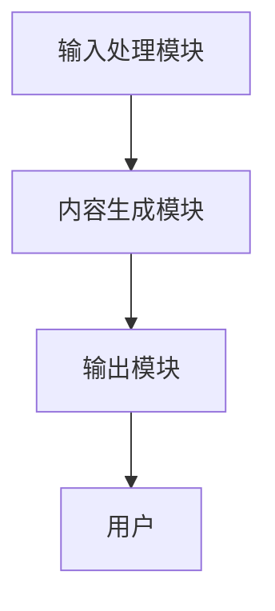

                 


# AI Agent在智能内容生成中的应用

> 关键词：AI Agent，智能内容生成，自然语言处理，机器学习，深度学习

> 摘要：本文详细探讨了AI Agent在智能内容生成中的应用，从AI Agent的基本概念、核心原理到实际应用场景进行了全面分析。文章通过理论与实践结合的方式，深入讲解了AI Agent在内容生成中的技术实现、系统架构设计及项目实战，为读者提供了一个全面了解AI Agent在智能内容生成中的应用的视角。

---

## 第1章: AI Agent的基本概念与技术背景

### 1.1 AI Agent的定义与核心概念

#### 1.1.1 什么是AI Agent
AI Agent（人工智能代理）是一种能够感知环境、自主决策并执行任务的智能实体。它通过感知输入的信息，结合内部的知识库和决策机制，生成相应的输出或行动。

#### 1.1.2 AI Agent的核心特征
- **自主性**：能够自主决策，无需外部干预。
- **反应性**：能够实时感知环境变化并做出反应。
- **学习能力**：能够通过数据和经验不断优化自身性能。
- **可解释性**：决策过程和结果能够被人类理解。

#### 1.1.3 AI Agent与传统AI的区别
- **目标导向**：AI Agent具有明确的目标，而传统AI更多是解决特定问题。
- **自主性**：AI Agent能够自主决策，而传统AI依赖于外部指令。

### 1.2 AI Agent在智能内容生成中的作用

#### 1.2.1 智能内容生成的定义
智能内容生成是指通过人工智能技术自动生成高质量文本、图像或其他形式的内容。

#### 1.2.2 AI Agent在内容生成中的优势
- **高效性**：能够快速生成大量内容。
- **多样性**：能够生成多样化的内容，满足不同需求。
- **适应性**：能够根据上下文调整生成内容。

#### 1.2.3 AI Agent与智能内容生成的关系
AI Agent作为智能内容生成的核心，通过自然语言处理、机器学习等技术实现内容生成。

---

## 第2章: AI Agent的应用场景与技术背景

### 2.1 AI Agent的典型应用场景

#### 2.1.1 智能写作助手
AI Agent可以辅助作家或内容创作者生成文本，提供实时建议和优化。

#### 2.1.2 内容推荐系统
AI Agent可以根据用户偏好推荐个性化的内容，如文章、视频等。

#### 2.1.3 自动化内容生成
AI Agent可以自动生成新闻、广告等内容，减少人工干预。

### 2.2 AI Agent与智能内容生成的技术背景

#### 2.2.1 自然语言处理技术
自然语言处理（NLP）是AI Agent实现智能内容生成的基础，包括文本理解、生成等任务。

#### 2.2.2 机器学习与深度学习
机器学习和深度学习技术为AI Agent提供了强大的模型训练和优化能力。

#### 2.2.3 大模型在内容生成中的应用
大模型（如GPT系列）通过海量数据训练，能够生成高质量的文本内容。

---

## 第3章: AI Agent在智能内容生成中的核心问题

### 3.1 内容生成的质量评估

#### 3.1.1 内容的相关性
生成的内容需要与输入的上下文相关。

#### 3.1.2 内容的可读性
生成的内容需要通顺、易读。

#### 3.1.3 内容的创新性
生成的内容需要具有一定的创新性，避免重复。

### 3.2 AI Agent的决策机制

#### 3.2.1 基于规则的决策
通过预定义的规则进行决策，适用于简单场景。

#### 3.2.2 基于模型的决策
通过训练好的模型进行决策，适用于复杂场景。

#### 3.2.3 基于反馈的决策
根据用户的反馈动态调整决策策略。

### 3.3 AI Agent的优化与改进

#### 3.3.1 模型的可解释性
提高模型的透明度，便于理解和优化。

#### 3.3.2 模型的泛化能力
增强模型在不同场景下的适应能力。

#### 3.3.3 模型的实时性
优化模型的运行效率，提高实时响应能力。

---

## 第4章: AI Agent的核心概念与原理

### 4.1 AI Agent的结构与功能

#### 4.1.1 感知层
负责接收和处理外部输入的信息。

#### 4.1.2 决策层
负责基于感知层的信息进行决策。

#### 4.1.3 执行层
负责根据决策层的指令执行具体操作。

### 4.2 AI Agent的工作流程

#### 4.2.1 信息输入
接收外部输入的信息，如用户查询、环境数据等。

#### 4.2.2 信息处理
对输入的信息进行理解和解析，提取关键信息。

#### 4.2.3 决策输出
基于解析的信息，生成相应的输出或行动指令。

---

## 第5章: AI Agent与智能内容生成的关系

### 5.1 智能内容生成的定义与分类

#### 5.1.1 文本生成
通过AI Agent生成高质量的文本内容，如文章、报告等。

#### 5.1.2 图像生成
通过AI Agent生成图像、图形等内容。

#### 5.1.3 多模态生成
同时生成文本、图像等多种形式的内容。

### 5.2 AI Agent在智能内容生成中的作用

#### 5.2.1 内容生成
AI Agent可以自动生成文本、图像等内容，满足多样化的需求。

#### 5.2.2 内容优化
AI Agent可以根据上下文优化生成内容，提高质量。

#### 5.2.3 内容推荐
AI Agent可以根据用户偏好推荐相关内容，提升用户体验。

---

## 第6章: AI Agent在智能内容生成中的算法原理

### 6.1 自然语言处理技术

#### 6.1.1 词嵌入
使用词嵌入技术（如Word2Vec）将词语表示为向量。

#### 6.1.2 生成模型
使用生成对抗网络（GAN）或变换器模型（如Transformer）生成文本。

### 6.2 机器学习与深度学习

#### 6.2.1 神经网络模型
使用深度神经网络模型（如LSTM、GRU）进行内容生成。

#### 6.2.2 模型训练
通过大量数据训练模型，优化生成效果。

---

## 第7章: AI Agent的系统架构设计

### 7.1 系统功能设计

#### 7.1.1 输入处理模块
负责接收和解析用户输入。

#### 7.1.2 内容生成模块
负责根据输入生成相应的内容。

#### 7.1.3 输出模块
负责将生成的内容输出给用户。

### 7.2 系统架构图



---

## 第8章: 项目实战

### 8.1 环境安装

#### 8.1.1 安装Python
```bash
python --version
pip install --upgrade pip
```

#### 8.1.2 安装依赖库
```bash
pip install numpy pandas matplotlib
```

### 8.2 核心代码实现

#### 8.2.1 输入处理
```python
def process_input(user_input):
    # 处理输入
    return processed_input
```

#### 8.2.2 内容生成
```python
def generate_content(processed_input):
    # 使用模型生成内容
    return generated_content
```

### 8.3 代码解读与分析
通过上述代码实现一个简单的AI Agent，能够接收输入并生成相应的内容。

---

## 第9章: 总结与展望

### 9.1 总结
本文详细介绍了AI Agent在智能内容生成中的应用，从基本概念到实际应用进行了全面分析。

### 9.2 展望
未来，随着技术的进步，AI Agent在智能内容生成中的应用将更加广泛和深入。

---

## 作者信息

作者：AI天才研究院/AI Genius Institute & 禅与计算机程序设计艺术/Zen And The Art of Computer Programming

