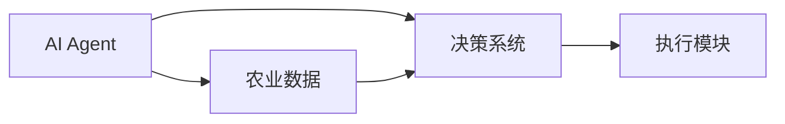

                 


# AI Agent在智能农业中的应用

> 关键词：AI Agent, 智能农业, 人工智能, 精准农业, 农业智能化

> 摘要：本文探讨了AI Agent在智能农业中的应用，从基本概念、算法原理、系统架构到实际项目实现，全面分析了AI Agent在农业智能化中的核心作用，结合实际案例，详细讲解了AI Agent在精准种植、病虫害监测等场景中的具体应用，为农业智能化提供了理论与实践的双重指导。

---

## 第1章: AI Agent的定义与核心概念

### 1.1 AI Agent的定义

AI Agent（人工智能代理）是指具有感知环境、做出决策并执行操作的智能实体。它能够通过传感器获取数据，利用算法进行分析，并根据结果采取相应的行动。AI Agent的核心在于其自主性和智能性，能够在复杂环境中完成特定任务。

#### 1.1.1 AI Agent的基本定义

AI Agent是一种智能系统，能够通过与环境交互来感知信息、做出决策并执行操作。它通常具有以下特征：
- **自主性**：能够在没有外部干预的情况下自主运行。
- **反应性**：能够实时感知环境变化并做出响应。
- **学习性**：能够通过经验改进自身的性能。
- **协作性**：能够与其他系统或人类进行协作。

#### 1.1.2 AI Agent在农业中的应用背景

农业是一个复杂的系统，涉及种植、养殖、病虫害防治等多个方面。传统的农业模式依赖人工经验，效率低下且难以应对复杂的环境变化。AI Agent的引入，为农业智能化提供了新的可能性。

#### 1.1.3 AI Agent的核心概念

AI Agent在农业中的核心概念包括：
- **数据采集**：通过传感器获取土壤湿度、温度、光照等环境数据。
- **数据分析**：利用机器学习算法对数据进行分析，提取有用信息。
- **决策制定**：基于分析结果，制定相应的农业管理策略。
- **执行操作**：通过自动化设备执行决策，例如自动灌溉、病虫害防治等。

### 1.2 AI Agent的核心概念与联系

AI Agent在农业中的应用涉及多个概念，它们之间存在密切的联系。

#### 1.2.1 实体关系图（ER图）

以下是一个简单的ER图，展示了AI Agent在农业中的核心实体及其关系：



从图中可以看出，AI Agent通过农业数据与决策系统交互，决策系统再通过执行模块实现具体操作。

#### 1.2.2 核心概念属性对比表

以下是一个核心概念属性对比表，展示了AI Agent与传统农业管理的区别：

| 概念       | 属性                       |
|------------|---------------------------|
| AI Agent   | 智能性、自主性、适应性     |
| 传统农业管理 | 依赖人工经验、效率低、缺乏实时性 |

---

## 第2章: AI Agent的算法原理

### 2.1 AI Agent的基本算法

AI Agent的核心在于其算法，不同类型的算法决定了其行为和决策能力。

#### 2.1.1 基于规则的AI Agent

基于规则的AI Agent是一种简单但有效的算法。它通过预定义的规则来做出决策。例如，当土壤湿度低于某个阈值时，系统会触发灌溉操作。

#### 2.1.2 基于机器学习的AI Agent

基于机器学习的AI Agent能够通过数据学习，发现规律并做出决策。例如，利用神经网络模型预测病虫害的发生概率。

#### 2.1.3 基于强化学习的AI Agent

基于强化学习的AI Agent能够通过与环境的交互，逐步优化其决策策略。例如，在智能温室中，AI Agent可以通过尝试不同的温度和湿度组合，找到最优的生长环境。

### 2.2 AI Agent的算法流程图

以下是一个AI Agent的算法流程图：


从图中可以看出，AI Agent的算法流程包括数据输入、特征提取、模型训练和决策输出四个步骤。

### 2.3 AI Agent的数学模型与公式

AI Agent的算法通常涉及复杂的数学模型。以下是一些常见的数学公式：

#### 2.3.1 机器学习模型

$$ y = f(x) $$

其中，$x$ 是输入数据，$y$ 是输出结果，$f$ 是模型的映射函数。

#### 2.3.2 强化学习模型

$$ Q(s, a) = r + \gamma \max Q(s', a') $$

其中，$Q$ 是价值函数，$s$ 是当前状态，$a$ 是动作，$r$ 是奖励，$\gamma$ 是折扣因子，$s'$ 是下一状态。

---

## 第3章: AI Agent的系统架构设计

### 3.1 系统功能设计

AI Agent在农业中的应用需要一个完善的系统架构设计。

#### 3.1.1 精准种植系统

精准种植系统通过AI Agent实现对农作物的精准管理，包括播种、施肥、灌溉等。

#### 3.1.2 病虫害监测系统

病虫害监测系统通过AI Agent分析图像数据，识别病虫害的种类和严重程度。

#### 3.1.3 农业机器人控制

农业机器人控制通过AI Agent实现对农业机器人的智能控制，完成采摘、除草等任务。

### 3.2 系统架构图

以下是一个AI Agent在农业中的系统架构图：


从图中可以看出，系统架构包括用户输入、数据处理、决策模块和执行模块四个部分。

### 3.3 接口设计与交互流程

以下是一个系统的接口设计与交互流程：


从图中可以看出，用户的输入经过数据采集、数据处理后，进入决策系统，最后通过执行设备完成操作。

---

## 第4章: AI Agent在精准种植中的应用

### 4.1 精准种植的定义与目标

精准种植是一种基于数据驱动的农业管理模式，旨在通过精准的决策提高农作物的产量和质量。

#### 4.1.1 精准种植的概念

精准种植是一种智能化的农业管理方式，通过AI Agent实现对农作物的精准管理。

#### 4.1.2 精准种植的目标

精准种植的目标包括：
- 提高农作物产量
- 降低资源浪费
- 提高农业管理效率

---

## 第5章: 项目实战

### 5.1 环境安装

在实际项目中，首先需要安装必要的环境和工具。

#### 5.1.1 安装Python

```bash
python --version
```

#### 5.1.2 安装依赖库

```bash
pip install numpy matplotlib scikit-learn
```

### 5.2 核心代码实现

以下是一个AI Agent在精准种植中的核心代码实现：

```python
import numpy as np
from sklearn import tree

# 数据准备
X = np.array([[70, 80], [60, 70], [80, 60], [75, 85]])
y = np.array([0, 1, 2, 3])

# 训练模型
clf = tree.DecisionTreeClassifier()
clf.fit(X, y)

# 预测
new_data = np.array([[72, 82]])
print(clf.predict(new_data))
```

### 5.3 案例分析

以下是一个AI Agent在精准种植中的实际案例：

#### 5.3.1 案例背景

某农场希望通过AI Agent实现精准灌溉管理。

#### 5.3.2 数据分析

通过传感器获取土壤湿度、温度等数据，利用AI Agent进行分析，制定灌溉计划。

#### 5.3.3 决策输出

AI Agent根据分析结果，制定最优的灌溉策略。

---

## 第6章: 总结与展望

### 6.1 总结

AI Agent在智能农业中的应用前景广阔。通过AI Agent，农业管理可以实现智能化、精准化，从而提高农业生产效率。

### 6.2 展望

未来，AI Agent在农业中的应用将更加广泛。随着技术的进步，AI Agent将更加智能化，能够应对更复杂的农业管理挑战。

### 6.3 注意事项

在实际应用中，需要注意数据质量和模型的可解释性。此外，还需要考虑系统的安全性和稳定性。

### 6.4 拓展阅读

推荐读者阅读以下书籍和论文：
- 《机器学习实战》
- 《强化学习：理论与应用》

---

# 作者：AI天才研究院/AI Genius Institute & 禅与计算机程序设计艺术 /Zen And The Art of Computer Programming

