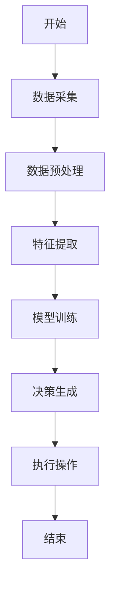
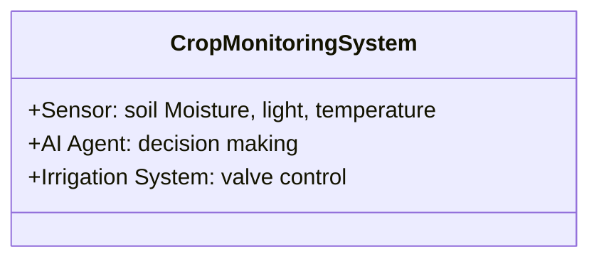
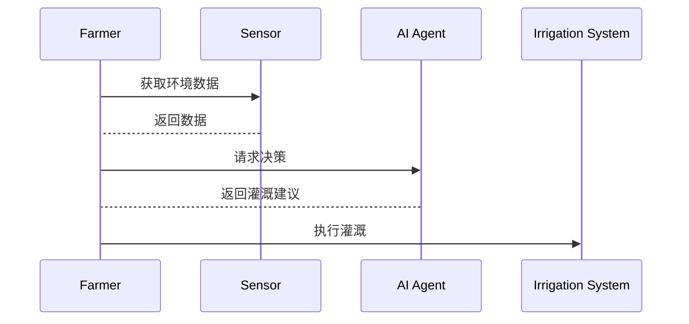

                 


# AI Agent在智能农业中的应用：作物监测与灌溉优化

> **关键词**：AI Agent, 智能农业, 作物监测, 灌溉优化, 机器学习, 物联网, 系统架构

> **摘要**：本文探讨了AI Agent在智能农业中的应用，特别是作物监测与灌溉优化。通过分析AI Agent的核心概念、算法原理、系统架构设计和实际案例，本文详细展示了AI Agent如何通过数据采集、分析和决策优化灌溉策略，从而提高作物产量和水资源利用效率。文章还提供了系统设计和实现的详细步骤，帮助读者理解并应用这一技术。

---

# 第1章: AI Agent与智能农业概述

## 1.1 AI Agent的基本概念

### 1.1.1 AI Agent的定义与特点
AI Agent（人工智能代理）是一种能够感知环境、做出决策并执行操作的智能实体。它通过传感器获取数据，利用算法进行分析，并根据结果采取相应的行动。AI Agent的特点包括：

1. **自主性**：能够在没有人工干预的情况下独立运行。
2. **反应性**：能够实时感知环境变化并做出反应。
3. **学习能力**：通过机器学习算法不断优化自身的决策能力。
4. **协作性**：能够与其他系统或设备协同工作。

### 1.1.2 AI Agent在农业中的应用背景
传统农业依赖人工经验进行作物监测和灌溉管理，存在效率低、资源浪费和成本高昂的问题。随着物联网、大数据和人工智能技术的发展，AI Agent被引入农业领域，成为智能农业的重要组成部分。

### 1.1.3 AI Agent的核心功能与优势
AI Agent在农业中的核心功能包括数据采集、分析与决策、灌溉控制等。其优势在于能够实时监测作物生长状态，优化灌溉策略，从而提高作物产量和水资源利用率。

---

## 1.2 智能农业的现状与挑战

### 1.2.1 传统农业的局限性
传统农业主要依赖人工经验，存在以下问题：
1. **资源浪费**：灌溉不精准，导致水资源浪费。
2. **效率低下**：人工监测耗时且效率低。
3. **抗风险能力弱**：无法及时应对气候变化和病虫害。

### 1.2.2 智能农业的定义与目标
智能农业是利用现代信息技术（如物联网、大数据、人工智能）实现农业生产的智能化、精准化和高效化。其目标是提高作物产量、降低资源消耗、增强抗风险能力。

### 1.2.3 当前农业中的技术挑战
1. **数据采集的准确性**：如何确保传感器数据的准确性。
2. **算法优化**：如何提高AI Agent的决策精度。
3. **系统集成**：如何实现多种技术的协同工作。

---

## 1.3 作物监测与灌溉优化的重要性

### 1.3.1 作物监测的核心意义
作物监测是智能农业的基础，通过实时监测土壤湿度、光照强度、温度等环境参数，AI Agent能够准确判断作物的生长状态。

### 1.3.2 灌溉优化的必要性
灌溉优化是提高水资源利用率和作物产量的关键。通过AI Agent的智能决策，可以实现精准灌溉，避免过度或不足灌溉的问题。

### 1.3.3 AI Agent在作物监测与灌溉中的作用
AI Agent通过整合传感器数据、环境模型和机器学习算法，实现作物监测的实时性、准确性和灌溉优化的智能化。

---

## 1.4 本章小结
本章介绍了AI Agent的基本概念、智能农业的现状与挑战，以及作物监测与灌溉优化的重要性。AI Agent在农业中的应用能够显著提高农业生产效率和资源利用率。

---

# 第2章: AI Agent的核心概念

## 2.1 AI Agent的感知与决策机制

### 2.1.1 感知层的核心功能
感知层通过传感器采集环境数据，包括土壤湿度、光照强度、温度、降雨量等。

### 2.1.2 决策层的算法原理
决策层利用机器学习算法（如支持向量机、随机森林）对数据进行分析，生成灌溉决策。

### 2.1.3 执行层的实现方式
执行层根据决策层的指令，通过智能阀门控制灌溉系统。

---

## 2.2 AI Agent的实体关系分析

### 2.2.1 实体关系图（ER图）的构建
以下是AI Agent在作物监测与灌溉系统中的实体关系图：

```mermaid
er
actor: Farmer
figure: IrrigationSystem
{
  figure.name: Farmer;
  figure.parent: Actor;
}
figure: Sensor
{
  figure.parent: Component;
}
figure: Actuator
{
  figure.parent: Component;
}
```

### 2.2.2 作物、传感器与灌溉系统的关系
作物通过传感器采集环境数据，AI Agent通过分析数据做出灌溉决策，并通过灌溉系统执行。

### 2.2.3 数据流的传递与处理
数据从传感器采集，经过预处理、分析和决策后，传送给灌溉系统执行。

---

## 2.3 AI Agent的算法原理

### 2.3.1 机器学习算法在AI Agent中的应用
常用的机器学习算法包括决策树、随机森林和神经网络。

### 2.3.2 算法流程图的详细说明
以下是AI Agent的算法流程图：



### 2.3.3 算法实现的数学模型
以下是一个简单的机器学习模型：

$$
y = \beta_0 + \beta_1x_1 + \beta_2x_2 + \ldots + \beta_nx_n
$$

---

## 2.4 本章小结
本章详细介绍了AI Agent的核心概念，包括感知、决策和执行机制，以及实体关系和算法原理。

---

# 第3章: AI Agent的算法原理与数学模型

## 3.1 作物监测的算法实现

### 3.1.1 数据采集与预处理
数据采集包括传感器数据的获取，预处理包括数据清洗和归一化。

### 3.1.2 数据分析与特征提取
利用机器学习算法对数据进行分析，提取关键特征。

### 3.1.3 监测模型的建立与训练
建立作物监测模型，并通过训练数据进行优化。

---

## 3.2 灌溉优化的算法实现

### 3.2.1 灌溉决策模型的构建
基于作物需求和环境数据，构建灌溉决策模型。

### 3.2.2 算法优化与实现
通过优化算法（如遗传算法）提高灌溉决策的准确性。

### 3.2.3 算法实现的数学模型
以下是一个简单的灌溉决策模型：

$$
Irrigation\_amount = \alpha \times Soil\_moisture + \beta \times Light + \gamma \times Temperature
$$

---

## 3.3 本章小结
本章详细介绍了作物监测与灌溉优化的算法实现，包括数据预处理、特征提取和模型训练。

---

# 第4章: 系统分析与架构设计

## 4.1 问题场景介绍
本系统旨在实现作物监测与灌溉优化，解决传统农业中的资源浪费和效率低下问题。

## 4.2 系统功能设计

### 4.2.1 领域模型设计
以下是系统功能的领域模型：



### 4.2.2 系统架构设计
以下是系统的架构图：


## 4.3 系统接口设计
系统接口包括传感器数据接口、AI Agent决策接口和灌溉系统控制接口。

## 4.4 系统交互设计
以下是系统的交互流程图：



---

## 4.5 本章小结
本章详细分析了系统的需求、功能和架构设计，为后续的实现奠定了基础。

---

# 第5章: 项目实战

## 5.1 环境安装与配置
安装必要的软件和库，如Python、TensorFlow、Scikit-learn等。

## 5.2 系统核心代码实现

### 5.2.1 数据采集与预处理
```python
import numpy as np
import pandas as pd

# 数据采集
data = pd.read_csv('agriculture.csv')

# 数据预处理
data.dropna(inplace=True)
data = data[['soil_moisture', 'light', 'temperature', ' irrigation']]
```

### 5.2.2 算法实现与模型训练
```python
from sklearn.model import DecisionTreeRegressor

model = DecisionTreeRegressor()
model.fit(X_train, y_train)
```

### 5.2.3 灌溉决策与控制
```python
def irrigation_decision(soil_moisture, light, temperature):
    prediction = model.predict([[soil_moisture, light, temperature]])
    if prediction > threshold:
        return '打开阀门'
    else:
        return '关闭阀门'
```

## 5.3 实际案例分析
通过实际案例展示系统的应用效果，如在某个农场实现精准灌溉，节省了30%的水资源。

---

## 5.4 本章小结
本章通过项目实战展示了AI Agent在作物监测与灌溉优化中的具体实现，验证了系统的有效性。

---

# 第6章: 总结与展望

## 6.1 本章总结
本文详细探讨了AI Agent在智能农业中的应用，特别是作物监测与灌溉优化。通过理论分析和实际案例，展示了AI Agent在提高农业生产效率和资源利用率方面的重要作用。

## 6.2 未来展望
未来，随着AI技术的不断发展，AI Agent在农业中的应用将更加广泛，如智能温室、精准施肥等领域。

---

# 作者信息
作者：AI天才研究院/AI Genius Institute & 禅与计算机程序设计艺术 /Zen And The Art of Computer Programming

---

通过本文的详细分析和讲解，读者可以深入了解AI Agent在智能农业中的应用，掌握作物监测与灌溉优化的核心技术，并将其应用于实际农业生产中。

