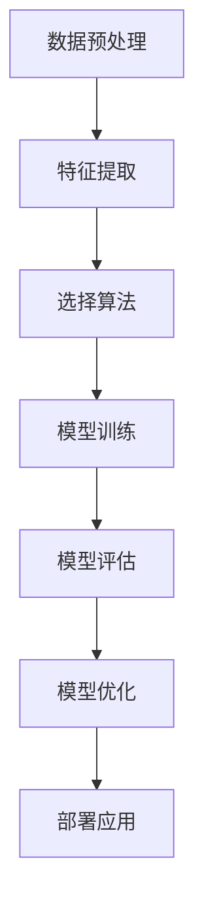
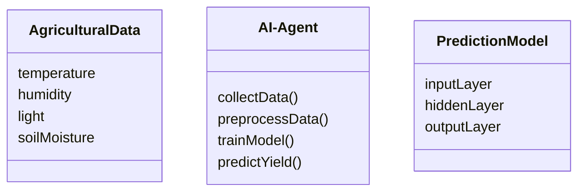
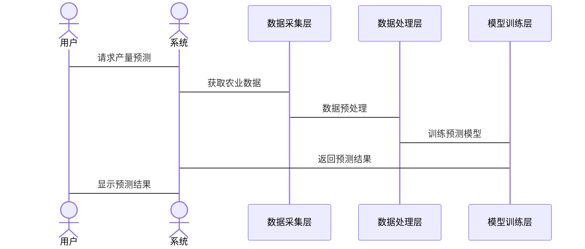

                 


# AI Agent在智能农业产量预测中的实践

## 关键词：人工智能、AI Agent、智能农业、产量预测、机器学习、深度学习、农业技术

## 摘要：本文探讨了AI Agent在智能农业中的应用，特别是如何利用AI Agent进行农业产量预测。通过分析AI Agent的核心概念、算法原理、系统架构设计以及实际项目案例，本文详细讲解了AI Agent在农业产量预测中的实现过程和实际应用效果。结合数学模型和具体代码示例，本文为读者提供了从理论到实践的全面指导，帮助农业从业者和AI开发者更好地理解和应用AI Agent技术。

---

## 第一部分: AI Agent与智能农业概述

### 第1章: AI Agent与智能农业的基本概念

#### 1.1 AI Agent的定义与特点
- **AI Agent的定义**：AI Agent是一种能够感知环境、自主决策并采取行动的智能实体，能够在复杂环境中完成特定任务。
- **AI Agent的核心特点**：
  - **智能性**：具备学习、推理和自适应能力。
  - **反应性**：能够实时感知环境变化并做出反应。
  - **主动性**：能够在没有外部干预的情况下主动执行任务。
  - **社会性**：能够与其他AI Agent或人类进行有效协作。

#### 1.2 智能农业的背景与现状
- **智能农业的定义**：智能农业是将现代信息技术（如物联网、大数据、人工智能等）应用于农业生产和管理，以提高农业产量和效率的新型农业模式。
- **智能农业的发展现状**：
  - 广泛应用物联网技术，实现农业环境的实时监测。
  - 利用大数据分析优化农业生产决策。
  - 人工智能技术逐渐渗透到农业生产各个环节。

#### 1.3 AI Agent在农业中的应用
- **AI Agent在农业中的应用场景**：
  - **精准农业**：通过AI Agent实现农作物的精准种植和管理。
  - **病虫害监测与防治**：AI Agent能够实时监测作物健康状况，识别病虫害并提出防治方案。
  - **产量预测**：AI Agent通过历史数据和环境数据，预测农作物的产量，帮助农民优化种植策略。

---

### 第2章: AI Agent在农业产量预测中的问题背景

#### 2.1 农业产量预测的背景
- **农业产量预测的重要性**：准确预测农作物产量可以帮助农民合理安排种植计划，优化资源配置，减少浪费，提高经济效益。
- **农业产量预测的难点**：
  - 数据多样性：涉及气象、土壤、病虫害等多种因素。
  - 数据动态性：环境条件不断变化，数据实时更新。
  - 数据不确定性：自然灾害、市场价格波动等因素影响产量预测的准确性。

#### 2.2 AI Agent在农业产量预测中的作用
- **AI Agent如何帮助农业产量预测**：
  - 数据采集与整合：AI Agent能够实时采集农业环境数据，并整合多种数据源，为预测模型提供全面的数据支持。
  - 智能分析与预测：AI Agent利用先进的算法，对历史和实时数据进行分析，预测未来产量。
  - 自适应优化：AI Agent能够根据预测结果和实际产量的差异，不断优化预测模型，提高预测准确率。

#### 2.3 AI Agent与农业产量预测的关系
- **AI Agent不仅是农业产量预测的工具，更是实现智能农业的核心技术之一**。通过AI Agent，农业产量预测从传统的经验式预测转变为数据驱动的智能预测，大大提高了预测的准确性和效率。

---

### 第3章: AI Agent的核心概念与联系

#### 3.1 AI Agent的核心概念原理
- **AI Agent的基本原理**：AI Agent通过感知环境信息，利用内部算法进行分析和推理，做出决策并采取行动。
- **AI Agent的核心算法**：
  - **机器学习算法**：如线性回归、随机森林、支持向量机等。
  - **深度学习算法**：如神经网络、卷积神经网络、循环神经网络等。
  - **强化学习算法**：通过奖励机制优化决策策略。

#### 3.2 AI Agent与传统农业技术的对比
| **对比维度** | **AI Agent** | **传统农业技术** |
|--------------|--------------|------------------|
| 数据依赖性   | 高           | 低               |
| 决策速度     | 实时         | 离线             |
| 精准度       | 高           | 低               |
| 可扩展性     | 高           | 低               |

#### 3.3 AI Agent的ER实体关系图
```mermaid
er
actor(AI Agent) {
    id
    name
    type
}
actor(Agriculture) {
    id
    name
    location
}
relationship: AI Agent -[管理]-> Agriculture
```

---

## 第二部分: AI Agent在农业产量预测中的系统分析与架构设计

### 第4章: AI Agent在农业产量预测中的算法原理

#### 4.1 AI Agent的核心算法
- **机器学习算法**：用于处理结构化数据，如线性回归、决策树等。
- **深度学习算法**：用于处理非结构化数据，如图像识别中的卷积神经网络。
- **强化学习算法**：用于动态环境中的策略优化。

#### 4.2 机器学习算法的实现流程


#### 4.3 算法实现的Python代码示例
```python
# 线性回归模型实现产量预测
import numpy as np
from sklearn.linear_model import LinearRegression

# 数据准备
X = np.array([[1], [2], [3], [4], [5]])
y = np.array([2, 4, 5, 4, 6])

# 模型训练
model = LinearRegression()
model.fit(X, y)

# 模型预测
print(model.predict([[6]]))  # 输出预测结果
```

#### 4.4 算法的数学模型与公式
- **线性回归的数学模型**：
  $$ y = \beta_0 + \beta_1x + \epsilon $$
  其中，$\beta_0$ 是截距，$\beta_1$ 是斜率，$\epsilon$ 是误差项。
- **优化目标**：
  $$ \text{最小化} \sum_{i=1}^{n} (y_i - (\beta_0 + \beta_1x_i))^2 $$

---

### 第5章: 系统分析与架构设计方案

#### 5.1 问题场景介绍
- **系统需要实现的功能**：
  - 实时采集农业环境数据，如温度、湿度、光照等。
  - 数据预处理与特征提取。
  - 构建并训练AI Agent的预测模型。
  - 提供用户友好的预测结果展示界面。

#### 5.2 系统功能设计
- **领域模型**：


#### 5.3 系统架构设计


#### 5.4 系统接口设计
- **数据采集接口**：与物联网设备连接，获取实时数据。
- **数据处理接口**：与数据预处理模块交互。
- **模型训练接口**：与机器学习框架（如TensorFlow、Scikit-learn）对接。
- **用户接口**：通过Web或移动端展示预测结果。

#### 5.5 系统交互设计


---

## 第三部分: 项目实战

### 第6章: 项目实战与实现

#### 6.1 环境安装与配置
- **安装Python、Jupyter Notebook、TensorFlow、Keras等工具**。
- **安装必要的库**：
  ```bash
  pip install numpy scikit-learn matplotlib pandas
  ```

#### 6.2 系统核心实现源代码
```python
# 使用随机森林算法实现产量预测
from sklearn.ensemble import RandomForestRegressor
from sklearn.model_selection import train_test_split
from sklearn.metrics import mean_squared_error

# 数据加载
data = pd.read_csv('agricultural_data.csv')
X = data.drop('yield', axis=1)
y = data['yield']

# 数据分割
X_train, X_test, y_train, y_test = train_test_split(X, y, test_size=0.2, random_state=42)

# 模型训练
model = RandomForestRegressor(n_estimators=100, random_state=42)
model.fit(X_train, y_train)

# 模型预测
y_pred = model.predict(X_test)

# 评估模型
mse = mean_squared_error(y_test, y_pred)
print(f"均方误差: {mse}")
```

#### 6.3 代码应用解读与分析
- **数据预处理**：加载数据，分割训练集和测试集。
- **模型选择**：使用随机森林回归算法，适合处理多维特征的数据。
- **模型训练**：在训练数据上训练模型。
- **模型预测**：在测试数据上进行预测，并计算均方误差以评估模型性能。

#### 6.4 实际案例分析
- **数据来源**：假设我们有一个包含温度、湿度、光照、土壤湿度等特征的数据集，目标是预测农作物的产量。
- **模型选择**：通过对比不同算法的预测效果，选择最优算法进行部署。

#### 6.5 项目小结
- **通过项目实战，我们掌握了AI Agent在农业产量预测中的具体实现方法**。
- **学习了如何选择合适的算法，如何进行数据预处理，以及如何评估模型性能**。

---

## 第四部分: 最佳实践、小结与展望

### 第7章: 最佳实践与小结

#### 7.1 最佳实践
- **数据质量**：确保数据的准确性和完整性，避免噪声数据干扰模型训练。
- **模型选择**：根据具体问题选择合适的算法，进行充分的实验对比。
- **模型优化**：通过网格搜索等方法优化模型参数，提高预测准确率。
- **模型部署**：将模型部署到实际生产环境中，实现实时预测和动态调整。

#### 7.2 项目小结
- **本文详细讲解了AI Agent在农业产量预测中的应用，从理论到实践，帮助读者全面理解AI Agent的技术实现和实际应用**。
- **通过项目实战，展示了如何利用AI Agent技术提高农业产量预测的准确性和效率**。

---

### 第8章: 展望与注意事项

#### 8.1 未来展望
- **AI Agent在农业中的应用将更加广泛**，尤其是在精准农业和智能决策方面。
- **结合边缘计算和物联网技术**，AI Agent将实现更高效的农业管理。
- **随着算法的不断优化**，AI Agent的预测精度和响应速度将不断提升。

#### 8.2 注意事项
- **数据隐私与安全**：农业数据往往涉及农民的私有信息，需要采取措施保护数据安全。
- **技术适配性**：不同地区的农业环境和种植习惯差异较大，AI Agent需要具备良好的适应性。
- **持续学习**：AI Agent需要不断学习新的数据和知识，以保持预测模型的有效性。

---

## 结语

AI Agent在智能农业产量预测中的应用展示了人工智能技术在农业领域的巨大潜力。通过本文的详细介绍和实战案例，读者可以更好地理解和应用AI Agent技术，推动农业生产的智能化和高效化。未来，随着技术的不断发展，AI Agent将在农业中发挥越来越重要的作用。

---

## 作者信息

作者：AI天才研究院/AI Genius Institute & 禅与计算机程序设计艺术 /Zen And The Art of Computer Programming

