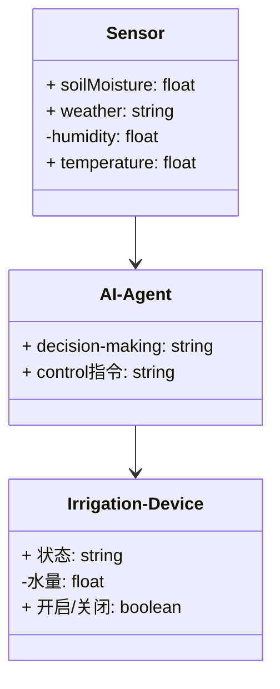
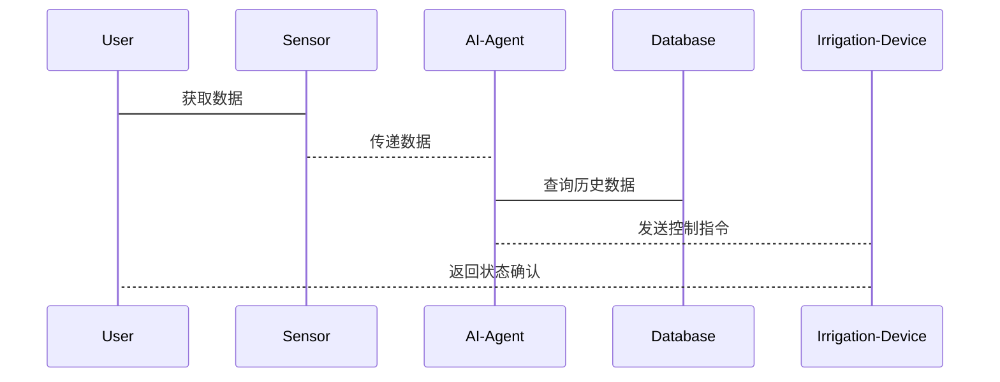

                 


# AI Agent在智能农业灌溉系统中的实践

## 关键词：
- AI Agent
- 智能农业
- 灌溉系统
- 人工智能
- 农业自动化

## 摘要：
本文深入探讨AI Agent在智能农业灌溉系统中的实践应用。通过分析AI Agent的核心概念、算法原理、系统架构以及实际案例，本文旨在展示如何利用AI技术优化农业灌溉过程，实现高效节水和精准管理。文章从背景介绍、技术原理到系统实现，层层剖析，为读者提供全面的技术指导和实践参考。

---

## 第1章: AI Agent与智能农业灌溉系统概述

### 1.1 AI Agent的基本概念
#### 1.1.1 AI Agent的定义与特点
- **定义**：AI Agent是一种智能体，能够感知环境、自主决策并执行任务。
- **特点**：自主性、反应性、目标导向、学习能力。

#### 1.1.2 AI Agent在农业中的应用潜力
- 数据驱动决策：通过传感器数据优化灌溉策略。
- 自动化管理：减少人工干预，提高效率。
- 节水节能：通过精准控制实现资源优化。

#### 1.1.3 智能农业灌溉系统的目标
- 提高灌溉效率。
- 降低成本。
- 保护环境。

### 1.2 智能农业灌溉系统的背景与现状
#### 1.2.1 传统农业灌溉的挑战
- 水资源浪费。
- 灌溉不均匀。
- 人工管理效率低。

#### 1.2.2 智能化灌溉的必要性
- 应对气候变化。
- 提高水资源利用率。
- 适应大规模农业需求。

#### 1.2.3 当前智能农业灌溉系统的应用现状
- 传感器技术成熟。
- 云计算与边缘计算结合。
- 大数据分析普及。

### 1.3 AI Agent在智能农业灌溉中的作用
#### 1.3.1 AI Agent的核心功能
- 数据采集与处理。
- 决策优化。
- 系统控制。

#### 1.3.2 AI Agent在灌溉系统中的具体应用
- 自动调整灌溉时间。
- 根据土壤湿度优化水量。
- 预测天气变化调整灌溉策略。

#### 1.3.3 AI Agent的优势与局限性
- **优势**：高效、精准、自适应。
- **局限性**：依赖传感器数据质量、算法复杂性。

---

## 第2章: AI Agent与智能农业灌溉系统的关联

### 2.1 AI Agent的核心概念与属性
#### 2.1.1 感知能力
- 通过传感器获取环境数据。
- 分析土壤湿度、光照强度、天气预报等信息。

#### 2.1.2 决策能力
- 基于历史数据和实时信息制定灌溉策略。
- 多目标优化（节水、增产、环保）。

#### 2.1.3 执行能力
- 控制灌溉设备执行决策。
- 实时反馈与调整。

### 2.2 智能农业灌溉系统的功能模块
#### 2.2.1 数据采集模块
- 传感器网络：土壤湿度传感器、气象传感器。
- 数据采集与传输：物联网（IoT）技术。

#### 2.2.2 数据分析模块
- 数据预处理：清洗、归一化。
- 模型训练：机器学习算法（回归、分类）。

#### 2.2.3 决策控制模块
- 灌溉策略制定。
- 系统控制：通过API或本地指令触发灌溉设备。

### 2.3 AI Agent与智能农业灌溉系统的实体关系
#### 2.3.1 实体关系图（ER图）
- **主要实体**：用户、传感器、灌溉设备、数据记录。
- **关系**：用户发起请求，传感器提供数据，AI Agent处理数据并控制设备。

#### 2.3.2 系统架构图
- **分层架构**：数据采集层、数据处理层、决策层。
- **模块交互**：传感器 → 数据处理 → AI Agent → 灌溉设备。

---

## 第3章: AI Agent在智能农业灌溉中的算法原理

### 3.1 基于强化学习的AI Agent算法
#### 3.1.1 强化学习的基本原理
- **定义**：通过试错学习，最大化累积奖励。
- **算法流程**：
  1. 状态感知：获取当前环境数据。
  2. 动作选择：基于策略选择灌溉动作。
  3. 奖励反馈：根据结果更新策略。
  4. 状态转移：执行动作，进入新状态。

#### 3.1.2 AI Agent在灌溉决策中的应用
- **场景**：土壤湿度低于阈值时触发灌溉。
- **数学模型**：
  $$ R = r_1 \cdot s_1 + r_2 \cdot s_2 + \ldots + r_n \cdot s_n $$
  其中，$R$ 为总奖励，$s_i$ 为状态，$r_i$ 为权重。

#### 3.1.3 算法实现的数学模型和公式
- **Q-learning公式**：
  $$ Q(s, a) = Q(s, a) + \alpha [r + \gamma \max Q(s', a') - Q(s, a)] $$
  其中，$\alpha$ 为学习率，$\gamma$ 为折扣因子。

### 3.2 基于决策树的AI Agent算法
#### 3.2.1 决策树的基本原理
- **定义**：通过特征分裂构建决策树。
- **优势**：易于解释，适合分类问题。

#### 3.2.2 决策树在灌溉控制中的应用
- **案例**：基于土壤湿度、天气预报和作物需求决策是否灌溉。

#### 3.2.3 决策树的构建与优化
- **构建流程**：
  1. 特征选择：土壤湿度、光照强度、天气预报。
  2. 数据分割：训练集与测试集。
  3. 决策树生成：ID3或C4.5算法。
  4. 剪枝优化：防止过拟合。

---

## 第4章: 智能农业灌溉系统的系统分析与架构设计

### 4.1 项目背景介绍
- **目标**：设计一个基于AI Agent的智能灌溉系统。
- **需求**：高效、精准、易用。

### 4.2 系统功能设计
#### 4.2.1 领域模型（Mermaid类图）


#### 4.2.2 系统架构设计（Mermaid架构图）


#### 4.2.3 系统接口设计
- **输入接口**：传感器数据接收。
- **输出接口**：灌溉设备控制指令。
- **API设计**：RESTful API实现设备控制。

#### 4.2.4 系统交互流程（Mermaid序列图）


---

## 第5章: AI Agent在智能农业灌溉系统中的项目实战

### 5.1 环境安装
- **工具安装**：
  ```bash
  pip install numpy scikit-learn tensorflow
  ```
- **环境配置**：
  ```bash
  source venv/bin/activate
  ```

### 5.2 系统核心实现
#### 5.2.1 数据预处理代码
```python
import numpy as np

def preprocess_data(data):
    # 数据清洗
    data = data.dropna()
    # 标准化
    data = (data - data.mean()) / data.std()
    return data
```

#### 5.2.2 模型训练代码
```python
from sklearn.tree import DecisionTreeClassifier

def train_model(X, y):
    model = DecisionTreeClassifier()
    model.fit(X, y)
    return model
```

#### 5.2.3 灌溉控制逻辑代码
```python
def irrigation_control(model, sensor_data):
    prediction = model.predict([sensor_data])
    if prediction[0] == 1:
        return "开启灌溉"
    else:
        return "关闭灌溉"
```

### 5.3 项目实战分析
#### 5.3.1 实际案例分析
- **案例**：某农场使用AI Agent优化灌溉，节水30%。

#### 5.3.2 项目总结
- **经验**：数据质量至关重要。
- **挑战**：传感器精度和算法优化。

---

## 第6章: 最佳实践与小结

### 6.1 最佳实践
- 数据采集：确保传感器精度。
- 模型优化：定期更新算法参数。
- 系统维护：定期检查硬件设备。

### 6.2 项目小结
- AI Agent在智能农业灌溉中的应用前景广阔。
- 技术实现需要结合传感器、算法和系统架构。

### 6.3 注意事项
- 数据隐私：避免数据泄露。
- 系统稳定性：确保灌溉设备可靠运行。

### 6.4 拓展阅读
- 推荐书籍：《机器学习实战》。
- 推荐博客：AI Agent技术博客。

---

## 作者：AI天才研究院/AI Genius Institute & 禅与计算机程序设计艺术 /Zen And The Art of Computer Programming

