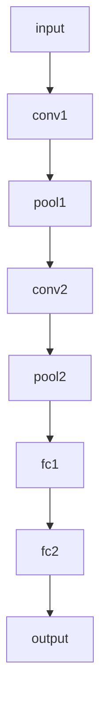
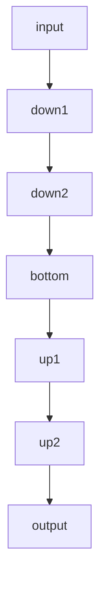
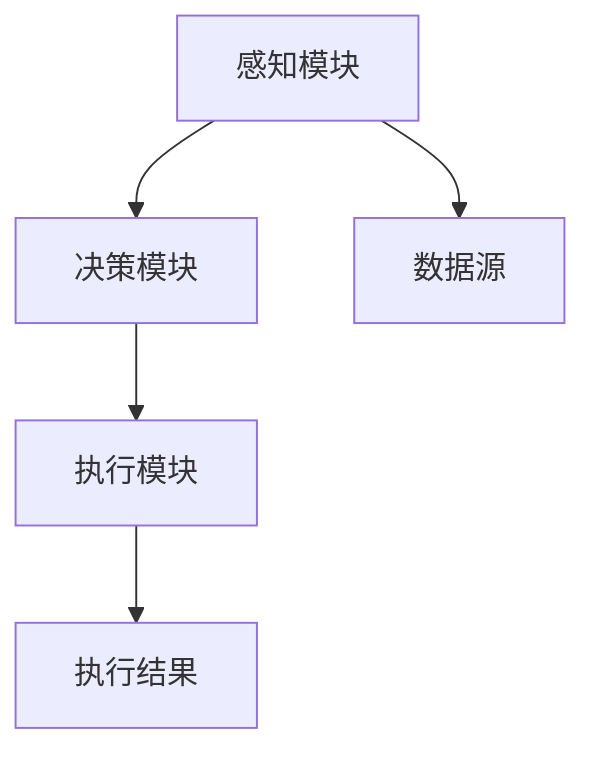

                 


# AI Agent在智能农作物病虫害检测中的实践

> 关键词：AI Agent, 农作物病虫害检测, 深度学习, 图像处理, 农业智能化

> 摘要：本文探讨了AI Agent在农作物病虫害检测中的应用，从技术背景、核心算法、系统设计到实际案例，详细分析了AI Agent的优势及其在农业智能化中的潜力。通过结合深度学习模型和图像处理技术，AI Agent能够高效、精准地检测病虫害，为农业生产提供智能化解决方案。

---

## 第一部分：背景与概念

### 第1章：AI Agent与农作物病虫害检测概述

#### 1.1 AI Agent的基本概念
AI Agent（人工智能代理）是一种能够感知环境、自主决策并执行任务的智能实体。它能够通过传感器获取数据，利用算法进行分析，并根据结果采取行动。在农业领域，AI Agent可以用于监测作物健康状况、预测病虫害发生风险以及自动采取防治措施。

#### 1.2 农作物病虫害检测的现状与挑战
农作物病虫害是影响农业产量和质量的主要因素之一。传统的病虫害检测方法依赖于人工观察，效率低且容易受到主观因素的影响。随着AI技术的发展，利用计算机视觉和深度学习模型进行自动检测成为可能，但仍面临数据获取困难、模型泛化能力不足等挑战。

#### 1.3 AI Agent在病虫害检测中的应用前景
AI Agent通过集成图像处理、深度学习和决策优化技术，能够实现对病虫害的实时监测和精准防治。其应用前景广阔，有助于提高农业生产效率、降低成本，并为农业智能化提供新的解决方案。

---

## 第二部分：技术原理

### 第2章：AI Agent的核心技术

#### 2.1 感知模块
AI Agent的感知模块通过摄像头或传感器获取农田环境数据。图像处理技术（如边缘检测、阈值分割）被用于提取病虫害特征，为后续分析提供基础。

#### 2.2 决策模块
决策模块基于感知数据，利用深度学习模型（如CNN、R-CNN）进行分类和定位。模型输出结果后，AI Agent会根据预设策略决定采取的防治措施（如喷洒农药、释放天敌）。

#### 2.3 执行模块
执行模块负责将决策模块的指令转化为实际行动，例如控制无人机进行农药喷洒或通知农户采取措施。这一模块需要与硬件设备（如无人机、喷洒系统）进行无缝对接。

### 第3章：深度学习模型在病虫害检测中的应用

#### 3.1 卷积神经网络（CNN）原理
CNN通过多层卷积和池化操作提取图像特征，常用于图像分类任务。在病虫害检测中，CNN可以识别不同类型的病虫害，并定位其在图像中的位置。

**图1：CNN模型结构**



#### 3.2 图像分割技术
图像分割技术能够精确定位病虫害的位置。基于U-Net的模型在病虫害检测中表现出色，能够将图像中的健康区域和感染区域区分出来。

**图2：U-Net模型结构**



#### 3.3 数据增强与模型优化
通过数据增强技术（如旋转、缩放、翻转）增加训练数据的多样性，提升模型的泛化能力。此外，采用迁移学习和模型融合技术可以进一步提高检测精度。

---

## 第三部分：系统设计与实现

### 第4章：系统架构设计

#### 4.1 系统模块划分
AI Agent系统主要由感知模块、决策模块和执行模块组成。感知模块负责数据采集，决策模块进行分析和决策，执行模块完成具体操作。

**图3：系统架构图**



#### 4.2 系统功能设计
系统功能包括：
- 数据采集与预处理
- 病虫害检测与分类
- 防治策略制定
- 系统反馈与优化

### 第5章：系统实现与优化

#### 5.1 环境配置
- **硬件要求**：高性能计算设备、摄像头、无人机等。
- **软件要求**：安装Python、TensorFlow、OpenCV等开发工具。

#### 5.2 核心实现代码
以下是一个基于YOLO的病虫害检测代码示例：

```python
import tensorflow as tf
from tensorflow.keras import layers

# 定义模型
model = tf.keras.Sequential([
    layers.Conv2D(32, (3,3), activation='relu', input_shape=(224, 224, 3)),
    layers.MaxPooling2D((2,2)),
    layers.Conv2D(64, (3,3), activation='relu'),
    layers.MaxPooling2D((2,2)),
    layers.Flatten(),
    layers.Dense(128, activation='relu'),
    layers.Dense(num_classes, activation='softmax')
])

# 编译模型
model.compile(optimizer='adam', loss='sparse_categorical_crossentropy', metrics=['accuracy'])

# 训练模型
model.fit(train_dataset, epochs=10, validation_data=val_dataset)
```

---

## 第四部分：项目实战

### 第6章：AI Agent系统在病虫害检测中的应用

#### 6.1 实际案例分析
以某农场的病虫害检测项目为例，详细分析系统的部署过程、检测效果以及经济效益。

#### 6.2 代码实现与解读
提供完整的系统实现代码，并对关键部分进行解读，帮助读者理解AI Agent的核心逻辑。

---

## 第五部分：优化与展望

### 第7章：系统优化与未来展望

#### 7.1 模型优化
通过模型剪枝、量化等技术优化模型性能，降低计算成本。

#### 7.2 应用场景扩展
将AI Agent技术扩展至更多农业领域，如作物生长监测、土壤质量分析等。

#### 7.3 未来研究方向
探讨多模态数据融合、边缘计算等新技术在AI Agent中的应用潜力。

---

## 附录

### A. 参考文献
1. LeCun, Y., Bengio, Y., & Hinton, G. (2015). Deep learning. Nature, 521(7555), 436-444.
2. Long, J., Shelhamer, E., & Darrell, T. (2015). Fully convolutional networks for semantic segmentation. In Proceedings of the IEEE conference on computer vision and pattern recognition (pp. 3431-3440).

### B. 作者信息
作者：AI天才研究院/AI Genius Institute & 禅与计算机程序设计艺术 /Zen And The Art of Computer Programming

---

通过以上内容，AI Agent在农作物病虫害检测中的应用得到了全面而深入的探讨，为农业智能化提供了可行的解决方案。

