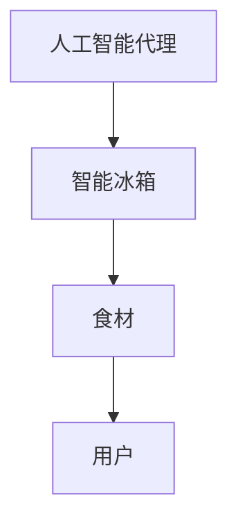
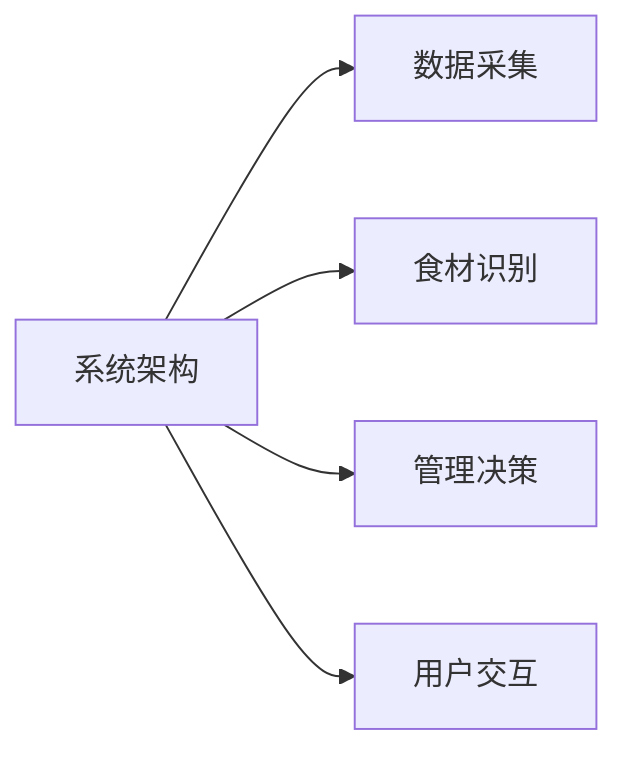

                 


# AI Agent在智能冰箱中的食材管理

> 关键词：AI Agent，智能冰箱，食材管理，数学模型，系统架构

> 摘要：本文探讨AI Agent在智能冰箱中的应用，详细介绍其在食材管理中的核心概念、算法原理、系统架构及项目实战。通过Mermaid图表和Latex公式，深入剖析技术细节，展示如何利用AI技术优化食材管理流程。

---

# 目录

## 第1章 AI Agent与智能冰箱概述

### 1.1 AI Agent的基本概念

- 1.1.1 人工智能代理的定义
- 1.1.2 AI Agent的核心特征
- 1.1.3 AI Agent与传统程序的区别

### 1.2 智能冰箱的背景与现状

- 1.2.1 智能冰箱的发展历程
- 1.2.2 当前智能冰箱的主要功能
- 1.2.3 智能冰箱的技术特点

### 1.3 食材管理的重要性

- 1.3.1 食材管理的基本概念
- 1.3.2 食材管理的常见问题
- 1.3.3 AI Agent在食材管理中的作用

## 第2章 AI Agent的核心原理

### 2.1 AI Agent的感知、决策与执行

- 2.1.1 感知阶段
- 2.1.2 决策阶段
- 2.1.3 执行阶段

### 2.2 AI Agent的分类与特点

- 2.2.1 分类
- 2.2.2 各类AI Agent的特点

### 2.3 AI Agent的实体关系图



## 第3章 食材管理的数学模型与算法原理

### 3.1 食材分类模型

- 3.1.1 分类模型的定义
- 3.1.2 常见的分类算法
- 3.1.3 分类模型的数学表达式
  $$f(x) = \max\{w_1x_1 + w_2x_2 + ... + w_nx_n\}$$

### 3.2 食材保质期预测模型

- 3.2.1 时间序列预测模型
- 3.2.2 基于机器学习的预测方法
- 3.2.3 预测模型的数学表达式
  $$P(t) = \alpha t + \beta$$

## 第4章 系统架构设计

### 4.1 系统功能设计

- 4.1.1 数据采集模块
- 4.1.2 食材识别模块
- 4.1.3 管理决策模块
- 4.1.4 用户交互模块

### 4.2 系统架构图



## 第5章 项目实战

### 5.1 环境配置

- 5.1.1 Python环境安装
- 5.1.2 必要库的安装
  ```bash
  pip install numpy
  pip install scikit-learn
  ```

### 5.2 数据采集与预处理

- 5.2.1 数据采集模块的实现
- 5.2.2 数据清洗与特征提取

### 5.3 食材识别模块的实现

- 5.3.1 使用决策树算法实现分类
  ```python
  from sklearn.tree import DecisionTreeClassifier
  ```

### 5.4 管理决策模块的实现

- 5.4.1 基于随机森林的保质期预测
  ```python
  from sklearn.ensemble import RandomForestRegressor
  ```

### 5.5 用户交互模块的实现

- 5.5.1 提供用户友好的界面
- 5.5.2 实时更新与反馈

## 第6章 总结与展望

### 6.1 总结

- 6.1.1 系统的主要功能
- 6.1.2 关键技术的实现

### 6.2 未来展望

- 6.2.1 多设备协同
- 6.2.2 个性化推荐
- 6.2.3 可持续发展

---

# 作者：AI天才研究院/AI Genius Institute & 禅与计算机程序设计艺术 /Zen And The Art of Computer Programming

