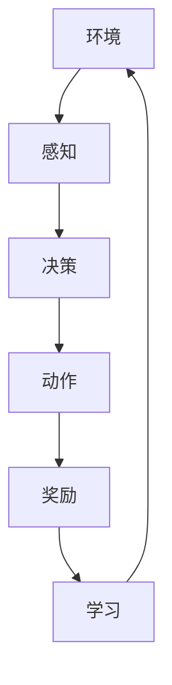
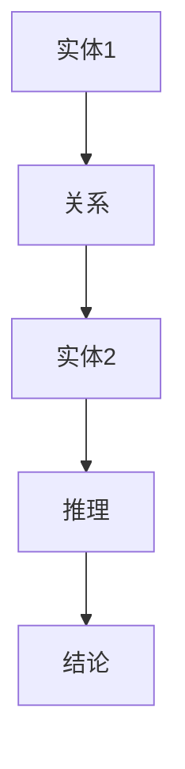
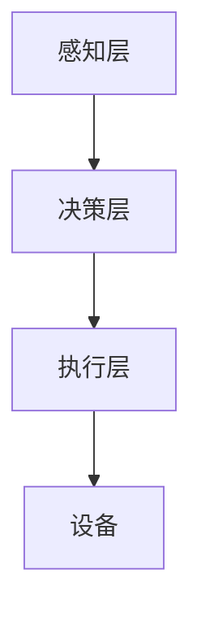

                 


# AI Agent在智能制造中的实践应用

## 关键词：AI Agent, 智能制造, 机器学习, 强化学习, 知识图谱, 系统架构

## 摘要：  
本文深入探讨了AI Agent在智能制造中的实践应用，从概念解析、核心技术、算法实现、系统架构到实际案例，全面分析了AI Agent如何赋能智能制造的智能化转型。文章结合理论与实践，通过详细的技术解析和代码实现，展示了AI Agent在智能制造中的巨大潜力和实际价值。

---

# 第1章: AI Agent与智能制造概述

## 1.1 智能制造的基本概念

智能制造是制造业数字化转型的核心，它通过物联网、大数据、人工智能等技术，实现生产过程的智能化、自动化和高效化。智能制造不仅仅是简单的自动化，而是通过数据驱动和智能决策，优化整个生产流程。

### 1.1.1 制造业的数字化转型  
制造业的数字化转型是指将传统制造业通过数字技术改造，实现生产过程的数字化、网络化和智能化。这一转型涵盖了从设计、生产、供应链到客户服务的全生命周期。

### 1.1.2 智能制造的核心特征  
智能制造的核心特征包括：  
- **数据驱动**：利用传感器、物联网等技术实时采集生产数据。  
- **智能决策**：通过机器学习和人工智能技术进行实时决策。  
- **自主优化**：系统能够根据环境变化自动优化生产流程。  

### 1.1.3 AI Agent在智能制造中的定位  
AI Agent（智能体）是智能制造的核心技术之一，它能够感知环境、自主决策、执行动作并优化行为。AI Agent在智能制造中的定位是通过数据驱动的智能决策，优化生产流程、降低成本、提高效率。

## 1.2 AI Agent的核心概念  

### 1.2.1 AI Agent的定义与特点  
AI Agent是一种能够感知环境、自主决策、执行动作并优化行为的智能系统。其特点包括：  
- **自主性**：能够在没有外部干预的情况下自主运行。  
- **反应性**：能够实时感知环境并做出反应。  
- **目标导向**：通过设定目标来优化行为。  

### 1.2.2 AI Agent与传统自动化系统的区别  

| **特点**       | **AI Agent**               | **传统自动化系统**           |
|----------------|---------------------------|-----------------------------|
| **决策能力**   | 具备自主决策能力           | 需要人工编程或固定规则       |
| **适应性**     | 能够自适应环境变化         | 适应性较弱                   |
| **学习能力**   | 能够通过学习优化行为       | 无法学习和优化                 |

### 1.2.3 AI Agent在智能制造中的应用场景  
AI Agent在智能制造中的应用场景包括：  
- **预测性维护**：通过实时监测设备状态，预测设备故障，减少停机时间。  
- **质量控制**：通过图像识别和机器学习，实时检测产品质量。  
- **生产优化**：通过优化生产流程，提高生产效率，降低成本。  

---

# 第2章: AI Agent的核心技术解析

## 2.1 AI Agent的关键技术  

### 2.1.1 机器学习与深度学习  
机器学习和深度学习是AI Agent的核心技术之一，用于从数据中学习模式和规律。通过训练模型，AI Agent能够根据输入数据做出决策。  

### 2.1.2 自然语言处理  
自然语言处理（NLP）用于AI Agent与人类交互，通过理解人类语言，实现人机对话和信息查询。  

### 2.1.3 强化学习与决策优化  
强化学习用于AI Agent的决策优化，通过与环境的交互，学习最优策略。  

## 2.2 AI Agent的实现原理  

### 2.2.1 状态感知与目标设定  
AI Agent通过传感器和数据源感知环境状态，并设定目标。  

### 2.2.2 行为决策与执行  
AI Agent根据感知到的状态和设定的目标，通过强化学习等算法做出决策，并执行动作。  

### 2.2.3 智能优化与自适应调整  
AI Agent通过不断学习和优化，实现自适应调整，提高决策的准确性和效率。  

## 2.3 AI Agent与智能制造的结合  

### 2.3.1 制造过程中的智能决策  
AI Agent在制造过程中，通过实时数据和强化学习，优化生产计划和资源分配。  

### 2.3.2 数据驱动的优化算法  
通过数据驱动的优化算法，AI Agent能够实时调整生产参数，提高生产效率。  

### 2.3.3 多 Agent 协作与分布式系统  
在智能制造中，多个AI Agent可以协作完成复杂的任务，实现分布式系统的高效管理。  

---

# 第3章: AI Agent的算法实现

## 3.1 AI Agent的核心算法  

### 3.1.1 基于强化学习的决策算法  
强化学习是一种通过与环境交互学习策略的算法。常用的强化学习算法包括Q-learning和Deep Q-Network（DQN）。  

### 3.1.2 基于知识图谱的推理算法  
知识图谱是一种结构化的数据表示方式，通过图结构表示实体之间的关系。基于知识图谱的推理算法可以用于AI Agent的知识推理和决策。  

### 3.1.3 基于深度学习的感知算法  
深度学习是一种通过多层神经网络学习数据特征的算法。在AI Agent中，深度学习常用于图像识别和自然语言处理。  

## 3.2 算法实现的流程图  

### 3.2.1 强化学习算法流程图  


### 3.2.2 知识图谱推理流程图  


## 3.3 算法的数学模型与公式  

### 3.3.1 强化学习的数学模型  
强化学习的目标是通过与环境交互，学习最优策略。数学模型通常包括状态空间、动作空间和奖励函数。  

### 3.3.2 Q-learning算法的数学公式  
$$ Q(s, a) = Q(s, a) + \alpha (r + \gamma \max Q(s', a') - Q(s, a)) $$  
其中，$\alpha$是学习率，$\gamma$是折扣因子，$r$是奖励，$s$是当前状态，$a$是当前动作，$s'$是下一个状态。  

---

# 第4章: AI Agent的系统架构设计

## 4.1 系统架构概述  

### 4.1.1 分层架构  
分层架构将系统划分为感知层、决策层和执行层。感知层负责数据采集，决策层负责策略制定，执行层负责动作执行。  

### 4.1.2 分布式架构  
分布式架构通过多AI Agent协作，实现系统的分布式管理和优化。  

### 4.1.3 微服务架构  
微服务架构将系统功能分解为多个微服务，通过API进行交互，实现系统的灵活扩展和高效管理。  

## 4.2 系统功能设计  

### 4.2.1 状态感知模块  
状态感知模块通过传感器和数据源，实时采集生产环境的状态数据。  

### 4.2.2 行为决策模块  
行为决策模块通过强化学习等算法，根据感知到的状态，制定决策策略。  

### 4.2.3 执行控制模块  
执行控制模块负责根据决策结果，控制执行设备的动作。  

## 4.3 系统架构图  



---

# 第5章: AI Agent的系统实现

## 5.1 项目背景与目标  
本项目旨在通过AI Agent实现智能工厂的质量检测，通过图像识别技术，实时检测产品质量，提高生产效率和产品质量。  

## 5.2 系统功能设计  

### 5.2.1 系统功能模块  
- **图像采集模块**：通过工业相机采集产品图像。  
- **图像处理模块**：对图像进行预处理和特征提取。  
- **质量检测模块**：通过深度学习模型，识别图像中的缺陷。  
- **结果输出模块**：输出检测结果，并根据结果调整生产参数。  

## 5.3 系统实现代码  

### 5.3.1 环境搭建  
- 安装Python、TensorFlow、OpenCV等库。  

### 5.3.2 图像采集代码  
``` python
import cv2

def capture_image():
    # 初始化摄像头
    cap = cv2.VideoCapture(0)
    ret, frame = cap.read()
    if ret:
        cv2.imwrite("product.jpg", frame)
    cap.release()
```

### 5.3.3 图像处理代码  
``` python
import cv2
import numpy as np

def process_image(image_path):
    # 读取图像
    image = cv2.imread(image_path)
    # 转换为灰度图
    gray = cv2.cvtColor(image, cv2.COLOR_BGR2GRAY)
    # 使用Canny边缘检测
    edges = cv2.Canny(gray, 50, 150)
    return edges
```

### 5.3.4 质量检测代码  
``` python
import tensorflow as tf
import numpy as np

model = tf.keras.models.load_model("quality_model.h5")

def predict_quality(image):
    # 预处理图像
    image = image.reshape((1, 224, 224, 3))
    # 预测
    prediction = model.predict(image)
    return prediction[0][0]

# 示例使用
edges = process_image("product.jpg")
if edges.sum() > 100:
    print("产品有缺陷")
else:
    print("产品无缺陷")
```

## 5.4 代码解读与分析  
- **图像采集模块**：通过OpenCV库，实时采集产品图像并保存。  
- **图像处理模块**：对图像进行预处理，提取边缘特征。  
- **质量检测模块**：使用预训练的深度学习模型，识别图像中的缺陷。  
- **结果输出模块**：根据检测结果，输出产品是否合格，并根据结果调整生产参数。  

---

# 第6章: 最佳实践与注意事项

## 6.1 项目经验总结  
- **数据质量**：数据的质量直接影响模型的性能，需要确保数据的多样性和代表性。  
- **模型调优**：通过交叉验证和超参数调优，提高模型的准确性和泛化能力。  
- **系统安全性**：确保系统的安全性，防止数据泄露和恶意攻击。  

## 6.2 小结  
通过本项目，我们成功实现了AI Agent在智能工厂质量检测中的应用，证明了AI Agent在智能制造中的巨大潜力和实际价值。

---

# 第7章: 未来展望

## 7.1 技术趋势  
- **边缘计算**：AI Agent将更多地部署在边缘设备上，实现实时决策和优化。  
- **多模态模型**：通过结合图像、文本、语音等多种模态数据，提高AI Agent的感知和决策能力。  
- **人机协作**：AI Agent将与人类更加协作，实现人机协同工作。  

## 7.2 挑战与应对策略  
- **数据隐私**：需要通过数据加密和匿名化技术，保护数据隐私。  
- **模型解释性**：需要提高模型的解释性，便于人类理解和信任。  
- **计算资源**：需要通过轻量化技术和边缘计算，降低对计算资源的需求。  

---

# 结语

AI Agent作为智能制造的核心技术，正在推动制造业的智能化转型。通过本文的深入分析，我们看到了AI Agent在智能制造中的巨大潜力和实际价值。未来，随着技术的进步和应用场景的拓展，AI Agent将在智能制造中发挥更加重要的作用。

---

# 作者：AI天才研究院（AI Genius Institute） & 禅与计算机程序设计艺术（Zen And The Art of Computer Programming）

---

**感谢您的阅读！如果本文对您有所帮助，请点赞、收藏并分享给更多需要的人！**

