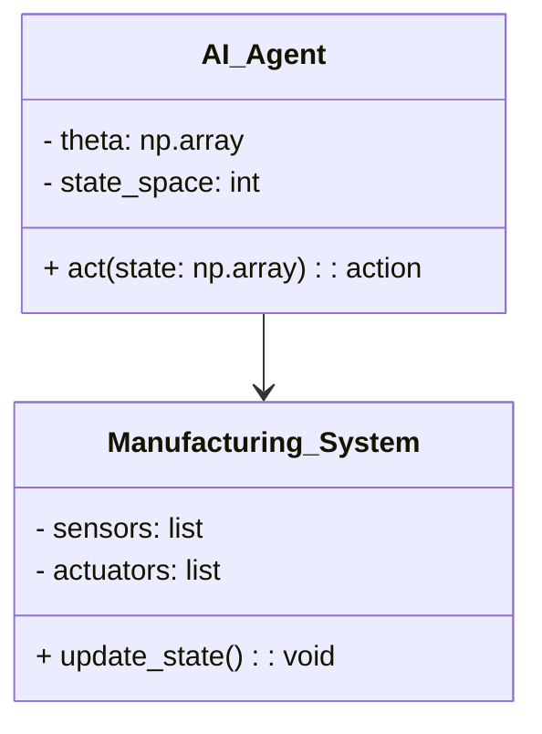
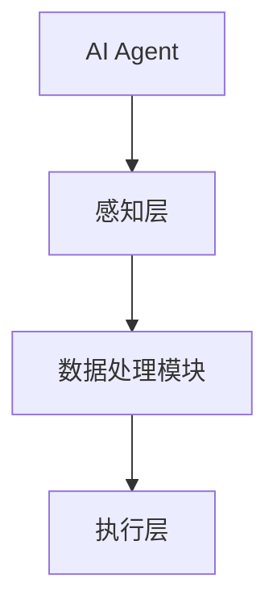

                 


# AI Agent在智能制造中的应用

> 关键词：AI Agent, 智能制造, 工业自动化, 人工智能, 数字化转型

> 摘要：本文探讨AI Agent在智能制造中的应用，分析其核心概念、算法原理、系统架构及实际案例，为读者提供全面的技术解读和实践指导。

---

# 第一部分: AI Agent与智能制造的背景与概念

## 第1章: AI Agent与智能制造的背景介绍

### 1.1 智能制造的定义与特点

智能制造是一种基于数字技术的制造模式，通过物联网、大数据、人工智能等技术实现生产过程的智能化。其特点包括：

- **智能化**：利用AI技术进行决策和优化。
- **自动化**：减少人工干预，提高效率。
- **数据驱动**：依赖实时数据进行分析和决策。

### 1.2 AI Agent的基本概念

AI Agent是一种智能体，具备感知环境、自主决策和执行任务的能力。其核心特征包括：

- **自主性**：无需外部干预。
- **反应性**：能实时感知并做出反应。
- **目标导向**：为了实现特定目标。

### 1.3 AI Agent在智能制造中的应用背景

智能制造面临效率提升、成本降低和质量优化的挑战。AI Agent通过智能化决策和自主执行任务，解决了这些痛点。

---

## 第2章: AI Agent与智能制造的核心概念分析

### 2.1 AI Agent的核心原理

AI Agent通过感知环境、分析数据、制定策略和执行动作来实现目标。其决策机制基于强化学习和监督学习。

### 2.2 智能制造的系统架构

智能制造系统由生产设备、传感器、数据处理模块和执行机构组成。系统架构包括：

- **感知层**：收集实时数据。
- **决策层**：分析数据并制定策略。
- **执行层**：执行决策指令。

### 2.3 AI Agent与智能制造的结合模型

AI Agent在智能制造中的角色包括数据处理、优化决策和任务执行。其与制造系统的交互流程如下：

1. 系统感知环境数据。
2. AI Agent分析数据并制定策略。
3. 系统执行决策指令。
4. 反馈结果并优化策略。

---

# 第二部分: AI Agent与智能制造的核心概念与联系

## 第3章: AI Agent的算法原理

### 3.1 强化学习算法

强化学习通过试错机制优化决策。数学模型如下：

$$
Q(s, a) = r + \gamma \max(Q(s', a'))
$$

其中，\( Q \) 表示状态-动作值函数，\( r \) 表示奖励，\( \gamma \) 表示折扣因子。

### 3.2 监督学习算法

监督学习通过训练数据进行分类或回归。数学模型如下：

$$
y = \theta x + b
$$

其中，\( \theta \) 表示权重，\( b \) 表示截距。

### 3.3 算法实现

以下是强化学习的Python实现示例：

```python
class AI_Agent:
    def __init__(self, state_space, action_space):
        self.state_space = state_space
        self.action_space = action_space
        self.theta = np.random.randn(state_space, 1)
        
    def act(self, state):
        return np.argmax(self.theta.T.dot(state))
```

---

## 第4章: 系统分析与架构设计

### 4.1 问题场景介绍

在智能制造中，AI Agent需要实时优化生产流程。例如，优化库存管理和生产调度。

### 4.2 系统功能设计

系统功能模块包括数据采集、决策优化和执行控制。类图如下：



### 4.3 系统架构设计

系统架构包括感知层、决策层和执行层。架构图如下：



### 4.4 接口设计与交互流程

系统交互流程如下：

1. 感知层采集数据。
2. AI Agent分析数据。
3. 执行层执行决策。
4. 反馈结果并优化策略。

---

## 第5章: 项目实战

### 5.1 环境安装

需要安装Python、TensorFlow和Keras库。

### 5.2 核心代码实现

以下是AI Agent的代码实现：

```python
import numpy as np
import tensorflow as tf

class AI_Agent:
    def __init__(self, input_dim):
        self.model = tf.keras.Sequential([
            tf.keras.layers.Dense(32, activation='relu', input_dim=input_dim),
            tf.keras.layers.Dense(1, activation='sigmoid')
        ])
        self.model.compile(optimizer='adam', loss='binary_crossentropy')

    def train(self, X, y):
        self.model.fit(X, y, epochs=100, batch_size=32)

    def predict(self, X):
        return self.model.predict(X)
```

### 5.3 案例分析

以优化库存管理为例，AI Agent通过分析历史销售数据，预测未来需求，优化库存水平。

### 5.4 项目小结

通过实际案例分析，展示了AI Agent在智能制造中的强大能力。

---

## 第6章: 总结与展望

### 6.1 核心要点总结

- AI Agent通过智能化决策优化生产流程。
- 强化学习和监督学习是主要算法。

### 6.2 最佳实践Tips

- 确保数据质量，选择合适的算法。
- 定期更新模型，适应变化。

### 6.3 未来展望

未来，AI Agent将在智能制造中发挥更大作用，推动行业进一步智能化。

---

作者：AI天才研究院 & 禅与计算机程序设计艺术

