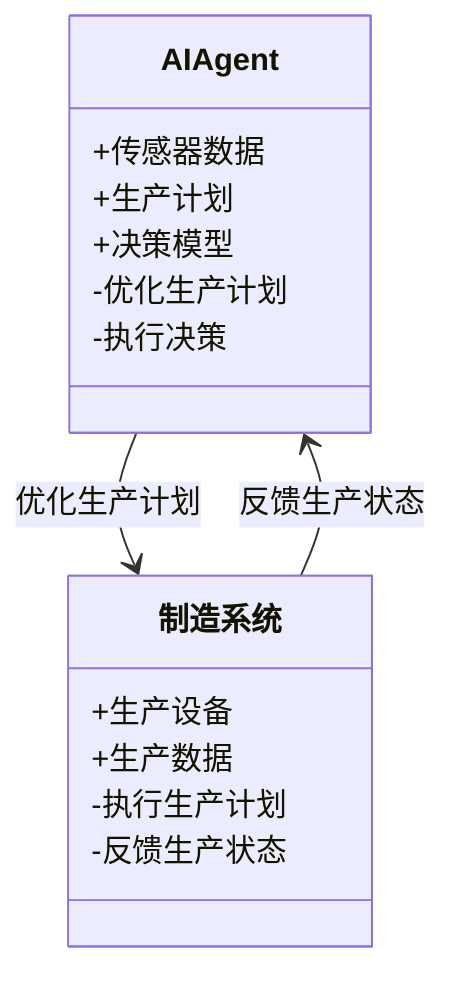
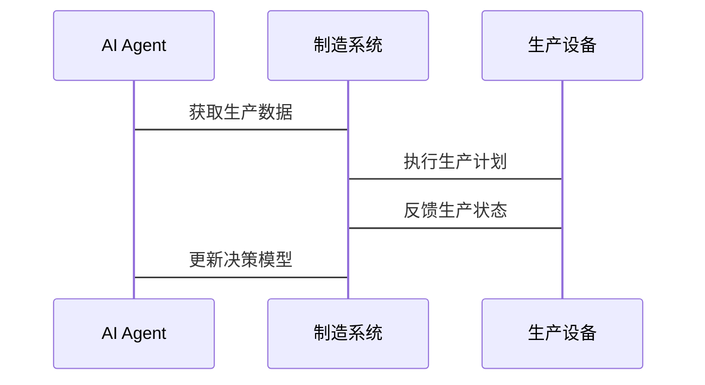

                 

<think>
好的，我将按照您的要求来撰写这篇文章。让我们一步一步地思考和分析。

# AI Agent在智能制造中的应用：生产线优化与质量控制

## 关键词：
AI Agent，智能制造，生产线优化，质量控制，工业4.0，人工智能，生产效率，质量改进

## 摘要：
本文将详细探讨AI Agent在智能制造中的应用，特别是如何通过AI Agent实现生产线优化与质量控制。文章将从背景与基础、核心概念、算法原理、系统架构、项目实战到最佳实践，全面解析AI Agent在智能制造中的重要作用和实际应用价值。通过本文，读者将深入了解AI Agent如何帮助制造业提升效率、降低成本，并推动制造过程的智能化转型。

---

## 第一部分: AI Agent与智能制造的背景与基础

### 第1章: 制造业的智能化转型

#### 1.1 制造业的数字化与智能化趋势

##### 1.1.1 制造业的演变历程
制造业经历了从手工生产到自动化、再到智能化的演变。早期制造业以手工生产为主，效率低下。随着工业革命的推进，机械化和自动化技术的应用极大地提高了生产效率。如今，随着人工智能和大数据技术的发展，制造业正向智能化方向迈进。

##### 1.1.2 数字化与智能化的驱动因素
- **技术进步**：人工智能、物联网、大数据等技术的发展为制造业的智能化转型提供了技术支持。
- **市场需求**：消费者对个性化产品的需求增加，推动了生产过程的智能化和灵活化。
- **成本压力**：企业需要通过提高效率和降低成本来保持竞争力。

##### 1.1.3 制造业的未来发展方向
未来的制造业将更加注重智能化、绿色化和可持续发展。智能化生产将通过AI Agent实现高效生产管理，绿色化生产将通过优化资源利用减少对环境的影响。

#### 1.2 智能制造的定义与特点

##### 1.2.1 智能制造的定义
智能制造是一种基于人工智能、物联网、大数据等技术的制造模式，能够实现生产过程的智能化、自动化和高效化。

##### 1.2.2 智能制造的核心特征
- **智能化**：通过AI技术实现生产过程的智能决策和优化。
- **自动化**：生产设备能够自动完成生产任务。
- **数据驱动**：利用大数据分析优化生产过程。
- **灵活性**：能够快速适应市场需求的变化。

##### 1.2.3 智能制造与传统制造的区别
| 特性 | 传统制造 | 智能制造 |
|------|----------|----------|
| 生产模式 | 批量生产 | 按需生产 |
| 技术依赖 | 机械化 | AI、大数据 |
| 数据利用 | 离散 | 实时分析 |
| 灵活性 | 低 | 高 |

#### 1.3 AI Agent的基本概念

##### 1.3.1 什么是AI Agent
AI Agent（人工智能代理）是指能够感知环境、做出决策并执行任务的智能实体。它可以是一个软件程序，也可以是一个物理设备。

##### 1.3.2 AI Agent的分类与特点
- **按智能水平分类**：
  - **反应式AI Agent**：基于当前感知做出反应。
  - **认知式AI Agent**：具备复杂推理和规划能力。
- **按应用场景分类**：
  - **服务型AI Agent**：提供信息服务。
  - **控制型AI Agent**：用于生产过程控制。

##### 1.3.3 AI Agent在智能制造中的作用
AI Agent在智能制造中充当生产过程的智能决策者和执行者，能够优化生产计划、实时监控生产状态并进行质量控制。

### 第2章: AI Agent在智能制造中的应用现状

#### 2.1 AI Agent在制造领域的应用案例

##### 2.1.1 生产线优化中的AI Agent应用
通过AI Agent实时优化生产计划，减少资源浪费，提高生产效率。

##### 2.1.2 质量控制中的AI Agent应用
利用AI Agent进行实时质量检测，减少缺陷产品，提高产品质量。

##### 2.1.3 其他领域的应用实例
AI Agent还可以应用于库存管理、供应链优化等领域。

#### 2.2 当前AI Agent技术的发展趋势
- **技术进步**：AI算法的优化和硬件性能的提升使得AI Agent的应用更加广泛。
- **市场需求**：企业对智能化生产的需求增加推动了AI Agent的应用。
- **未来潜力**：AI Agent在智能制造中的应用将进一步深化，推动制造业向更高层次发展。

---

## 第二部分: AI Agent的核心概念与原理

### 第3章: AI Agent的核心概念与原理

#### 3.1 AI Agent的基本原理

##### 3.1.1 AI Agent的感知与决策机制
AI Agent通过传感器和数据输入感知环境，利用算法进行分析和决策。

##### 3.1.2 AI Agent的学习与适应能力
AI Agent通过机器学习算法不断优化自身的决策模型，提高适应能力。

##### 3.1.3 AI Agent的自主性与协作性
AI Agent具备自主决策的能力，并能够与其他AI Agent协作完成复杂的任务。

#### 3.2 AI Agent与智能制造的结合

##### 3.2.1 AI Agent在智能制造中的角色定位
AI Agent作为生产过程的智能决策者和执行者，能够优化生产计划和质量控制。

##### 3.2.2 AI Agent与制造系统的协同工作
AI Agent与制造系统协同工作，实现生产过程的智能化和高效化。

##### 3.2.3 AI Agent对制造效率的提升作用
通过AI Agent的智能决策和优化，制造效率得到显著提升，成本降低，产品质量提高。

---

## 第三部分: AI Agent的算法原理

### 第4章: AI Agent的算法原理

#### 4.1 强化学习算法
强化学习是一种通过试错机制优化决策的算法。AI Agent通过与环境的交互，不断优化自身的决策策略。

##### 4.1.1 强化学习的基本原理
- **环境**：AI Agent所处的生产环境。
- **动作**：AI Agent在环境中的决策行为。
- **奖励**：环境对AI Agent行为的反馈。

##### 4.1.2 强化学习的应用场景
在生产过程中，AI Agent可以通过强化学习优化生产计划和资源分配。

#### 4.2 监督学习算法
监督学习是一种通过标记数据训练模型的算法。AI Agent可以利用监督学习进行质量检测和预测。

##### 4.2.1 监督学习的基本原理
- **输入**：生产过程中的各种数据。
- **输出**：预测结果，如是否为缺陷品。

##### 4.2.2 监督学习的应用场景
在质量控制中，AI Agent可以通过监督学习模型预测产品质量。

#### 4.3 聚类分析算法
聚类分析是一种无监督学习算法，用于将数据分成不同的类别。

##### 4.3.1 聚类分析的基本原理
- **数据输入**：生产过程中的各种数据。
- **聚类结果**：将相似的数据点归为一类。

##### 4.3.2 聚类分析的应用场景
在生产过程中，AI Agent可以通过聚类分析识别异常情况。

---

## 第四部分: 系统分析与架构设计

### 第5章: 系统分析与架构设计

#### 5.1 问题场景介绍
在智能制造中，生产过程复杂，需要实时监控和优化。

#### 5.2 项目介绍
本项目旨在通过AI Agent实现生产线的优化和质量控制。

#### 5.3 系统功能设计

##### 5.3.1 领域模型
领域模型展示了系统中的各个实体及其关系。



#### 5.4 系统架构设计

```mermaid
flowchart TD
    AI Agent((AI Agent)) --> 制造系统((制造系统))
    制造系统 --> 生产设备((生产设备))
    制造系统 --> 生产数据((生产数据))
```

#### 5.5 系统接口设计
系统接口包括AI Agent与制造系统的交互接口。

#### 5.6 系统交互流程



---

## 第五部分: 项目实战

### 第6章: 项目实战

#### 6.1 环境安装
安装必要的软件和库，如Python、TensorFlow等。

#### 6.2 核心代码实现

##### 6.2.1 强化学习模型代码

```python
class AI_Agent:
    def __init__(self, state_space, action_space):
        self.state_space = state_space
        self.action_space = action_space
        # 初始化决策模型
        self.model = self.build_model()

    def build_model(self):
        # 构建神经网络模型
        pass

    def perceive(self, state):
        # 状态感知
        pass

    def decide(self, state):
        # 决策
        pass
```

##### 6.2.2 质量检测代码

```python
import tensorflow as tf
from tensorflow.keras import layers

model = tf.keras.Sequential([
    layers.Dense(64, activation='relu'),
    layers.Dense(1, activation='sigmoid')
])

model.compile(optimizer='adam', loss='binary_crossentropy', metrics=['accuracy'])
```

#### 6.3 实际案例分析
通过实际案例分析AI Agent在生产线优化和质量控制中的应用效果。

#### 6.4 项目总结
总结项目实施过程中的经验教训，提出改进建议。

---

## 第六部分: 最佳实践与小结

### 第7章: 最佳实践

#### 7.1 最佳实践
- **数据质量**：确保数据的准确性和完整性。
- **模型优化**：定期更新和优化AI Agent的决策模型。
- **系统集成**：确保AI Agent与制造系统的无缝集成。

#### 7.2 小结
通过本文的详细讲解，读者可以全面了解AI Agent在智能制造中的应用，包括其核心概念、算法原理、系统架构和实际案例。

#### 7.3 注意事项
- AI Agent的应用需要结合企业的实际情况。
- 数据安全和隐私保护是需要重点关注的问题。

#### 7.4 拓展阅读
推荐相关的书籍和论文，供读者深入学习。

---

## 作者

作者：AI天才研究院/AI Genius Institute & 禅与计算机程序设计艺术 /Zen And The Art of Computer Programming

---

希望这篇文章能为您提供有价值的见解和启发。如果您有任何问题或需要进一步的解释，请随时联系我。

