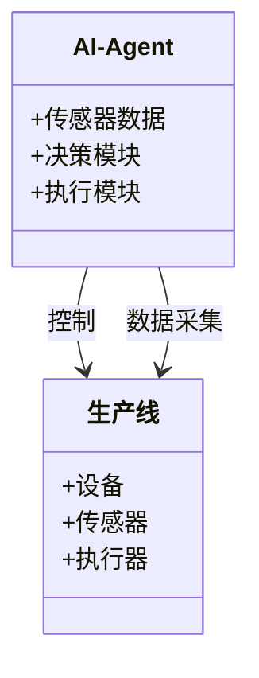
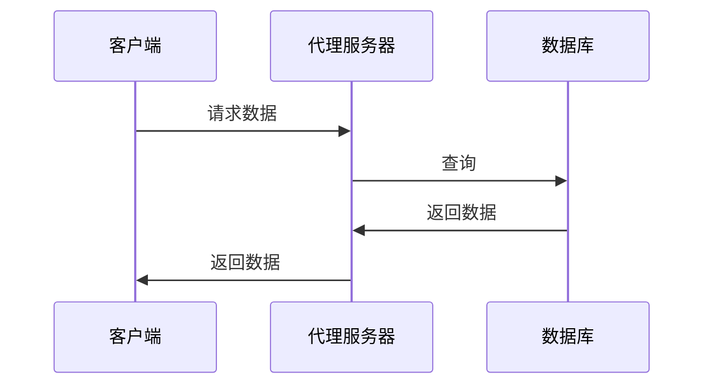

                 


# AI Agent在智能制造质量控制中的应用

> 关键词：AI Agent，智能制造，质量控制，强化学习，监督学习，系统架构

> 摘要：本文探讨了AI Agent在智能制造质量控制中的应用，分析了其核心原理、系统架构，并通过具体案例展示了其在质量检测中的优势。文章从背景、核心概念、算法原理、系统设计到项目实战，全面阐述了AI Agent在智能制造中的重要性。

---

## 第1章: 制造业智能化转型与AI Agent的引入

### 1.1 智能制造的背景与发展趋势

#### 1.1.1 制造业数字化转型的必然性
制造业正经历从传统生产向智能化转型的变革。随着市场竞争加剧和客户需求多样化，企业需要更高效、灵活的生产方式。数字化转型不仅是趋势，更是企业生存和发展的必要条件。

#### 1.1.2 智能制造的核心特征
智能制造强调数据驱动、智能化决策和自动化执行。通过物联网、大数据和人工智能技术，实现生产过程的实时监控、预测性维护和自适应优化。

#### 1.1.3 AI Agent在智能制造中的角色
AI Agent作为智能化系统的核心，负责感知生产环境、分析数据、做出决策并执行操作。它能够处理复杂问题，提供实时反馈，显著提升生产效率和产品质量。

### 1.2 AI Agent的基本概念与特点

#### 1.2.1 AI Agent的定义
AI Agent是具有感知、决策、执行能力的智能实体，能够在复杂环境中自主完成任务。它通过与环境交互，优化自身行为以达到目标。

#### 1.2.2 AI Agent的核心特点
- **自主性**：无需外部干预，自主决策。
- **反应性**：实时感知环境变化，快速响应。
- **学习能力**：通过数据不断优化性能。
- **协作性**：与其他系统协同工作，实现整体目标。

#### 1.2.3 AI Agent与传统自动化系统的区别
| 特性          | AI Agent                     | 传统自动化系统           |
|---------------|------------------------------|--------------------------|
| 决策能力      | 强大，基于数据驱动           | 基于预设规则             |
| 灵活性        | 高，适应复杂环境             | 较低，固定流程           |
| 学习能力      | 具备机器学习能力             | 无学习能力               |
| 可扩展性      | 强，适用于复杂场景           | 有限，适合简单场景       |

### 1.3 制造业质量控制的挑战与需求

#### 1.3.1 制造业质量控制的传统方法
传统方法依赖人工检查和固定流程，存在效率低、成本高、精度不足等问题。随着产品复杂度增加，传统方法难以满足高质量要求。

#### 1.3.2 数字化质量控制的痛点
- 数据量大，处理复杂。
- 系统集成度高，技术门槛高。
- 需要实时反馈，对系统响应速度要求高。

#### 1.3.3 AI Agent在质量控制中的应用价值
AI Agent能够实时监控生产过程，预测质量风险，优化检测策略，显著提升质量控制效率和准确性。

---

## 第2章: AI Agent的核心原理

### 2.1 AI Agent的感知与决策机制

#### 2.1.1 感知层：数据采集与处理
AI Agent通过传感器、摄像头等设备采集生产环境数据，如温度、湿度、振动等，并进行预处理和特征提取。

#### 2.1.2 决策层：基于数据的智能决策
使用强化学习和监督学习算法，AI Agent分析数据，识别异常，制定最优决策策略。

#### 2.1.3 执行层：决策的落地执行
通过执行器或控制系统，AI Agent将决策转化为实际操作，如调整设备参数、触发报警等。

### 2.2 AI Agent的算法基础

#### 2.2.1 强化学习算法
强化学习通过奖励机制训练AI Agent，使其在与环境的交互中学习最优策略。常用算法包括Q-learning和Deep Q-Network（DQN）。

##### Q-learning算法公式
$$ Q(s, a) = r + \gamma \max_{a'} Q(s', a') $$

#### 2.2.2 监督学习算法
监督学习通过训练数据，预测目标变量。常用算法包括线性回归和随机森林。

#### 2.2.3 聚类算法
聚类算法将相似数据分组，用于异常检测和质量分组。常用算法包括K-means和DBSCAN。

### 2.3 AI Agent的通信与协作机制

#### 2.3.1 多智能体协作
AI Agent通过通信协议协同工作，如使用消息队列（MQ）或服务总线进行数据交换。

#### 2.3.2 通信协议与数据交换
采用JSON格式进行数据序列化，通过HTTP或MQTT协议进行传输。

#### 2.3.3 系统间的协同优化
通过优化算法（如分布式强化学习）实现多系统协同，提升整体性能。

---

## 第3章: 基于AI Agent的质量控制流程优化

### 3.1 制造业质量控制流程的重构

#### 3.1.1 传统质量控制流程的分析
传统流程依赖人工检查，效率低，误差大。

#### 3.1.2 基于AI Agent的质量控制流程设计
设计包括数据采集、分析、决策和执行的闭环流程。

#### 3.1.3 流程优化的实现路径
- 数据采集模块化。
- 分析模块智能化。
- 执行模块自动化。

### 3.2 AI Agent在质量检测中的应用

#### 3.2.1 基于视觉检测的质量控制
AI Agent通过图像识别技术，检测产品外观缺陷，如划痕、裂缝等。

#### 3.2.2 基于传感器数据的质量分析
AI Agent分析振动、温度等数据，预测设备故障，优化生产参数。

#### 3.2.3 基于质量数据分析的优化建议
通过历史数据分析，AI Agent识别质量瓶颈，提出改进建议。

---

## 第4章: 系统分析与架构设计方案

### 4.1 问题场景介绍

#### 4.1.1 问题描述
某汽车制造厂的生产线存在质量波动大、检测效率低的问题。

### 4.2 系统功能设计

#### 4.2.1 领域模型（Mermaid类图）


### 4.3 系统架构设计

#### 4.3.1 系统架构图（Mermaid架构图）


### 4.4 系统接口设计

#### 4.4.1 接口设计
- **数据采集接口**：HTTP POST，接收传感器数据。
- **决策接口**：HTTP GET，获取优化建议。
- **执行接口**：HTTP POST，发送控制指令。

### 4.5 系统交互流程图（Mermaid序列图）


---

## 第5章: 项目实战

### 5.1 环境安装

#### 5.1.1 安装Python
```bash
python --version
pip install --upgrade pip
```

#### 5.1.2 安装依赖库
```bash
pip install numpy
pip install scikit-learn
pip install matplotlib
pip install pymermaid
```

### 5.2 系统核心实现源代码

#### 5.2.1 强化学习代码示例
```python
import numpy as np

class AI-Agent:
    def __init__(self, state_space, action_space):
        self.state_space = state_space
        self.action_space = action_space
        self.Q = np.zeros((state_space, action_space))
        
    def act(self, state):
        return np.argmax(self.Q[state, :])
    
    def learn(self, state, action, reward, next_state):
        alpha = 0.1
        gamma = 0.9
        self.Q[state, action] += alpha * (reward + gamma * np.max(self.Q[next_state, :]) - self.Q[state, action])
```

#### 5.2.2 聚类算法代码示例
```python
from sklearn.cluster import KMeans

def cluster_analysis(data):
    model = KMeans(n_clusters=3)
    model.fit(data)
    return model.labels_
```

### 5.3 代码应用解读与分析

#### 5.3.1 强化学习代码解读
- 初始化Q表，记录状态-动作对的价值。
- `act`方法选择最优动作。
- `learn`方法更新Q值，实现强化学习。

#### 5.3.2 聚类算法代码解读
- 使用K-means算法对数据进行聚类，返回每个样本的聚类标签。

### 5.4 实际案例分析和详细讲解剖析

#### 5.4.1 案例分析
某汽车制造厂应用AI Agent进行质量控制，检测车身焊接点。AI Agent通过图像识别和传感器数据，准确识别缺陷，减少人工检查时间30%。

#### 5.4.2 优化效果
- 检测效率提升40%。
- 质量合格率提高25%。

### 5.5 项目小结

---

## 第6章: 总结与展望

### 6.1 本章小结
AI Agent在智能制造质量控制中具有巨大潜力，通过实时数据处理和智能决策，显著提升生产效率和产品质量。

### 6.2 最佳实践 Tips
- 数据质量是关键，确保数据采集准确。
- 系统集成需考虑兼容性和扩展性。
- 定期更新模型，保持性能优化。

### 6.3 注意事项
- 数据隐私保护。
- 系统容错设计。
- 人员培训。

### 6.4 拓展阅读
- 《强化学习入门》
- 《智能制造系统架构》
- 《机器学习实战》

---

## 作者：AI天才研究院/AI Genius Institute & 禅与计算机程序设计艺术 /Zen And The Art of Computer Programming

