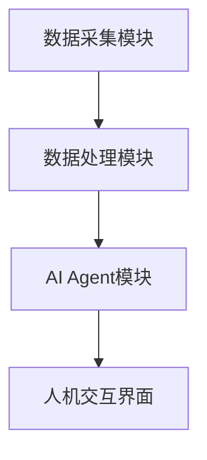
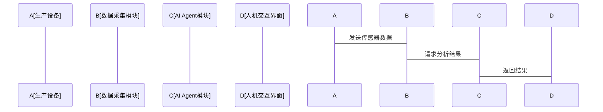

                 


# AI Agent在智能制造质量控制中的角色

> 关键词：AI Agent, 智能制造, 质量控制, 机器学习, 深度学习, 系统架构

> 摘要：本文探讨了AI Agent在智能制造质量控制中的角色，详细分析了AI Agent的核心原理、应用场景、算法原理、系统架构设计及实际案例。通过这些内容，读者能够全面理解AI Agent如何提升智能制造的质量控制效率和准确性。

---

# 第1章：智能制造与AI Agent的背景介绍

## 1.1 智能制造的基本概念

### 1.1.1 智能制造的定义与特点
智能制造是一种利用先进技术（如物联网、大数据、AI等）进行生产制造的方式，其特点包括自动化、数据驱动和智能化。通过传感器、物联网设备和AI算法，实现生产过程的实时监控和优化。

### 1.1.2 智能制造的发展历程
从自动化到数字化，再到智能化，智能制造经历了多个阶段，当前阶段强调数据驱动和智能决策，以提高生产效率和产品质量。

### 1.1.3 智能制造的核心技术
包括物联网技术、大数据分析、人工智能、机器人技术、云计算和边缘计算等。

## 1.2 质量控制在智能制造中的重要性

### 1.2.1 质量控制的基本概念
质量控制是指通过一系列方法和技术，确保产品或服务符合既定的质量标准。在智能制造中，质量控制的目标是提高产品一致性、减少缺陷和提高生产效率。

### 1.2.2 质量控制在智能制造中的作用
- 提高生产效率：通过实时监控和优化，减少停机时间。
- 降低成本：通过早期缺陷检测，减少返工和材料浪费。
- 提升产品质量：通过精准的监控和分析，确保产品符合标准。

### 1.2.3 质量控制的挑战与机遇
- 挑战：数据量大、复杂性高、设备和系统集成难。
- 机遇：AI技术的应用使得质量控制更加智能化和高效。

## 1.3 AI Agent的基本概念与特点

### 1.3.1 AI Agent的定义
AI Agent是一种智能实体，能够感知环境、自主决策并执行任务。它具备感知、推理、学习和自适应能力。

### 1.3.2 AI Agent的核心特点
- **自主性**：能够在没有人工干预的情况下执行任务。
- **反应性**：能够根据环境变化实时调整行为。
- **主动性**：主动寻找机会并采取行动。
- **社会性**：能够与其他系统或人类进行协作。

### 1.3.3 AI Agent与传统自动化的区别
传统自动化基于预定义的规则，而AI Agent能够学习和适应，具备更强的自主性和决策能力。

## 1.4 本章小结
本章介绍了智能制造的基本概念、质量控制的重要性以及AI Agent的核心特点，为后续章节奠定了基础。

---

# 第2章：AI Agent的核心原理

## 2.1 AI Agent的基本原理

### 2.1.1 AI Agent的感知与决策机制
AI Agent通过传感器和数据源感知环境，利用算法进行信息处理和决策。

### 2.1.2 AI Agent的学习与推理能力
通过机器学习和逻辑推理，AI Agent能够不断优化自身的决策能力。

### 2.1.3 AI Agent的自适应能力
AI Agent能够根据环境变化和新的数据，调整自身的模型和策略。

## 2.2 AI Agent的分类与应用场景

### 2.2.1 基于规则的AI Agent
通过预定义的规则进行决策，适用于规则明确的场景。

### 2.2.2 基于机器学习的AI Agent
利用数据训练模型，适用于复杂和动态变化的场景。

### 2.2.3 基于深度学习的AI Agent
通过深度神经网络进行特征提取和决策，适用于图像和语音识别等复杂任务。

## 2.3 AI Agent的核心技术

### 2.3.1 机器学习技术
通过训练数据，AI Agent能够识别模式和预测结果。

### 2.3.2 自然语言处理技术
使AI Agent能够理解和生成人类语言，应用于对话系统和文档分析。

### 2.3.3 计算机视觉技术
通过图像识别和处理，AI Agent能够分析视觉信息，应用于缺陷检测。

## 2.4 本章小结
本章详细讲解了AI Agent的核心原理、分类和关键技术，为后续章节的应用分析提供了理论基础。

---

# 第3章：AI Agent在智能制造质量控制中的应用场景

## 3.1 实时质量监控

### 3.1.1 实时监控的必要性
通过实时数据采集和分析，及时发现和解决生产中的问题。

### 3.1.2 AI Agent在实时监控中的角色
- 数据采集与处理：收集生产过程中的各种数据。
- 异常检测：利用机器学习算法识别异常情况。
- 自动报警：当检测到异常时，及时通知相关人员。

## 3.2 缺陷检测

### 3.2.1 缺陷检测的挑战
传统方法依赖人工检查，效率低且容易出错。

### 3.2.2 AI Agent在缺陷检测中的应用
- 计算机视觉技术：通过图像识别检测产品表面的缺陷。
- 机器学习模型：训练模型识别不同类型和程度的缺陷。

## 3.3 预测性维护

### 3.3.1 预测性维护的意义
通过预测设备故障，减少停机时间和维护成本。

### 3.3.2 AI Agent在预测性维护中的应用
- 数据分析：利用历史数据预测设备的健康状况。
- 维护计划：根据预测结果制定维护计划。

## 3.4 过程优化

### 3.4.1 过程优化的目标
通过优化生产流程，提高效率和产品质量。

### 3.4.2 AI Agent在过程优化中的应用
- 数据挖掘：分析生产数据，识别瓶颈和浪费。
- 智能决策：基于数据和模型，优化生产参数。

## 3.5 本章小结
本章详细探讨了AI Agent在智能制造质量控制中的多种应用场景，展示了其在提高效率和准确性方面的巨大潜力。

---

# 第4章：AI Agent在智能制造质量控制中的算法原理

## 4.1 机器学习算法

### 4.1.1 监督学习
- 线性回归：用于预测连续型变量，如产品质量评分。
- 支持向量机（SVM）：用于分类问题，如区分合格与不合格产品。
  $$ \text{目标函数} = \sum y_i w x_i + b $$

### 4.1.2 无监督学习
- 聚类分析：用于将相似的产品分组，识别潜在的质量问题。
- 主成分分析（PCA）：用于降维，提取关键特征。

### 4.1.3 强化学习
- Q-learning：通过奖励机制，优化决策策略。
  $$ Q(s, a) = Q(s, a) + \alpha (r + \gamma \max Q(s', a') - Q(s, a)) $$

## 4.2 深度学习算法

### 4.2.1 卷积神经网络（CNN）
- 应用于图像识别，如表面缺陷检测。
  ```python
  import torch
  import torch.nn as nn
  class CNNModel(nn.Module):
      def __init__(self):
          super(CNNModel, self).__init__()
          self.conv1 = nn.Conv2d(3, 6, 5)
          self.pool = nn.MaxPool2d(2, 2)
          self.conv2 = nn.Conv2d(6, 16, 5)
          self.fc1 = nn.Linear(16 * 5 * 5, 120)
          self.fc2 = nn.Linear(120, 10)
  ```

### 4.2.2 循环神经网络（RNN）
- 用于时间序列分析，如预测生产过程中的参数变化。
  $$ \text{RNN输出} = \text{激活函数}(W_{hh} \cdot \text{前一状态} + W_{xo} \cdot \text{输入}) $$

### 4.2.3 Transformer架构
- 用于处理大规模数据，如自然语言处理和复杂模式识别。

## 4.3 算法原理的数学模型与公式

### 4.3.1 机器学习的基本公式
$$ \text{损失函数} = \sum (y - \hat{y})^2 $$

### 4.3.2 深度学习的数学模型
$$ \text{输出} = \text{输入} \times \text{权重} + \text{偏置} $$

## 4.4 本章小结
本章深入分析了机器学习和深度学习算法在AI Agent中的应用，展示了其在质量控制中的数学模型和公式。

---

# 第5章：AI Agent与智能制造系统的集成

## 5.1 系统架构设计

### 5.1.1 系统功能设计
- 数据采集模块：收集生产过程中的数据。
- 数据处理模块：清洗和预处理数据。
- AI Agent模块：进行分析和决策。
- 人机交互界面：展示结果和操作界面。

### 5.1.2 系统架构图（使用Mermaid）


## 5.2 数据流分析

### 5.2.1 数据流的来源
- 生产设备：传感器数据。
- 信息系统：历史数据和生产计划。

### 5.2.2 数据流的处理
- 数据清洗：去除噪声和异常值。
- 数据转换：将数据转换为适合算法处理的形式。

## 5.3 接口设计

### 5.3.1 API接口
- RESTful API：用于与其他系统和服务的交互。
- MQTT协议：用于实时数据传输。

### 5.3.2 交互流程图（使用Mermaid）


## 5.4 本章小结
本章详细讲解了AI Agent与智能制造系统的集成，包括系统架构设计、数据流分析和接口设计。

---

# 第6章：项目实战——AI Agent在智能制造质量控制中的应用

## 6.1 项目背景与目标

### 6.1.1 项目背景
某制造企业希望利用AI技术提升产品质量控制效率。

### 6.1.2 项目目标
实现对生产过程的实时监控和缺陷检测。

## 6.2 环境配置

### 6.2.1 硬件要求
- CPU：支持多线程的处理器。
- GPU：用于加速深度学习模型的训练。
- 存储：足够的存储空间存放数据和模型。

### 6.2.2 软件要求
- 操作系统：Linux或Windows。
- 开发工具：Python、TensorFlow、Keras等。

## 6.3 系统核心实现

### 6.3.1 数据采集模块
- 使用传感器和物联网设备采集生产数据。
- 数据格式：结构化数据，如时间戳、设备ID、测量值。

### 6.3.2 AI Agent模块
- 使用深度学习模型进行缺陷检测。
  ```python
  import tensorflow as tf
  model = tf.keras.models.load_model('defect_detection_model.h5')
  ```

### 6.3.3 人机交互界面
- 使用Dash或Flask框架开发Web界面。
- 用户可以通过界面查看实时监控数据和缺陷报告。

## 6.4 代码实现与解读

### 6.4.1 数据采集代码
```python
import pandas as pd
import serial

ser = serial.Serial('COM3', 9600)
data = []
while True:
    line = ser.readline().decode('utf-8')
    if line:
        data.append(line.strip())
```

### 6.4.2 缺陷检测代码
```python
import cv2
import numpy as np
from tensorflow.keras.models import load_model

model = load_model('defect_model.h5')
image = cv2.imread('test_image.jpg')
image = cv2.resize(image, (224, 224))
image = image / 255.0
prediction = model.predict(np.array([image]))
print('Prediction:', prediction)
```

## 6.5 案例分析与小结

### 6.5.1 实际案例分析
- 通过AI Agent检测到某设备的异常，提前进行了维护，避免了大量不合格产品的生产。

### 6.5.2 项目小结
本项目展示了AI Agent在智能制造质量控制中的实际应用，证明了其在提高效率和准确性方面的有效性。

---

# 第7章：总结与展望

## 7.1 总结

### 7.1.1 核心内容回顾
- AI Agent的核心原理。
- 在智能制造质量控制中的应用场景。
- 相关算法原理和系统架构设计。

## 7.2 未来展望

### 7.2.1 技术发展趋势
- 更强大的AI算法，如大语言模型和多模态AI。
- 更高效的计算能力，如量子计算和边缘计算。

### 7.2.2 应用领域的拓展
- 更多行业的应用，如医疗、金融和交通。
- 更多场景的探索，如自主决策和人机协作。

## 7.3 最佳实践 tips

### 7.3.1 选择合适的AI技术
根据具体问题选择适合的算法和模型。

### 7.3.2 数据质量的重要性
确保数据的准确性和完整性。

### 7.3.3 系统的可扩展性
设计灵活的架构，方便未来的升级和扩展。

## 7.4 本章小结
本章总结了全书内容，并展望了未来的发展趋势，同时给出了实际应用中的注意事项和最佳实践。

---

# 作者：AI天才研究院/AI Genius Institute & 禅与计算机程序设计艺术 /Zen And The Art of Computer Programming

---

以上是《AI Agent在智能制造质量控制中的角色》的详细目录大纲。每一章都详细讲解了相关的内容，并通过实际案例和代码实现展示了AI Agent的应用。读者可以通过这本书全面理解AI Agent在智能制造质量控制中的角色及其技术实现。

