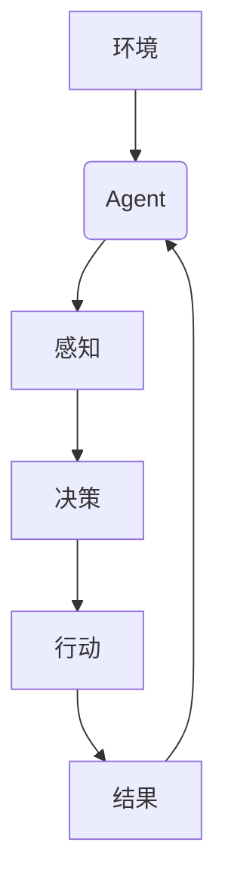

                 


# AI Agent在智能制造过程控制中的角色

## 关键词
- AI Agent
- 智能制造
- 过程控制
- 算法原理
- 系统架构

## 摘要
AI Agent在智能制造过程控制中扮演着越来越重要的角色。随着人工智能技术的快速发展，AI Agent能够通过强化学习、贝叶斯网络等算法，实现智能制造过程中的实时决策与优化。本文详细探讨了AI Agent的核心概念、算法原理、系统架构设计以及在智能制造中的实际应用，通过具体案例分析，展示了AI Agent在智能制造过程控制中的巨大潜力和实际价值。

---

# 第一部分: AI Agent与智能制造的背景与概念

## 第1章: AI Agent在智能制造中的背景与问题背景

### 1.1 智能制造的现状与挑战
智能制造是工业4.0的核心，其目标是通过数字化、网络化和智能化的生产方式，实现高效、灵活、可持续的制造过程。然而，智能制造系统面临着以下主要挑战：
- **复杂性**：制造过程涉及多个子系统，如设备、传感器、数据流和人机交互，系统的复杂性使得传统的规则驱动方法难以应对动态变化。
- **实时性**：制造过程需要实时决策，以应对生产中的突发情况和优化资源利用率。
- **不确定性**：制造环境中的不确定性（如设备故障、供应链波动）使得传统的静态规划方法难以适应。

### 1.2 AI Agent的基本概念与核心原理
AI Agent（人工智能代理）是一种能够感知环境、自主决策并采取行动的智能实体。其核心原理包括：
- **感知**：通过传感器或数据输入获取环境信息。
- **决策**：基于感知信息，利用算法（如强化学习、监督学习）进行推理和选择最优行动。
- **执行**：通过执行器或系统接口将决策转化为实际操作。

### 1.3 AI Agent与智能制造的结合
AI Agent在智能制造中的角色可以分为以下几个方面：
1. **实时监控与优化**：AI Agent通过实时数据分析，优化生产流程，减少资源浪费。
2. **故障预测与自适应调整**：AI Agent能够预测设备故障并自动调整生产计划，降低停机时间。
3. **人机协作**：AI Agent可以与人类操作员协同工作，提供实时建议和决策支持。

---

## 第2章: AI Agent的核心概念与原理

### 2.1 AI Agent的核心概念
AI Agent的核心概念包括：
- **状态空间**：系统在某一时刻的状态集合，例如温度、压力等。
- **动作空间**：AI Agent可以执行的动作或决策。
- **奖励函数**：衡量AI Agent行为的好坏，用于强化学习中的反馈机制。

### 2.2 AI Agent的核心算法
AI Agent主要依赖以下算法：
- **强化学习（Reinforcement Learning）**：通过试错学习，AI Agent在环境中不断探索以最大化累积奖励。
- **贝叶斯网络（Bayesian Network）**：用于建模不确定性，帮助AI Agent进行概率推理。

### 2.3 AI Agent在智能制造中的具体应用
AI Agent在智能制造中的应用包括：
- **质量控制**：通过实时数据分析，识别生产中的异常情况。
- **能耗优化**：根据生产负荷动态调整设备运行参数，降低能源消耗。

---

## 第3章: AI Agent在智能制造过程控制中的算法原理

### 3.1 强化学习算法原理
强化学习是一种通过试错机制来优化决策的算法。其核心公式包括：
- **Q-learning**：$$ Q(s, a) = r + \gamma \max Q(s', a') $$
- **Deep Q-Network (DQN)**：通过神经网络近似Q值函数，适用于高维状态空间。

### 3.2 贝叶斯网络的应用
贝叶斯网络通过概率推理帮助AI Agent进行决策。例如，在设备故障预测中，贝叶斯网络可以根据历史数据推断出故障概率。

### 3.3 算法流程图


---

## 第4章: AI Agent的系统架构设计

### 4.1 系统架构概述
AI Agent的系统架构通常包括：
- **感知层**：负责数据采集和环境感知。
- **决策层**：负责策略制定和优化。
- **执行层**：负责将决策转化为具体操作。

### 4.2 系统功能设计
- **实时监控**：通过传感器数据实时监控生产过程。
- **智能决策**：基于强化学习算法优化生产计划。

### 4.3 系统架构图


---

## 第5章: 项目实战与案例分析

### 5.1 环境安装
安装所需的环境包括Python、TensorFlow、Keras等。

### 5.2 核心代码实现
```python
import numpy as np
import gym

# 初始化环境
env = gym.make('CartPole-v0')
env.seed(42)

# DQN参数
learning_rate = 0.01
gamma = 0.99
epsilon = 1.0

# 神经网络模型
model = Sequential()
model.add(Dense(24, input_dim=4, activation='relu'))
model.add(Dense(2, activation='linear'))
model.compile(optimizer='adam', loss='mse')

# 训练过程
for episode in range(1000):
    state = env.reset()
    while True:
        if np.random.random() < epsilon:
            action = env.action_space.sample()
        else:
            q = model.predict(np.array([state]))
            action = np.argmax(q[0])
        
        next_state, reward, done, _ = env.step(action)
        target = model.predict(np.array([next_state]))
        target[0][action] += reward + gamma * np.max(target[0])
        model.fit(np.array([state]), target, epochs=1, verbose=0)
        
        state = next_state
        if done:
            break
```

### 5.3 案例分析
通过训练AI Agent控制小车平衡，展示强化学习在智能制造中的应用。

---

## 第6章: 总结与展望

### 6.1 总结
本文详细探讨了AI Agent在智能制造过程控制中的角色，包括核心概念、算法原理和系统架构设计。

### 6.2 展望
未来，随着AI Agent技术的不断发展，其在智能制造中的应用将更加广泛，包括边缘计算、数字孪生等领域。

---

## 作者
作者：AI天才研究院 & 禅与计算机程序设计艺术

---

以上是《AI Agent在智能制造过程控制中的角色》的技术博客文章。

