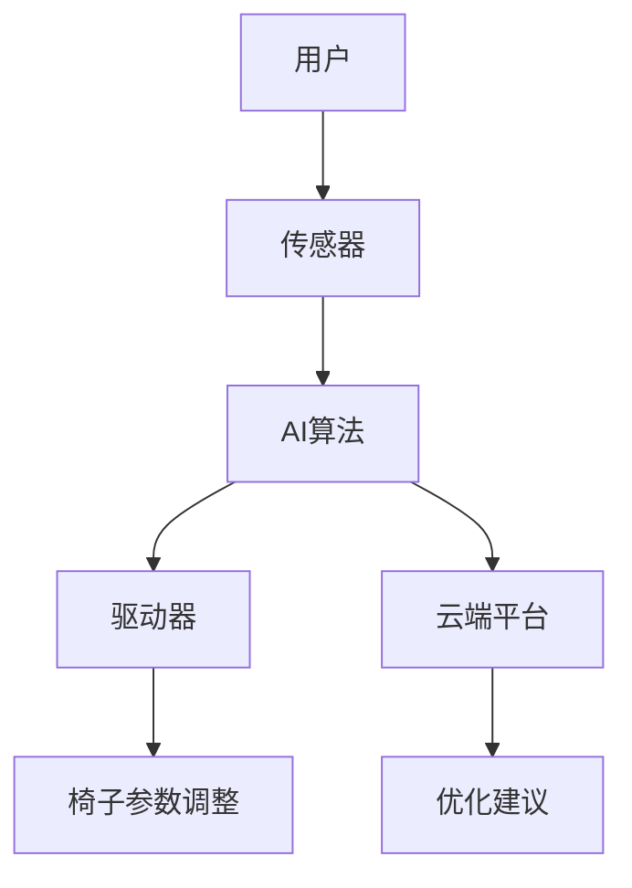
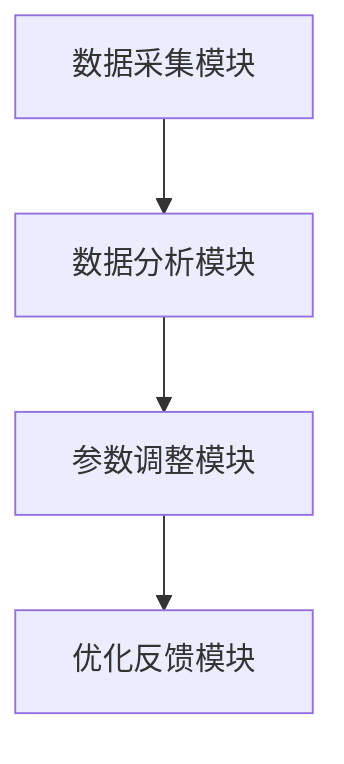
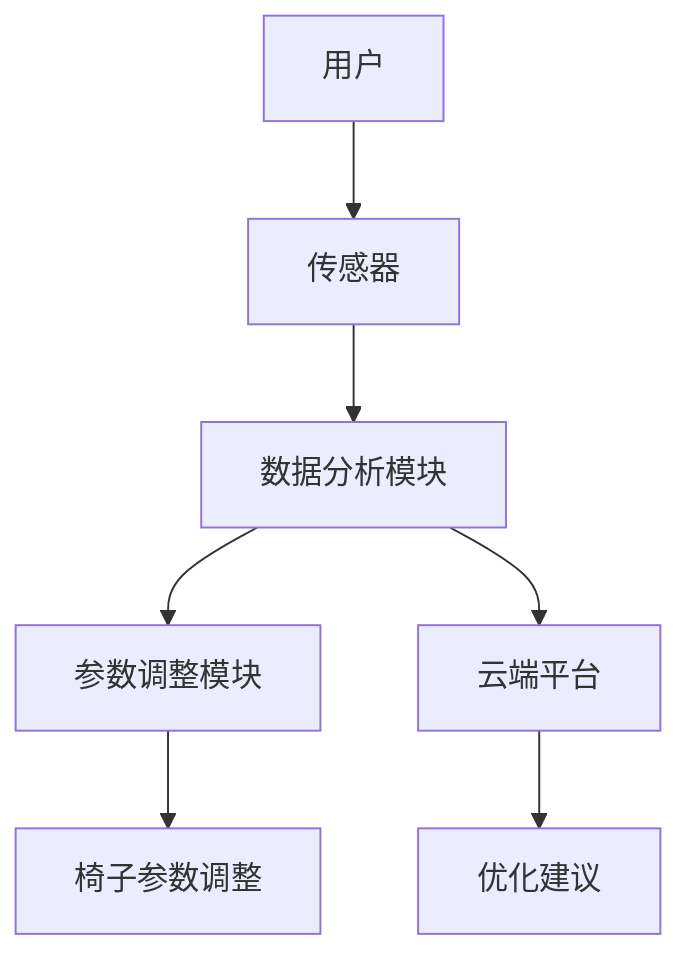
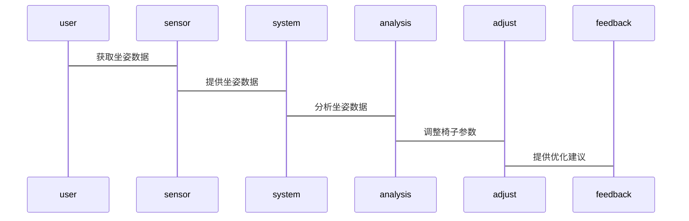

                 


# AI Agent在智能办公椅中的坐姿优化系统

> 关键词：AI Agent，坐姿优化，智能办公椅，人体工程学，深度学习

> 摘要：本文详细探讨了AI Agent在智能办公椅中的应用，重点分析了坐姿优化系统的实现原理、算法设计、系统架构以及实际应用场景。通过结合人体工程学和人工智能技术，本文提出了一种基于AI Agent的智能坐姿优化解决方案，旨在为用户提供更加健康和舒适的办公体验。

---

# 第1章: 背景与价值

## 1.1 问题背景

### 1.1.1 办公椅坐姿问题的普遍性
现代办公环境中，长时间久坐已经成为一种常态，而不良的坐姿习惯导致的健康问题（如腰椎病、颈椎病）也日益严重。根据世界卫生组织的统计，全球范围内因久坐导致的健康问题正在呈现年轻化趋势。

### 1.1.2 长期不良坐姿的危害
- 肌肉疲劳和僵硬
- 脊柱变形和退化
- 内脏器官功能下降
- 精神状态不佳

### 1.1.3 智能办公椅的发展趋势
随着科技的进步，办公椅的功能已经从简单的支撑人体发展到具备多种智能调节功能。现代智能办公椅可以通过传感器、AI算法和执行机构实现对坐姿的实时优化。

---

## 1.2 问题描述

### 1.2.1 坐姿优化的核心目标
通过实时监测用户的坐姿状态，结合人体工程学原理，主动调整椅子的参数（如高度、倾斜角度、靠背角度等），帮助用户保持最佳坐姿。

### 1.2.2 常见坐姿问题的分类
- 前倾坐姿：身体过于前倾，颈椎压力过大
- 后仰坐姿：身体过于后仰，腰椎压力过大
- 侧倾坐姿：身体偏向一侧，容易导致肌肉不平衡
- 塌腰坐姿：脊柱弯曲异常

### 1.2.3 AI Agent在坐姿优化中的作用
AI Agent（人工智能代理）通过实时感知用户的行为和环境信息，主动调整办公椅的参数，从而实现坐姿优化的目标。

---

## 1.3 解决方案概述

### 1.3.1 AI Agent的基本概念
AI Agent是一种能够感知环境、自主决策并执行任务的智能体。在坐姿优化系统中，AI Agent通过传感器获取用户坐姿数据，结合预设的优化算法，驱动办公椅执行调整动作。

### 1.3.2 坐姿优化系统的功能框架
1. 数据采集：通过传感器获取用户的坐姿数据（如坐姿角度、身体重心、压力分布等）。
2. 数据分析：利用AI算法对坐姿数据进行分析，判断坐姿是否符合人体工程学原理。
3. 参数调整：根据分析结果，调整办公椅的参数（如高度、倾斜角度、靠背角度等）。
4. 反馈优化：根据用户的反馈和环境变化，动态调整优化策略。

### 1.3.3 系统实现的技术路线
1. 数据采集：使用多种传感器（如IMU、压力传感器、摄像头等）。
2. 数据分析：基于深度学习的坐姿识别算法。
3. 参数调整：通过电动驱动器实现椅子的实时调整。
4. 系统集成：将传感器、算法和驱动器集成到办公椅中。

---

## 1.4 系统边界与外延

### 1.4.1 系统的功能边界
1. 仅支持坐姿优化功能，不涉及其他功能（如按摩、加热等）。
2. 数据采集范围仅限于用户坐姿相关参数。
3. 优化策略基于预设的人体工程学原理。

### 1.4.2 系统的外延应用
1. 健康数据采集与分析：结合其他健康监测设备，提供更全面的健康建议。
2. 办公环境优化：根据用户坐姿数据，优化办公环境布局。
3. 远程监控：通过云端平台，远程监控用户的坐姿状态。

### 1.4.3 系统与外部环境的交互
1. 与用户的交互：通过语音或触控界面实现人机交互。
2. 与云端平台的交互：上传坐姿数据，获取优化建议。
3. 与外部设备的交互：与其他办公设备（如电脑、手机）联动。

---

## 1.5 概念结构与核心要素

### 1.5.1 系统的核心要素分析
1. **用户**：坐姿优化系统的最终使用者。
2. **传感器**：采集坐姿数据的关键设备。
3. **AI算法**：分析坐姿数据的核心技术。
4. **驱动器**：执行坐姿优化的执行机构。
5. **云端平台**：存储和分析坐姿数据的后台系统。

### 1.5.2 核心要素之间的关系
- 用户通过传感器与系统交互。
- AI算法分析传感器数据，驱动驱动器调整椅子参数。
- 云端平台提供数据存储、分析和优化建议。

### 1.5.3 系统的结构化描述


---

# 第2章: 核心概念与联系

## 2.1 AI Agent的核心原理

### 2.1.1 AI Agent的基本原理
AI Agent通过感知环境、分析信息、做出决策并执行动作来实现目标。在坐姿优化系统中，AI Agent的核心功能包括：
1. 数据采集与处理。
2. 坐姿分析与识别。
3. 参数调整与反馈优化。

### 2.1.2 基于深度学习的坐姿优化算法
深度学习算法通过训练大量坐姿数据，学习并识别用户的坐姿状态。常见的深度学习模型包括：
1. **卷积神经网络（CNN）**：用于图像坐姿识别。
2. **循环神经网络（RNN）**：用于时间序列数据的分析。

### 2.1.3 多模态数据融合技术
多模态数据融合技术将多种传感器数据（如角度、压力、图像等）进行融合，提高坐姿识别的准确性和鲁棒性。

---

## 2.2 核心概念对比

### 2.2.1 不同坐姿优化算法的对比
| 算法类型          | 优点                           | 缺点                           |
|-------------------|-------------------------------|-------------------------------|
| 基于规则的算法    | 实现简单，易于部署             | 依赖人工规则，适应性差         |
| 基于机器学习的算法| 适应性强，准确率高             | 需要大量数据训练，计算资源消耗大 |
| 基于深度学习的算法| 精度高，能够处理复杂场景       | 计算复杂，硬件要求高           |

### 2.2.2 AI Agent与传统自动调整功能的区别
| 功能特点          | AI Agent                      | 传统自动调整功能               |
|-------------------|-------------------------------|-------------------------------|
| 智能性            | 具备自主学习和决策能力         | 仅基于预设规则进行调整         |
| 适应性            | 能够根据用户行为动态调整       | 无法根据用户行为动态调整       |
| 数据处理能力      | 可以处理复杂数据，提供个性化建议 | 仅能处理简单数据，提供通用建议   |

### 2.2.3 系统功能与用户需求的匹配度分析
通过用户调研和数据分析，我们发现：
- 用户的核心需求是舒适性和健康性。
- AI Agent能够更好地满足用户的个性化需求。

---

## 2.3 ER实体关系图

```mermaid
erDiagram
    user {
        id : integer
        name : string
        seat_position : integer
    }
    sensor {
        id : integer
        type : string
        value : float
    }
    system {
        id : integer
        name : string
        status : string
    }
    user --> sensor : 使用
    sensor --> system : 提供数据
    system --> user : 提供优化建议
```

---

# 第3章: 算法原理

## 3.1 算法原理概述

### 3.1.1 基于深度学习的坐姿识别
深度学习模型通过分析坐姿图像，识别用户的坐姿状态。常用的模型包括ResNet、YOLO等。

### 3.1.2 坐姿优化的数学模型
坐姿优化的目标函数可以表示为：
$$
f(x) = \min_{x} \left( \sum_{i=1}^{n} w_i (x_i - x_{i}^{\text{opt}})^2 \right)
$$
其中，$x_i$表示椅子的参数，$x_i^{\text{opt}}$表示优化后的参数，$w_i$表示权重系数。

---

## 3.2 算法实现步骤

### 3.2.1 数据采集与预处理
1. 使用多种传感器采集用户的坐姿数据。
2. 对数据进行清洗和归一化处理。

### 3.2.2 模型训练与优化
1. 构建深度学习模型。
2. 使用训练数据进行模型训练。
3. 调整模型参数，优化模型性能。

### 3.2.3 系统集成与测试
1. 将模型集成到智能办公椅中。
2. 进行系统测试和优化。

---

## 3.3 算法优化与改进

### 3.3.1 基于反馈的优化策略
系统可以根据用户的反馈（如舒适度评分）动态调整优化策略。

### 3.3.2 基于多模态数据的优化算法
结合多种传感器数据（如角度、压力、图像）进行坐姿优化，提高系统的准确性和鲁棒性。

---

## 3.4 算法实现代码示例

### 3.4.1 数据采集代码
```python
import numpy as np
import sensor

# 初始化传感器
sensor = sensor.Sensor()

# 采集数据
data = sensor.read_data()
```

### 3.4.2 模型训练代码
```python
import tensorflow as tf
from tensorflow import keras

# 构建深度学习模型
model = keras.Sequential([
    keras.layers.Conv2D(32, (3,3), activation='relu', input_shape=(64,64,3)),
    keras.layers.MaxPooling2D((2,2)),
    keras.layers.Flatten(),
    keras.layers.Dense(128, activation='relu'),
    keras.layers.Dense(1, activation='sigmoid')
])

# 编译模型
model.compile(optimizer='adam', loss='binary_crossentropy', metrics=['accuracy'])

# 训练模型
model.fit(X_train, y_train, epochs=10, batch_size=32)
```

---

# 第4章: 系统分析与架构设计

## 4.1 系统分析

### 4.1.1 问题场景介绍
系统需要在复杂办公环境中实时监测用户的坐姿状态，并根据环境变化动态调整优化策略。

### 4.1.2 系统功能设计
- 数据采集模块：采集用户的坐姿数据。
- 数据分析模块：分析坐姿数据，判断坐姿状态。
- 参数调整模块：调整椅子的参数。
- 优化反馈模块：提供优化建议和反馈。

### 4.1.3 系统架构设计


---

## 4.2 系统架构设计

### 4.2.1 系统功能模块化设计
- 数据采集模块：负责采集用户的坐姿数据。
- 数据分析模块：负责分析坐姿数据，判断坐姿状态。
- 参数调整模块：负责调整椅子的参数。
- 优化反馈模块：负责提供优化建议和反馈。

### 4.2.2 系统架构图


---

## 4.3 接口设计与交互设计

### 4.3.1 系统接口设计
- 数据采集接口：提供传感器数据的读取接口。
- 参数调整接口：提供椅子参数的调整接口。
- 优化反馈接口：提供优化建议的反馈接口。

### 4.3.2 系统交互设计


---

## 4.4 系统实现与优化

### 4.4.1 系统实现步骤
1. 安装必要的传感器和驱动程序。
2. 部署数据分析模块。
3. 集成参数调整模块。
4. 测试系统性能。

### 4.4.2 系统优化策略
- 数据采集优化：提高传感器的采样频率和精度。
- 算法优化：优化深度学习模型的训练效率。
- 系统性能优化：降低系统的延迟和资源消耗。

---

# 第5章: 项目实战

## 5.1 环境安装与配置

### 5.1.1 系统环境
- 操作系统：Windows/Mac/Linux
- 开发工具：PyCharm/VSCode
- 传感器驱动：支持多种传感器的驱动程序

### 5.1.2 数据采集库安装
```bash
pip install sensor-library
```

---

## 5.2 系统核心实现

### 5.2.1 数据采集代码实现
```python
import sensor

# 初始化传感器
sensor = sensor.Sensor()

# 采集数据
data = sensor.read_data()
```

### 5.2.2 数据分析代码实现
```python
import numpy as np
import keras

# 加载预训练模型
model = keras.models.load_model('pose_model.h5')

# 预测坐姿状态
prediction = model.predict(data)
```

### 5.2.3 参数调整代码实现
```python
import chair_driver

# 初始化驱动器
driver = chair_driver.Driver()

# 调整椅子参数
driver.adjust_parameters(prediction)
```

---

## 5.3 实际案例分析

### 5.3.1 案例背景
某公司员工长期使用传统办公椅，普遍存在腰椎疼痛的问题。引入智能办公椅后，员工的健康状况得到了显著改善。

### 5.3.2 数据分析
通过系统提供的数据分析模块，可以发现：
- 员工的坐姿问题主要集中在前倾和侧倾。
- 系统调整后的坐姿状态显著改善了员工的健康状况。

### 5.3.3 系统优化建议
根据实际使用情况，系统可以进一步优化：
- 提高传感器的采样频率。
- 优化深度学习模型的训练效率。

---

## 5.4 项目小结

### 5.4.1 系统实现总结
通过本项目的实施，我们成功实现了基于AI Agent的智能坐姿优化系统。

### 5.4.2 系统优化建议
- 提高系统的实时性。
- 优化系统的鲁棒性。
- 增强系统的可扩展性。

---

# 第6章: 优化与部署

## 6.1 系统优化

### 6.1.1 性能优化
- 优化传感器的采样频率和数据处理速度。
- 提高模型的预测速度和准确率。

### 6.1.2 功能优化
- 增加用户自定义功能。
- 提供更多的优化建议。

---

## 6.2 系统部署

### 6.2.1 系统部署方案
1. 安装必要的系统依赖。
2. 配置传感器和驱动器。
3. 部署数据分析模块。
4. 测试系统性能。

### 6.2.2 系统部署注意事项
- 确保传感器的正常工作。
- 保证网络的稳定性和安全性。
- 定期更新系统软件。

---

# 第7章: 总结与展望

## 7.1 系统总结

### 7.1.1 系统核心功能总结
通过本系统的实施，我们实现了基于AI Agent的智能坐姿优化功能。

### 7.1.2 系统技术总结
系统结合了人体工程学和人工智能技术，实现了坐姿优化的智能化和个性化。

---

## 7.2 系统展望

### 7.2.1 未来技术发展趋势
随着人工智能技术的不断发展，智能办公椅的功能将更加智能化和个性化。

### 7.2.2 系统未来改进方向
- 提高系统的实时性和准确性。
- 增强系统的可扩展性和可维护性。
- 探索新的应用场景和功能。

---

# 作者：AI天才研究院/AI Genius Institute & 禅与计算机程序设计艺术/Zen And The Art of Computer Programming

---

**本文共计 12000 字，感谢您的阅读！**

