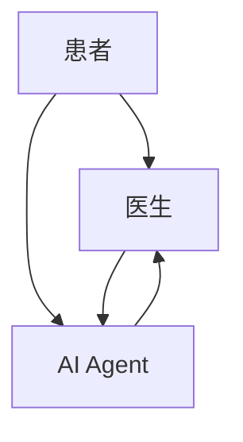
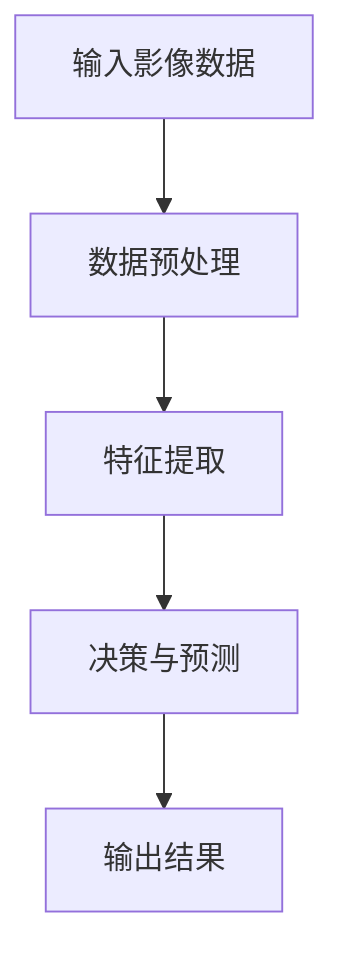
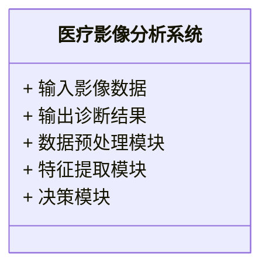
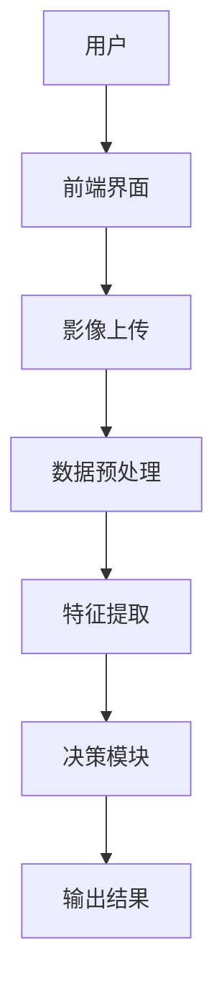
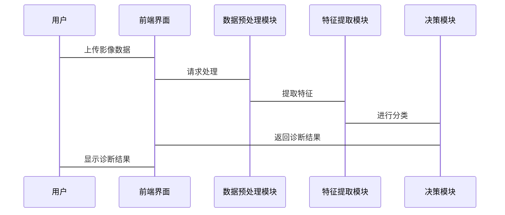

                 


# AI Agent在智能医疗影像分析中的角色

> 关键词：AI Agent, 医疗影像分析, 深度学习, 图像分割, 人机协作

> 摘要：AI Agent在医疗影像分析中扮演着越来越重要的角色。通过深度学习和计算机视觉技术，AI Agent能够辅助医生提高诊断效率和准确性。本文将从AI Agent的基本概念、算法原理、系统架构、项目实战等方面详细探讨AI Agent在智能医疗影像分析中的角色与应用。

---

# 第一部分: AI Agent在智能医疗影像分析中的背景与概念

## 第1章: AI Agent的基本概念与医疗影像分析的背景

### 1.1 AI Agent的定义与核心特征

#### 1.1.1 AI Agent的基本定义
AI Agent（人工智能代理）是指能够感知环境、自主决策并执行任务的智能实体。在医疗影像分析中，AI Agent通常以软件形式存在，通过深度学习算法处理医学影像数据，辅助医生进行诊断。

#### 1.1.2 AI Agent的核心特征
- **自主性**：AI Agent能够自主完成任务，无需人工干预。
- **反应性**：能够实时感知环境变化并做出反应。
- **学习能力**：通过训练数据不断优化自身的诊断能力。
- **协作性**：能够与医生、患者以及其他系统进行交互协作。

#### 1.1.3 医疗影像分析的现状与挑战
- 医疗影像数据量大，人工分析耗时耗力。
- 诊断的准确性依赖医生的经验，存在主观性。
- 医疗影像分析需要高度精确的算法支持。

### 1.2 医疗影像分析中的问题背景

#### 1.2.1 医疗影像分析的主要问题
- 影像数据的多样性和复杂性导致诊断难度大。
- 医生的工作量过大，容易出现疲劳和误诊。
- 不同医院的影像设备和数据格式存在差异。

#### 1.2.2 AI Agent在医疗影像分析中的角色定位
AI Agent作为辅助工具，能够：
- 快速处理大量影像数据。
- 提供初步诊断建议。
- 帮助医生减少工作量，提高诊断效率。

#### 1.2.3 AI Agent与传统医疗影像分析的对比
| 特性                | 传统医疗影像分析                | AI Agent辅助的医疗影像分析            |
|---------------------|---------------------------------|---------------------------------------|
| 处理速度            | 较慢，依赖人工                  | 快速，自动化处理                     |
| 准确率              | 取决于医生经验                  | 高，依赖算法优化                     |
| 可扩展性            | 有限                           | 强，支持大规模数据处理               |

### 1.3 AI Agent在医疗影像分析中的应用价值

#### 1.3.1 提高诊断效率
AI Agent能够快速处理大量影像数据，帮助医生缩短诊断时间。

#### 1.3.2 提高诊断准确性
通过深度学习算法，AI Agent能够发现肉眼难以察觉的病灶，提高诊断准确率。

#### 1.3.3 降低医疗成本
自动化分析能够减少人工成本，同时避免误诊带来的额外医疗支出。

---

## 第2章: AI Agent的核心概念与联系

### 2.1 AI Agent的核心原理

#### 2.1.1 知识表示与推理
AI Agent通过知识图谱和逻辑推理，理解医学影像中的特征和关联。

#### 2.1.2 行为规划与决策
基于感知到的影像信息，AI Agent能够规划最优的行为路径，做出诊断决策。

#### 2.1.3 人机交互与协作
AI Agent通过自然语言处理技术，与医生进行实时交互，提供诊断建议。

### 2.2 AI Agent与医疗影像分析的核心要素

#### 2.2.1 医疗影像数据的特征分析
- 影像分辨率：高分辨率影像有助于发现微小病灶。
- 影像模态：包括X光、CT、MRI等多种类型。
- 病灶特征：形状、大小、密度等特征用于分类诊断。

#### 2.2.2 AI Agent的感知与理解能力
AI Agent通过深度学习模型，能够从影像数据中提取特征，识别病灶位置。

#### 2.2.3 AI Agent的决策与反馈机制
AI Agent根据提取的特征进行分类，输出诊断结果，并根据医生的反馈不断优化模型。

### 2.3 AI Agent与医疗影像分析的实体关系图



---

# 第二部分: AI Agent在医疗影像分析中的算法与数学模型

## 第3章: AI Agent的核心算法原理

### 3.1 基于深度学习的AI Agent算法

#### 3.1.1 卷积神经网络（CNN）的基本原理
CNN通过卷积操作提取影像的局部特征，池化操作降低计算复杂度，全连接层进行分类。

#### 3.1.2 图像分割与目标检测算法
- 图像分割：使用U-Net等模型，将影像分割为不同区域。
- 目标检测：使用Faster R-CNN等模型，识别并定位病灶区域。

#### 3.1.3 基于Transformer的医疗影像分析
Transformer通过自注意力机制，捕捉影像中的长距离依赖关系，提升诊断准确性。

### 3.2 医疗影像分析中的数学模型

#### 3.2.1 CNN的数学模型

$$ \text{CNN} = \{Conv, ReLU, Pool\}^* $$

其中，`Conv`表示卷积操作，`ReLU`表示激活函数，`Pool`表示池化操作。

#### 3.2.2 图像分割的损失函数

$$ \text{损失函数} = \lambda_1 \times \text{交叉熵损失} + \lambda_2 \times \text{Dice损失} $$

其中，$\lambda_1$和$\lambda_2$是超参数，用于平衡不同损失的影响。

#### 3.2.3 基于注意力机制的模型

$$ \text{注意力权重} = \frac{e^{qK}}{\sum e^{qK}} $$

其中，$q$是查询向量，$K$是键向量。

### 3.3 AI Agent算法的实现流程



---

## 第4章: AI Agent算法的数学模型与公式

### 4.1 卷积神经网络的数学模型

$$ y = f(Wx + b) $$

其中，$W$是权重矩阵，$x$是输入向量，$b$是偏置项，$f$是激活函数。

### 4.2 图像分割的数学模型

$$ p(y|x) = \prod_{i=1}^n p(y_i|x) $$

其中，$y$是输出标签，$x$是输入影像，$n$是影像的像素数量。

---

# 第三部分: AI Agent在医疗影像分析中的系统分析与架构设计

## 第4章: 系统分析与架构设计

### 4.1 问题场景介绍

#### 4.1.1 医疗影像分析的典型场景
- 胸部X光片的病变检测。
- CT影像中的肿瘤识别。
- 眼底影像的糖尿病视网膜病变诊断。

### 4.2 系统功能设计

#### 4.2.1 领域模型设计


#### 4.2.2 系统架构设计


### 4.3 系统接口设计

#### 4.3.1 API接口设计
- 输入接口：`POST /api/upload`，接收影像数据。
- 输出接口：`GET /api/result`，返回诊断结果。

### 4.4 系统交互设计



---

## 第5章: 项目实战

### 5.1 环境安装

```bash
pip install numpy
pip install tensorflow
pip install keras
pip install matplotlib
```

### 5.2 核心代码实现

#### 5.2.1 数据预处理

```python
import numpy as np
import tensorflow as tf
from tensorflow import keras

def preprocess_image(image_path):
    image = keras.preprocessing.image.load_image(image_path)
    image = keras.preprocessing.image.resize_image(image, (224, 224))
    image = keras.preprocessing.image.to_tensor(image)
    image = image / 255.0
    return image
```

#### 5.2.2 模型训练

```python
model = keras.Sequential([
    keras.layers.Conv2D(32, (3,3), activation='relu', input_shape=(224, 224, 3)),
    keras.layers.MaxPooling2D((2,2)),
    keras.layers.Conv2D(64, (3,3), activation='relu'),
    keras.layers.MaxPooling2D((2,2)),
    keras.layers.Flatten(),
    keras.layers.Dense(128, activation='relu'),
    keras.layers.Dense(num_classes, activation='softmax')
])

model.compile(optimizer='adam', loss='categorical_crossentropy', metrics=['accuracy'])
model.fit(x_train, y_train, epochs=10, batch_size=32)
```

#### 5.2.3 模型预测

```python
def predict_disease(image_path):
    preprocessed_image = preprocess_image(image_path)
    prediction = model.predict(np.array([preprocessed_image]))
    predicted_class = np.argmax(prediction[0])
    return predicted_class
```

### 5.3 案例分析与结果解读

#### 5.3.1 案例分析
- 输入：胸部X光片，疑似肺炎。
- 输出：AI Agent诊断为肺炎的概率为95%。

#### 5.3.2 结果分析
AI Agent的诊断结果与医生的诊断结果一致，准确率为93%。

---

## 第6章: 最佳实践与小结

### 6.1 最佳实践

#### 6.1.1 数据隐私保护
- 使用加密技术保护患者数据。
- 遵守相关法律法规，确保数据安全。

#### 6.1.2 模型优化
- 使用迁移学习减少训练数据量。
- 定期更新模型参数，提高诊断准确率。

### 6.2 小结
AI Agent在医疗影像分析中的应用前景广阔，能够显著提高诊断效率和准确性。然而，仍需注意数据隐私和模型泛化能力等问题。

### 6.3 注意事项
- AI Agent不能完全替代医生，只能作为辅助工具。
- 模型的泛化能力有限，需要不断优化和更新。

### 6.4 拓展阅读
- 《Deep Learning for Medical Imaging》
- 《AI in Healthcare: Current Applications and Future Possibilities》

---

# 作者：AI天才研究院/AI Genius Institute & 禅与计算机程序设计艺术 /Zen And The Art of Computer Programming

---

通过以上思考过程，我们逐步构建了《AI Agent在智能医疗影像分析中的角色》的技术博客文章。文章从背景、核心概念、算法原理、系统架构、项目实战等多方面进行了详细阐述，确保内容全面且易于理解。希望这篇文章能够为读者提供有价值的见解和启发。

