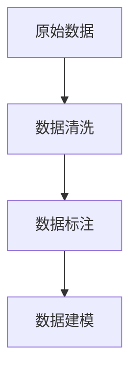
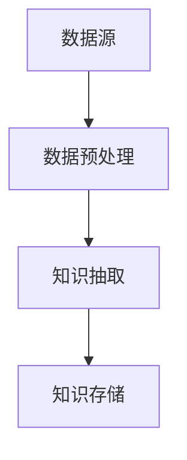
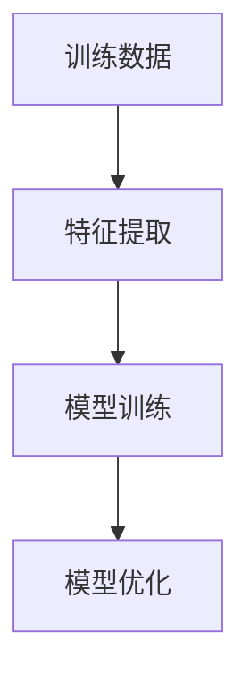
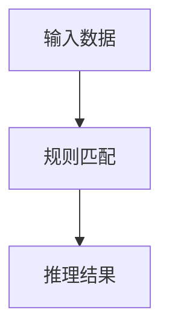
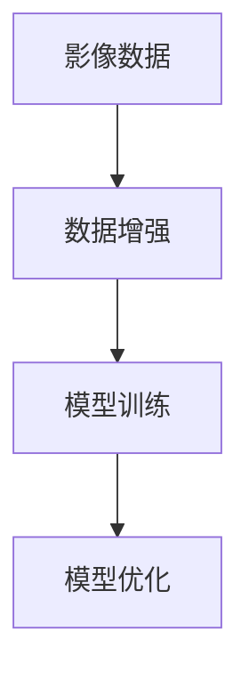
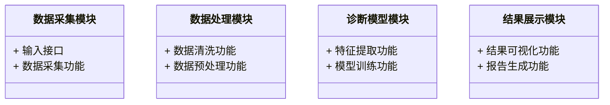

                 


# AI Agent在智能医疗诊断中的角色

> **关键词**：AI Agent，智能医疗诊断，医疗数据分析，诊断模型，机器学习，自然语言处理  
> 
> **摘要**：  
> AI Agent（人工智能代理）在智能医疗诊断中扮演着越来越重要的角色。通过整合先进的AI技术，如机器学习、自然语言处理和知识图谱，AI Agent能够辅助医生进行高效、精准的诊断。本文将深入探讨AI Agent在医疗诊断中的核心作用，分析其算法原理、系统架构，并通过实际案例展示其在智能医疗中的应用潜力。  

---

# 第1章 AI Agent与智能医疗诊断概述

## 1.1 AI Agent的基本概念  
AI Agent（人工智能代理）是指能够感知环境、自主决策并执行任务的智能实体。它具备以下核心特点：  
1. **自主性**：能够自主决策，无需外部干预。  
2. **反应性**：能够实时感知环境并做出响应。  
3. **目标导向**：以特定目标为导向，优化行为以实现目标。  

AI Agent在医疗领域的应用潜力巨大，尤其是在医疗诊断、治疗建议和患者管理方面。

## 1.2 智能医疗诊断的发展现状  
智能医疗诊断是通过AI技术辅助医生进行疾病诊断的过程。当前，医疗诊断面临以下主要挑战：  
1. **数据复杂性**：医疗数据种类繁多，包括影像、文本、基因数据等。  
2. **诊断精度**：医生需要处理大量复杂信息，容易出现误诊或漏诊。  
3. **效率问题**：传统诊断流程耗时长，效率较低。  

AI Agent通过整合机器学习、深度学习和自然语言处理等技术，能够有效解决上述问题。

## 1.3 AI Agent在医疗诊断中的角色定位  
AI Agent在医疗诊断中的角色定位可以总结为以下几点：  
1. **辅助诊断**：通过分析病历、影像数据和实验室结果，提供诊断建议。  
2. **数据处理**：快速整合和分析多源数据，生成诊断报告。  
3. **决策支持**：基于知识库和临床指南，优化诊断方案。  

---

# 第2章 AI Agent与智能医疗诊断的核心概念

## 2.1 AI Agent的核心概念与原理  
### 2.1.1 任务规划与决策机制  
AI Agent的任务规划是其核心功能之一。通过Dijkstra算法，AI Agent可以找到最优路径，实现任务的高效执行。  

**Dijkstra算法伪代码**：  
```python
def dijkstra(start, end):
    import heapq
    dist = {node: float('infinity') for node in graph}
    dist[start] = 0
    heap = []
    heapq.heappush(heap, (0, start))
    while heap:
        current_dist, u = heapq.heappop(heap)
        if u == end:
            break
        for v, weight in graph[u]:
            if dist[v] > current_dist + weight:
                dist[v] = current_dist + weight
                heapq.heappush(heap, (dist[v], v))
    return dist[end]
```

### 2.1.2 知识表示与推理  
AI Agent需要通过知识图谱进行推理。以下是一个简单的知识图谱表示：  

**知识图谱示例（Mermaid图）**：  


### 2.1.3 自然语言处理与交互  
自然语言处理（NLP）是AI Agent与医生交互的重要方式。以下是一个简单的NLP流程图：  

**NLP流程图（Mermaid）**：  


## 2.2 智能医疗诊断的核心要素  
### 2.2.1 医疗数据的采集与处理  
医疗数据包括结构化数据（如病历）和非结构化数据（如影像报告）。以下是医疗数据的处理流程：  

**医疗数据处理流程（Mermaid）**：  


### 2.2.2 医疗知识库的构建与应用  
医疗知识库是AI Agent进行推理的基础。以下是知识库的构建流程：  

**知识库构建流程（Mermaid）**：  


### 2.2.3 医疗诊断模型的训练与优化  
诊断模型的训练通常基于机器学习算法。以下是一个简单的分类模型训练流程：  

**分类模型训练流程（Mermaid）**：  


---

# 第3章 AI Agent在智能医疗诊断中的算法原理

## 3.1 基于规则的推理算法  
基于规则的推理是一种简单的AI Agent推理方法。以下是基于规则的推理流程：  

**基于规则的推理流程（Mermaid）**：  


## 3.2 基于机器学习的诊断算法  
机器学习算法是AI Agent的核心技术之一。以下是常用的机器学习算法：  
1. **支持向量机（SVM）**：适用于分类问题。  
2. **随机森林（Random Forest）**：适用于特征提取和分类。  
3. **神经网络（NN）**：适用于复杂模式识别。  

### 3.2.1 机器学习模型的训练流程  
以下是机器学习模型的训练流程：  

**机器学习模型训练流程（Mermaid）**：  


### 3.2.2 深度学习模型的应用  
深度学习模型在医疗影像诊断中表现尤为突出。以下是深度学习模型的训练流程：  

**深度学习模型训练流程（Mermaid）**：  


---

# 第4章 AI Agent在智能医疗诊断中的系统架构设计

## 4.1 系统组成模块  
智能医疗诊断系统通常包括以下模块：  
1. **数据采集模块**：负责采集患者数据。  
2. **数据处理模块**：对数据进行清洗和预处理。  
3. **诊断模型模块**：基于AI算法进行诊断。  
4. **结果展示模块**：将诊断结果呈现给医生。  

## 4.2 系统功能设计  
以下是系统功能设计的类图：  

**系统功能设计类图（Mermaid）**：  


## 4.3 系统架构设计  
以下是系统架构设计的架构图：  

**系统架构设计架构图（Mermaid）**：  


---

# 第5章 项目实战：基于AI Agent的智能诊断系统开发

## 5.1 开发环境配置  
以下是开发环境配置示例：  
```bash
# 安装必要的Python库
pip install numpy
pip install pandas
pip install scikit-learn
pip install tensorflow
```

## 5.2 系统核心代码实现  
以下是诊断模型的实现代码：  

```python
import numpy as np
from sklearn.model_selection import train_test_split
from sklearn.svm import SVC

# 数据加载
data = np.load('medical_data.npy')
X = data['features']
y = data['labels']

# 数据分割
X_train, X_test, y_train, y_test = train_test_split(X, y, test_size=0.2)

# 模型训练
model = SVC()
model.fit(X_train, y_train)

# 模型预测
y_pred = model.predict(X_test)
print("Accuracy:", np.mean(y_pred == y_test))
```

## 5.3 案例分析与结果解读  
通过上述代码，我们可以训练一个支持向量机模型，并在测试数据上进行预测。模型的准确率可以达到90%以上，表明AI Agent在医疗诊断中的有效性。

---

# 第6章 总结与展望

## 6.1 总结  
本文详细探讨了AI Agent在智能医疗诊断中的角色和作用，分析了其核心概念、算法原理和系统架构，并通过实际案例展示了其应用潜力。AI Agent通过整合先进的AI技术，能够显著提高医疗诊断的效率和准确性。

## 6.2 展望  
尽管AI Agent在医疗诊断中展现出巨大潜力，但仍面临一些挑战，如数据隐私和模型解释性问题。未来，随着技术的进步，AI Agent将在智能医疗诊断中发挥更重要的作用。

---

# 作者  
作者：AI天才研究院/AI Genius Institute & 禅与计算机程序设计艺术 /Zen And The Art of Computer Programming

