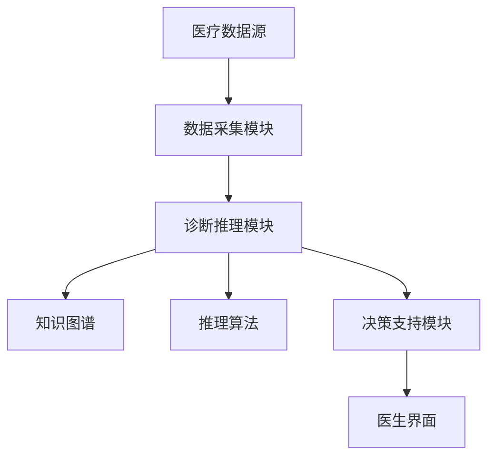

                 


# AI Agent在智能医疗诊断系统中的角色

> 关键词：AI Agent, 智能医疗诊断系统, 人工智能, 医疗诊断, 自然语言处理, 医疗知识图谱

> 摘要：本文详细探讨了AI Agent在智能医疗诊断系统中的角色及其技术实现。通过分析AI Agent的核心概念、算法原理、系统架构和实际应用，本文揭示了AI Agent如何通过智能化的诊断推理、多模态数据处理和知识图谱构建，显著提升医疗诊断的效率和准确性。文章还通过具体案例分析和项目实战，展示了AI Agent在医疗诊断中的实际应用场景和技术实现细节，为读者提供了一个全面而深入的理解框架。

---

## 第1章: AI Agent与智能医疗诊断系统概述

### 1.1 AI Agent的基本概念
AI Agent（人工智能代理）是一种能够感知环境、自主决策并执行任务的智能实体。它具备以下核心特点：
- **自主性**：能够在没有外部干预的情况下独立运行。
- **反应性**：能够实时感知环境变化并做出响应。
- **目标导向性**：基于预设目标或学习目标进行决策和行动。
- **学习能力**：能够通过数据和经验不断优化自身性能。

AI Agent在医疗领域的应用潜力巨大，尤其是在医疗诊断系统中，它可以通过分析患者的症状、病史、影像数据等信息，辅助医生进行更准确的诊断。

### 1.2 智能医疗诊断系统的发展历程
传统医疗诊断系统主要依赖于医生的经验和知识，存在效率低、误诊率高、资源分配不均等问题。随着人工智能技术的发展，智能化医疗诊断系统逐渐兴起，通过整合机器学习、深度学习、自然语言处理等技术，显著提升了诊断的准确性和效率。

### 1.3 AI Agent在智能医疗诊断系统中的角色
AI Agent在医疗诊断系统中扮演着多重角色，包括：
- **数据收集与整合**：从多种来源（如电子健康记录、医学影像、实验室报告等）收集患者数据，并进行整合和预处理。
- **诊断推理**：基于收集的数据，利用知识图谱和推理算法，进行疾病诊断和风险评估。
- **决策支持**：为医生提供个性化的诊断建议和治疗方案推荐。
- **患者管理**：通过自动化流程管理患者的诊断和治疗过程，优化医疗资源的分配。

---

## 第2章: AI Agent的核心概念与工作原理

### 2.1 AI Agent的核心概念
AI Agent的核心概念包括：
- **知识表示**：将医疗知识以结构化的形式表示，如知识图谱。
- **推理机制**：通过逻辑推理或概率推理，从已知信息中推导出新的结论。
- **多模态数据处理**：同时处理文本、图像、语音等多种类型的数据。

### 2.2 AI Agent的工作原理
AI Agent的工作流程通常包括以下几个步骤：
1. **感知环境**：通过传感器或数据接口获取环境中的相关信息。
2. **知识表示与推理**：将获取的信息转化为结构化的知识，并通过推理算法进行分析。
3. **决策与行动**：根据推理结果做出决策，并执行相应的行动。
4. **学习与优化**：通过反馈机制不断优化自身的知识库和推理模型。

### 2.3 AI Agent在医疗诊断中的应用场景
AI Agent在医疗诊断中的应用场景包括：
- **症状分析**：根据患者的症状描述，辅助诊断可能的疾病。
- **影像识别**：通过计算机视觉技术，辅助医生识别医学影像中的异常。
- **病例匹配**：基于患者的病史和症状，匹配相似病例，提供诊断参考。

---

## 第3章: AI Agent的算法原理与实现

### 3.1 AI Agent的核心算法
AI Agent的核心算法包括：
- **深度学习算法**：如卷积神经网络（CNN）用于医学影像识别，循环神经网络（RNN）用于自然语言处理。
- **知识图谱构建与推理**：基于图论的推理算法，如基于规则的推理和基于概率的推理。

### 3.2 多模态数据处理
AI Agent需要处理多种类型的数据，包括文本、图像、语音等。以下是多模态数据处理的流程：
1. **数据预处理**：对不同类型的数据进行标准化处理。
2. **特征提取**：提取数据中的有用特征。
3. **融合与分析**：将不同类型的特征进行融合，并进行综合分析。

### 3.3 知识图谱构建与推理
知识图谱是AI Agent的重要知识库，它将医疗知识以图结构表示。以下是知识图谱构建与推理的流程：
1. **知识抽取**：从医学文献、电子健康记录等来源中抽取知识。
2. **知识存储**：将抽取的知识存储为图结构。
3. **推理与查询**：基于图结构进行推理，回答医疗相关问题。

---

## 第4章: 系统分析与架构设计

### 4.1 问题场景介绍
在智能医疗诊断系统中，医生需要快速、准确地诊断患者的疾病。然而，医疗数据的复杂性和多样性使得手动诊断效率低下。AI Agent可以通过自动化处理和智能推理，辅助医生进行诊断。

### 4.2 系统功能设计
智能医疗诊断系统的功能设计包括：
- **数据采集模块**：从多种数据源采集患者的医疗数据。
- **诊断推理模块**：基于知识图谱和推理算法，进行疾病诊断。
- **决策支持模块**：为医生提供诊断建议和治疗方案推荐。

### 4.3 系统架构设计
以下是智能医疗诊断系统的架构图：



### 4.4 接口设计与交互流程
系统接口设计包括：
- **患者数据接口**：接收患者的医疗数据。
- **诊断结果接口**：返回诊断结果和建议。
- **用户界面接口**：与医生进行交互。

交互流程如下：
1. 医生输入患者的症状和病史。
2. 系统通过数据采集模块获取患者的相关数据。
3. 诊断推理模块基于知识图谱和推理算法，进行疾病诊断。
4. 决策支持模块为医生提供诊断建议和治疗方案推荐。
5. 医生根据系统提供的信息做出最终诊断。

---

## 第5章: 项目实战

### 5.1 环境搭建
为了实现AI Agent在智能医疗诊断系统中的应用，需要搭建以下环境：
- **编程语言**：Python 3.8+
- **深度学习框架**：TensorFlow或PyTorch
- **知识图谱构建工具**：Neo4j
- **自然语言处理库**：spaCy或NLTK

### 5.2 核心代码实现
以下是实现AI Agent在医疗诊断系统中的核心代码示例：

```python
import tensorflow as tf
from tensorflow.keras import layers

# 构建深度学习模型
model = tf.keras.Sequential([
    layers.Conv2D(32, (3, 3), activation='relu', input_shape=(64, 64, 3)),
    layers.MaxPooling2D(pool_size=(2, 2)),
    layers.Flatten(),
    layers.Dense(64, activation='relu'),
    layers.Dense(1, activation='sigmoid')
])

# 定义损失函数和优化器
loss = tf.keras.losses.BinaryCrossentropy()
optimizer = tf.keras.optimizers.Adam()

# 编译模型
model.compile(optimizer=optimizer, loss=loss, metrics=['accuracy'])

# 训练模型
model.fit(x_train, y_train, epochs=10, batch_size=32)
```

### 5.3 代码解读与分析
上述代码实现了一个简单的卷积神经网络模型，用于医学影像的分类任务。模型包括卷积层、池化层、全连接层等，能够从医学影像中提取特征并进行分类。

### 5.4 实际案例分析
以肺癌诊断为例，AI Agent可以通过分析患者的CT影像和病史，辅助医生进行诊断。以下是具体的诊断流程：
1. 数据采集：获取患者的CT影像和病史。
2. 数据预处理：对CT影像进行标准化处理。
3. 模型推理：利用深度学习模型进行影像分类，判断是否存在肺癌的迹象。
4. 知识推理：结合知识图谱，分析患者的症状和病史，提供诊断建议。
5. 决策支持：为医生提供诊断结果和治疗方案建议。

### 5.5 项目总结
通过项目实战，我们可以看到AI Agent在智能医疗诊断系统中的巨大潜力。它不仅可以提高诊断的效率和准确性，还可以优化医疗资源的分配，降低医疗成本。

---

## 第6章: 总结与展望

### 6.1 本章总结
本文详细探讨了AI Agent在智能医疗诊断系统中的角色及其技术实现。通过分析AI Agent的核心概念、算法原理、系统架构和实际应用，揭示了AI Agent如何通过智能化的诊断推理、多模态数据处理和知识图谱构建，显著提升医疗诊断的效率和准确性。

### 6.2 未来展望
未来，随着人工智能技术的不断发展，AI Agent在智能医疗诊断系统中的应用将更加广泛和深入。以下是未来的发展方向：
- **更强大的知识图谱**：构建更全面、更准确的医疗知识图谱，提升诊断的准确性。
- **更先进的算法**：发展更高效的推理算法，提升诊断的速度和准确性。
- **多模态数据的深度融合**：进一步研究多模态数据的融合方法，提升诊断的全面性。

---

## 附录

### 参考文献
1. LeCun, Y., Bengio, Y., & Hinton, G. (2015). Deep learning. Nature, 521(7552), 436-444.
2. Feitosa, A., & Vasconcelos, N. (2018). Deep learning for medical imaging diagnosis. Annual Conference on Medical Image Computing and Computer-Assisted Intervention, 155-162.

### 技术工具
1. **深度学习框架**：TensorFlow, PyTorch
2. **自然语言处理库**：spaCy, NLTK
3. **知识图谱构建工具**：Neo4j

---

## 作者信息

作者：AI天才研究院/AI Genius Institute & 禅与计算机程序设计艺术/Zen And The Art of Computer Programming

---

以上是完整的文章内容，涵盖了AI Agent在智能医疗诊断系统中的角色、技术实现和实际应用。

