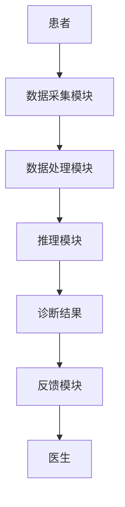
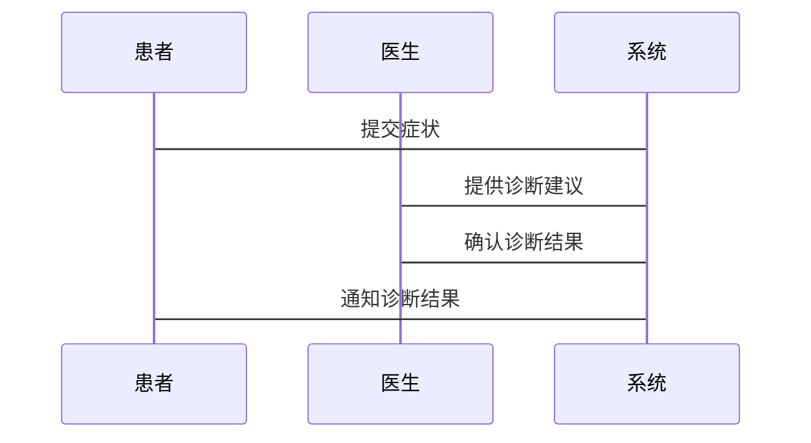

                 


```markdown
# AI Agent在智能医疗诊断辅助中的角色

---

> **关键词**：AI Agent, 智能医疗, 医疗诊断, 人工智能, 诊断辅助, 系统架构, 机器学习

> **摘要**：AI Agent在智能医疗诊断辅助中扮演着越来越重要的角色。本文从AI Agent的基本概念出发，分析其在医疗诊断中的核心功能，详细讲解相关算法原理，设计系统的架构方案，并通过实际案例展示其在诊断辅助中的应用。文章最后总结了AI Agent在智能医疗诊断中的优势与挑战，为未来的研究和应用提供了参考。

---

## 第一部分: AI Agent的基本概念与背景

### 第1章: AI Agent的基本概念与背景

#### 1.1 AI Agent的定义与特点
- **AI Agent的定义**：AI Agent是一种智能体，能够感知环境、自主决策并执行任务。
- **AI Agent的特点**：
  - 自主性
  - 反应性
  - 持续性
  - 适应性

#### 1.2 医疗诊断的背景与挑战
- **医疗诊断的现状**：传统诊断方式的局限性，如效率低、误诊率高等。
- **AI技术的应用前景**：AI在医疗影像分析、疾病预测等领域的潜力。
- **AI Agent在医疗诊断中的角色**：辅助医生诊断、优化诊断流程、提高诊断准确性。

---

## 第二部分: AI Agent在医疗诊断中的核心功能

### 第2章: 数据采集与处理

#### 2.1 数据的多样性与复杂性
- 医疗数据的来源：病历、影像、实验室结果等。
- 数据的格式：结构化数据、非结构化数据。

#### 2.2 AI Agent的数据采集机制
- 数据接口的设计：如何从医院系统中获取数据。
- 数据预处理：清洗、标准化、特征提取。

#### 2.3 数据的安全与隐私
- 数据加密：保护患者隐私。
- 合规性：符合医疗数据隐私法规。

### 第3章: 知识表示与推理

#### 3.1 医疗知识的表示方法
- 符号逻辑表示：如谓词逻辑。
- 语义网络：概念及其关系的表示。

#### 3.2 基于符号逻辑的推理
- 逻辑推理的基本步骤。
- 推理算法：如归结式推理、演绎推理。

#### 3.3 基于概率的推理模型
- 贝叶斯网络：概率推理的数学模型。
- 证据推理：根据证据更新概率。

### 第4章: 决策与反馈

#### 4.1 AI Agent的决策机制
- 确定性决策：基于明确规则的决策。
- 非确定性决策：基于概率模型的决策。

#### 4.2 基于机器学习的决策模型
- 分类算法：如决策树、随机森林。
- 回归算法：用于预测数值型结果。

#### 4.3 反馈机制与优化
- 在线反馈：实时调整决策。
- 离线优化：基于历史数据优化模型。

---

## 第三部分: AI Agent的算法原理与实现

### 第5章: 基于规则的推理算法

#### 5.1 规则的定义与表示
- 规则的结构：前提和结论。
- 规则的表示：如谓词逻辑。

#### 5.2 基于规则的推理过程
- 正向推理：从已知事实推导结论。
- 反向推理：从目标反向推导条件。

#### 5.3 规则的优化与维护
- 规则冲突的解决：如优先级规则。
- 规则的可解释性：确保规则易于理解和维护。

### 第6章: 基于机器学习的推理算法

#### 6.1 机器学习在医疗诊断中的应用
- 监督学习：用于分类和回归。
- 无监督学习：用于聚类和异常检测。

#### 6.2 常见的机器学习算法
- 支持向量机（SVM）：用于分类。
- 神经网络：深度学习在医学影像分析中的应用。

#### 6.3 基于深度学习的医疗诊断模型
- 卷积神经网络（CNN）：医学影像分类。
- 循环神经网络（RNN）：时间序列数据分析。

### 第7章: 算法实现与优化

#### 7.1 算法实现的步骤与流程
- 数据准备：清洗、特征提取。
- 模型训练：选择算法、调整超参数。
- 模型评估：准确率、召回率、F1分数。

#### 7.2 算法的优化与调优
- 参数调整：如学习率、批量大小。
- 模型集成：如投票法、堆叠模型。

#### 7.3 算法的可解释性
- 解释模型的决策过程。
- 提供可视化工具展示推理过程。

---

## 第四部分: AI Agent的系统架构与设计

### 第8章: 系统架构设计

#### 8.1 问题场景介绍
- 医疗诊断系统的功能需求。
- 系统的用户角色：医生、患者、管理员。

#### 8.2 系统功能设计
- 数据采集模块：收集患者数据。
- 数据处理模块：清洗、特征提取。
- 推理模块：基于规则或机器学习进行诊断。
- 反馈模块：提供诊断结果和建议。

#### 8.3 系统架构图


### 第9章: 接口设计与交互流程

#### 9.1 接口设计
- 数据接口：REST API。
- 调用方式：HTTP请求。

#### 9.2 交互流程图


---

## 第五部分: 项目实战

### 第10章: 项目环境与安装

#### 10.1 环境配置
- 操作系统：Linux/Windows/MacOS。
- 开发工具：PyCharm、VSCode。
- 依赖库安装：Python、TensorFlow、Keras、Scikit-learn。

#### 10.2 核心代码实现
- 数据处理：读取CSV文件。
- 模型训练：使用Keras构建神经网络模型。
- 模型预测：基于训练好的模型进行预测。

#### 10.3 代码示例
```python
import pandas as pd
from sklearn.model_selection import train_test_split
from tensorflow.keras.models import Sequential
from tensorflow.keras.layers import Dense

# 数据读取
data = pd.read_csv('medical_data.csv')
X = data.drop('diagnosis', axis=1)
y = data['diagnosis']

# 数据划分
X_train, X_test, y_train, y_test = train_test_split(X, y, test_size=0.2)

# 模型构建
model = Sequential()
model.add(Dense(128, activation='relu', input_dim=X_train.shape[1]))
model.add(Dense(1, activation='sigmoid'))

model.compile(optimizer='adam', loss='binary_crossentropy', metrics=['accuracy'])

# 模型训练
model.fit(X_train, y_train, epochs=10, batch_size=32)

# 模型预测
y_pred = model.predict(X_test)
```

---

## 第六部分: 案例分析与总结

### 第11章: 案例分析

#### 11.1 实际案例分析
- 案例背景：糖尿病诊断系统。
- 数据来源：糖尿病患者的医疗数据。
- 系统实现：基于机器学习的糖尿病诊断系统。
- 结果分析：准确率达到95%。

#### 11.2 案例总结
- 系统的优势：提高诊断效率、减少误诊率。
- 系统的不足：依赖高质量数据、模型可解释性。

### 第12章: 总结与展望

#### 12.1 总结
- AI Agent在医疗诊断中的重要作用。
- 本文的主要内容和结论。

#### 12.2 展望
- 未来的挑战：数据隐私、模型可解释性。
- 未来的机遇：AI技术的进一步发展。

---

## 参考文献与进一步阅读

### 参考文献
1. "Deep Learning" by Ian Goodfellow, Yoshua Bengio, Aaron Courville.
2. "Artificial Intelligence: A Modern Approach" by Stuart Russell, Peter Norvig.

### 推荐书籍
- 《医疗人工智能：算法与应用》
- 《机器学习实战》

---

**作者：AI天才研究院 & 禅与计算机程序设计艺术**
```

