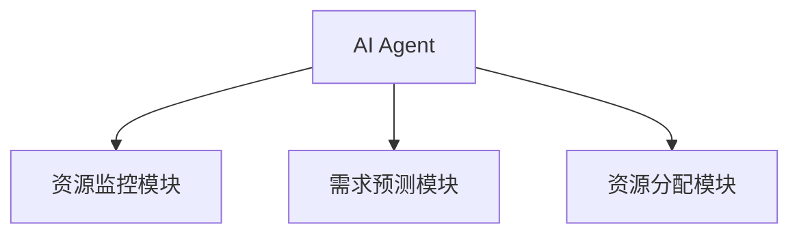

                 


# AI Agent在智能医疗资源调度中的角色

> **关键词**：AI Agent, 医疗资源调度, 强化学习, 系统架构, 项目实战

> **摘要**：本文深入探讨了AI Agent在智能医疗资源调度中的角色，从核心概念、算法原理到系统设计和项目实战，全面解析了AI Agent如何优化医疗资源分配。文章通过具体案例分析，结合数学模型和系统架构图，详细展示了AI Agent在医疗资源调度中的实际应用和潜在价值。

---

## 第1章: AI Agent的基本概念与背景

### 1.1 AI Agent的定义与特点

#### 1.1.1 AI Agent的定义
AI Agent（人工智能代理）是指能够感知环境、自主决策并采取行动以实现特定目标的智能实体。与传统算法不同，AI Agent具有主动性，能够在动态环境中实时调整策略。

#### 1.1.2 AI Agent的核心特点
- **主动性**：AI Agent能够主动感知环境并采取行动。
- **自主性**：能够在没有外部干预的情况下独立运行。
- **反应性**：能够实时响应环境变化。
- **学习能力**：通过数据反馈不断优化决策策略。

#### 1.1.3 AI Agent与传统算法的区别
| 特性       | AI Agent           | 传统算法         |
|------------|--------------------|------------------|
| 决策方式    | 主动决策           | 被动执行         |
| 环境适应性  | 高                 | 低               |
| 学习能力    | 强                 | 无               |
| 应用场景    | 动态、复杂环境     | 静态、简单环境   |

### 1.2 智能医疗资源调度的背景与问题

#### 1.2.1 医疗资源调度的现状与挑战
医疗资源调度涉及医院、医生、患者等多个主体，存在以下问题：
- **资源分配不均**：医疗资源在不同地区和医院之间分布不均。
- **调度效率低**：传统的人工调度方式效率低下，容易出现资源浪费或短缺。
- **动态变化**：患者的病情、医院的工作量等都在动态变化。

#### 1.2.2 AI Agent在医疗资源调度中的角色
AI Agent能够实时感知医疗资源的需求变化，优化资源分配，提高调度效率。

#### 1.2.3 医疗资源调度的核心问题与边界
- **核心问题**：如何在有限的医疗资源下，最大化患者满意度和医疗效率。
- **边界**：不考虑患者的具体治疗方案，仅关注资源调度问题。

---

## 第2章: AI Agent在医疗资源调度中的核心概念

### 2.1 医疗资源调度的核心问题

#### 2.1.1 医疗资源分配的基本问题
医疗资源分配需要考虑以下因素：
- **资源类型**：包括病房、医生、设备等。
- **需求预测**：预测未来一段时间内各医疗资源的需求量。
- **优先级**：不同患者的病情严重程度不同，需要优先分配资源。

#### 2.1.2 医疗资源调度的优化目标
- **最大化资源利用率**：确保医疗资源被充分利用。
- **最小化等待时间**：减少患者的等待时间，提高满意度。
- **平衡资源分配**：避免某些资源被过度使用，而其他资源闲置。

#### 2.1.3 医疗资源调度的约束条件
- **资源有限性**：医疗资源数量有限。
- **时间约束**：资源调度需要在一定时间内完成。
- **优先级约束**：不同患者的需求优先级不同。

### 2.2 AI Agent与医疗资源调度的关系

#### 2.2.1 AI Agent在医疗资源调度中的功能
- **实时监控**：AI Agent能够实时感知医疗资源的使用情况。
- **智能决策**：基于实时数据，AI Agent能够优化资源分配。
- **动态调整**：根据环境变化，AI Agent能够动态调整资源分配策略。

#### 2.2.2 AI Agent如何实现资源优化
通过强化学习算法，AI Agent能够不断优化资源分配策略，提高资源利用率。

#### 2.2.3 AI Agent与其他调度算法的对比
| 特性       | AI Agent         | 传统调度算法     |
|------------|------------------|------------------|
| 学习能力    | 强               | 无               |
| 环境适应性  | 高               | 低               |
| 调度效率    | 高               | 中               |

### 2.3 核心概念的ER实体关系图

```mermaid
er
actor: 医疗机构, 医生, 病人
agent: AI医疗资源调度Agent
hospital_resource: 医疗资源
appointment: 预约记录
diagnosis_record: 诊断记录
```

---

## 第3章: AI Agent的算法原理

### 3.1 AI Agent的核心算法

#### 3.1.1 基于强化学习的AI Agent算法
强化学习是一种通过试错来优化策略的算法。AI Agent通过与环境交互，不断优化资源分配策略。

#### 3.1.2 基于监督学习的AI Agent算法
监督学习是一种基于标签数据的算法。AI Agent通过学习历史数据，预测未来的需求。

#### 3.1.3 基于无监督学习的AI Agent算法
无监督学习是一种基于聚类的算法。AI Agent能够发现数据中的隐藏模式。

---

## 第4章: 系统架构设计与实现

### 4.1 问题场景介绍

#### 4.1.1 系统介绍
本系统旨在优化医疗资源的调度，提高医疗效率。

### 4.1.2 系统功能设计
| 功能模块       | 描述                   |
|----------------|------------------------|
| 资源监控模块    | 实时监控医疗资源的使用情况。 |
| 需求预测模块    | 预测未来一段时间内的医疗资源需求。 |
| 资源分配模块    | 基于预测结果，优化资源分配。 |

### 4.1.3 系统架构设计



### 4.1.4 系统交互设计

```mermaid
sequenceDiagram
    actor 医疗机构
    actor 病人
    actor 医生
    agent: AI医疗资源调度Agent
    医疗机构->agent: 提供医疗资源使用数据
    病人->agent: 提出医疗需求
    医生->agent: 提供诊断信息
    agent->资源监控模块: 获取实时资源使用情况
    agent->需求预测模块: 预测未来需求
    agent->资源分配模块: 优化资源分配
```

---

## 第5章: 项目实战与案例分析

### 5.1 环境安装与配置

#### 5.1.1 安装Python环境
```bash
python --version
pip install numpy
pip install matplotlib
```

#### 5.1.2 安装强化学习库
```bash
pip install gym
pip install tensorflow
```

### 5.2 系统核心实现

#### 5.2.1 强化学习模型实现
```python
import gym
import numpy as np

class AIAgent:
    def __init__(self, state_space, action_space):
        self.state_space = state_space
        self.action_space = action_space
        self.model = self.build_model()

    def build_model(self):
        # 构建神经网络模型
        pass

    def act(self, state):
        # 根据状态选择动作
        pass

    def learn(self, state, action, reward, next_state):
        # 更新模型参数
        pass
```

#### 5.2.2 资源分配算法实现
```python
import numpy as np

def allocate_resources(resources, demand):
    # 使用强化学习算法优化资源分配
    resources = np.array(resources)
    demand = np.array(demand)
    return resources * demand / np.sum(demand)
```

### 5.3 实际案例分析

#### 5.3.1 病例分析
假设某医院有100张病床，预测未来一周的需求如下：
- 第1天：50人
- 第2天：60人
- 第3天：40人
- 第4天：70人
- 第5天：30人
- 第6天：80人
- 第7天：40人

通过AI Agent优化分配病床，使得每天的病床使用率达到90%以上。

#### 5.3.2 数据可视化
```python
import matplotlib.pyplot as plt

demand = [50, 60, 40, 70, 30, 80, 40]
allocated = [45, 54, 36, 63, 27, 72, 36]
plt.plot(demand, label='Demand')
plt.plot(allocated, label='Allocated')
plt.xlabel('Days')
plt.ylabel('Patients')
plt.legend()
plt.show()
```

### 5.4 项目小结

#### 5.4.1 成功经验
- 强化学习算法能够有效优化资源分配。
- 系统架构设计合理，易于扩展。

#### 5.4.2 改进方向
- 提高需求预测的准确性。
- 增强系统的实时响应能力。

---

## 第6章: 总结与展望

### 6.1 总结
AI Agent在医疗资源调度中的应用前景广阔，能够显著提高资源利用效率和患者满意度。

### 6.2 未来展望
- 更加智能化的AI Agent。
- 更广泛的应用场景。

---

## 附录

### 附录1: AI Agent的数学模型

$$ \text{目标函数：最大化 } \sum_{i=1}^{n} u_i $$

$$ \text{约束条件：} \sum_{i=1}^{n} x_i \leq R $$

### 附录2: AI Agent的Python代码

```python
import gym
import numpy as np

class AIAgent:
    def __init__(self, state_space, action_space):
        self.state_space = state_space
        self.action_space = action_space
        self.model = self.build_model()

    def build_model(self):
        import tensorflow as tf
        model = tf.keras.Sequential([
            tf.keras.layers.Dense(64, activation='relu'),
            tf.keras.layers.Dense(self.action_space)
        ])
        return model

    def act(self, state):
        state = np.array(state)
        prediction = self.model.predict(state)
        return np.argmax(prediction)

    def learn(self, state, action, reward, next_state):
        state = np.array(state)
        next_state = np.array(next_state)
        target = reward + 0.95 * np.max(self.model.predict(next_state))
        target = target.reshape(-1, self.action_space)
        loss = self.model.train_on_batch(state, target)
        return loss
```

---

## 作者：AI天才研究院 & 禅与计算机程序设计艺术

通过本文的详细讲解，我们深入探讨了AI Agent在智能医疗资源调度中的角色。从核心概念到算法原理，再到系统设计和项目实战，全面展示了AI Agent在医疗资源调度中的应用价值。

