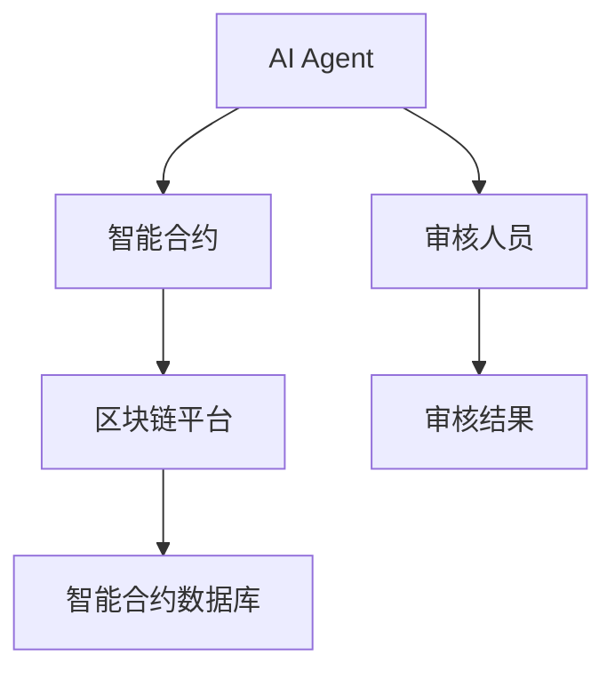
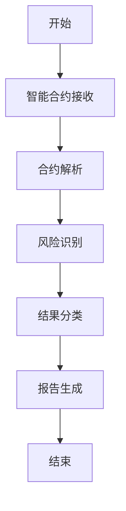
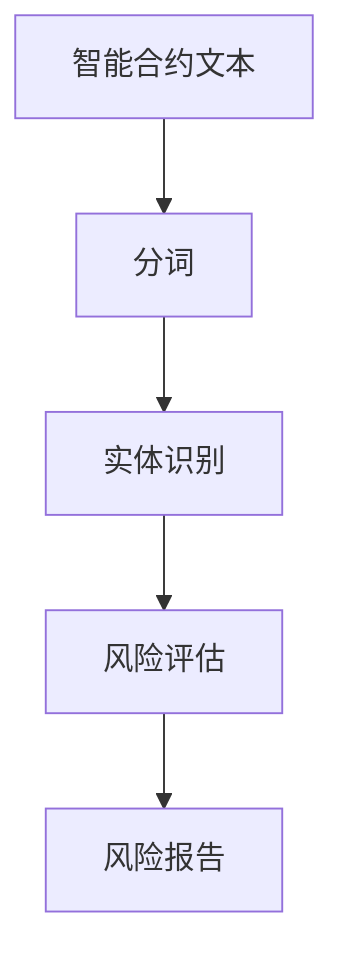
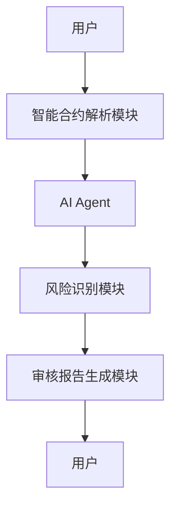
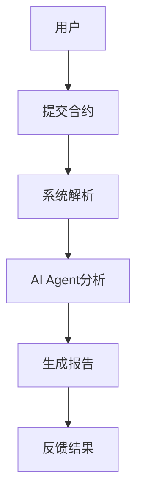

                 


```markdown
# AI Agent在智能合约审核中的应用

## 关键词
AI Agent, 智能合约, 合约审核, 区块链, 自然语言处理, 机器学习

## 摘要
本文详细探讨AI Agent在智能合约审核中的应用，涵盖核心概念、算法原理、系统设计及项目实战，旨在通过理论与实践结合，展示AI技术在智能合约审核中的创新应用与价值。

## 第一部分: AI Agent与智能合约审核的背景介绍

### 第1章: AI Agent与智能合约概述
#### 1.1 AI Agent的基本概念
##### 1.1.1 AI Agent的定义与特点
- 定义：AI Agent是能够感知环境并自主决策的智能体，具备主动性、响应性和学习能力。
- 特点：自主性、反应性、主动性、社会性、学习能力、适应性。
- 应用场景：智能助手、推荐系统、自动驾驶、智能合约审核。

##### 1.1.2 AI Agent的核心功能与应用场景
- 核心功能：感知环境、目标设定、规划行动、执行行动、学习优化。
- 应用场景：个性化推荐、智能客服、自动驾驶、智能合约审核。

##### 1.1.3 AI Agent与传统自动化系统的区别
- 区别：自主性、学习能力、适应性、社会交互性。

#### 1.2 智能合约的基本概念
##### 1.2.1 智能合约的定义与特点
- 定义：基于区块链技术的自动执行合约，无需中介。
- 特点：自动化、不可篡改、透明性、智能性。
- 优势：提高效率、降低成本、增强信任。

##### 1.2.2 智能合约的工作原理与技术基础
- 工作原理：区块链平台部署、触发条件、自动执行。
- 技术基础：区块链、智能合约编程语言（Solidity、Vyper）、区块链网络架构。

##### 1.2.3 智能合约的应用场景与挑战
- 应用场景：金融、法律、供应链、物联网。
- 挑战：技术复杂性、安全性、合规性、可解释性。

#### 1.3 AI Agent在智能合约审核中的应用背景
##### 1.3.1 智能合约审核的重要性与难点
- 重要性：确保合约合规性、准确性、安全性。
- 难点：复杂性、多样性、潜在漏洞。

##### 1.3.2 AI Agent在智能合约审核中的优势
- 高效性：快速分析大量数据。
- 准确性：减少人为错误。
- 自适应性：动态优化审核流程。

##### 1.3.3 当前智能合约审核的主要挑战与解决方案
- 挑战：审核效率低、误判风险高、技术复杂。
- 解决方案：AI Agent辅助审核、自动化工具、多团队协作。

## 第2章: 智能合约审核的核心概念与联系
### 2.1 AI Agent与智能合约审核的核心概念
#### 2.1.1 AI Agent在智能合约审核中的角色
- 智能合约预处理：解析合约内容，识别关键条款。
- 自动化审核：利用NLP和机器学习分析合约，识别潜在风险。
- 交互式审核：与审核人员协作，提供实时反馈和建议。

#### 2.1.2 智能合约审核的流程与关键环节
- 合约预处理：解析、清洗、结构化。
- 风险识别：术语识别、漏洞检测、合规性检查。
- 结果分析：分类、优先级排序、报告生成。
- 反馈优化：持续学习，优化审核策略。

#### 2.1.3 AI Agent与智能合约审核的结合模型
- 技术架构：AI Agent作为审核主体，结合区块链平台。
- 数据流：合约数据输入→AI Agent处理→审核结果输出。
- 交互方式：API接口调用、事件驱动、规则引擎。

### 2.2 核心概念对比分析
#### 2.2.1 AI Agent与传统审核工具的对比
| 特性         | AI Agent                 | 传统审核工具           |
|--------------|--------------------------|------------------------|
| 自动化程度   | 高，具备学习和优化能力   | 中，依赖预设规则        |
| 处理效率     | 高，可并行处理大量数据   | 低，依赖人工操作        |
| 精准度       | 高，基于机器学习模型     | 中，依赖规则库准确性    |
| 可扩展性     | 高，易于集成新功能       | 低，依赖人工调整规则    |

#### 2.2.2 智能合约与传统合同的对比
| 特性         | 智能合约                 | 传统合同               |
|--------------|--------------------------|------------------------|
| 执行方式     | 自动化                   | 需人工执行              |
| 存储介质     | 区块链                   | 纸质或电子文档          |
| 修改难度     | 高，需通过区块链共识机制 | 中，相对容易修改        |
| 透明性       | 高，区块链公开可查       | 低，依赖信任            |

#### 2.2.3 AI Agent在智能合约审核中的独特优势
- 高效性：快速处理大量合约。
- 准确性：减少人为错误，提高审核质量。
- 自适应性：持续学习优化审核策略。

### 2.3 实体关系图与流程图
#### 2.3.1 AI Agent与智能合约审核的实体关系图（Mermaid）


#### 2.3.2 智能合约审核流程图（Mermaid）


---

## 第三部分: AI Agent智能合约审核的算法原理

### 第3章: AI Agent智能合约审核的算法原理
#### 3.1 算法概述
##### 3.1.1 问题建模
- 问题：将智能合约审核转化为分类问题，分类目标：合规性、风险等级。
- 数据：智能合约文本、代码片段、上下文信息。

##### 3.1.2 基于NLP的风险识别
- 技术：分词、实体识别、情感分析、句法分析。
- 步骤：文本预处理、特征提取、模型训练。
- 案例：识别高风险条款，如“不可抗力”、“管辖法律”。

##### 3.1.3 机器学习模型选择
- 分类算法：支持向量机（SVM）、随机森林（Random Forest）、深度学习模型（如BERT）。
- 模型训练：使用历史合约数据，监督学习。
- 模型评估：准确率、召回率、F1分数。

#### 3.2 算法实现
##### 3.2.1 基于NLP的风险识别流程


##### 3.2.2 基于机器学习的分类模型
- 步骤：数据预处理、特征工程、模型训练、模型评估。
- 代码示例：
```python
# 文本预处理
import nltk
text = "This is a sample contract text."
tokens = nltk.word_tokenize(text)
print(tokens)  # 输出: ['This', 'is', 'a', 'sample', 'contract', 'text', '.']
```

##### 3.2.3 算法数学模型
- 机器学习模型：SVM
  - 损失函数：Hinge损失
  - 优化目标：最大化间隔，最小化损失。
  - 公式：
    $$ L = \sum_{i=1}^{n} \sum_{j=1}^{m} \max(0, y_i - y_j + \alpha) $$
  - 参数：线性可分性、核函数选择。

#### 3.3 算法实现步骤
##### 3.3.1 合约解析与特征提取
- 使用Python的nltk库进行文本处理。
- 提取关键词：如“force majeure”，“jurisdiction”。

##### 3.3.2 模型训练与评估
- 训练数据：历史智能合约数据，标注合规性。
- 模型选择：支持向量机、随机森林、深度学习模型。
- 评估指标：准确率、召回率、F1分数。

#### 3.4 算法优化与调优
##### 3.4.1 超参数优化
- 参数：C（惩罚参数）、gamma（核函数参数）。
- 方法：网格搜索、随机搜索、贝叶斯优化。
- 工具：scikit-learn的GridSearchCV。

##### 3.4.2 模型调优
- 特征选择：使用递归特征消除（RFE）。
- 模型集成：投票分类器、堆叠模型。
- 优化目标：提高准确率和召回率。

---

## 第四部分: AI Agent智能合约审核的系统设计

### 第4章: 系统分析与架构设计
#### 4.1 系统功能设计
##### 4.1.1 系统功能模块
| 模块         | 功能描述                           |
|--------------|------------------------------------|
| 合约解析模块 | 解析智能合约文本，提取关键信息       |
| 风险识别模块 | 识别潜在风险，生成风险报告           |
| 合规性检查模块 | 检查合约是否符合法规要求             |
| 审核报告生成模块 | 生成审核报告，记录问题和建议         |

##### 4.1.2 系统交互流程
1. 用户提交智能合约。
2. 系统解析合约，提取关键信息。
3. AI Agent分析，识别潜在风险。
4. 生成审核报告，反馈给用户。

#### 4.2 系统架构设计
##### 4.2.1 系统架构图


##### 4.2.2 技术选型
- 后端：Python/Django
- 前端：React.js
- 数据库：PostgreSQL
- AI模型：预训练语言模型（如BERT）

#### 4.3 系统接口设计
##### 4.3.1 API接口
- 接口名称：`POST /api/contract-review`
- 请求格式：JSON
- 响应格式：JSON

##### 4.3.2 接口示例
```python
import requests
data = {
    "contract_text": "This is a sample contract text."
}
response = requests.post('http://localhost:8000/api/contract-review', json=data)
print(response.json())
```

#### 4.4 系统交互流程图


---

## 第五部分: AI Agent智能合约审核的项目实战

### 第5章: 项目实战
#### 5.1 项目环境安装
##### 5.1.1 安装Python
```bash
python --version
pip install --upgrade pip
```

##### 5.1.2 安装依赖库
```bash
pip install nltk
pip install scikit-learn
pip install mermaid
```

#### 5.2 系统核心实现
##### 5.2.1 合约解析模块
```python
import nltk
from sklearn.feature_extraction.text import TfidfVectorizer

nltk.download('punkt')
def tokenize(text):
    return nltk.word_tokenize(text)

text = "This is a sample contract text."
tokens = tokenize(text)
print(tokens)
```

##### 5.2.2 风险识别模块
```python
from sklearn.svm import SVC
from sklearn.metrics import accuracy_score

# 假设我们有训练数据X和标签y
X = [[...], [...]]
y = [0, 1]

model = SVC()
model.fit(X, y)

# 预测
new_X = [[...]]
print(model.predict(new_X))
```

##### 5.2.3 合规性检查模块
```python
import requests

response = requests.get('https://example.com/legal-regulations')
data = response.json()
print(data)
```

#### 5.3 代码应用解读与分析
##### 5.3.1 代码结构
- 合约解析模块：`contract_parser.py`
- 风险识别模块：`risk_detection.py`
- 合规性检查模块：`compliance_check.py`

##### 5.3.2 代码实现
- 合约解析模块实现：
```python
import json

def parse_contract(contract_text):
    tokens = tokenize(contract_text)
    entities = extract_entities(tokens)
    return entities
```

- 风险识别模块实现：
```python
from sklearn.naive_bayes import MultinomialNB

model = MultinomialNB()
model.fit(X_train, y_train)
```

##### 5.3.3 代码解读
- 合约解析：将文本转化为可处理的结构。
- 风险识别：基于机器学习模型预测潜在风险。
- 合规性检查：对比法律数据库，确保合规性。

#### 5.4 实际案例分析与详细讲解
##### 5.4.1 案例分析
- 案例1：识别高风险条款。
- 案例2：检查合规性问题。

##### 5.4.2 案例详细讲解
- 步骤1：解析合约文本。
- 步骤2：识别潜在风险。
- 步骤3：生成审核报告。

#### 5.5 项目小结
- 项目目标：实现AI Agent辅助智能合约审核。
- 项目成果：开发了一个高效、准确的审核系统。
- 项目意义：提高了审核效率，降低了成本。

---

## 第六部分: 总结与展望

### 第6章: 总结与展望
#### 6.1 总结
- AI Agent在智能合约审核中的应用价值。
- 本项目的主要工作和成果。

#### 6.2 最佳实践 tips
- 数据质量：确保训练数据多样化、高质量。
- 模型优化：持续优化算法，提高准确率和召回率。
- 系统集成：与现有系统无缝集成，提供API接口。

#### 6.3 小结
- AI Agent智能合约审核的优势。
- 系统设计的关键点。
- 未来的发展方向。

#### 6.4 注意事项
- 数据隐私：确保数据安全和隐私保护。
- 模型可解释性：提高模型的透明度，便于审核人员理解。
- 系统稳定性：确保系统稳定运行，减少故障时间。

#### 6.5 拓展阅读
- 推荐书籍：《Python机器学习实战》、《区块链技术及应用》。
- 推荐资源：GitHub开源项目、技术博客、在线课程。

---

## 作者：AI天才研究院/AI Genius Institute & 禅与计算机程序设计艺术/Zen And The Art of Computer Programming
```

