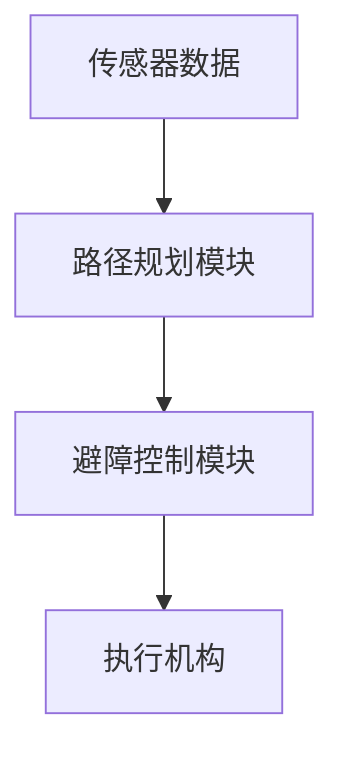
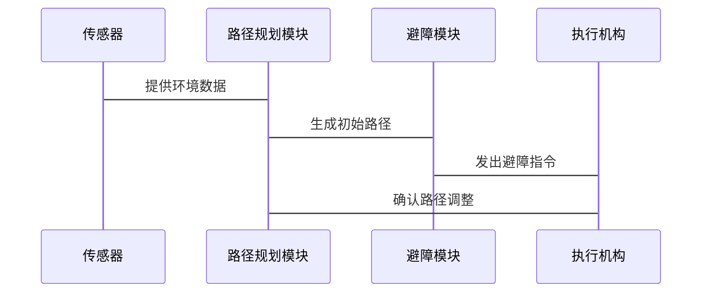

                 


# AI Agent在智能吸尘器中的路径规划

> 关键词：AI Agent，智能吸尘器，路径规划，A*算法，RRT算法，系统架构设计，项目实战

> 摘要：本文深入探讨AI Agent在智能吸尘器中的路径规划技术，分析常见路径规划算法（如A*、RRT等）的原理及其在智能吸尘器中的应用，结合系统架构设计和项目实战，为读者提供全面的技术指导。

---

# 第一部分：AI Agent与智能吸尘器概述

## 第1章：AI Agent的基本概念

### 1.1 AI Agent的定义与特点
AI Agent是一种智能体，能够感知环境并自主决策。其核心特点包括：
- **自主性**：无需外部干预，自主完成任务。
- **反应性**：能实时感知环境变化并做出反应。
- **学习能力**：通过经验优化行为策略。

### 1.2 智能吸尘器的发展历程
智能吸尘器经历了从简单清洁模式到AI驱动的路径规划的演变。当前主流产品（如iRobot的Roomba）结合了传感器和AI算法，实现了高效的环境探索和路径规划。

### 1.3 路径规划的背景与意义
路径规划是智能吸尘器实现高效清洁的核心技术。通过优化路径，吸尘器能在复杂环境中避免障碍物，覆盖所有区域，提升清洁效率。

---

# 第二部分：路径规划算法原理

## 第2章：常见路径规划算法

### 2.1 A*算法
A*算法是一种基于启发式搜索的路径规划算法，常用于二维或三维空间中的最短路径问题。

#### 2.1.1 算法原理
A*算法通过评估节点的g(n)（已遍历距离）和h(n)（启发函数，估算剩余距离）来选择最优路径。其搜索策略为：
$$f(n) = g(n) + h(n)$$

#### 2.1.2 优缺点分析
| 优点 | 缺点 |
|------|------|
| 启发式搜索，效率高 | 启发函数设计复杂 |
| 避免循环 | 对复杂环境适应性差 |

#### 2.1.3 实现代码示例
```python
import heapq

def a_star(grid, start, end):
    open_set = set([start])
    came_from = {}
    g_score = {start:0}
    f_score = {start: heuristic(start, end)}

    while open_set:
        current = heapq.heappop(open_set, key=lambda x: f_score[x])
        if current == end:
            break

        for neighbor in grid.neighbors(current):
            tentative_g_score = g_score[current] + distance(current, neighbor)
            if neighbor not in g_score or tentative_g_score < g_score[neighbor]:
                came_from[neighbor] = current
                g_score[neighbor] = tentative_g_score
                f_score[neighbor] = g_score[neighbor] + heuristic(neighbor, end)
                heapq.heappush(open_set, neighbor)

    return came_from, g_score
```

### 2.2 RRT算法
RRT（Rapidly-exploring Random Tree）是一种基于随机采样的路径规划算法，适用于高维或非结构化环境。

#### 2.2.1 算法原理
RRT算法通过随机采样生成树，并逐步扩展与目标点接近的路径。其树的扩展概率为：
$$\text{树的扩展概率} = \frac{\text{样本点数}}{\text{总点数}}$$

#### 2.2.2 优缺点分析
| 优点 | 缺点 |
|------|------|
| 适用于复杂环境 | 计算复杂度高 |
| 鲁棒性强 | 需要大量采样 |

#### 2.2.3 实现代码示例
```python
import numpy as np

def rrt(grid, start, end):
    tree = {start: []}
    for _ in range(iterations):
        sample = random_point(grid)
        nearest = find_nearest(sample, tree.keys())
        new_node = extend(nearest, sample)
        if new_node == end:
            tree[end] = new_node
            break
        tree[new_node] = nearest
    return tree
```

---

# 第三部分：系统分析与架构设计

## 第3章：智能吸尘器系统架构设计

### 3.1 系统需求分析
智能吸尘器系统需满足以下需求：
- 环境感知：通过激光雷达、超声波传感器等获取环境数据。
- 路径规划：基于传感器数据生成最优路径。
- 避障控制：动态调整路径以避开障碍物。

### 3.2 系统架构设计
系统架构包括：
- **传感器数据采集模块**：负责收集环境数据。
- **路径规划模块**：执行路径计算。
- **避障控制模块**：动态调整路径。
- **执行机构**：驱动吸尘器运动。

#### 3.2.1 系统架构图


### 3.3 系统交互流程


---

# 第四部分：项目实战

## 第4章：路径规划算法的实现与优化

### 4.1 环境搭建
- **工具选择**：使用ROS（Robot Operating System）框架。
- **开发环境**：安装Python、ROS、Rviz等工具。

### 4.2 代码实现
实现A*和RRT算法，并在ROS环境中测试。

#### 4.2.1 A*算法实现
```python
def heuristic(n, goal):
    return np.linalg.norm(n - goal)

def a_star_search(grid, start, goal):
    open_set = set([start])
    came_from = {}
    g_score = {start:0}
    f_score = {start: heuristic(start, goal)}

    while open_set:
        current = heapq.heappop(open_set, key=lambda x: f_score[x])
        if current == goal:
            return came_from, g_score
        for neighbor in grid.get_neighbors(current):
            tentative_g_score = g_score[current] + grid.cost(current, neighbor)
            if neighbor not in g_score or tentative_g_score < g_score[neighbor]:
                came_from[neighbor] = current
                g_score[neighbor] = tentative_g_score
                f_score[neighbor] = g_score[neighbor] + heuristic(neighbor, goal)
                heapq.heappush(open_set, neighbor)
```

#### 4.2.2 RRT算法实现
```python
def rrt_planning(start, goal, obstacles):
    tree = {start: []}
    for _ in range(1000):
        x_rand = np.random.uniform(0, 100)
        y_rand = np.random.uniform(0, 100)
        node_rand = (x_rand, y_rand)
        node_near = find_nearst(node_rand, tree.keys())
        node_new = steer(node_near, node_rand)
        if not check_collision(node_new, obstacles):
            tree[node_new] = node_near
    return tree
```

### 4.3 测试与优化
- **测试场景**：设置不同障碍物布局，测试路径规划效果。
- **优化策略**：调整A*的启发函数和RRT的采样密度，提升规划效率。

---

# 第五部分：总结与展望

## 第5章：总结与未来展望

### 5.1 全文总结
本文详细探讨了AI Agent在智能吸尘器中的路径规划技术，分析了A*和RRT算法的原理及其应用，并结合系统架构设计和项目实战，为读者提供了全面的技术指导。

### 5.2 未来展望
未来研究方向包括：
- 更智能的多目标路径规划。
- 基于深度学习的路径优化。
- 多智能体协同路径规划。

---

作者：AI天才研究院/AI Genius Institute & 禅与计算机程序设计艺术 /Zen And The Art of Computer Programming

