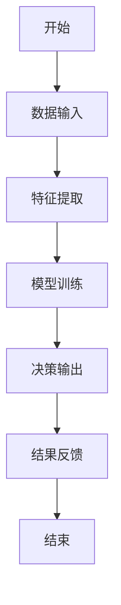
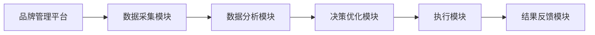
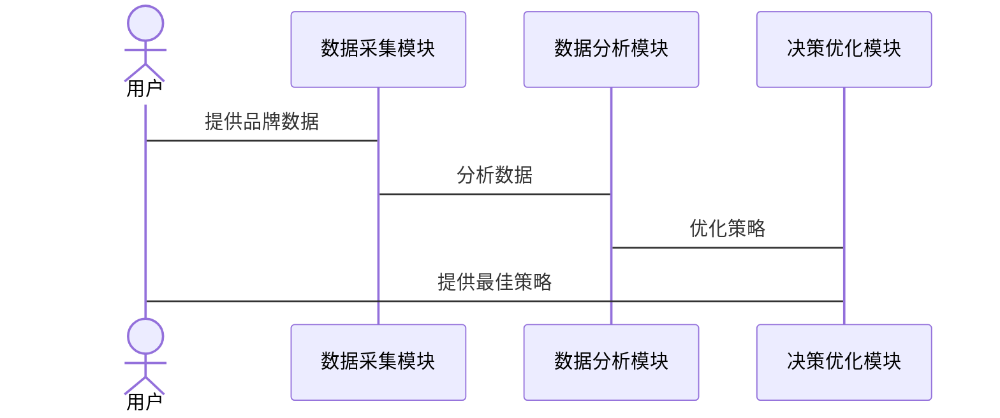

                 


# AI Agent在智能品牌管理中的应用

> 关键词：AI Agent，智能品牌管理，机器学习，数据挖掘，品牌策略，决策优化

> 摘要：本文详细探讨了AI Agent在智能品牌管理中的应用，从基本概念到算法原理，再到实际案例，全面分析了AI Agent如何通过数据分析、决策优化和风险预警等手段，提升品牌管理的效率和精准度。文章还结合了实际的系统架构设计和项目实战，为读者提供了丰富的理论和实践指导。

---

# 第1章 AI Agent与智能品牌管理的背景与概念

## 1.1 AI Agent的基本概念

### 1.1.1 AI Agent的定义
AI Agent（人工智能代理）是指能够感知环境、自主决策并执行任务的智能实体。它通过数据输入、模型训练和决策输出，帮助人类完成复杂任务。

### 1.1.2 AI Agent的核心特征
- **自主性**：AI Agent能够独立运行，无需人工干预。
- **反应性**：能够实时感知环境变化并做出反应。
- **学习能力**：通过机器学习不断优化决策模型。

### 1.1.3 AI Agent与传统品牌管理的区别
传统品牌管理依赖人工经验，而AI Agent通过数据驱动的方法，实现了更精准和高效的决策。

---

## 1.2 智能品牌管理的定义与特点

### 1.2.1 智能品牌管理的定义
智能品牌管理是利用人工智能技术，通过数据分析、模型构建和决策优化，实现品牌战略的制定和执行。

### 1.2.2 智能品牌管理的核心要素
- **数据驱动**：依赖大数据分析。
- **智能化决策**：通过AI算法优化策略。
- **实时反馈**：能够快速响应市场变化。

### 1.2.3 智能品牌管理与传统品牌管理的对比
智能品牌管理更加精准、高效，能够处理海量数据，而传统管理则依赖经验，效率较低。

---

## 1.3 AI Agent在智能品牌管理中的作用

### 1.3.1 AI Agent在品牌数据分析中的应用
AI Agent能够快速处理大量数据，提取关键信息，为品牌决策提供支持。

### 1.3.2 AI Agent在品牌决策优化中的作用
通过机器学习算法，AI Agent能够优化品牌策略，提升市场表现。

### 1.3.3 AI Agent在品牌策略执行中的价值
AI Agent能够实时监控市场变化，及时调整策略，确保品牌目标的实现。

---

## 1.4 本章小结
本章介绍了AI Agent的基本概念和智能品牌管理的核心要素，强调了AI Agent在品牌管理中的重要性。

---

# 第2章 AI Agent的核心原理与技术基础

## 2.1 AI Agent的核心原理

### 2.1.1 AI Agent的基本架构
AI Agent通常由感知层、决策层和执行层组成，能够实现数据输入、模型训练和决策输出。

### 2.1.2 AI Agent的决策机制
AI Agent通过概率论和强化学习等方法，实现决策优化。

### 2.1.3 AI Agent的学习与优化
AI Agent通过监督学习、无监督学习和强化学习，不断优化自身的决策模型。

---

## 2.2 AI Agent的关键技术

### 2.2.1 自然语言处理技术
自然语言处理（NLP）用于分析品牌相关的文本数据，提取关键词和情感倾向。

### 2.2.2 机器学习算法
机器学习算法，如随机森林和神经网络，用于品牌画像构建和预测分析。

### 2.2.3 数据挖掘与分析技术
数据挖掘技术用于发现数据中的潜在模式，支持品牌策略的制定。

---

## 2.3 AI Agent与品牌管理的结合

### 2.3.1 数据驱动的品牌决策
AI Agent通过数据分析，提供品牌定位和市场趋势的决策支持。

### 2.3.2 品牌画像构建
通过机器学习算法，AI Agent能够构建精准的品牌画像，帮助制定个性化策略。

### 2.3.3 品牌风险预警
AI Agent能够实时监控市场变化，及时预警潜在风险。

---

## 2.4 本章小结
本章详细介绍了AI Agent的核心原理和关键技术，以及其在品牌管理中的具体应用。

---

# 第3章 AI Agent的算法原理与数学模型

## 3.1 AI Agent的算法原理

### 3.1.1 基于概率论的决策模型
概率论模型用于评估不同决策方案的可能性，帮助AI Agent做出最优选择。

### 3.1.2 基于强化学习的策略优化
强化学习通过奖励机制，优化AI Agent的决策策略，提升品牌管理效果。

### 3.1.3 基于图论的知识图谱构建
知识图谱构建帮助AI Agent理解品牌相关的知识网络，支持复杂决策。

---

## 3.2 AI Agent的数学模型

### 3.2.1 概率分布模型
$$P(A|B) = \frac{P(B|A)P(A)}{P(B)}$$

### 3.2.2 马尔可夫决策过程
$$V(s) = \max_{a} [r(s,a) + \gamma V(s')$$

### 3.2.3 贝叶斯网络模型
贝叶斯网络通过条件概率，构建品牌相关的因果关系网络。

---

## 3.3 算法流程图（使用mermaid）



---

## 3.4 数学公式与详细讲解

### 3.4.1 概率论公式
$$P(A|B) = \frac{P(B|A)P(A)}{P(B)}$$
该公式表示在已知B发生的条件下，A发生的概率。

### 3.4.2 强化学习公式
$$V(s) = \max_{a} [r(s,a) + \gamma V(s')$$
该公式表示状态s下的最优价值函数，通过最大化当前奖励和未来价值来优化决策。

---

## 3.5 本章小结
本章详细讲解了AI Agent的算法原理和数学模型，为后续的应用分析奠定了基础。

---

# 第4章 AI Agent在品牌管理中的系统架构设计

## 4.1 系统功能设计

### 4.1.1 数据采集模块
负责收集品牌相关的数据，包括市场数据、消费者反馈等。

### 4.1.2 数据分析模块
通过机器学习算法，分析数据，提取品牌画像和市场趋势。

### 4.1.3 决策优化模块
基于分析结果，优化品牌策略，制定最佳行动计划。

---

## 4.2 系统架构设计



---

## 4.3 系统接口设计

### 4.3.1 数据接口
API接口用于数据的输入和输出，确保系统与其他模块的协同工作。

### 4.3.2 用户接口
提供友好的用户界面，方便用户查看分析结果和调整策略。

---

## 4.4 系统交互流程



---

## 4.5 本章小结
本章详细设计了AI Agent在品牌管理中的系统架构，包括功能模块、架构图和交互流程。

---

# 第5章 AI Agent的项目实战

## 5.1 环境安装

### 5.1.1 安装Python
安装Python 3.x版本，确保兼容性。

### 5.1.2 安装依赖库
安装numpy、pandas、scikit-learn等库，用于数据处理和机器学习。

```bash
pip install numpy pandas scikit-learn
```

---

## 5.2 核心代码实现

### 5.2.1 数据处理代码
```python
import pandas as pd
import numpy as np
from sklearn.model_selection import train_test_split
from sklearn.ensemble import RandomForestClassifier
```

### 5.2.2 品牌画像构建
```python
data = pd.read_csv('brand_data.csv')
X = data.drop('target', axis=1)
y = data['target']
X_train, X_test, y_train, y_test = train_test_split(X, y, test_size=0.2)
model = RandomForestClassifier()
model.fit(X_train, y_train)
```

### 5.2.3 决策优化代码
```python
def optimize_strategy(data):
    # 数据预处理
    X = data.drop('target', axis=1)
    y = data['target']
    # 训练模型
    model.fit(X_train, y_train)
    # 输出最佳策略
    return model.predict(X_test)
```

---

## 5.3 案例分析

### 5.3.1 案例背景
某品牌希望优化市场推广策略，通过AI Agent分析市场数据，制定最佳推广计划。

### 5.3.2 分析结果
AI Agent通过分析数据，发现目标用户群体和市场趋势，优化了品牌定位和推广策略。

### 5.3.3 实施效果
品牌销售额显著提升，市场占有率提高。

---

## 5.4 本章小结
本章通过实际项目案例，展示了AI Agent在品牌管理中的应用，提供了详细的代码实现和案例分析。

---

# 第6章 AI Agent在品牌管理中的应用案例

## 6.1 应用场景分析

### 6.1.1 品牌定位优化
AI Agent通过数据分析，帮助品牌找到最佳市场定位。

### 6.1.2 品牌推广策略优化
AI Agent分析市场数据，制定最优的推广计划。

### 6.1.3 品牌风险预警
AI Agent实时监控市场变化，预警潜在风险。

---

## 6.2 案例分析

### 6.2.1 案例背景
某品牌面临市场竞争加剧，希望通过AI Agent优化品牌策略。

### 6.2.2 分析过程
AI Agent通过数据挖掘和机器学习算法，分析市场趋势和消费者行为，制定优化策略。

### 6.2.3 实施效果
品牌竞争力显著提升，市场表现优于竞争对手。

---

## 6.3 本章小结
本章通过具体案例，展示了AI Agent在品牌管理中的实际应用和效果。

---

# 第7章 总结与展望

## 7.1 本章总结
本文详细探讨了AI Agent在智能品牌管理中的应用，从理论到实践，全面分析了其在品牌数据分析、决策优化和风险预警中的作用。

## 7.2 未来展望
未来，AI Agent在品牌管理中的应用将更加广泛和深入，结合区块链、5G等新技术，实现更高效和精准的品牌管理。

---

## 7.3 最佳实践 tips
- 在品牌管理中，AI Agent能够显著提升效率和精准度。
- 通过数据分析和机器学习算法，优化品牌策略。
- 实时监控市场变化，及时调整品牌定位。

---

## 7.4 小结
AI Agent正在改变品牌管理的方式，未来将发挥更大的作用。

---

## 7.5 注意事项
- 数据隐私和安全问题需要注意。
- AI Agent的应用需要结合实际业务需求。
- 持续优化AI模型，确保决策的准确性。

---

## 7.6 拓展阅读
- 《机器学习实战》
- 《数据挖掘导论》
- 《人工智能：现代方法》

---

# 作者：AI天才研究院/AI Genius Institute & 禅与计算机程序设计艺术/Zen And The Art of Computer Programming

---

以上是《AI Agent在智能品牌管理中的应用》的完整目录和文章内容。

