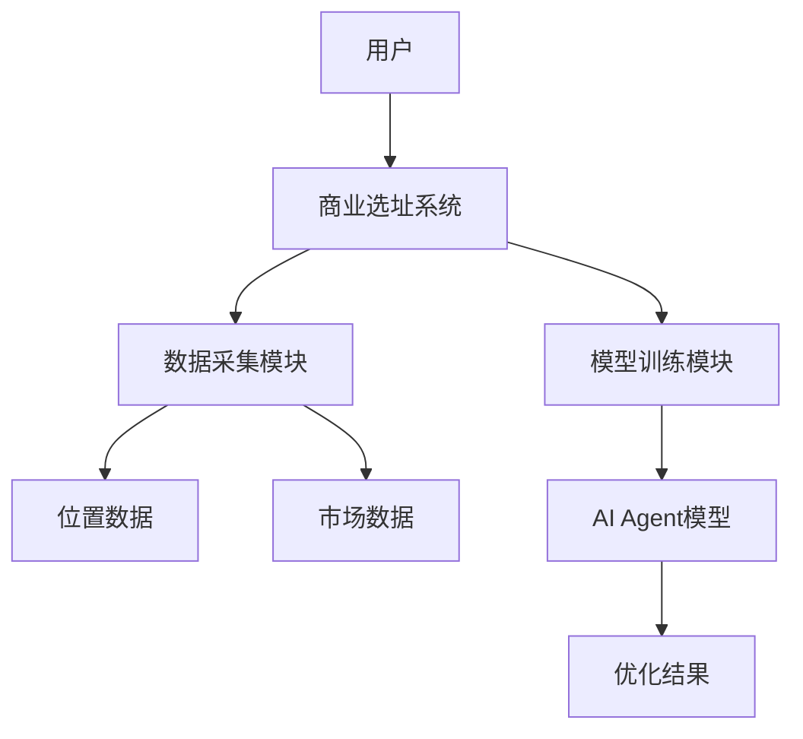
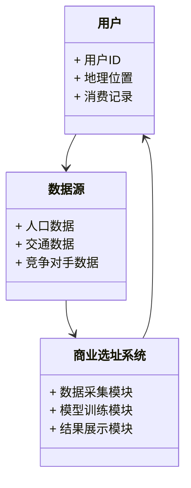
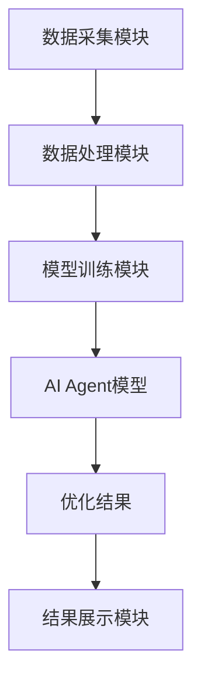
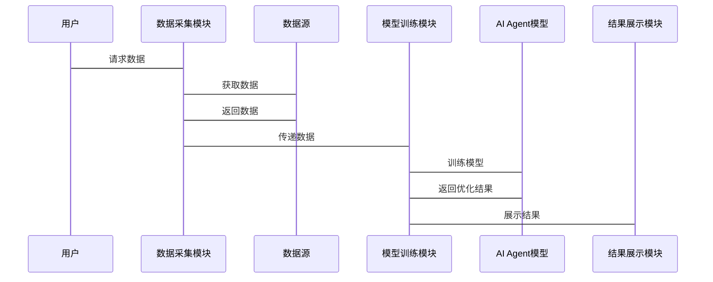

                 


```markdown
# AI Agent在智能商业选址中的应用

> 关键词：AI Agent, 智能商业选址, 人工智能技术, 机器学习算法, 数据驱动决策, 智能优化系统

> 摘要：本文探讨了AI Agent在智能商业选址中的应用，分析了AI Agent的核心原理及其在商业选址中的优势，结合实际案例，详细阐述了基于Q-learning的选址优化算法，并通过系统架构设计展示了AI Agent在商业选址中的实现过程。

---

## 第一部分: AI Agent在智能商业选址中的应用概述

### 第1章: AI Agent与商业选址的背景介绍

#### 1.1 AI Agent的基本概念
##### 1.1.1 AI Agent的定义
AI Agent（人工智能代理）是指能够感知环境并采取行动以实现目标的智能体。AI Agent可以通过传感器获取信息，并通过执行器与环境交互。其核心在于通过算法和模型来优化决策过程。

##### 1.1.2 AI Agent的核心要素
- **状态（State）**：AI Agent所处的环境信息。
- **动作（Action）**：AI Agent在特定状态下采取的行为。
- **目标（Goal）**：AI Agent追求的最终结果。
- **奖励（Reward）**：AI Agent采取行动后获得的反馈，用于优化决策。

##### 1.1.3 AI Agent的分类与特点
AI Agent可以分为基于规则的代理、基于模型的代理和基于强化学习的代理。其中，基于强化学习的代理在商业选址中的应用最为广泛。

#### 1.2 商业选址问题的背景
##### 1.2.1 商业选址的基本概念
商业选址是指选择一个地理位置，以满足商业目标（如最大化销售额、最小化成本等）。选址决策受到多种因素的影响，如人口密度、交通状况、竞争对手分布等。

##### 1.2.2 商业选址的挑战与难点
- 数据复杂性：需要整合多源异构数据。
- 动态性：市场环境不断变化。
- 多目标优化：需要在多个目标之间进行权衡。

##### 1.2.3 AI Agent在商业选址中的优势
- 高效性：AI Agent能够快速处理大量数据。
- 数据驱动：基于数据进行决策，减少人为偏差。
- 智能性：能够动态调整策略，适应环境变化。

#### 1.3 AI Agent在商业选址中的应用前景
##### 1.3.1 AI Agent在智能选址中的潜力
- 提高选址精度：通过深度学习模型分析数据。
- 实时优化：根据实时数据调整选址策略。
- 多场景应用：适用于零售、物流、金融等多个领域。

##### 1.3.2 企业采用AI Agent的优势
- 提升决策效率：减少人工分析时间。
- 增强决策准确性：基于大数据分析。
- 降低运营成本：优化资源配置。

##### 1.3.3 AI Agent应用的挑战与机遇
- 挑战：数据隐私、模型复杂性、算法可解释性。
- 机遇：技术进步、数据量增加、计算能力提升。

### 第2章: AI Agent与商业选址的核心概念与联系

#### 2.1 AI Agent的核心原理
##### 2.1.1 状态空间与动作空间
- **状态空间**：AI Agent可能遇到的所有状态的集合。
- **动作空间**：AI Agent在每个状态下可能采取的所有动作的集合。

##### 2.1.2 策略与价值函数
- **策略（Policy）**：描述AI Agent在每个状态下采取动作的概率分布。
- **价值函数（Value Function）**：衡量某个状态下采取某动作后的预期收益。

##### 2.1.3 奖励机制与目标函数
- **奖励机制**：AI Agent采取行动后获得的反馈，用于优化策略。
- **目标函数**：AI Agent追求的最终目标的数学表达。

#### 2.2 商业选址的核心要素
##### 2.2.1 区域特征分析
- 人口密度、经济发展水平、交通状况等。

##### 2.2.2 市场需求分析
- 消费者行为、市场规模、竞争情况。

##### 2.2.3 竞争分析与风险评估
- 竞争对手的位置、市场份额、潜在风险。

#### 2.3 AI Agent与商业选址的实体关系图


### 第3章: AI Agent在商业选址中的算法原理

#### 3.1 基于Q-learning的选址优化算法
##### 3.1.1 算法流程图
```mermaid
graph TD
    A[初始状态] --> B[选择动作]
    B --> C[执行动作]
    C --> D[获得奖励]
    D --> E[更新Q值]
    E --> F[判断是否终止]
    F --> G[结束] || F --> B[继续循环]
```

##### 3.1.2 算法实现代码
```python
import numpy as np
import random

class QLearningAgent:
    def __init__(self, state_space_size, action_space_size):
        self.state_space_size = state_space_size
        self.action_space_size = action_space_size
        self.Q = np.zeros((state_space_size, action_space_size))
        self.learning_rate = 0.1
        self.discount_factor = 0.9

    def choose_action(self, state, epsilon=0.1):
        if random.random() < epsilon:
            return random.randint(0, self.action_space_size - 1)
        else:
            return np.argmax(self.Q[state, :])

    def update_Q(self, state, action, reward, next_state):
        self.Q[state, action] = self.Q[state, action] + self.learning_rate * (
            reward + self.discount_factor * np.max(self.Q[next_state, :]) - self.Q[state, action]
        )

# 示例使用
agent = QLearningAgent(state_space_size=5, action_space_size=3)
state = 2
action = agent.choose_action(state)
reward = 1.0
next_state = 3
agent.update_Q(state, action, reward, next_state)
```

##### 3.1.3 算法原理的数学模型
AI Agent通过Q-learning算法优化选址策略，其数学模型如下：
$$ Q(s, a) = Q(s, a) + \alpha [r + \gamma \max Q(s', a')] $$
其中：
- \( Q(s, a) \)：状态 \( s \) 下采取动作 \( a \) 的Q值。
- \( \alpha \)：学习率。
- \( r \)：奖励值。
- \( \gamma \)：折扣因子。
- \( Q(s', a') \)：下一个状态 \( s' \) 下的动作 \( a' \) 的Q值。

#### 3.2 商业选址中的强化学习模型
##### 3.2.1 环境与状态表示
- 状态表示：位置坐标、周边环境特征等。
- 动作表示：选择某个位置作为候选点。

##### 3.2.2 奖励机制设计
- 奖励函数：根据选址结果给予奖励，如销售额、利润等。

##### 3.2.3 模型训练与优化
- 使用深度强化学习框架（如DQN）进行训练。

### 第4章: 系统分析与架构设计

#### 4.1 问题场景介绍
以连锁便利店的选址为例，分析如何利用AI Agent进行优化。

#### 4.2 系统功能设计
##### 4.2.1 领域模型


#### 4.3 系统架构设计
##### 4.3.1 模块划分
- 数据采集模块：收集地理位置、人口密度等数据。
- 模型训练模块：训练AI Agent模型。
- 结果展示模块：可视化优化结果。

##### 4.3.2 架构图


#### 4.4 接口与交互设计
##### 4.4.1 接口设计
- 数据接口：与数据源对接。
- 模型接口：与其他系统模块对接。

##### 4.4.2 交互流程


### 第5章: 项目实战

#### 5.1 环境安装
- 安装Python和相关库（如TensorFlow、Keras、NumPy等）。

#### 5.2 核心代码实现
##### 5.2.1 数据预处理
```python
import pandas as pd

data = pd.read_csv('location_data.csv')
```

##### 5.2.2 模型训练
```python
model = Sequential()
model.add(Dense(64, activation='relu', input_dim=data.shape[1]))
model.add(Dense(1, activation='sigmoid'))
model.compile(optimizer='adam', loss='binary_crossentropy')
model.fit(data, labels, epochs=10, batch_size=32)
```

##### 5.2.3 结果展示
```python
import matplotlib.pyplot as plt

plt.scatter(x, y, c=model.predict(data), cmap='viridis')
plt.colorbar()
plt.show()
```

#### 5.3 实际案例分析
##### 5.3.1 案例背景
- 某连锁便利店计划在某城市扩展业务，需要选择新的门店位置。

##### 5.3.2 数据分析
- 使用AI Agent模型分析候选位置的可行性和收益。

##### 5.3.3 优化结果
- 模型推荐最优位置，并展示在地图上。

#### 5.4 项目小结
- AI Agent在商业选址中的应用能够显著提高选址效率和准确性。
- 通过数据驱动的方式，减少人为误差，提升决策质量。

---

## 第二部分: 最佳实践与总结

### 第6章: 最佳实践与经验分享

#### 6.1 关键技术点总结
- 数据质量：数据的完整性和准确性直接影响模型效果。
- 模型选择：选择适合业务需求的AI Agent模型。
- 训练优化：合理设置超参数，优化模型性能。

#### 6.2 实践中的注意事项
- 数据隐私：遵守相关法律法规，保护用户隐私。
- 模型可解释性：确保模型决策过程透明，便于分析和优化。

#### 6.3 拓展阅读
- 推荐相关书籍和论文，进一步深入学习AI Agent和商业选址的知识。

### 第7章: 小结与展望

#### 7.1 本章小结
- AI Agent通过数据驱动的方式优化商业选址，显著提升了选址效率和准确性。
- 结合强化学习和深度学习技术，AI Agent在复杂场景下表现出色。

#### 7.2 未来展望
- 技术进步：AI Agent算法的优化和创新。
- 应用扩展：AI Agent在更多商业场景中的应用。

---

## 作者：AI天才研究院/AI Genius Institute & 禅与计算机程序设计艺术 /Zen And The Art of Computer Programming
```

