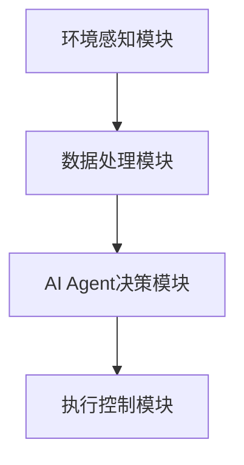
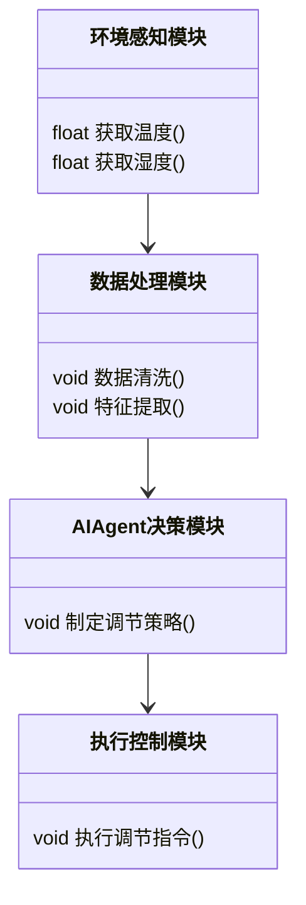
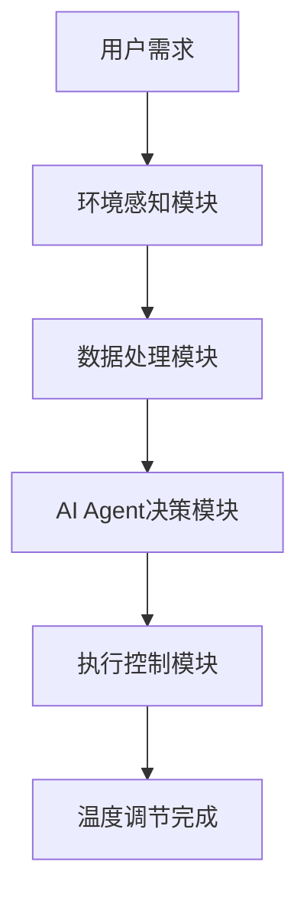

                 


# AI Agent在智能围巾中的温度调节

> 关键词：AI Agent，智能围巾，温度调节，算法原理，系统架构，项目实战

> 摘要：本文深入探讨了AI Agent在智能围巾温度调节系统中的应用，从背景、核心概念、算法原理、系统架构到项目实战，全面解析了AI Agent如何实现智能温度调节，优化用户体验。

---

# 第1章: AI Agent与智能温度调节概述

## 1.1 问题背景与需求分析

### 1.1.1 传统温度调节的局限性

传统温度调节系统通常依赖固定的时间表或简单的温感触发，存在以下问题：
- **反应滞后**：无法实时感知环境变化，导致温度调节不够及时。
- **个性化不足**：无法根据用户个体需求（如体温敏感度、穿着情况）进行调整。
- **能耗问题**：频繁调节可能导致能源浪费。

### 1.1.2 智能化温度调节的需求

随着物联网和人工智能技术的发展，智能温度调节的需求日益增长：
- **实时感知与反馈**：通过传感器实时采集环境数据，动态调整温度。
- **个性化服务**：根据用户习惯和偏好，提供定制化温度调节方案。
- **能效优化**：通过智能算法减少能源浪费，提升能效。

### 1.1.3 AI Agent在温度调节中的作用

AI Agent（智能代理）通过实时数据处理、决策和执行，能够显著提升温度调节的智能化水平：
- **数据采集与分析**：AI Agent实时采集环境数据（如温度、湿度、用户行为等）并进行分析。
- **智能决策**：基于分析结果，AI Agent制定最优的温度调节策略。
- **动态调整**：根据环境变化和用户反馈，动态优化调节方案。

---

## 1.2 智能围巾温度调节的实现目标

### 1.2.1 自适应调节温度

AI Agent能够根据环境变化和用户需求，实时调整温度设置，确保用户始终处于舒适状态。

### 1.2.2 实时感知环境变化

通过集成多种传感器（如温度、湿度、光线传感器），AI Agent能够实时感知环境变化，做出快速响应。

### 1.2.3 用户舒适度优化

通过分析用户的生理数据和行为模式，AI Agent能够预测用户的舒适需求，提供个性化的温度调节方案。

---

## 1.3 本章小结

本章介绍了传统温度调节系统的局限性，提出了智能化温度调节的需求，并详细阐述了AI Agent在智能围巾温度调节中的作用和实现目标。

---

# 第2章: AI Agent的核心概念与原理

## 2.1 AI Agent的基本定义

### 2.1.1 什么是AI Agent

AI Agent（智能代理）是一种能够感知环境、自主决策并执行任务的智能系统。它通过与环境交互，实现预定目标。

### 2.1.2 AI Agent的核心特征

- **自主性**：能够在没有外部干预的情况下运行。
- **反应性**：能够实时感知环境变化并做出反应。
- **主动性**：主动采取行动以实现目标。
- **社会性**：能够与其他系统或用户进行交互和协作。

### 2.1.3 AI Agent的分类与应用场景

AI Agent可以根据功能、智能水平和环境类型进行分类：
- **按功能分类**：信息检索Agent、监控Agent、推荐系统Agent等。
- **按智能水平分类**：反应式Agent、基于模型的Agent、学习型Agent。
- **按环境类型分类**：静态环境、动态环境、协作环境。

---

## 2.2 智能围巾中的AI Agent设计

### 2.2.1 AI Agent的功能模块

- **感知模块**：负责采集环境数据（如温度、湿度、光线）和用户数据（如体温、活动状态）。
- **决策模块**：基于感知数据，利用算法制定温度调节策略。
- **执行模块**：通过智能织物或加热元件执行温度调节指令。
- **学习模块**：通过机器学习算法优化温度调节模型。

### 2.2.2 AI Agent的决策机制

AI Agent的决策机制通常包括以下步骤：
1. **数据采集**：通过传感器获取环境和用户数据。
2. **数据处理**：对数据进行清洗、归一化处理。
3. **模型推理**：利用机器学习模型预测最佳温度。
4. **决策优化**：根据预测结果制定调节策略。
5. **反馈调整**：根据用户反馈动态优化模型。

### 2.2.3 AI Agent与智能围巾的交互方式

AI Agent与智能围巾的交互可以通过以下方式进行：
- **无线通信**：通过蓝牙、Wi-Fi等技术与手机或其他设备交互。
- **触控界面**：用户可以通过触控面板直接与AI Agent交互。
- **语音指令**：支持语音识别技术，用户可以通过语音控制温度调节。

---

## 2.3 本章小结

本章详细介绍了AI Agent的核心概念、功能模块和决策机制，并探讨了其在智能围巾中的具体应用。

---

# 第3章: AI Agent与智能围巾的系统架构

## 3.1 系统整体架构设计

### 3.1.1 系统组成模块

智能围巾温度调节系统主要包括以下模块：
- **环境感知模块**：负责采集环境数据。
- **数据处理模块**：对数据进行预处理和分析。
- **AI Agent决策模块**：基于数据制定调节策略。
- **执行控制模块**：通过智能织物执行调节指令。

### 3.1.2 模块之间的关系

模块之间的关系可以通过以下流程图表示：



### 3.1.3 系统的可扩展性设计

系统设计时考虑了可扩展性，模块之间采用松耦合设计，便于后续功能扩展。

---

## 3.2 系统功能模块设计

### 3.2.1 环境感知模块

- **功能描述**：通过多种传感器（如温度、湿度、光线传感器）采集环境数据。
- **实现方式**：传感器数据通过蓝牙或Wi-Fi传输到数据处理模块。

### 3.2.2 数据处理模块

- **功能描述**：对采集到的数据进行清洗、归一化处理，并进行特征提取。
- **实现方式**：使用Python的pandas库进行数据处理。

### 3.2.3 AI Agent决策模块

- **功能描述**：基于处理后的数据，利用机器学习模型制定温度调节策略。
- **实现方式**：使用Python的scikit-learn库训练回归模型。

### 3.2.4 执行控制模块

- **功能描述**：根据决策模块的指令，通过智能织物或加热元件执行温度调节。
- **实现方式**：通过Arduino或Raspberry Pi控制加热元件。

---

## 3.3 本章小结

本章详细描述了智能围巾温度调节系统的整体架构和功能模块设计，并通过Mermaid图展示了模块之间的关系。

---

# 第4章: AI Agent的算法原理与实现

## 4.1 算法选择与原理

### 4.1.1 选择AI算法的依据

- **任务需求**：温度调节需要实时预测和决策。
- **数据类型**：环境数据和用户数据多为数值型。
- **计算能力**：要求算法高效且易于部署。

### 4.1.2 算法原理概述

选择基于回归的机器学习算法（如线性回归、支持向量回归）进行预测，结合PID控制算法进行实时调节。

### 4.1.3 算法的优缺点分析

- **优点**：简单易实现，计算效率高。
- **缺点**：对于非线性关系的预测精度有限。

---

## 4.2 算法实现细节

### 4.2.1 数据预处理

- **数据清洗**：去除异常值和缺失值。
- **归一化处理**：将数据归一化到统一范围内。

### 4.2.2 模型训练

- **回归模型训练**：使用scikit-learn库训练线性回归模型。
- **模型优化**：通过交叉验证选择最优模型参数。

### 4.2.3 模型优化与调参

- **超参数调整**：通过网格搜索优化模型参数。
- **模型评估**：通过均方误差（MSE）评估模型性能。

---

## 4.3 算法实现的代码示例

### 4.3.1 数据预处理代码

```python
import pandas as pd
from sklearn.preprocessing import StandardScaler

# 数据加载
data = pd.read_csv('temperature_data.csv')

# 删除异常值
data = data[~data['temperature'].isna()]

# 标准化处理
scaler = StandardScaler()
data_scaled = scaler.fit_transform(data[['temperature', 'humidity']])
```

### 4.3.2 模型训练代码

```python
from sklearn.linear_model import LinearRegression
from sklearn.model_selection import train_test_split

# 数据分割
X_train, X_test, y_train, y_test = train_test_split(data_scaled, data['target'], test_size=0.2)

# 模型训练
model = LinearRegression()
model.fit(X_train, y_train)
```

### 4.3.3 模型优化代码

```python
from sklearn.model_selection import GridSearchCV

# 超参数搜索
param_grid = {'fit_intercept': [True, False]}
grid_search = GridSearchCV(model, param_grid, cv=5)
grid_search.fit(X_train, y_train)

# 最优模型
best_model = grid_search.best_estimator_
```

---

## 4.4 本章小结

本章详细介绍了AI Agent的算法选择、实现细节和代码示例，展示了如何通过机器学习算法实现智能温度调节。

---

# 第5章: 系统分析与架构设计方案

## 5.1 问题场景介绍

智能围巾温度调节系统需要在复杂多变的环境中，实时感知用户需求，动态调整温度，确保用户舒适。

## 5.2 项目介绍

本项目旨在开发一款智能围巾，通过AI Agent实现温度的智能调节，提升用户体验。

---

## 5.3 系统功能设计

### 5.3.1 领域模型（Mermaid 类图）



### 5.3.2 系统架构设计（Mermaid 架构图）

```mermaid
C4Context
    title 智能围巾温度调节系统
    Partition 系统 {
        Container 环境感知模块 {
            Actor 传感器
        }
        Container 数据处理模块 {
            Actor 数据清洗
        }
        Container AI Agent决策模块 {
            Actor 温度预测
        }
        Container 执行控制模块 {
            Actor 加热元件
        }
    }
```

### 5.3.3 系统接口设计

- **传感器接口**：通过I2C或SPI接口连接传感器。
- **用户交互接口**：通过蓝牙或Wi-Fi与手机APP交互。
- **执行控制接口**：通过PWM信号控制加热元件。

---

## 5.4 系统交互流程图



---

## 5.5 本章小结

本章详细描述了智能围巾温度调节系统的功能设计、架构设计和交互流程，展示了系统整体的实现方案。

---

# 第6章: 项目实战

## 6.1 环境安装

- **硬件环境**：需要Arduino或Raspberry Pi控制传感器和加热元件。
- **软件环境**：安装Python、scikit-learn、pandas等库。

## 6.2 系统核心实现源代码

### 6.2.1 数据采集代码

```python
import serial

# 串口通信代码
ser = serial.Serial('COM3', 9600)
data = ser.readline().decode().strip()
```

### 6.2.2 AI Agent决策代码

```python
from sklearn.linear_model import LinearRegression

# 模型预测代码
model.predict([[temperature, humidity]])
```

### 6.2.3 执行控制代码

```python
import RPi.GPIO as GPIO

# 控制加热元件代码
GPIO.output(heater_pin, GPIO.HIGH)
```

## 6.3 代码应用解读与分析

- **数据采集**：通过传感器采集环境数据并传输到数据处理模块。
- **AI Agent决策**：基于机器学习模型预测最佳温度并制定调节策略。
- **执行控制**：根据决策结果，通过智能织物或加热元件执行温度调节。

## 6.4 实际案例分析

- **案例背景**：假设环境温度为5℃，湿度为60%，用户体温敏感。
- **AI Agent决策**：预测最佳温度为25℃，并启动加热元件。
- **调节结果**：温度逐渐升高至25℃，用户反馈舒适。

## 6.5 本章小结

本章通过实际案例展示了智能围巾温度调节系统的实现过程，从数据采集到决策执行，详细解读了代码的功能和应用。

---

# 第7章: 最佳实践、小结、注意事项与拓展阅读

## 7.1 最佳实践

- **数据质量管理**：确保数据的准确性和完整性。
- **算法优化**：根据实际需求调整模型参数，提升预测精度。
- **系统安全性**：确保系统免受网络攻击，保护用户隐私。

## 7.2 本章小结

本文通过详细分析和实战，展示了AI Agent在智能围巾温度调节中的应用，从背景、算法、架构到实现，全面解析了系统的设计与实现。

## 7.3 注意事项

- **传感器校准**：定期校准传感器，确保数据准确性。
- **系统维护**：定期更新模型，优化系统性能。
- **用户体验**：注重用户反馈，持续改进系统。

## 7.4 拓展阅读

- **相关技术**：学习更多AI Agent和物联网技术的应用。
- **算法优化**：深入研究深度学习算法在温度调节中的应用。
- **系统设计**：探索更多智能穿戴设备的设计与实现。

---

# 作者：AI天才研究院/AI Genius Institute & 禅与计算机程序设计艺术/Zen And The Art of Computer Programming

---

以上是《AI Agent在智能围巾中的温度调节》的技术博客文章的完整目录和内容概要。文章从背景、概念、算法、系统架构到项目实战，全面解析了AI Agent在智能温度调节中的应用，为读者提供了从理论到实践的详细指导。

