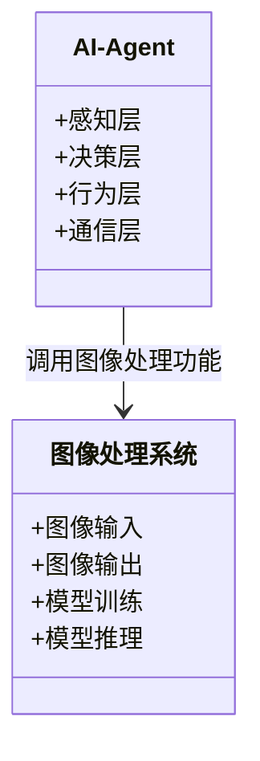

                 


# AI Agent在智能图像处理中的应用

> 关键词：AI Agent，智能图像处理，深度学习，图像识别，图像分割，图像生成

> 摘要：本文探讨了AI Agent在智能图像处理中的应用，分析了AI Agent的基本概念、图像处理技术的核心原理，以及它们如何结合以实现更高效的图像处理。文章详细讲解了AI Agent在图像识别、图像分割和图像生成中的具体应用，并通过实际案例展示了其优势和挑战。此外，文章还讨论了系统架构设计、算法实现和项目实战，为读者提供了全面的技术视角。

---

# 第1章: AI Agent与智能图像处理概述

## 1.1 AI Agent的基本概念

### 1.1.1 AI Agent的定义与特点

AI Agent（人工智能代理）是指能够感知环境、做出决策并执行任务的智能实体。它具有以下特点：
- **自主性**：能够在没有外部干预的情况下自主运行。
- **反应性**：能够实时感知环境并做出反应。
- **目标导向性**：具有明确的目标，并根据目标进行决策。
- **学习能力**：能够通过经验或数据进行自我优化和改进。

### 1.1.2 AI Agent的核心功能与类型

AI Agent的核心功能包括感知、决策、行为执行和通信协作。根据应用场景的不同，AI Agent可以分为以下几类：
- **反应式AI Agent**：基于当前感知做出即时反应。
- **基于模型的AI Agent**：利用内部模型进行决策和规划。
- **协作式AI Agent**：能够与其他AI Agent或人类进行协作。

### 1.1.3 AI Agent与传统图像处理的区别

传统的图像处理技术主要依赖于手动设定的规则和算法，而AI Agent能够通过深度学习等技术，从数据中自动学习特征和规律，具有更强的适应性和灵活性。

## 1.2 智能图像处理的基本概念

### 1.2.1 智能图像处理的定义与特点

智能图像处理是利用人工智能技术对图像进行分析、理解和处理的过程。其特点是：
- **数据驱动**：依赖于大量数据进行训练和优化。
- **深度学习驱动**：主要基于深度学习模型（如CNN、GAN等）进行图像处理。
- **任务导向性**：针对特定任务（如识别、分割、生成）进行优化。

### 1.2.2 智能图像处理的主要技术

智能图像处理的主要技术包括图像识别、图像分割、图像生成等。这些技术通常基于深度学习模型，如卷积神经网络（CNN）和生成对抗网络（GAN）。

### 1.2.3 智能图像处理的应用领域

智能图像处理广泛应用于多个领域，如医学图像分析、自动驾驶、安防监控、图像编辑与生成等。

## 1.3 AI Agent在智能图像处理中的作用

### 1.3.1 AI Agent在图像处理中的优势

AI Agent在图像处理中的优势包括：
- **自主性**：能够在复杂环境中自主完成图像处理任务。
- **实时性**：能够实时感知环境并做出反应。
- **适应性**：能够通过学习和优化适应不同的图像处理场景。

### 1.3.2 AI Agent与图像处理技术的结合

AI Agent与图像处理技术的结合主要体现在以下几个方面：
- **感知与决策的协同**：AI Agent通过感知环境中的图像信息，做出相应的决策。
- **行为与执行的结合**：AI Agent根据决策结果执行具体的图像处理任务。
- **协作与通信**：多个AI Agent可以通过协作和通信共同完成复杂的图像处理任务。

### 1.3.3 AI Agent在智能图像处理中的应用场景

AI Agent在智能图像处理中的应用场景包括：
- **自动驾驶**：通过AI Agent感知和识别道路、车辆和行人，实现自动驾驶。
- **医学图像分析**：通过AI Agent辅助医生进行医学图像的分析和诊断。
- **安防监控**：通过AI Agent实时监控视频流，识别异常行为或物体。

## 1.4 本章小结

本章主要介绍了AI Agent的基本概念、智能图像处理的核心技术以及AI Agent在智能图像处理中的作用。通过这些内容，读者可以理解AI Agent与智能图像处理之间的关系，并为后续章节的学习打下基础。

---

# 第2章: AI Agent的核心概念与原理

## 2.1 AI Agent的感知与决策机制

### 2.1.1 感知层的图像处理技术

AI Agent的感知层主要依赖于图像处理技术来感知环境中的信息。常见的图像处理技术包括图像增强、特征提取、目标检测等。

#### 图像增强
图像增强技术可以提高图像的质量，使其更适合后续处理。例如，通过调整亮度、对比度等参数来增强图像。

#### 特征提取
特征提取是图像处理中的关键步骤，通过提取图像中的特征信息（如边缘、纹理、形状等），可以为后续的决策提供依据。

#### 目标检测
目标检测技术可以识别图像中的目标物体，并确定其位置和类别。

### 2.1.2 决策层的算法原理

AI Agent的决策层主要依赖于机器学习和深度学习算法。常用的算法包括支持向量机（SVM）、随机森林（Random Forest）和卷积神经网络（CNN）等。

#### 支持向量机（SVM）
SVM是一种监督学习算法，主要用于分类任务。它通过找到一个超平面，将数据分成不同的类别。

#### 卷积神经网络（CNN）
CNN是一种深度学习模型，特别适合处理图像数据。它通过卷积层、池化层和全连接层等结构，提取图像的特征并进行分类。

### 2.1.3 感知与决策的协同工作

感知层和决策层协同工作，感知层负责提取图像信息，决策层基于这些信息做出决策。例如，在自动驾驶中，AI Agent通过感知层识别道路上的物体，然后通过决策层做出加速、减速或转向的决策。

---

## 2.2 AI Agent的行为与执行机制

### 2.2.1 行为规划的基本原理

行为规划是AI Agent决策的核心部分，它根据当前的状态和目标，制定出具体的行为计划。常见的行为规划方法包括基于规则的方法和基于模型的方法。

#### 基于规则的方法
基于规则的方法通过预定义的规则来制定行为。例如，设定“如果前方有障碍物，则立即刹车”的规则。

#### 基于模型的方法
基于模型的方法通过构建环境模型，预测未来的状态，并制定最优的行为计划。例如，使用马尔可夫决策过程（MDP）进行决策。

### 2.2.2 行为执行的实现方式

行为执行是AI Agent将决策转化为具体动作的过程。例如，在图像处理任务中，AI Agent根据决策结果执行图像分割、图像识别等操作。

### 2.2.3 行为与图像处理的结合

行为与图像处理的结合主要体现在AI Agent通过图像处理技术感知环境，并根据感知结果执行具体的行为。例如，在安防监控中，AI Agent通过图像处理技术识别异常行为，并根据识别结果发出警报。

---

## 2.3 AI Agent的通信与协作机制

### 2.3.1 多AI Agent的通信方式

多AI Agent可以通过多种方式进行通信，包括基于消息的通信和基于共享记忆的通信。消息通信是通过发送消息进行信息交换，而共享记忆则是通过共享内存中的信息进行通信。

### 2.3.2 多AI Agent的协作模型

多AI Agent的协作模型包括基于任务分解的协作模型和基于角色分配的协作模型。任务分解模型将任务分解为多个子任务，由不同的AI Agent分别执行。角色分配模型则是根据AI Agent的能力和环境需求，分配不同的角色。

### 2.3.3 通信与协作对图像处理的影响

通信与协作可以提高AI Agent的协同能力，使其能够更好地完成复杂的图像处理任务。例如，在医学图像分析中，多个AI Agent可以通过协作完成不同类型的图像处理任务。

## 2.4 本章小结

本章主要介绍了AI Agent的核心概念与原理，包括感知与决策机制、行为与执行机制以及通信与协作机制。通过这些内容，读者可以理解AI Agent如何在智能图像处理中发挥作用。

---

# 第3章: 智能图像处理的核心技术

## 3.1 图像识别技术

### 3.1.1 基于深度学习的图像识别

基于深度学习的图像识别技术主要依赖于卷积神经网络（CNN）。CNN通过卷积层、池化层和全连接层等结构，提取图像的特征并进行分类。

#### 卷积层
卷积层通过卷积核在图像上滑动，提取局部特征。例如，使用3x3的卷积核提取3x3区域的特征。

#### 池化层
池化层通过下采样操作，降低图像的分辨率，减少计算量。常见的池化方法包括最大池化和平均池化。

#### 全连接层
全连接层将卷积层和池化层提取的特征进行全连接，最终输出图像的类别。

### 3.1.2 常见图像识别算法

常见的图像识别算法包括LeNet、AlexNet、VGG、ResNet等。这些算法在ImageNet等数据集上取得了优异的性能。

### 3.1.3 图像识别的挑战与优化

图像识别的挑战包括光照变化、目标姿态、背景干扰等。为了优化图像识别性能，可以采用数据增强、模型优化和迁移学习等技术。

---

## 3.2 图像分割技术

### 3.2.1 基于深度学习的图像分割

基于深度学习的图像分割技术主要依赖于U-Net、Fpn等网络结构。这些网络通过跳跃连接和上采样操作，实现像素级别的分割。

#### U-Net结构
U-Net是一种经典的图像分割网络，由编码器和解码器两部分组成。编码器提取图像的特征，解码器通过上采样和跳跃连接，恢复图像的细节。

### 3.2.2 图像分割算法的实现

图像分割算法的实现通常包括数据预处理、模型训练和模型推理三个阶段。数据预处理包括图像归一化、数据增强等。模型训练使用标注数据，通过反向传播算法优化模型参数。模型推理则将未标注的图像输入模型，输出分割结果。

### 3.2.3 图像分割的应用场景

图像分割的应用场景包括医学图像分割、自动驾驶中的语义分割、图像编辑与修复等。

---

## 3.3 图像生成技术

### 3.3.1 基于GAN的图像生成

生成对抗网络（GAN）是一种强大的图像生成技术。生成器和判别器通过对抗训练，生成逼真的图像。

#### GAN的结构
GAN由生成器和判别器两部分组成。生成器通过生成图像欺骗判别器，而判别器通过区分真实图像和生成图像进行训练。

### 3.3.2 图像生成算法的原理

图像生成算法的原理包括生成器的损失函数设计、判别器的损失函数设计以及生成器和判别器的交替优化。生成器的目标是生成与真实图像无法区分的图像，而判别器的目标是区分真实图像和生成图像。

### 3.3.3 图像生成的创新应用

图像生成的创新应用包括图像修复、图像风格迁移、图像超分辨率重建等。

---

## 3.4 本章小结

本章主要介绍了智能图像处理的核心技术，包括图像识别、图像分割和图像生成。通过这些技术的实现，AI Agent可以更好地完成智能图像处理任务。

---

# 第4章: AI Agent与图像处理的结合

## 4.1 AI Agent在图像识别中的应用

### 4.1.1 基于AI Agent的图像识别流程

基于AI Agent的图像识别流程包括图像感知、特征提取、目标检测和分类识别四个步骤。AI Agent通过感知层提取图像特征，并通过决策层进行分类识别。

### 4.1.2 AI Agent在图像识别中的优势

AI Agent在图像识别中的优势包括：
- **自主性**：能够在复杂环境中自主完成图像识别任务。
- **实时性**：能够实时感知环境并做出反应。
- **适应性**：能够通过学习和优化适应不同的图像识别场景。

### 4.1.3 实际案例分析

实际案例分析包括自动驾驶中的目标检测、医学图像分析中的病灶识别等。

---

## 4.2 AI Agent在图像分割中的应用

### 4.2.1 基于AI Agent的图像分割流程

基于AI Agent的图像分割流程包括图像感知、特征提取、分割预测和结果优化四个步骤。AI Agent通过感知层提取图像特征，并通过决策层进行分割预测。

### 4.2.2 AI Agent在图像分割中的优化

AI Agent在图像分割中的优化包括模型优化、数据增强和算法优化。模型优化通过调整网络结构和超参数，提高分割精度。数据增强通过增加数据多样性，提高模型的泛化能力。算法优化通过改进分割算法，提高分割速度和精度。

### 4.2.3 实际案例分析

实际案例分析包括医学图像分割、自动驾驶中的语义分割等。

---

## 4.3 AI Agent在图像生成中的应用

### 4.3.1 基于AI Agent的图像生成流程

基于AI Agent的图像生成流程包括图像感知、生成器设计、判别器设计和对抗训练四个步骤。AI Agent通过生成器生成图像，并通过判别器进行对抗训练。

### 4.3.2 AI Agent在图像生成中的创新

AI Agent在图像生成中的创新包括生成高分辨率图像、实现图像风格迁移等。

### 4.3.3 实际案例分析

实际案例分析包括图像修复、图像风格迁移等。

---

## 4.4 本章小结

本章主要介绍了AI Agent在图像识别、图像分割和图像生成中的具体应用。通过这些应用的实现，AI Agent可以更好地完成智能图像处理任务。

---

# 第5章: AI Agent在智能图像处理中的算法原理

## 5.1 基于深度学习的图像处理算法

### 5.1.1 卷积神经网络（CNN）

卷积神经网络（CNN）是基于深度学习的图像处理算法的核心。通过卷积层、池化层和全连接层等结构，CNN可以提取图像的特征并进行分类。

### 5.1.2 图像识别算法的数学模型

图像识别算法的数学模型包括卷积层、池化层和全连接层的数学公式。例如，卷积层的计算公式为：

$$ f(x) = \sum_{i=1}^{n} w_i \cdot x_i + b $$

其中，$w_i$ 是卷积核的权重，$x_i$ 是输入图像的像素值，$b$ 是偏置项。

### 5.1.3 图像分割算法的实现

图像分割算法的实现包括编码器和解码器的结构设计。例如，U-Net的编码器部分包括多个卷积层和池化层，解码器部分包括多个上采样层和跳跃连接。

---

## 5.2 基于生成对抗网络的图像生成算法

### 5.2.1 生成对抗网络（GAN）

生成对抗网络（GAN）由生成器和判别器两部分组成。生成器的目标是生成与真实图像无法区分的图像，而判别器的目标是区分真实图像和生成图像。

### 5.2.2 GAN的损失函数

GAN的损失函数包括生成器的损失函数和判别器的损失函数。生成器的损失函数为：

$$ L_G = \mathbb{E}_{z}[\mathcal{L}(G(z), x)] $$

其中，$G(z)$ 是生成器生成的图像，$x$ 是真实图像，$\mathcal{L}$ 是损失函数。

判别器的损失函数为：

$$ L_D = \mathbb{E}_{x}[\mathcal{L}(D(x))] + \mathbb{E}_{z}[\mathcal{L}(1 - D(G(z)))] $$

其中，$D(x)$ 是判别器对真实图像的判断结果，$D(G(z))$ 是判别器对生成图像的判断结果。

### 5.2.3 GAN的训练过程

GAN的训练过程包括生成器和判别器的交替优化。在每一轮训练中，首先训练判别器，使其能够区分真实图像和生成图像。然后训练生成器，使其生成与真实图像无法区分的图像。

---

## 5.3 算法实现与优化

### 5.3.1 算法实现

算法实现包括模型的设计、数据的准备、模型的训练和模型的推理。例如，在图像识别任务中，首先设计卷积神经网络的结构，然后准备训练数据，接着使用梯度下降算法优化模型参数，最后使用训练好的模型进行图像分类。

### 5.3.2 算法优化

算法优化包括模型优化、数据增强和算法调优。模型优化通过调整网络结构和超参数，提高模型的性能。数据增强通过增加数据多样性，提高模型的泛化能力。算法调优通过改进训练策略，提高训练效率和模型性能。

---

## 5.4 本章小结

本章主要介绍了AI Agent在智能图像处理中的算法原理，包括基于深度学习的图像处理算法和基于生成对抗网络的图像生成算法。通过这些算法的实现，AI Agent可以更好地完成智能图像处理任务。

---

# 第6章: 系统分析与架构设计方案

## 6.1 问题场景介绍

### 6.1.1 问题背景

在智能图像处理中，通常需要处理大量的图像数据，并且需要高效的算法和系统架构来支持实时处理。

### 6.1.2 问题描述

本章将设计一个基于AI Agent的智能图像处理系统，该系统能够实现图像识别、图像分割和图像生成等功能。

### 6.1.3 问题解决

通过设计合理的系统架构和算法实现，可以提高图像处理的效率和准确性。

---

## 6.2 项目介绍

### 6.2.1 项目目标

本项目的目标是设计一个基于AI Agent的智能图像处理系统，实现图像识别、图像分割和图像生成等功能。

### 6.2.2 项目范围

本项目的研究范围包括AI Agent的核心技术、智能图像处理的核心技术以及它们的结合应用。

---

## 6.3 系统功能设计

### 6.3.1 领域模型设计

领域模型设计主要基于Mermaid类图，描述系统的功能模块及其关系。例如：



---

## 6.4 系统架构设计

### 6.4.1 系统架构图

系统架构设计主要基于Mermaid架构图，描述系统的各个模块及其交互。例如：

```mermaid
archimate
title 智能图像处理系统架构图
应用架构
    用例: 图像识别
        调用: AI-Agent进行图像识别
    用例: 图像分割
        调用: AI-Agent进行图像分割
    用例: 图像生成
        调用: AI-Agent进行图像生成
技术架构
    数据存储: 图像数据
    训练模块: 深度学习模型
    推理模块: 图像处理算法
    通信模块: AI-Agent之间的通信
```

---

## 6.5 系统接口设计

### 6.5.1 系统接口

系统接口包括图像输入接口、图像输出接口、模型训练接口和模型推理接口。例如：

- 图像输入接口：接收输入的图像数据。
- 图像输出接口：输出处理后的图像数据。
- 模型训练接口：训练深度学习模型。
- 模型推理接口：进行图像识别、分割和生成。

---

## 6.6 系统交互设计

### 6.6.1 系统交互流程

系统交互流程包括图像输入、模型调用、图像处理和结果输出四个步骤。例如：

1. 用户通过图像输入接口上传图像数据。
2. 系统调用AI Agent进行图像处理。
3. AI Agent通过感知层提取图像特征，并通过决策层进行分类识别。
4. 处理结果通过图像输出接口返回给用户。

---

## 6.7 本章小结

本章主要介绍了基于AI Agent的智能图像处理系统的架构设计，包括系统功能设计、系统架构设计、系统接口设计和系统交互设计。通过这些设计，可以实现高效的图像处理。

---

# 第7章: 项目实战

## 7.1 环境安装

### 7.1.1 安装Python

安装Python 3.8或更高版本。

### 7.1.2 安装深度学习框架

安装TensorFlow或PyTorch框架。例如：

```bash
pip install tensorflow
```

### 7.1.3 安装图像处理库

安装OpenCV和 PIL库。例如：

```bash
pip install opencv-python
pip install pillow
```

---

## 7.2 系统核心实现源代码

### 7.2.1 图像识别实现

以下是一个简单的图像识别代码示例：

```python
import tensorflow as tf
from tensorflow.keras import layers

# 定义卷积神经网络模型
def build_model(input_shape, num_classes):
    model = tf.keras.Sequential()
    model.add(layers.Conv2D(32, (3, 3), activation='relu', input_shape=input_shape))
    model.add(layers.MaxPooling2D((2, 2)))
    model.add(layers.Conv2D(64, (3, 3), activation='relu'))
    model.add(layers.MaxPooling2D((2, 2)))
    model.add(layers.Flatten())
    model.add(layers.Dense(64, activation='relu'))
    model.add(layers.Dense(num_classes, activation='softmax'))
    return model

# 编译模型
model = build_model((224, 224, 3), 10)
model.compile(optimizer='adam', loss='sparse_categorical_crossentropy', metrics=['accuracy'])

# 训练模型
model.fit(x_train, y_train, epochs=10, batch_size=32)
```

### 7.2.2 图像分割实现

以下是一个简单的图像分割代码示例：

```python
import tensorflow as tf
from tensorflow.keras import layers

# 定义U-Net模型
def build_unet(input_shape):
    inputs = layers.Input(input_shape)
    conv1 = layers.Conv2D(64, (3, 3), activation='relu', padding='same')(inputs)
    conv2 = layers.Conv2D(64, (3, 3), activation='relu', padding='same')(conv1)
    pool1 = layers.MaxPooling2D((2, 2))(conv2)
    conv3 = layers.Conv2D(128, (3, 3), activation='relu', padding='same')(pool1)
    conv4 = layers.Conv2D(128, (3, 3), activation='relu', padding='same')(conv3)
    pool2 = layers.MaxPooling2D((2, 2))(conv4)
    conv5 = layers.Conv2D(256, (3, 3), activation='relu', padding='same')(pool2)
    conv6 = layers.Conv2D(256, (3, 3), activation='relu', padding='same')(conv5)
    up1 = layers.UpSampling2D((2, 2))(conv6)
    conv7 = layers.Conv2D(128, (3, 3), activation='relu', padding='same')(up1)
    conv8 = layers.Conv2D(64, (3, 3), activation='relu', padding='same')(conv7)
    up2 = layers.UpSampling2D((2, 2))(conv8)
    conv9 = layers.Conv2D(32, (3, 3), activation='relu', padding='same')(up2)
    outputs = layers.Conv2D(1, (1, 1), activation='sigmoid')(conv9)
    return Model(inputs=inputs, outputs=outputs)

# 编译模型
model = build_unet((224, 224, 3))
model.compile(optimizer='adam', loss='binary_crossentropy', metrics=['accuracy'])

# 训练模型
model.fit(x_train, y_train, epochs=10, batch_size=32)
```

### 7.2.3 图像生成实现

以下是一个简单的图像生成代码示例：

```python
import tensorflow as tf
from tensorflow.keras import layers

# 定义生成器
def build_generator(z_dim):
    generator = tf.keras.Sequential()
    generator.add(layers.Dense(256, activation='relu', input_shape=(z_dim,)))
    generator.add(layers.Reshape((1, 1, 256)))
    generator.add(layers.Conv2DTranspose(128, (3, 3), strides=(2, 2), padding='same', activation='relu'))
    generator.add(layers.Conv2DTranspose(64, (3, 3), strides=(2, 2), padding='same', activation='relu'))
    generator.add(layers.Conv2DTranspose(3, (3, 3), strides=(2, 2), padding='same', activation='tanh'))
    return generator

# 定义判别器
def build_discriminator(input_shape):
    discriminator = tf.keras.Sequential()
    discriminator.add(layers.Conv2D(64, (3, 3), strides=(2, 2), padding='same', activation='relu', input_shape=input_shape))
    discriminator.add(layers.Conv2D(128, (3, 3), strides=(2, 2), padding='same', activation='relu'))
    discriminator.add(layers.Flatten())
    discriminator.add(layers.Dense(1, activation='sigmoid'))
    return discriminator

# 定义GAN模型
generator = build_generator(100)
discriminator = build_discriminator((224, 224, 3))
gan_model = tf.keras.Model(inputs=[z, x], outputs=discriminator(generator(z)))

# 编译模型
discriminator.compile(loss='binary_crossentropy', optimizer='adam')
gan_model.compile(loss='binary_crossentropy', optimizer='adam')

# 训练模型
for epoch in range(10):
    for batch in range(len(x_train) // batch_size):
        z = tf.random.normal([batch_size, 100])
        x = x_train[batch*batch_size : (batch+1)*batch_size]
        z = tf.concat([z, x], axis=-1)
        discriminator.trainable = False
        gan_model.train_on_batch([z, x], [0.9]*batch_size)
        discriminator.trainable = True
        gan_model.train_on_batch([z, x], [0.1]*batch_size)
```

---

## 7.3 代码应用解读与分析

### 7.3.1 图像识别代码解读

图像识别代码主要实现了基于卷积神经网络的图像分类任务。模型通过卷积层和池化层提取图像特征，并通过全连接层进行分类。

### 7.3.2 图像分割代码解读

图像分割代码主要实现了基于U-Net的图像分割任务。模型通过编码器提取图像特征，并通过解码器恢复图像的细节。

### 7.3.3 图像生成代码解读

图像生成代码主要实现了基于生成对抗网络的图像生成任务。生成器通过对抗训练生成图像，判别器通过区分真实图像和生成图像进行训练。

---

## 7.4 实际案例分析

### 7.4.1 图像识别案例

以图像分类任务为例，训练一个卷积神经网络，实现对MNIST手写数字的分类。

### 7.4.2 图像分割案例

以图像分割任务为例，训练一个U-Net模型，实现对医学图像的分割。

### 7.4.3 图像生成案例

以图像生成任务为例，训练一个生成对抗网络，实现对特定风格图像的生成。

---

## 7.5 本章小结

本章主要介绍了基于AI Agent的智能图像处理系统的项目实战，包括环境安装、系统核心实现源代码、代码应用解读与分析以及实际案例分析。通过这些内容，读者可以掌握AI Agent在智能图像处理中的具体实现方法。

---

# 第8章: 最佳实践与总结

## 8.1 最佳实践 tips

### 8.1.1 数据预处理

数据预处理是图像处理任务中的关键步骤。通过数据增强、归一化等技术，可以提高模型的泛化能力和训练效率。

### 8.1.2 模型优化

模型优化包括网络结构优化和超参数优化。通过调整网络结构和超参数，可以提高模型的性能和效率。

### 8.1.3 系统设计

系统设计需要考虑模块化设计和可扩展性设计。通过模块化设计，可以提高系统的维护性和可扩展性。

---

## 8.2 小结

AI Agent在智能图像处理中的应用具有广泛的应用前景。通过深度学习技术，AI Agent可以实现高效的图像识别、图像分割和图像生成。同时，AI Agent的自主性和适应性也为其在复杂环境中的应用提供了优势。

---

## 8.3 注意事项

### 8.3.1 数据隐私

在图像处理任务中，需要注意数据隐私问题，确保数据的安全性和合法性。

### 8.3.2 模型泛化能力

在模型训练中，需要注意模型的泛化能力，避免过拟合。

### 8.3.3 系统性能

在系统设计中，需要注意系统的性能优化，确保系统的高效运行。

---

## 8.4 拓展阅读

### 8.4.1 深度学习与图像处理

推荐阅读《Deep Learning》和《Deep Learning for Computer Vision》等书籍。

### 8.4.2 AI Agent与智能系统

推荐阅读《Artificial Intelligence: A Modern Approach》和《Multi-Agent Systems》等书籍。

---

# 作者：AI天才研究院/AI Genius Institute & 禅与计算机程序设计艺术 /Zen And The Art of Computer Programming

