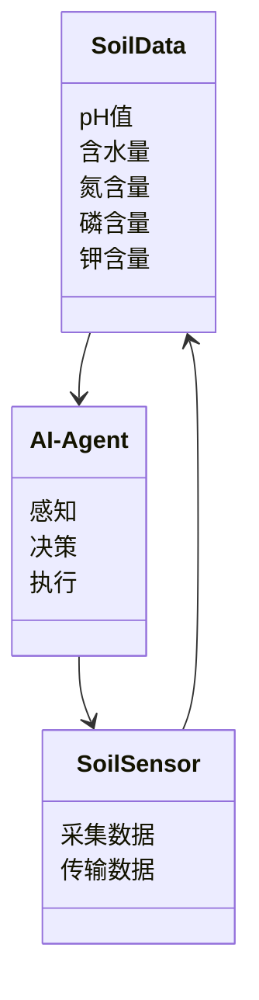
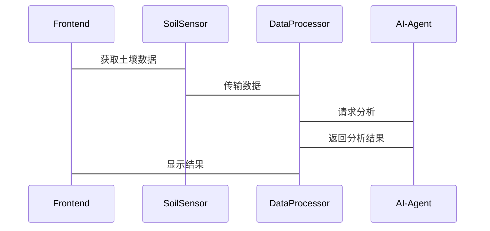

                 


```markdown
# AI Agent在智能土壤分析中的实践

> 关键词：AI Agent，智能土壤分析，土壤健康评估，机器学习，土壤污染监测

> 摘要：本文详细探讨了AI Agent在智能土壤分析中的应用，从背景、原理到系统设计和项目实现，全面解析了如何利用AI技术提升土壤分析的效率和准确性。通过实际案例和详细的技术分析，展示了AI Agent在土壤健康评估、污染监测和肥力预测中的潜力。

---

# 第一部分: AI Agent在智能土壤分析中的背景与基础

## 第1章: 智能土壤分析的背景与挑战

### 1.1 土壤分析的重要性
#### 1.1.1 土壤在农业和环境科学中的作用
土壤是农业生产和生态系统的核心要素，其健康状况直接影响农作物的产量和环境的可持续性。传统土壤分析方法依赖实验室检测，耗时长且成本高，难以满足大规模农田实时监测的需求。

#### 1.1.2 传统土壤分析方法的局限性
- 传统方法依赖人工采样和实验室分析，效率低下。
- 无法实时监测土壤动态变化，难以应对突发性污染事件。
- 数据孤岛问题严重，不同数据源难以整合。

#### 1.1.3 智能土壤分析的需求与趋势
随着农业智能化和环境监测技术的发展，对实时、高效、精准的土壤分析需求日益增加。AI Agent技术通过整合多源数据，提供智能化解决方案，成为土壤分析领域的新兴趋势。

### 1.2 AI Agent的基本概念
#### 1.2.1 人工智能与智能体的定义
AI Agent（智能体）是指能够感知环境、自主决策并执行任务的智能实体。它结合了感知、推理、学习和行动的能力，能够在动态环境中自主完成复杂任务。

#### 1.2.2 AI Agent的核心特征
- **自主性**：无需外部干预，自主完成任务。
- **反应性**：能够实时感知环境变化并做出反应。
- **学习能力**：通过数据学习优化决策策略。
- **协作性**：能够与其他智能体或系统协同工作。

#### 1.2.3 AI Agent在土壤分析中的应用潜力
AI Agent技术可以应用于土壤健康评估、污染监测、肥力预测等领域，通过实时数据采集和智能分析，提升土壤管理的科学性和效率。

## 第2章: AI Agent在土壤分析中的应用

### 2.1 土壤分析的典型场景
#### 2.1.1 土壤健康评估
通过分析土壤的物理、化学和生物特性，评估土壤健康状况，为农业决策提供依据。

#### 2.1.2 土壤污染监测
实时监测土壤中的污染物浓度，及时发现和预警污染事件。

#### 2.1.3 土壤肥力预测
基于土壤数据预测肥力变化，优化施肥方案，减少资源浪费和环境污染。

### 2.2 AI Agent在土壤分析中的优势
#### 2.2.1 高效性与准确性
AI Agent能够快速处理大量数据，提供高精度的分析结果。

#### 2.2.2 自适应性与实时性
AI Agent能够实时感知土壤变化，快速做出响应，适应不同环境条件。

#### 2.2.3 多数据源的整合能力
AI Agent能够整合传感器数据、卫星遥感数据等多种数据源，提供全面的土壤分析。

---

# 第二部分: AI Agent的核心原理与技术

## 第3章: AI Agent的核心原理

### 3.1 感知模块
#### 3.1.1 数据采集与预处理
- 数据采集：通过土壤传感器获取土壤的物理、化学和生物特性数据。
- 数据预处理：清洗、归一化和特征提取，为后续分析提供高质量数据。

#### 3.1.2 土壤数据特征提取
- 物理特性：如pH值、含水量等。
- 化学特性：如有机质含量、氮磷钾含量等。
- 生物特性：如微生物数量、酶活性等。

#### 3.1.3 数据融合技术
将多源数据进行融合，提升分析结果的准确性和全面性。

### 3.2 决策模块
#### 3.2.1 机器学习算法的选择与应用
- 监督学习：如随机森林、支持向量机（SVM）用于分类和回归任务。
- 无监督学习：如聚类分析用于土壤类型划分。
- 深度学习：如神经网络用于复杂模式识别。

#### 3.2.2 决策树与规则生成
通过决策树算法（如ID3、C4.5）生成土壤分析规则，提高决策的透明性和可解释性。

#### 3.2.3 多目标优化策略
在土壤分析中，通常需要同时优化多个目标（如最大化肥力、最小化污染），可以通过多目标优化算法（如NSGA-II）实现。

### 3.3 执行模块
#### 3.3.1 动作规划与优化
根据决策结果，规划具体的执行动作，如调整灌溉、施肥等。

#### 3.3.2 反馈机制与自适应调整
通过反馈机制，实时调整决策策略，提升系统的适应性和鲁棒性。

#### 3.3.3 系统稳定性与鲁棒性
确保系统在复杂环境和异常情况下的稳定运行，通过冗余设计和容错机制提升系统的可靠性。

## 第4章: AI Agent与土壤分析的结合

### 4.1 土壤分析的多维度数据处理
#### 4.1.1 土壤物理性质的数据建模
- 使用回归模型预测土壤的物理特性，如含水量、密度等。

#### 4.1.2 土壤化学成分的分析与预测
- 利用机器学习模型预测土壤中的氮、磷、钾含量。

#### 4.1.3 土壤生物特性的智能化评估
- 通过生物传感器和机器学习模型评估土壤中的微生物活性。

### 4.2 AI Agent在土壤分析中的具体实现
#### 4.2.1 数据流的处理与分析
- 实时采集土壤数据，通过数据流处理技术进行分析和预测。

#### 4.2.2 智能决策系统的构建
- 基于机器学习模型构建土壤分析决策系统，提供实时决策支持。

#### 4.2.3 系统的可扩展性与维护性
- 系统设计具有良好的扩展性，能够方便地添加新的传感器和数据源。

---

# 第三部分: 算法原理与系统架构设计

## 第5章: AI Agent算法原理

### 5.1 机器学习算法的选择与优化
#### 5.1.1 线性回归模型

```python
import numpy as np
from sklearn.linear_model import LinearRegression

# 示例数据：x为输入特征，y为目标值
x = np.array([[1], [2], [3], [4], [5]])
y = np.array([2, 4, 5, 4, 6])

# 创建线性回归模型
model = LinearRegression()
model.fit(x, y)

# 预测新数据
new_x = np.array([[6]])
print(model.predict(new_x))  # 输出：[[7.2]]
```

#### 5.1.2 支持向量机（SVM）

```python
from sklearn.svm import SVC

# 示例数据：训练集和测试集
X = [[0, 0], [1, 1], [1, 0], [0, 1]]
y = [0, 1, 1, 0]

# 创建SVM模型并训练
model = SVC()
model.fit(X, y)

# 预测新数据
new_X = [[2, 2]]
print(model.predict(new_X))  # 输出：[1]
```

#### 5.1.3 决策树

```python
from sklearn.tree import DecisionTreeClassifier

# 示例数据：训练集和测试集
X = [[1, 1], [1, 0], [0, 1], [0, 0]]
y = [1, 1, 0, 0]

# 创建决策树模型并训练
model = DecisionTreeClassifier()
model.fit(X, y)

# 预测新数据
new_X = [[1, 1]]
print(model.predict(new_X))  # 输出：[1]
```

### 5.2 算法原理的数学模型

#### 5.2.1 线性回归模型的数学公式
$$ y = \beta_0 + \beta_1x + \epsilon $$
其中，$\beta_0$ 是截距，$\beta_1$ 是回归系数，$\epsilon$ 是误差项。

#### 5.2.2 支持向量机的数学公式
$$ y = \text{sign}(w \cdot x + b) $$
其中，$w$ 是权重向量，$x$ 是输入向量，$b$ 是偏置项。

---

## 第6章: 系统架构设计

### 6.1 系统功能设计
#### 6.1.1 领域模型


#### 6.1.2 系统架构


### 6.2 系统接口设计
#### 6.2.1 数据接口
- 数据采集接口：从传感器获取土壤数据。
- 数据处理接口：对数据进行清洗和预处理。
- 数据分析接口：调用机器学习模型进行分析。

#### 6.2.2 系统交互流程


---

## 第7章: 项目实战

### 7.1 环境安装
- 安装Python和必要的库：numpy、pandas、scikit-learn、matplotlib。

### 7.2 核心代码实现
#### 7.2.1 数据预处理
```python
import pandas as pd
from sklearn.preprocessing import StandardScaler

# 读取数据
data = pd.read_csv('soil_data.csv')

# 分离特征与目标
X = data.drop('target', axis=1)
y = data['target']

# 数据标准化
scaler = StandardScaler()
X_scaled = scaler.fit_transform(X)
```

#### 7.2.2 模型训练
```python
from sklearn.model_selection import train_test_split
from sklearn.ensemble import RandomForestClassifier

# 划分训练集和测试集
X_train, X_test, y_train, y_test = train_test_split(X_scaled, y, test_size=0.2)

# 创建随机森林模型
model = RandomForestClassifier(n_estimators=100, max_depth=4, random_state=42)
model.fit(X_train, y_train)

# 预测测试集
y_pred = model.predict(X_test)
print('Accuracy:', model.score(X_test, y_test))
```

#### 7.2.3 结果可视化
```python
import matplotlib.pyplot as plt

# 绘制特征重要性
importances = model.feature_importances_
indices = np.argsort(importances)[::-1]

plt.figure()
plt.title('Feature Importances')
plt.bar(range(X.shape[1]), importances[indices], align='center')
plt.xticks(range(X.shape[1]), indices)
plt.show()
```

### 7.3 案例分析
#### 7.3.1 数据采集与预处理
通过土壤传感器获取土壤数据，进行清洗和标准化处理。

#### 7.3.2 模型训练与评估
使用随机森林模型进行训练，评估模型的准确性和性能。

#### 7.3.3 结果分析
分析模型预测结果，找出关键影响因素，优化土壤管理策略。

---

## 第8章: 最佳实践与小结

### 8.1 最佳实践
- 数据质量是关键，确保数据的准确性和完整性。
- 模型选择要考虑实际需求，复杂场景下采用集成学习方法。
- 系统设计要注重可扩展性和可维护性，方便后续优化和功能扩展。

### 8.2 小结
本文详细探讨了AI Agent在智能土壤分析中的应用，从理论到实践，展示了如何利用AI技术提升土壤分析的效率和准确性。通过实际案例和技术分析，证明了AI Agent在土壤健康评估、污染监测和肥力预测中的巨大潜力。

### 8.3 注意事项
- 确保数据隐私和安全，特别是在处理敏感土壤数据时。
- 定期更新模型，保持其适应性和准确性。
- 建立完善的监控机制，及时发现和处理系统异常。

### 8.4 拓展阅读
- 《机器学习实战》
- 《深度学习入门：基于Python的CNN实现》
- 《土壤科学导论》

---

# 作者

作者：AI天才研究院/AI Genius Institute & 禅与计算机程序设计艺术 /Zen And The Art of Computer Programming
```

