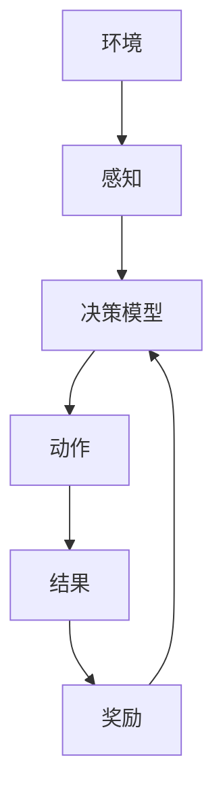
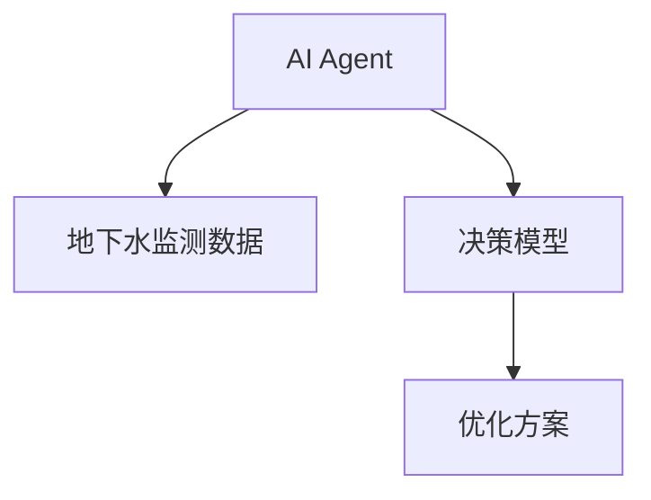
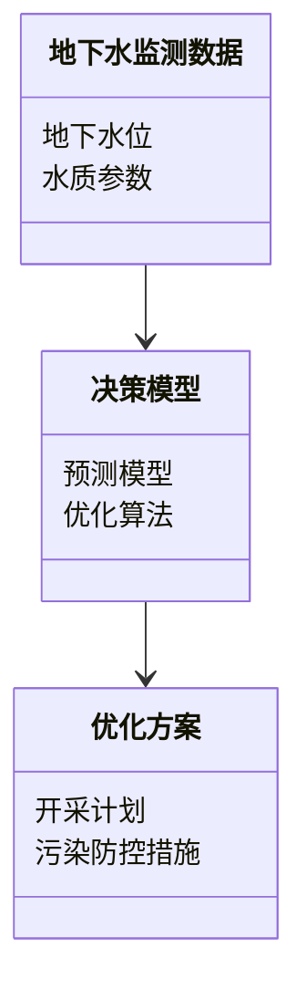
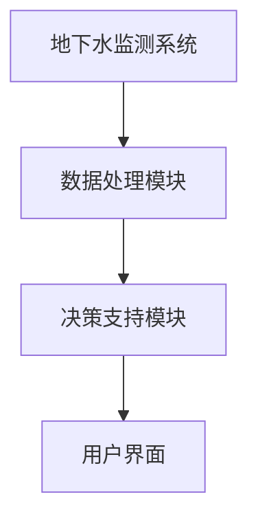
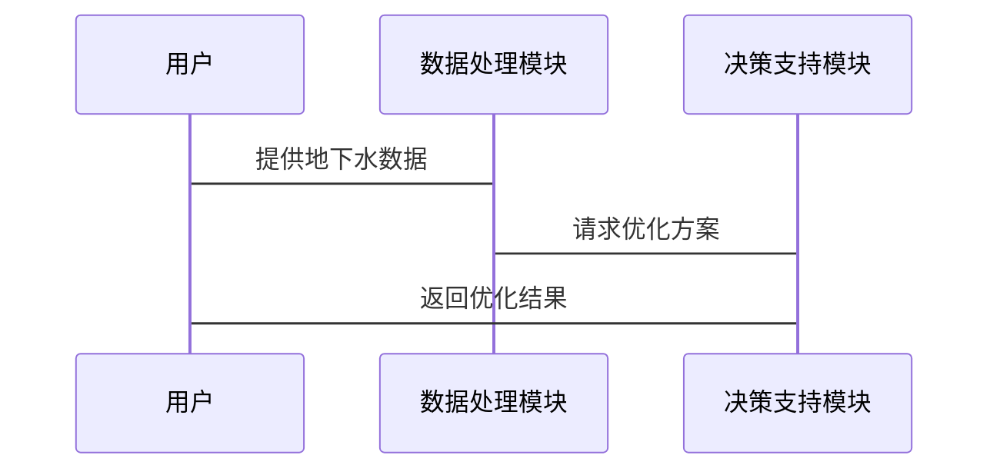

                 


# AI Agent在智能地下水资源管理中的实践

> **关键词**：AI Agent，地下水资源管理，智能优化，强化学习，环境监测，可持续发展  
>
> **摘要**：随着全球水资源短缺问题日益严重，地下水资源管理的重要性愈发凸显。本文探讨AI Agent技术在地下水资源管理中的实践应用，分析其在监测、预测和优化中的作用。通过强化学习算法，结合实际案例，详细阐述AI Agent在地下水管理中的优势与挑战，为实现可持续水资源管理提供新的思路。

---

# 第一部分: AI Agent与地下水资源管理的背景与概念

## 第1章: AI Agent与地下水资源管理的背景

### 1.1 地下水资源管理的背景与挑战

#### 1.1.1 地下水资源的重要性
地下水资源是全球水资源的重要组成部分，为农业、工业和居民生活提供水源支持。然而，随着人口增长和气候变化，地下水超采、污染等问题日益严重，威胁生态平衡和经济发展。

#### 1.1.2 当前地下水资源管理的痛点
- 数据采集困难：地下水分布复杂，监测点有限，难以全面掌握地下水动态。
- 污染风险：工业废水、农业面源污染等对地下水造成威胁。
- 管理效率低：传统管理依赖人工经验，难以快速响应变化。

#### 1.1.3 AI技术在水资源管理中的潜力
AI技术能够实时分析海量数据，预测地下水变化趋势，优化管理策略，为科学决策提供支持。

### 1.2 AI Agent的基本概念与特点

#### 1.2.1 AI Agent的定义
AI Agent（智能体）是能够感知环境、自主决策并执行任务的智能系统。它能够通过传感器获取数据，利用算法处理信息，并根据结果采取行动。

#### 1.2.2 AI Agent的核心特点
- **自主性**：无需外部干预，自主完成任务。
- **反应性**：能够实时感知环境变化并调整行为。
- **学习能力**：通过数据反馈不断优化决策模型。
- **协作性**：能够与其他系统或AI Agent协同工作。

#### 1.2.3 AI Agent与传统算法的区别
AI Agent不仅能够处理数据，还能根据环境动态调整策略，具有更强的适应性和灵活性。

### 1.3 AI Agent在地下水资源管理中的应用前景

#### 1.3.1 AI Agent在水资源管理中的潜在应用领域
- **地下水监测**：实时监测地下水位、水质等参数。
- **污染防控**：预测污染扩散路径，制定防控措施。
- **优化开采**：根据地下水储量动态，优化开采计划。

#### 1.3.2 企业采用AI Agent的优势
- 提高管理效率：通过智能化系统减少人工干预。
- 实时监控：快速响应地下水变化，降低风险。
- 数据驱动决策：基于实时数据优化管理策略。

#### 1.3.3 AI Agent应用的挑战与机遇
- **挑战**：数据不足、模型精度、计算资源需求。
- **机遇**：技术创新、政策支持、市场需求。

### 1.4 本章小结
本章介绍了地下水资源管理的背景与挑战，阐述了AI Agent的基本概念和特点，并分析了其在水资源管理中的应用前景。通过AI Agent技术，能够显著提升地下水管理的效率和科学性。

---

# 第二部分: AI Agent的核心概念与原理

## 第2章: AI Agent的核心概念与原理

### 2.1 AI Agent的核心概念

#### 2.1.1 AI Agent的定义与分类
AI Agent可以分为简单反射型、基于模型的反应型、目标驱动型和效用驱动型四种类型，适用于不同的应用场景。

#### 2.1.2 AI Agent的决策机制
AI Agent通过感知环境、分析数据、制定策略并执行行动，实现对地下水的智能管理。

#### 2.1.3 AI Agent的感知与行动能力
AI Agent能够通过传感器、数据库等获取环境信息，并通过执行器（如水泵、阀门）进行操作。

### 2.2 AI Agent的算法原理

#### 2.2.1 强化学习算法
强化学习是一种通过试错优化决策的算法，常用于AI Agent的训练。

##### Q-learning算法
Q-learning是一种经典的强化学习算法，适用于离线训练。其公式如下：
$$ Q(s, a) = (1-\alpha)Q(s, a) + \alpha [r + \max_{a'} Q(s', a')] $$
其中，$\alpha$是学习率，$r$是奖励，$s$是当前状态，$a$是当前动作，$s'$是下一状态。

##### 算法流程图


#### 2.2.2 监督学习算法
监督学习通过标注数据训练模型，常用于地下水位预测等任务。

##### 回归树算法
回归树是一种常用的监督学习方法，适用于地下水位预测。
$$ y = a x + b $$
其中，$y$是预测值，$x$是输入特征，$a$和$b$是模型参数。

#### 2.2.3 混合算法
结合强化学习和监督学习的优势，适用于复杂场景。

### 2.3 AI Agent的数学模型与公式

#### 2.3.1 Q-learning算法公式
$$ Q(s, a) = (1-\alpha)Q(s, a) + \alpha [r + \max_{a'} Q(s', a')] $$

#### 2.3.2 回归树公式
$$ y = a x + b $$

### 2.4 AI Agent的实体关系图

#### 实体关系图


### 2.5 本章小结
本章详细介绍了AI Agent的核心概念、算法原理和数学模型，并通过图表展示了实体关系，为后续的系统设计奠定了基础。

---

# 第三部分: AI Agent在地下水资源管理中的系统分析与架构设计

## 第3章: 系统分析与架构设计

### 3.1 问题场景介绍

#### 3.1.1 问题描述
某地区地下水位持续下降，污染风险增加，亟需智能化管理方案。

#### 3.1.2 项目目标
实现地下水实时监测、污染防控和优化开采。

### 3.2 项目介绍

#### 3.2.1 项目背景
某城市因过度开采地下水导致地面沉降，需引入AI Agent技术进行管理。

#### 3.2.2 项目范围
涵盖地下水监测、污染预警、开采优化三大模块。

### 3.3 系统功能设计

#### 3.3.1 功能模块划分
- 数据采集模块：实时采集地下水位、水质数据。
- 数据分析模块：预测地下水变化趋势。
- 决策支持模块：优化开采计划。

#### 3.3.2 领域模型类图


### 3.4 系统架构设计

#### 3.4.1 系统架构图


#### 3.4.2 系统接口设计
- 数据接口：传感器数据接口。
- 用户接口：Web界面或移动应用。

### 3.5 系统交互设计

#### 3.5.1 交互流程图


### 3.6 本章小结
本章详细分析了地下水管理系统的功能、架构和交互流程，为后续的系统实现提供了设计依据。

---

# 第四部分: 项目实战

## 第4章: 项目实战

### 4.1 环境安装

#### 4.1.1 安装Python环境
```bash
python --version
pip install numpy matplotlib scikit-learn
```

### 4.2 系统核心实现

#### 4.2.1 数据采集模块
```python
import numpy as np

# 模拟地下水监测数据
def generate_data(n):
    return np.random.uniform(0, 1, n)
```

#### 4.2.2 数据分析模块
```python
from sklearn.tree import DecisionTreeRegressor

# 训练回归树模型
model = DecisionTreeRegressor()
model.fit(X_train, y_train)
```

#### 4.2.3 决策支持模块
```python
# 使用Q-learning算法优化决策
def update_Q(s, a, r, s_prime):
    global Q
    Q[s][a] = (1 - alpha) * Q[s][a] + alpha * (r + max(Q[s_prime][:]))

alpha = 0.1
Q = {}  # 初始化Q表
update_Q(current_state, action, reward, next_state)
```

### 4.3 案例分析

#### 4.3.1 案例场景
某地区地下水位连续下降，AI Agent通过预测和优化，制定科学开采计划。

#### 4.3.2 实施效果
- 地下水位下降速度减缓。
- 污染风险降低。

### 4.4 本章小结
本章通过实际案例展示了AI Agent在地下水管理中的应用，验证了其有效性和优势。

---

# 第五部分: 最佳实践与总结

## 第5章: 最佳实践与总结

### 5.1 小结
AI Agent在地下水管理中的应用显著提升了管理效率和科学性。

### 5.2 注意事项
- 数据质量：确保数据的准确性和完整性。
- 模型优化：根据实际场景调整算法参数。
- 安全性：保护数据隐私和系统安全。

### 5.3 拓展阅读
建议读者深入学习强化学习和系统架构设计，探索AI技术在其他领域的应用。

---

**作者：AI天才研究院/AI Genius Institute & 禅与计算机程序设计艺术 /Zen And The Art of Computer Programming**

