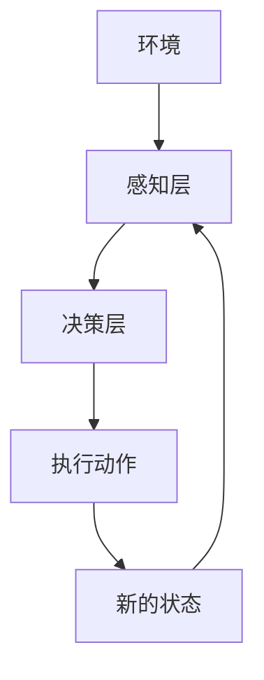
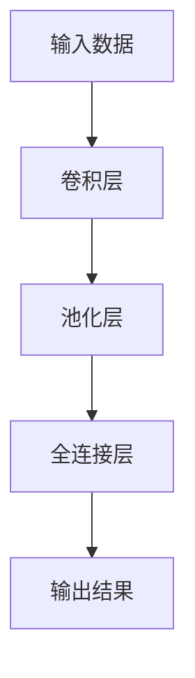
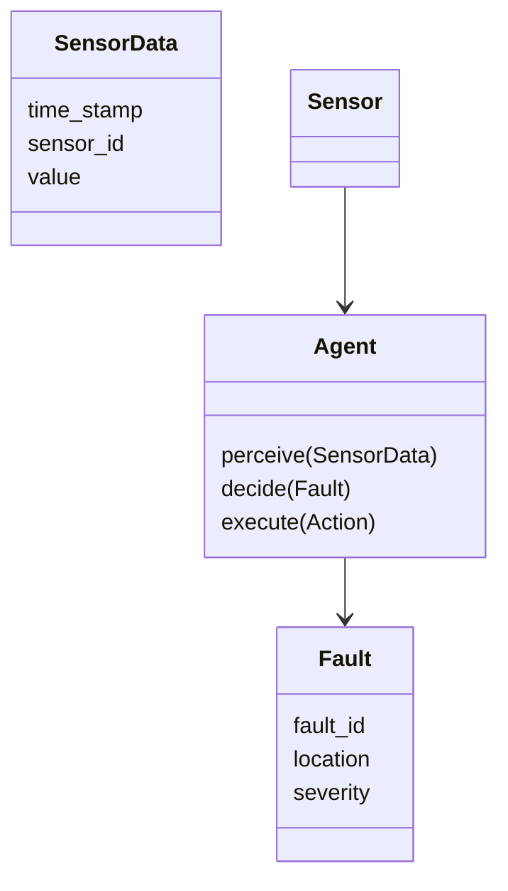
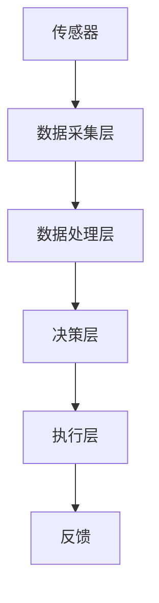

                 


# AI Agent在智能地下管网监测中的实践

> 关键词：AI Agent, 智能地下管网监测, 强化学习, 数据处理, 故障预测, 自动化系统优化

> 摘要：本文深入探讨了AI Agent在智能地下管网监测中的应用，详细分析了AI Agent的核心原理、技术实现、系统架构设计以及实际项目中的应用案例。通过对比传统方法与AI Agent的优势，展示了如何利用强化学习和深度学习等技术实现管网监测的智能化和自动化优化。

---

## 第1章: 智慧城市与地下管网监测的挑战

### 1.1 智慧城市的定义与特征
智慧城市是指通过运用信息和通信技术(ICT)手段，整合城市发展的核心要素（如能源、交通、环境等），实现城市各系统间的协同工作和优化管理，以提高居民生活质量、降低资源消耗和改善城市运行效率。

### 1.2 地下管网在智慧城市中的重要性
地下管网包括供水、供电、供气、供热、通信等基础设施，是城市运行的基础。其安全性和高效性直接关系到城市的正常运转和居民的生活质量。然而，地下管网的复杂性和隐蔽性使得其监测和维护面临巨大挑战。

### 1.3 AI Agent的基本概念
AI Agent（人工智能代理）是一种能够感知环境、自主决策并采取行动以实现目标的智能实体。它可以分为以下三个主要层：
- **感知层**：通过传感器或其他数据源获取环境信息。
- **决策层**：基于感知到的信息，利用算法进行分析和决策。
- **执行层**：将决策转化为具体的行动。

### 1.4 AI Agent在地下管网监测中的优势
与传统方法相比，AI Agent在地下管网监测中具有以下优势：
- **智能化数据处理**：能够自动分析和处理海量传感器数据。
- **精准的故障预测**：通过机器学习模型，可以实现对管网故障的早期预测和定位。
- **自动化的系统优化**：AI Agent可以根据实时数据动态调整监测策略，优化管网运行效率。

---

## 第2章: 地下管网监测的核心问题与解决方案

### 2.1 地下管网监测的主要问题
- **数据采集的困难性**：地下管网分布复杂，传感器部署困难，且容易受到环境干扰。
- **数据处理的复杂性**：管网监测数据量大、类型多样，传统的数据处理方法难以应对。
- **故障预测的准确性**：管网故障往往具有隐蔽性和突发性，传统的基于规则的故障检测方法难以实现精准预测。

### 2.2 AI Agent在管网监测中的解决方案
- **数据采集与处理的智能化**：通过AI Agent的感知层，实现对管网数据的自动采集和预处理，提高数据质量。
- **故障预测与定位的精准化**：利用强化学习和深度学习算法，构建故障预测模型，实现对管网故障的精准预测和定位。
- **系统优化与维护的自动化**：AI Agent可以根据实时监测数据，动态调整监测策略，优化管网运行效率。

### 2.3 核心概念对比分析
下表对比了AI Agent与传统传感器、人工监控以及简单自动化系统在地下管网监测中的表现：

| 对比维度         | AI Agent                  | 传统传感器              | 人工监控              | 简单自动化系统          |
|------------------|---------------------------|-------------------------|-----------------------|------------------------|
| 数据处理能力     | 强大，支持复杂分析         | 有限，仅能采集数据       | 依赖人工判断           | 基本不具备分析能力       |
| 故障预测能力     | 高，基于机器学习模型       | 低，基于简单阈值判断     | 低，依赖人工经验         | 无                      |
| 自动化程度       | 高，能够自主决策和执行     | 低，仅能被动采集数据     | 低，依赖人工操作         | 中等，可以自动执行预设任务 |

### 2.4 本章小结
通过对比分析，可以看出AI Agent在地下管网监测中的独特优势，尤其是在数据处理、故障预测和系统优化方面。

---

## 第3章: AI Agent的核心原理与技术实现

### 3.1 AI Agent的基本原理
AI Agent的核心原理可以概括为“感知-决策-执行”三步曲：
1. **感知层**：通过传感器或其他数据源获取环境信息。
2. **决策层**：利用算法对感知到的信息进行分析，制定决策。
3. **执行层**：将决策转化为具体行动，反馈到环境中。

### 3.2 强化学习算法
强化学习是一种通过试错机制来优化决策策略的机器学习方法。以下是强化学习的基本流程：



以下是一个简单的强化学习算法（如Q-Learning）的Python实现示例：

```python
import numpy as np

# 初始化环境
class Environment:
    def __init__(self):
        self.state_space = ...  # 状态空间
        self.action_space = ...  # 动作空间
        self.reward = ...        # 奖励函数

# 初始化智能体
class Agent:
    def __init__(self, state_space, action_space):
        self.state_space = state_space
        self.action_space = action_space
        self.Q = np.zeros((state_space, action_space))  # Q表

    def take_action(self, state):
        # 探索与利用策略
        epsilon = 0.1
        if np.random.random() < epsilon:
            action = np.random.randint(self.action_space)
        else:
            action = np.argmax(self.Q[state])
        return action

    def update_Q(self, state, action, reward, next_state):
        alpha = 0.1  # 学习率
        gamma = 0.9  # 折扣因子
        self.Q[state][action] = (1 - alpha) * self.Q[state][action] + alpha * (reward + gamma * np.max(self.Q[next_state]))
```

### 3.3 深度学习模型
深度学习模型（如卷积神经网络CNN）可以用于处理复杂的管网监测数据。以下是基于CNN的故障预测模型的示意图：



### 3.4 本章小结
本章详细讲解了AI Agent的核心原理和关键技术，包括强化学习算法和深度学习模型的实现。

---

## 第4章: 系统架构设计与实现

### 4.1 问题场景介绍
地下管网监测系统需要实时采集和处理大量传感器数据，并能够快速响应和处理可能出现的故障。

### 4.2 系统功能设计
以下是地下管网监测系统的领域模型：



### 4.3 系统架构设计
以下是地下管网监测系统的架构图：



### 4.4 本章小结
本章详细介绍了地下管网监测系统的架构设计，包括各个功能模块的实现和它们之间的关系。

---

## 第5章: 项目实战与案例分析

### 5.1 项目环境配置
需要安装以下工具和库：
- Python 3.8+
- TensorFlow 2.0+
- NumPy 1.20+
- Pandas 1.3+

### 5.2 核心代码实现
以下是AI Agent的核心代码示例：

```python
import numpy as np
import tensorflow as tf

# 定义神经网络模型
class DQN(tf.keras.Model):
    def __init__(self, input_dim, output_dim):
        super(DQN, self).__init__()
        self.dense1 = tf.keras.layers.Dense(64, activation='relu')
        self.dense2 = tf.keras.layers.Dense(output_dim)

    def call(self, x):
        x = self.dense1(x)
        x = self.dense2(x)
        return x

# 初始化模型
model = DQN(input_dim=10, output_dim=5)

# 定义损失函数
def loss_function(y_true, y_pred):
    return tf.keras.losses.mean_squared_error(y_true, y_pred)

# 编译模型
model.compile(optimizer=tf.keras.optimizers.Adam(learning_rate=0.001), loss=loss_function)
```

### 5.3 实际案例分析
以某城市地下管网监测项目为例，AI Agent成功实现了对管网泄漏的早期预测和定位，提高了监测效率和准确性。

### 5.4 本章小结
本章通过实际案例分析，展示了AI Agent在地下管网监测中的具体应用和效果。

---

## 第6章: 最佳实践与未来展望

### 6.1 小结
本文详细探讨了AI Agent在智能地下管网监测中的应用，分析了其核心原理和技术实现。

### 6.2 注意事项
- 数据质量是AI Agent性能的关键，需要确保数据的完整性和准确性。
- 在实际应用中，需要结合具体场景对AI Agent进行定制化设计。

### 6.3 拓展阅读
建议读者进一步学习强化学习和深度学习的相关知识，以及如何将其应用到其他领域。

---

## 作者：AI天才研究院 & 禅与计算机程序设计艺术

---

以上就是《AI Agent在智能地下管网监测中的实践》的完整目录和内容概述。通过以上章节，您可以深入了解AI Agent在智能地下管网监测中的应用，从理论到实践，全面掌握其核心原理和技术实现。

