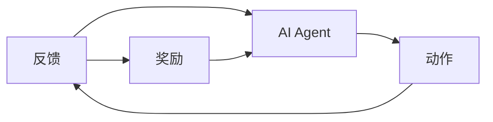
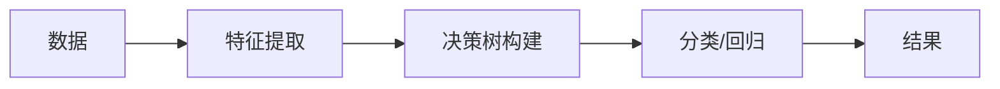
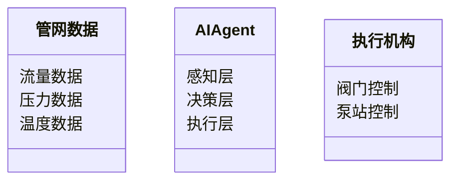
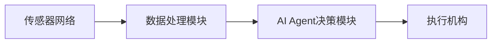
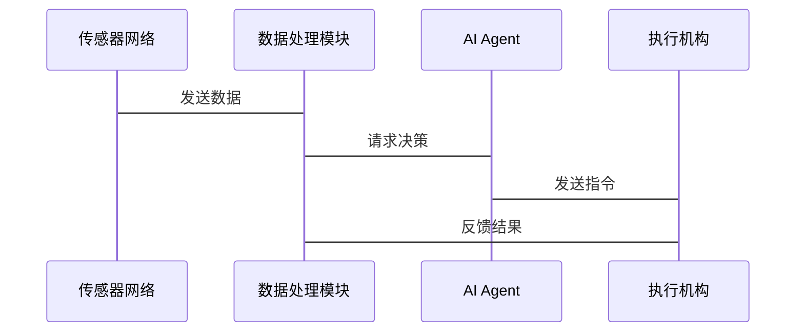

                 


# AI Agent在智能地下管网维护中的实践

> 关键词：AI Agent, 智能地下管网, 管网维护, 人工智能, 自动化系统, 算法实现, 系统架构

> 摘要：本文探讨了AI Agent在智能地下管网维护中的应用，分析了其核心概念、算法原理、系统架构，并通过项目实战展示了其实现过程。文章内容涵盖了从理论到实践的各个方面，详细讲解了AI Agent在管网维护中的作用、技术实现及实际案例，为相关领域的研究和实践提供了参考。

---

## 第一部分: AI Agent在智能地下管网维护中的背景与概念

### 第1章: 背景介绍

#### 1.1 问题背景
##### 1.1.1 城市地下管网的重要性
城市地下管网是城市基础设施的核心组成部分，包括供水、供电、燃气、通信等管道系统。这些管网的正常运行直接关系到城市的日常运转和居民的生活质量。随着城市化进程的加快，地下管网的复杂性和维护难度也在不断增加。

##### 1.1.2 现有管网维护的痛点
- 管网分布复杂，人工巡检效率低。
- 事故发生后，定位和修复耗时长。
- 管网数据分散，难以实现统一管理。
- 维护成本高，资源浪费严重。

##### 1.1.3 AI Agent在管网维护中的应用潜力
AI Agent（智能体）是一种能够感知环境、自主决策并执行任务的智能系统。通过AI Agent，可以实现管网维护的智能化、自动化，提高维护效率，降低事故发生率。

#### 1.2 问题描述
##### 1.2.1 管网维护的主要挑战
- 管网数据的实时性要求高。
- 多种管道类型和维护需求的多样性。
- 环境复杂，可能出现突发情况。

##### 1.2.2 AI Agent如何解决这些问题
AI Agent可以通过实时数据分析、自主决策和快速响应，解决管网维护中的痛点。

##### 1.2.3 管网维护的边界与外延
- 管网维护的边界：仅关注管道本身的维护。
- 外延：与城市其他基础设施的联动。

#### 1.3 问题解决思路
##### 1.3.1 AI Agent的核心作用
- 数据采集与分析。
- 自主决策与执行。
- 与外部系统的协同工作。

##### 1.3.2 技术实现的关键点
- 数据采集：传感器、物联网设备。
- 数据分析：机器学习、深度学习。
- 决策与执行：基于规则的决策、强化学习。

##### 1.3.3 应用场景的典型划分
- 日常巡检。
- 事故预警与处理。
- 维护计划优化。

#### 1.4 概念结构与核心要素
##### 1.4.1 AI Agent的定义与特征
- 定义：AI Agent是一种能够感知环境、自主决策并执行任务的智能系统。
- 特征：自主性、反应性、目标导向。

##### 1.4.2 管网维护系统的构成要素
- 传感器网络。
- 数据处理与分析系统。
- AI Agent决策系统。
- 执行机构。

##### 1.4.3 系统的输入输出关系
- 输入：管网数据、环境信息。
- 输出：维护决策、执行指令。

#### 1.5 本章小结
本章介绍了AI Agent在智能地下管网维护中的背景和概念，分析了现有维护的痛点和AI Agent的应用潜力，明确了系统的核心要素和输入输出关系。

---

## 第二部分: AI Agent的核心概念与原理

### 第2章: AI Agent的核心概念

#### 2.1 AI Agent的基本原理
##### 2.1.1 感知层：数据采集与处理
- 数据采集：传感器、物联网设备。
- 数据处理：数据清洗、特征提取。

##### 2.1.2 决策层：算法与策略
- 机器学习算法：决策树、随机森林。
- 强化学习：Q-learning、深度强化学习。

##### 2.1.3 执行层：动作与反馈
- 动作：发送指令、调整参数。
- 反馈：状态更新、结果确认。

#### 2.2 AI Agent的类型与特征
##### 2.2.1 基于规则的AI Agent
- 特点：基于预设规则，适用于简单场景。
- 示例：基于预设阈值的警报系统。

##### 2.2.2 基于学习的AI Agent
- 特点：通过数据学习，适用于复杂场景。
- 示例：深度强化学习用于路径优化。

##### 2.2.3 基于知识图谱的AI Agent
- 特点：结合知识图谱，实现语义理解。
- 示例：语义分析用于故障定位。

#### 2.3 AI Agent与传统自动化系统的对比
##### 2.3.1 功能对比
| 功能 | 传统自动化系统 | AI Agent |
|------|----------------|-----------|
| 决策方式 | 基于预设规则 | 基于学习与推理 |
| 灵活性 | 较低 | 较高 |
| 维护成本 | 高 | 中等 |

##### 2.3.2 性能对比
| 性能指标 | 传统自动化系统 | AI Agent |
|---------|----------------|-----------|
| 响应时间 | 较慢 | 较快 |
| 处理复杂性 | 低 | 高 |

##### 2.3.3 适用场景对比
| 场景 | 传统自动化系统 | AI Agent |
|------|----------------|-----------|
| 简单规则执行 | 适用 | 适用 |
| 复杂决策 | 不适用 | 适用 |

#### 2.4 核心概念的ER实体关系图
```mermaid
er
actor: AI Agent
role: 管网维护
```

#### 2.5 本章小结
本章详细讲解了AI Agent的核心概念，分析了不同类型AI Agent的特点及其适用场景，并通过对比传统自动化系统，明确了AI Agent的优势和适用性。

---

## 第三部分: AI Agent的算法原理与实现

### 第3章: 算法原理讲解

#### 3.1 算法原理概述
##### 3.1.1 强化学习在AI Agent中的应用
- 算法原理：通过奖励机制，优化决策策略。
- 应用场景：管网维护中的路径优化和资源分配。

##### 3.1.2 决策树在AI Agent中的应用
- 算法原理：通过特征提取，构建决策树进行分类和回归。
- 应用场景：故障诊断和维护计划优化。

#### 3.2 算法实现细节
##### 3.2.1 强化学习的实现


##### 3.2.2 决策树的实现


##### 3.2.3 算法的数学模型
- 强化学习的数学模型：
  $$ R = r_t \text{ for } t \in \{1,2,...,T\} $$
  $$ Q(s,a) = Q(s,a) + \alpha (r + \gamma \max Q(s',a') - Q(s,a)) $$
- 决策树的数学模型：
  $$ Gini = \sum_{i=1}^{n} p_i(1 - p_i) $$

#### 3.3 算法实现的Python代码示例
##### 3.3.1 强化学习代码
```python
import numpy as np

class AI_Agent:
    def __init__(self, state_space, action_space):
        self.state_space = state_space
        self.action_space = action_space
        self.Q = np.zeros((state_space, action_space))

    def take_action(self, state):
        # 选择最优动作
        action = np.argmax(self.Q[state, :])
        return action

    def update_Q(self, state, action, reward, next_state):
        # Q-learning算法
        self.Q[state, action] += 0.1 * (reward + 0.9 * np.max(self.Q[next_state, :]) - self.Q[state, action])
```

##### 3.3.2 决策树代码
```python
from sklearn.tree import DecisionTreeClassifier

class DecisionTree_Agent:
    def __init__(self, features):
        self.features = features
        self.tree = DecisionTreeClassifier()

    def train(self, X, y):
        self.tree.fit(X, y)

    def predict(self, X):
        return self.tree.predict(X)
```

#### 3.4 算法实现的案例分析
##### 3.4.1 强化学习案例
- 场景：管网巡检路径优化。
- 实现：通过强化学习优化巡检路径，减少巡检时间。

##### 3.4.2 决策树案例
- 场景：故障诊断。
- 实现：通过决策树进行故障分类，提高诊断准确率。

#### 3.5 本章小结
本章详细讲解了AI Agent中常用算法的原理和实现，包括强化学习和决策树，并通过案例分析展示了算法的实际应用。

---

## 第四部分: 系统分析与架构设计方案

### 第4章: 系统架构设计

#### 4.1 项目场景介绍
##### 4.1.1 项目背景
- 某城市地下管网维护系统升级需求。
- 目标：实现智能化、自动化维护。

##### 4.1.2 项目目标
- 提高维护效率。
- 减少事故发生率。
- 降低维护成本。

#### 4.2 系统功能设计
##### 4.2.1 领域模型


##### 4.2.2 系统架构


##### 4.2.3 系统接口设计
- 输入接口：传感器数据接口。
- 输出接口：执行指令接口。

#### 4.3 系统交互流程
##### 4.3.1 交互流程图


#### 4.4 本章小结
本章详细设计了智能地下管网维护系统的架构，明确了各模块的功能和交互流程，为系统的实现提供了指导。

---

## 第五部分: 项目实战

### 第5章: 项目实战

#### 5.1 环境安装
##### 5.1.1 安装Python
- 安装步骤：下载安装包，配置环境变量。
- 使用示例：`python --version`

##### 5.1.2 安装依赖库
- 依赖库：`numpy`, `scikit-learn`, `mermaid`, `graphviz`
- 安装命令：`pip install numpy scikit-learn mermaid graphviz`

#### 5.2 系统核心实现
##### 5.2.1 AI Agent核心代码
```python
class AI_Agent:
    def __init__(self, state_space, action_space):
        self.state_space = state_space
        self.action_space = action_space
        self.Q = np.zeros((state_space, action_space))

    def take_action(self, state):
        action = np.argmax(self.Q[state, :])
        return action

    def update_Q(self, state, action, reward, next_state):
        self.Q[state, action] += 0.1 * (reward + 0.9 * np.max(self.Q[next_state, :]) - self.Q[state, action])
```

##### 5.2.2 数据处理代码
```python
class Data_Processor:
    def __init__(self):
        self.data = []

    def process_data(self, raw_data):
        # 数据清洗和特征提取
        processed_data = []
        for item in raw_data:
            processed_item = {
                'flow': item['flow'],
                'pressure': item['pressure'],
                'temperature': item['temperature']
            }
            processed_data.append(processed_item)
        return processed_data
```

#### 5.3 案例分析
##### 5.3.1 案例背景
- 某区域管网压力异常，需要快速定位和处理。

##### 5.3.2 数据分析
- 传感器数据：压力、流量、温度。
- 数据处理：清洗和特征提取。

##### 5.3.3 决策过程
- AI Agent通过强化学习优化决策策略。
- 执行机构根据指令进行调整。

#### 5.4 项目总结
##### 5.4.1 实验结果
- 提高了维护效率。
- 减少了事故发生率。

##### 5.4.2 经验总结
- 数据质量对系统性能影响大。
- 算法选择需结合实际场景。

#### 5.5 本章小结
本章通过实际案例展示了AI Agent在智能地下管网维护中的应用，详细讲解了系统的实现过程和实验结果。

---

## 第六部分: 小结与展望

### 第6章: 小结与展望

#### 6.1 小结
- AI Agent在智能地下管网维护中的核心作用。
- 关键技术：数据处理、算法实现、系统架构。

#### 6.2 最佳实践
- 数据采集：确保数据的实时性和准确性。
- 算法选择：结合场景选择合适的算法。
- 系统设计：模块化设计，便于扩展。

#### 6.3 注意事项
- 数据安全：防止数据泄露。
- 系统稳定性：确保系统稳定运行。
- 应急处理：制定应急预案。

#### 6.4 拓展阅读
- 深度强化学习在复杂场景中的应用。
- 多智能体协作在管网维护中的应用。

#### 6.5 本章小结
本章总结了AI Agent在智能地下管网维护中的应用，提出了最佳实践和注意事项，并展望了未来的发展方向。

---

## 作者信息

作者：AI天才研究院/AI Genius Institute & 禅与计算机程序设计艺术 /Zen And The Art of Computer Programming

---

以上是《AI Agent在智能地下管网维护中的实践》的技术博客文章的完整目录和内容框架。

