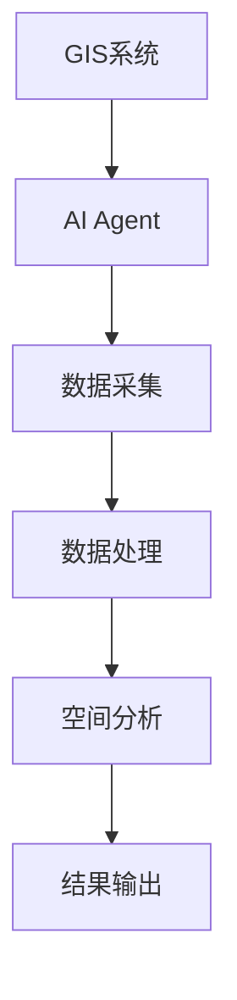
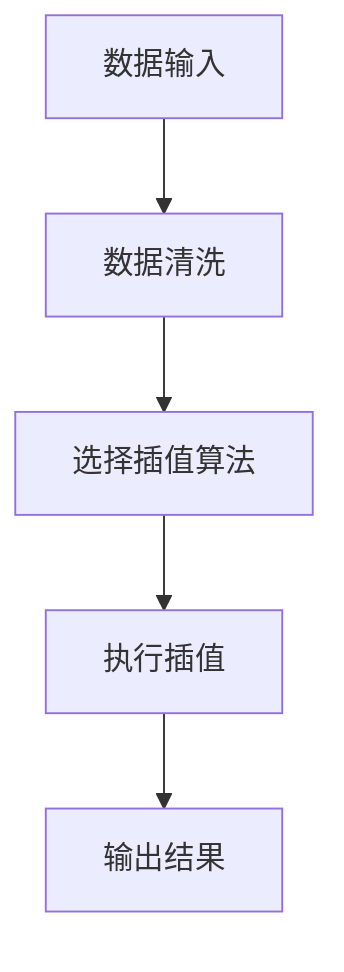
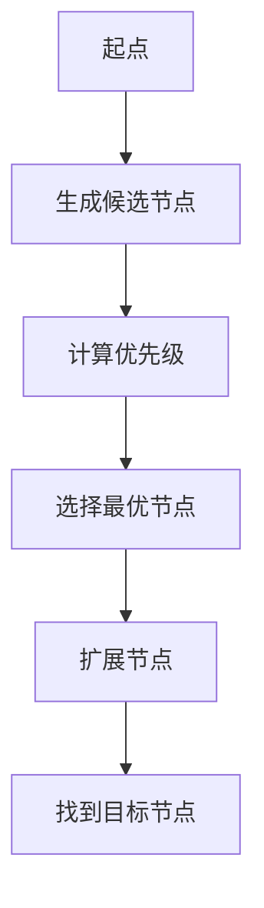

                 


# AI Agent在智能地理信息系统中的实践

---

## 关键词

- AI Agent
- 智能地理信息系统
- 空间数据分析
- 机器学习
- GIS系统架构

---

## 摘要

本文探讨AI Agent在智能地理信息系统（GIS）中的实践应用，详细分析AI Agent的基本概念、核心算法、系统架构设计以及实际项目案例。通过理论与实践结合的方式，揭示AI Agent如何提升GIS系统的智能化水平，解决复杂的空间数据分析与决策问题。

---

## 第一部分: AI Agent与智能地理信息系统概述

### 第1章: AI Agent的基本概念与背景

#### 1.1 AI Agent的定义与特点

AI Agent（人工智能代理）是一种能够感知环境、自主决策并执行任务的智能实体。其核心特点包括：

- **自主性**：无需外部干预，自主完成任务。
- **反应性**：能够实时感知环境变化并做出响应。
- **目标导向**：基于目标驱动行为。
- **学习能力**：通过数据学习优化决策能力。

AI Agent与传统GIS的区别主要体现在智能化程度上，传统GIS依赖人工操作，而AI Agent能够实现自动化分析与决策。

#### 1.2 智能地理信息系统的概念

智能GIS是在传统GIS基础上，融入人工智能技术，使其具备自主分析、决策和优化能力。其主要特点包括：

- **智能化**：通过AI技术实现自动化空间分析。
- **实时性**：能够实时处理动态数据。
- **自适应性**：能够根据环境变化调整分析策略。

智能GIS的核心功能包括空间数据处理、空间分析、实时监测与预警等。

#### 1.3 AI Agent在智能GIS中的应用背景

随着地理信息系统的广泛应用，对智能化需求日益增加。AI Agent在智能GIS中的应用背景包括：

- **复杂空间数据分析**：需要处理海量、多源的空间数据。
- **动态环境适应**：需要应对实时变化的地理环境。
- **高效决策支持**：需要快速提供决策支持。

目前，AI Agent在智能GIS中的研究主要集中在空间数据分析、路径规划、实时监测等领域，但仍面临数据处理效率、算法优化等挑战。

---

### 第2章: AI Agent与地理信息系统的结合

#### 2.1 AI Agent在GIS中的核心作用

AI Agent在智能GIS中的核心作用包括：

- **数据处理与分析**：AI Agent能够自动化处理GIS中的空间数据，包括数据清洗、特征提取等。
- **空间推理与决策**：基于机器学习算法，AI Agent能够进行空间推理和决策，帮助用户做出最优选择。
- **实时数据更新与反馈**：AI Agent能够实时更新GIS数据，并根据反馈调整分析策略。

#### 2.2 AI Agent的基本架构

AI Agent的基本架构包括：

- **感知层**：负责数据的采集与感知，如传感器数据采集。
- **决策层**：基于感知数据进行分析与决策，如路径规划。
- **执行层**：根据决策结果执行操作，如调整设备参数。

#### 2.3 AI Agent与GIS系统的交互流程

AI Agent与GIS系统的交互流程如下：

1. **数据输入**：GIS系统将空间数据传输给AI Agent。
2. **数据处理**：AI Agent对数据进行清洗、特征提取等处理。
3. **空间分析**：AI Agent基于机器学习算法进行空间分析与推理。
4. **结果输出**：AI Agent将分析结果反馈给GIS系统。
5. **实时更新**：根据反馈信息，AI Agent实时更新数据并调整分析策略。

---

## 第二部分: AI Agent的核心算法与数学模型

### 第3章: AI Agent的核心算法与数学模型

#### 3.1 空间数据处理算法

##### 3.1.1 空间插值算法

空间插值算法用于处理空间数据中的缺失值，常用算法包括：

- **IDW（反距离加权插值）**：基于距离的倒数加权。
- **Kriging（克里金法）**：基于统计学的空间插值方法。
- ** spline插值**：基于样条函数的插值方法。

##### 3.1.2 空间聚类算法

空间聚类算法用于识别空间数据中的聚类区域，常用算法包括：

- **K-means**：基于距离的聚类算法。
- **DBSCAN**：基于密度的空间聚类算法。
- **Spatial Clustering with Grid**：基于网格的空间聚类算法。

##### 3.1.3 空间分类算法

空间分类算法用于对空间数据进行分类，常用算法包括：

- **随机森林**：基于决策树的分类算法。
- **支持向量机（SVM）**：基于统计学习的分类算法。
- **K-近邻（KNN）**：基于相似性的分类算法。

#### 3.2 AI Agent的路径规划算法

##### 3.2.1 A*算法原理

A*算法是一种基于启发式搜索的路径规划算法，其基本原理如下：

1. **初始化**：设置起点和目标点。
2. **生成候选节点**：从起点出发，生成所有可能的移动节点。
3. **计算优先级**：根据启发函数计算每个候选节点的优先级。
4. **选择最优节点**：选择优先级最高的节点进行扩展。
5. **重复**：重复上述步骤，直到找到目标节点。

A*算法的数学模型如下：

$$ f(n) = g(n) + h(n) $$

其中，\( f(n) \) 是节点 \( n \) 的总成本，\( g(n) \) 是从起点到节点 \( n \) 的实际成本，\( h(n) \) 是从节点 \( n \) 到目标节点的估计成本。

##### 3.2.2 RRT算法原理

RRT（Rapidly-exploring Random Tree）算法是一种基于采样的路径规划算法，其基本原理如下：

1. **初始化**：设置起点。
2. **随机采样**：随机采样空间中的点。
3. **连接节点**：将采样点与现有树中的节点连接，构建树。
4. **检查碰撞**：检查新连接是否与障碍物碰撞。
5. **扩展树**：如果新连接不与障碍物碰撞，则将新节点添加到树中。
6. **重复**：重复上述步骤，直到找到目标节点。

RRT算法的数学模型如下：

$$ P_{\text{free}} = 1 - P_{\text{obs}} $$

其中，\( P_{\text{free}} \) 是自由空间的概率，\( P_{\text{obs}} \) 是障碍物空间的概率。

##### 3.2.3 Dijkstra算法原理

Dijkstra算法是一种基于优先队列的路径规划算法，其基本原理如下：

1. **初始化**：设置起点，初始化优先队列和距离数组。
2. **提取最小距离节点**：从优先队列中提取距离最小的节点。
3. **更新距离**：遍历当前节点的所有邻居节点，更新它们的距离。
4. **重复**：重复上述步骤，直到队列为空。
5. **输出结果**：输出最短路径。

Dijkstra算法的数学模型如下：

$$ d(i,j) = \min_{k} \{ d(i,k) + d(k,j) \} $$

其中，\( d(i,j) \) 是从节点 \( i \) 到节点 \( j \) 的最短距离。

#### 3.3 空间推理与决策模型

##### 3.3.1 基于规则的推理模型

基于规则的推理模型是一种简单的推理方法，通过预定义的规则进行推理。例如，如果A点的海拔高度大于B点，则推断A点的气温低于B点。

##### 3.3.2 基于概率的推理模型

基于概率的推理模型是一种统计学方法，通过概率分布进行推理。例如，使用贝叶斯网络进行空间数据的概率推理。

##### 3.3.3 基于神经网络的推理模型

基于神经网络的推理模型是一种深度学习方法，通过训练神经网络进行推理。例如，使用卷积神经网络（CNN）进行空间图像的分类与识别。

---

## 第三部分: 智能GIS系统的架构设计

### 第4章: 智能GIS系统的架构设计

#### 4.1 系统整体架构

智能GIS系统的整体架构包括以下几个部分：

1. **数据采集层**：负责采集空间数据，如遥感数据、传感器数据等。
2. **数据处理层**：负责对采集的数据进行清洗、转换和预处理。
3. **算法执行层**：负责执行空间数据分析算法，如空间插值、路径规划等。
4. **结果显示层**：负责将分析结果以可视化形式展示给用户。

#### 4.2 系统功能设计

##### 4.2.1 数据采集与处理

数据采集与处理是智能GIS系统的核心功能，包括：

- **数据采集**：通过传感器、遥感等方式采集空间数据。
- **数据清洗**：对采集的数据进行去噪、归一化处理。
- **数据存储**：将处理后的数据存储到数据库中。

##### 4.2.2 空间分析与决策

空间分析与决策是智能GIS系统的核心功能，包括：

- **空间插值**：对空间数据进行插值处理，填补数据空白。
- **空间聚类**：识别空间数据中的聚类区域。
- **空间分类**：对空间数据进行分类，如土地利用分类。

##### 4.2.3 实时监测与预警

实时监测与预警是智能GIS系统的延伸功能，包括：

- **实时监测**：对动态空间数据进行实时监测。
- **预警分析**：基于历史数据和当前数据，进行预警分析。

#### 4.3 系统接口设计

系统接口设计包括以下几个方面：

1. **数据接口**：与数据采集设备、数据库等进行数据交互。
2. **算法接口**：与第三方算法库进行接口对接。
3. **用户接口**：提供用户友好的可视化界面。

#### 4.4 系统交互设计

系统交互设计包括以下几个方面：

1. **用户输入**：用户通过可视化界面输入参数和指令。
2. **系统响应**：系统根据用户输入执行相应的操作。
3. **结果展示**：系统将分析结果以可视化形式展示给用户。

---

## 第四部分: 项目实战

### 第5章: 项目实战

#### 5.1 环境搭建

##### 5.1.1 系统环境

- 操作系统：Linux（Ubuntu 20.04）
- 开发工具：PyCharm 2022.3
- 依赖库：Python 3.8、numpy、pandas、scikit-learn、matplotlib、folium

##### 5.1.2 数据准备

数据来源：公开的地理数据集，如OpenStreetMap数据集。

#### 5.2 系统核心实现

##### 5.2.1 空间插值实现

使用scikit-learn库中的Kriging插值算法实现空间插值。

代码示例：

```python
import numpy as np
from sklearn.gaussian_process import GaussianProcessRegressor

# 生成训练数据
X = np.array([[0, 0], [1, 1], [2, 2], [3, 3], [4, 4]])
y = np.array([0, 1, 2, 3, 4])

# 初始化模型
model = GaussianProcessRegressor()

# 训练模型
model.fit(X, y)

# 预测新数据
X_new = np.array([[5, 5]])
y_new, _ = model.predict(X_new)
print(y_new)  # 输出预测结果
```

##### 5.2.2 路径规划实现

使用A*算法实现路径规划。

代码示例：

```python
import heapq

class Node:
    def __init__(self, x, y):
        self.x = x
        self.y = y
        self.f = 0
        self.g = 0
        self.h = 0
        self.parent = None

def a_star_algorithm(start, end, grid):
    open_list = []
    closed_list = set()

    heapq.heappush(open_list, (0, start))
    start.g = 0
    start.f = 0

    while open_list:
        current = heapq.heappop(open_list)[1]

        if current == end:
            return reconstruct_path(current)

        neighbors = []
        if current.x < len(grid)-1:
            neighbors.append(grid[current.x+1][current.y])
        if current.x > 0:
            neighbors.append(grid[current.x-1][current.y])
        if current.y < len(grid[0])-1:
            neighbors.append(grid[current.x][current.y+1])
        if current.y > 0:
            neighbors.append(grid[current.x][current.y-1])

        for neighbor in neighbors:
            if neighbor not in closed_list:
                temp_g = current.g + 1
                temp_h = abs(neighbor.x - end.x) + abs(neighbor.y - end.y)
                temp_f = temp_g + temp_h

                if neighbor in open_list:
                    if neighbor.f < temp_f:
                        continue
                heapq.heappush(open_list, (temp_f, neighbor))
                neighbor.g = temp_g
                neighbor.h = temp_h
                neighbor.f = temp_f
                current.parent = neighbor

        closed_list.add(current)

    return None

def reconstruct_path(current):
    path = []
    while current is not None:
        path.append((current.x, current.y))
        current = current.parent
    return path[::-1]
```

##### 5.2.3 空间分类实现

使用随机森林算法实现空间分类。

代码示例：

```python
import numpy as np
from sklearn.ensemble import RandomForestClassifier

# 生成训练数据
X = np.array([[0, 0], [1, 1], [2, 2], [3, 3], [4, 4]])
y = np.array([0, 1, 2, 3, 4])

# 初始化模型
model = RandomForestClassifier(n_estimators=100)

# 训练模型
model.fit(X, y)

# 预测新数据
X_new = np.array([[5, 5]])
y_new = model.predict(X_new)
print(y_new)  # 输出预测结果
```

#### 5.3 案例分析

##### 5.3.1 案例背景

以某城市交通规划为例，利用AI Agent进行路径规划与交通流量预测。

##### 5.3.2 数据处理

对交通流量数据进行清洗、特征提取等处理。

##### 5.3.3 算法实现

使用A*算法进行路径规划，使用随机森林算法进行交通流量预测。

##### 5.3.4 结果分析

分析算法的准确率、效率等性能指标，并根据结果提出优化建议。

---

## 第五部分: 总结与扩展阅读

### 第6章: 总结与扩展阅读

#### 6.1 总结

本文详细探讨了AI Agent在智能地理信息系统中的实践应用，从理论到实践，全面分析了AI Agent的核心算法、系统架构设计以及实际项目案例。通过本文的介绍，读者可以全面了解AI Agent在智能GIS中的应用价值和实现方法。

#### 6.2 扩展阅读

1. **AI Agent的基础知识**：深入学习AI Agent的基本概念、原理与应用。
2. **空间数据分析技术**：进一步学习空间插值、聚类、分类等算法。
3. **路径规划算法**：研究A*、RRT、Dijkstra等算法的优缺点及应用场景。
4. **智能GIS系统架构**：学习智能GIS系统的整体架构设计与优化方法。
5. **机器学习在GIS中的应用**：研究机器学习技术在GIS中的其他应用领域。

---

## 附录

### 附录A: AI Agent与GIS系统交互流程图（Mermaid）



### 附录B: 空间插值算法流程图（Mermaid）



### 附录C: 路径规划算法流程图（Mermaid）



---

## 作者

作者：AI天才研究院/AI Genius Institute & 禅与计算机程序设计艺术/Zen And The Art of Computer Programming

