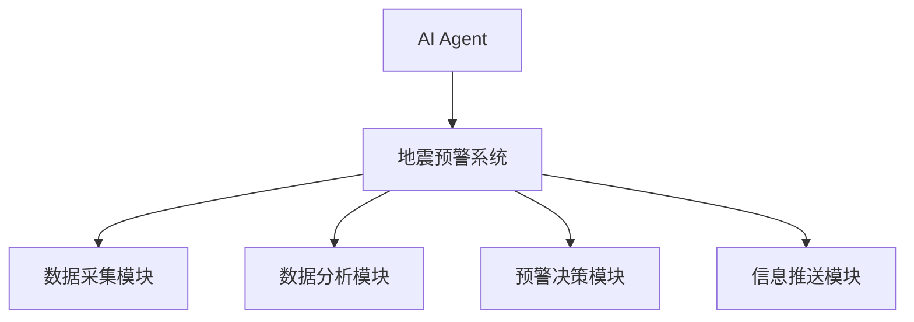
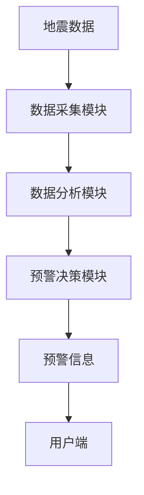
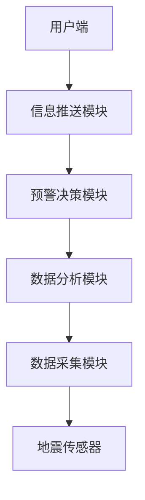
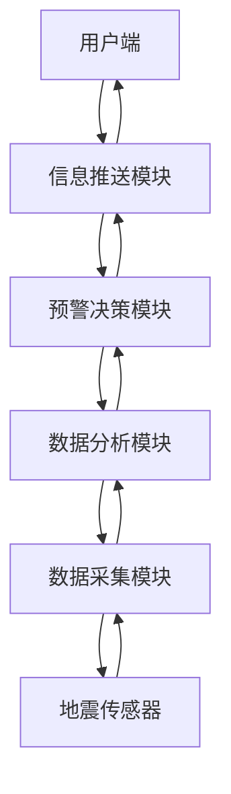

                 


# AI Agent在智能地震预警系统中的实践

## 关键词：
AI Agent, 地震预警系统, 机器学习, 时间序列分析, 系统架构设计

## 摘要：
本文探讨了AI Agent在智能地震预警系统中的应用，重点分析了地震预警系统的核心概念、AI Agent的技术原理、系统架构设计以及实际项目实现。文章从背景介绍、核心概念、算法原理、系统架构、项目实战等多方面展开，详细讲解了AI Agent如何提升地震预警系统的效率和准确性，为地震预警技术的未来发展提供了新的思路。

---

## 第一部分: AI Agent在智能地震预警系统中的背景与概念

### 第1章: 地震预警系统概述

#### 1.1 地震预警的重要性
地震是一种极具破坏性的自然灾害，往往给人类社会带来巨大的人员伤亡和财产损失。地震预警系统通过实时监测地震活动，能够在地震发生前发出警报，为人们争取宝贵的逃生时间。现代地震预警系统结合了先进的传感器技术和数据分析方法，能够快速捕捉地震信号并进行处理。

地震预警系统的社会价值体现在以下几个方面：
1. **减少人员伤亡**：提前预警可以为人们争取宝贵的逃生时间。
2. **降低财产损失**：通过提前采取防护措施，减少地震对建筑物和其他设施的破坏。
3. **提高应急响应效率**：预警系统可以帮助应急管理部门快速定位震中位置，组织救援行动。

#### 1.2 AI Agent的基本概念
AI Agent（人工智能代理）是指能够感知环境、自主决策并执行任务的智能实体。AI Agent具有以下核心特征：
1. **自主性**：能够在没有外部干预的情况下自主运行。
2. **反应性**：能够实时感知环境变化并做出响应。
3. **学习能力**：能够通过数据和经验不断优化自身的决策能力。
4. **协作性**：能够与其他AI Agent或系统进行协作。

AI Agent在地震预警中的应用潜力巨大。通过AI Agent技术，地震预警系统可以实现更高效的地震数据处理、更准确的地震预测以及更快速的预警信息推送。

#### 1.3 AI Agent与地震预警系统的结合
AI Agent与地震预警系统的结合，本质上是通过AI技术提升地震预警系统的效率和准确性。AI Agent可以通过以下方式实现对地震预警的支持：
1. **实时数据处理**：AI Agent可以对地震传感器传回的数据进行实时分析，快速识别地震信号。
2. **智能预测**：通过机器学习算法，AI Agent可以预测地震的发生时间和震级。
3. **信息推送**：AI Agent可以负责将地震预警信息快速传递给相关部门和公众。

---

### 第2章: AI Agent在地震预警中的问题背景

#### 2.1 地震预警系统的技术挑战
地震预警系统面临以下技术挑战：
1. **数据采集的实时性**：地震预警需要快速响应，对数据采集的实时性要求极高。
2. **数据处理的准确性**：地震数据的复杂性和噪声干扰使得数据处理的准确性成为一大难题。
3. **系统的响应速度**：在地震发生时，预警系统需要在极短的时间内完成数据处理和预警信息的推送。

#### 2.2 AI Agent在地震预警中的应用前景
AI Agent技术的应用为地震预警系统带来了新的可能性。通过AI Agent，地震预警系统可以实现以下目标：
1. **提升数据处理效率**：AI Agent可以通过并行计算和分布式处理提升数据处理效率。
2. **提高预测准确性**：通过机器学习算法，AI Agent可以实现对地震的智能预测。
3. **优化预警流程**：AI Agent可以优化地震预警的整个流程，从数据采集到信息推送实现端到端的自动化。

---

## 第二部分: AI Agent与地震预警系统的核心概念与联系

### 第3章: AI Agent与地震预警系统的核心概念

#### 3.1 AI Agent在地震预警中的核心原理
AI Agent在地震预警中的核心原理包括以下几个方面：
1. **数据采集与处理**：AI Agent通过地震传感器采集地震数据，并对其进行预处理和特征提取。
2. **智能分析与预测**：AI Agent利用机器学习算法对地震数据进行分析，预测地震的发生时间和震级。
3. **预警信息的实时推送**：AI Agent将预测结果转化为预警信息，并通过多种渠道（如手机、广播）实时推送给用户。

#### 3.2 地震预警系统的关键组成部分
地震预警系统主要包括以下几个关键组成部分：
1. **数据采集模块**：负责采集地震数据，包括地震波信号、地壳运动数据等。
2. **数据分析模块**：对采集到的数据进行处理和分析，识别地震信号。
3. **预警决策模块**：根据数据分析结果，生成地震预警信息。
4. **信息推送模块**：将地震预警信息推送至用户端。

#### 3.3 AI Agent与地震预警系统的联系
AI Agent与地震预警系统的联系主要体现在以下几个方面：
1. **数据处理**：AI Agent可以对地震数据进行实时处理，提升数据处理效率。
2. **智能预测**：AI Agent可以通过机器学习算法实现地震的智能预测。
3. **优化预警流程**：AI Agent可以优化地震预警的整个流程，从数据采集到信息推送实现自动化。

---

### 第4章: AI Agent与地震预警系统的实体关系分析

#### 4.1 实体关系图


#### 4.2 信息流分析


---

## 第三部分: AI Agent在地震预警系统中的算法原理

### 第5章: AI Agent的算法原理

#### 5.1 数据处理与特征提取
数据处理与特征提取是地震预警系统中的关键步骤。以下是常见的数据处理方法和特征提取技术：
1. **数据预处理**：包括数据清洗、数据归一化等。
2. **特征提取**：通过提取地震数据中的有用特征（如频率、振幅等）来提高预测准确性。
3. **时间序列分析**：地震数据通常具有时间序列特性，可以通过时间序列分析方法提取有用信息。

#### 5.2 机器学习模型的选择与训练
在地震预警系统中，机器学习模型的选择和训练至关重要。以下是常用的机器学习模型及其应用场景：
1. **卷积神经网络（CNN）**：适用于地震波形数据的特征提取。
2. **长短期记忆网络（LSTM）**：适用于时间序列数据的预测。
3. **支持向量机（SVM）**：适用于地震分类任务。

---

## 第四部分: AI Agent在地震预警系统中的系统分析与架构设计

### 第6章: 系统分析与架构设计

#### 6.1 系统功能设计
地震预警系统的功能设计包括以下几个方面：
1. **数据采集**：通过地震传感器采集地震数据。
2. **数据分析**：对采集到的数据进行处理和分析，识别地震信号。
3. **预警决策**：根据数据分析结果，生成地震预警信息。
4. **信息推送**：将预警信息推送至用户端。

#### 6.2 系统架构设计
以下是地震预警系统的架构设计：


#### 6.3 系统接口设计
系统接口设计包括以下几个方面：
1. **数据采集接口**：用于与地震传感器进行数据交互。
2. **数据处理接口**：用于与数据分析模块进行数据交互。
3. **预警信息接口**：用于与信息推送模块进行数据交互。

#### 6.4 系统交互设计
系统交互流程如下：


---

## 第五部分: AI Agent在地震预警系统中的项目实战

### 第7章: 项目实战

#### 7.1 环境安装
以下是地震预警系统项目的环境安装步骤：
1. **安装Python**：选择合适的Python版本（建议使用Python 3.8以上）。
2. **安装依赖库**：安装必要的第三方库，如NumPy、Pandas、Scikit-learn、TensorFlow等。
3. **配置开发环境**：安装IDE（如Jupyter Notebook、PyCharm）并配置好Python环境。

#### 7.2 系统核心实现
以下是地震预警系统的核心代码实现：
```python
import numpy as np
from sklearn.model_selection import train_test_split
from tensorflow.keras.models import Sequential
from tensorflow.keras.layers import LSTM, Dense

# 加载地震数据
data = np.load('earthquake_data.npy')
labels = np.load('labels.npy')

# 数据分割
X_train, X_test, y_train, y_test = train_test_split(data, labels, test_size=0.2)

# 模型构建
model = Sequential()
model.add(LSTM(64, input_shape=(data.shape[1], data.shape[2])))
model.add(Dense(1, activation='sigmoid'))

model.compile(loss='binary_crossentropy', optimizer='adam', metrics=['accuracy'])

# 模型训练
model.fit(X_train, y_train, epochs=10, batch_size=32, validation_data=(X_test, y_test))
```

#### 7.3 代码解读与分析
1. **数据加载**：使用NumPy加载预处理好的地震数据和标签。
2. **数据分割**：将数据划分为训练集和测试集。
3. **模型构建**：使用LSTM网络构建地震预测模型。
4. **模型训练**：对模型进行训练，优化模型参数。

#### 7.4 实际案例分析
以下是地震预警系统的一个实际案例分析：
1. **数据采集**：通过地震传感器采集地震数据。
2. **数据处理**：对采集到的数据进行预处理和特征提取。
3. **模型预测**：使用训练好的模型对地震数据进行预测，生成地震预警信息。
4. **信息推送**：将预警信息推送至用户端。

---

## 第六部分: 总结与展望

### 第8章: 总结与展望

#### 8.1 系统总结
通过本文的分析，我们可以看到AI Agent在地震预警系统中的应用前景广阔。AI Agent技术可以通过实时数据处理、智能预测和优化预警流程，显著提升地震预警系统的效率和准确性。

#### 8.2 未来展望
未来，随着AI技术的不断发展，地震预警系统将更加智能化和高效化。以下是未来的发展方向：
1. **引入边缘计算**：通过边缘计算技术，进一步提升地震预警系统的实时性和响应速度。
2. **强化学习的应用**：通过强化学习技术，进一步优化地震预警系统的预测准确性和决策能力。
3. **多模态数据融合**：通过多模态数据融合技术，进一步提升地震预测的准确性和全面性。

#### 8.3 最佳实践 tips
在实际应用中，建议采取以下措施：
1. **数据质量控制**：确保地震数据的准确性和完整性。
2. **模型优化**：通过持续优化模型参数和算法，提升地震预警系统的预测能力。
3. **系统安全性**：确保地震预警系统的安全性，防止数据泄露和系统攻击。

---

## 作者信息

作者：AI天才研究院/AI Genius Institute & 禅与计算机程序设计艺术 /Zen And The Art of Computer Programming

---

通过本文的详细分析，我们可以看到AI Agent在地震预警系统中的巨大潜力。希望本文能够为地震预警技术的未来发展提供新的思路和方向。

