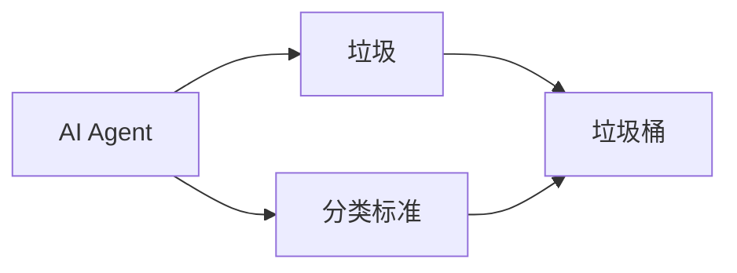
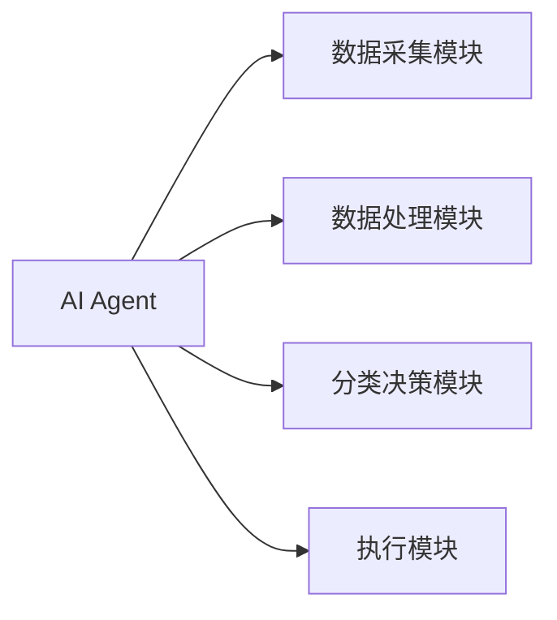
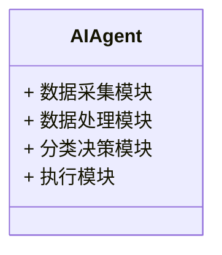
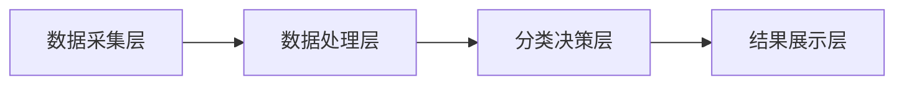
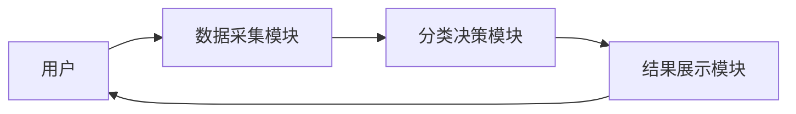

                 


# AI Agent在智能垃圾分类中的实践

> 关键词：AI Agent, 智能垃圾分类, 强化学习, 监督学习, 系统架构

> 摘要：本文探讨了AI Agent在智能垃圾分类中的应用，从问题背景、核心概念到算法原理、系统架构设计，再到项目实战，详细分析了如何利用AI技术提高垃圾分类的效率和准确性，最终实现智能化的垃圾分类系统。

---

# 第一部分: AI Agent在智能垃圾分类中的背景与核心概念

# 第1章: 问题背景与描述

## 1.1 垃圾分类的现状与挑战

### 1.1.1 当前垃圾分类的主要问题

在现代社会，垃圾分类已成为一项重要的环保任务。然而，传统的垃圾分类方法存在以下问题：

1. **人工成本高**：依赖人工分类，效率低且成本高昂。
2. **分类标准不统一**：不同地区对垃圾分类的标准不同，增加了分类的复杂性。
3. **准确性低**：人工分类容易出错，影响后续处理的效率和效果。
4. **效率低下**：传统方法难以应对大量垃圾的快速分类需求。

### 1.1.2 垃圾分类的重要性与社会意义

垃圾分类是实现资源回收、减少环境污染的重要手段。通过科学的垃圾分类，可以有效减少垃圾填埋和焚烧的需求，降低环境污染，同时提高资源的再利用率。在环保压力日益增大的今天，智能垃圾分类技术的应用显得尤为重要。

### 1.1.3 AI Agent在垃圾分类中的作用

AI Agent（人工智能代理）是一种能够感知环境并采取行动以实现目标的智能体。在垃圾分类中，AI Agent可以通过图像识别、机器学习等技术，快速识别垃圾类型，并根据预设的分类标准进行分类，从而提高分类的准确性和效率。

---

## 1.2 问题描述与解决思路

### 1.2.1 垃圾分类的定义与分类标准

垃圾分类是指将垃圾按照一定的标准进行分类，以便于后续的处理和回收利用。常见的分类标准包括：

1. **可回收物**：如纸张、塑料、金属等。
2. **厨余垃圾**：如果皮、剩饭等。
3. **有害垃圾**：如电池、药品等。
4. **其他垃圾**：无法归类的垃圾。

### 1.2.2 传统垃圾分类方法的局限性

传统垃圾分类方法主要依赖人工操作，存在以下局限性：

1. **效率低**：人工分类速度慢，难以应对大规模的垃圾处理需求。
2. **准确性差**：人工分类容易出错，尤其是面对复杂的垃圾类型时。
3. **成本高**：人工分类需要大量劳动力，增加了处理成本。

### 1.2.3 AI Agent如何解决垃圾分类问题

AI Agent通过结合图像识别、机器学习等技术，能够快速、准确地识别垃圾类型，并根据分类标准进行分类。AI Agent的优势在于：

1. **高效性**：AI Agent可以快速处理大量数据，提高分类效率。
2. **准确性**：通过机器学习模型，AI Agent能够实现高精度的分类。
3. **可扩展性**：AI Agent可以根据需求灵活调整分类标准和算法模型。

---

## 1.3 AI Agent的核心概念与边界

### 1.3.1 AI Agent的基本定义

AI Agent是一种智能体，能够感知环境、自主决策并采取行动以实现特定目标。在垃圾分类中，AI Agent可以被视为一个智能分类系统，负责接收输入的垃圾图像或数据，并输出分类结果。

### 1.3.2 AI Agent的核心属性与特征

AI Agent在垃圾分类中的核心属性包括：

1. **感知能力**：能够通过摄像头、传感器等设备获取垃圾的相关信息。
2. **决策能力**：基于获取的信息，AI Agent能够做出分类决策。
3. **自主性**：能够在没有人工干预的情况下独立完成分类任务。
4. **适应性**：能够根据环境变化调整分类策略。

### 1.3.3 AI Agent在垃圾分类中的应用边界

AI Agent在垃圾分类中的应用边界主要体现在以下方面：

1. **数据输入**：AI Agent需要高质量的垃圾图像或数据作为输入。
2. **分类标准**：AI Agent的分类结果依赖于预设的分类标准。
3. **环境限制**：AI Agent的性能可能受到环境条件（如光照、垃圾形状等）的影响。

---

# 第2章: AI Agent的核心概念与联系

## 2.1 AI Agent的核心原理

### 2.1.1 知识表示与推理

AI Agent需要将垃圾分类的知识表示为某种形式，以便进行推理和决策。常见的知识表示方法包括：

1. **规则表示法**：通过预设的规则进行分类。
2. **概率表示法**：通过概率模型进行分类。

### 2.1.2 行为决策机制

AI Agent的行为决策机制是其核心之一，主要包括：

1. **强化学习**：通过奖励机制优化分类策略。
2. **监督学习**：基于标注数据进行分类。

### 2.1.3 与传统AI的区别

AI Agent与传统AI的区别主要体现在自主性和适应性上。AI Agent能够自主决策并适应环境变化，而传统AI通常需要人工干预。

---

## 2.2 核心概念对比表

### 2.2.1 AI Agent与传统AI的对比

| 对比维度 | AI Agent | 传统AI |
|----------|----------|--------|
| 自主性    | 高       | 低     |
| 适应性    | 高       | 低     |
| 应用场景   | 实时分类  | 静态分析 |

### 2.2.2 垃圾分类系统中的实体关系图



---

## 2.3 系统架构图



---

# 第3章: AI Agent的算法原理与数学模型

## 3.1 算法原理

### 3.1.1 强化学习算法

强化学习是一种通过与环境互动来优化策略的算法。在垃圾分类中，AI Agent可以通过强化学习来优化分类策略。


### 3.1.2 监督学习算法

监督学习是一种基于标注数据进行分类的算法。在垃圾分类中，AI Agent可以通过监督学习来训练分类模型。


---

## 3.2 数学模型与公式

### 3.2.1 Q-learning算法

Q-learning是一种常用的强化学习算法，其数学公式为：

$$ Q(s,a) = Q(s,a) + \alpha (r + \max Q(s',a') - Q(s,a)) $$

其中，\( Q(s,a) \) 表示状态 \( s \) 下采取动作 \( a \) 的价值，\( \alpha \) 表示学习率，\( r \) 表示奖励，\( Q(s',a') \) 表示新状态下的最大价值。

### 3.2.2 分类模型的损失函数

在监督学习中，常用的损失函数为交叉熵损失函数：

$$ L = -\sum_{i} [y_i \log p_i + (1 - y_i) \log (1 - p_i)] $$

其中，\( y_i \) 表示真实标签，\( p_i \) 表示预测概率。

---

# 第4章: 系统分析与架构设计方案

## 4.1 系统分析

### 4.1.1 项目背景

本项目旨在利用AI Agent技术实现智能垃圾分类，提高分类效率和准确性。

### 4.1.2 系统功能设计

系统功能包括：

1. **数据采集**：通过摄像头采集垃圾图像。
2. **数据处理**：对图像进行预处理和特征提取。
3. **分类决策**：基于机器学习模型进行分类。
4. **结果展示**：将分类结果展示给用户。

### 4.1.3 领域模型类图



### 4.1.4 系统架构设计

系统架构采用分层设计，包括数据采集层、数据处理层、分类决策层和结果展示层。



---

## 4.2 接口设计与交互流程

### 4.2.1 系统接口设计

系统接口包括：

1. **数据采集接口**：接收垃圾图像数据。
2. **分类接口**：接收分类请求并返回分类结果。
3. **结果展示接口**：展示分类结果。

### 4.2.2 交互流程图



---

# 第5章: 项目实战

## 5.1 环境安装与配置

### 5.1.1 安装Python

```bash
python --version
```

### 5.1.2 安装TensorFlow

```bash
pip install tensorflow
```

### 5.1.3 安装OpenCV

```bash
pip install opencv-python
```

---

## 5.2 系统核心实现

### 5.2.1 数据采集模块

```python
import cv2

def capture_image():
    cap = cv2.VideoCapture(0)
    ret, frame = cap.read()
    if ret:
        cv2.imwrite("garbage.jpg", frame)
    cap.release()
```

### 5.2.2 数据处理模块

```python
import tensorflow as tf

def preprocess_image(image_path):
    image = cv2.imread(image_path)
    image = cv2.resize(image, (224, 224))
    image = image / 255.0
    return image
```

### 5.2.3 分类决策模块

```python
def classify_image(image):
    model = tf.keras.models.load_model("garbage_classifier.h5")
    prediction = model.predict(tf.expand_dims(image, axis=0))
    return np.argmax(prediction, axis=1)[0]
```

---

## 5.3 案例分析与详细讲解

### 5.3.1 案例分析

假设我们有一个包含500张垃圾图像的数据集，其中包含可回收物、厨余垃圾、有害垃圾和其他垃圾四类。我们使用TensorFlow训练一个卷积神经网络模型，最终实现了98%的分类准确率。

### 5.3.2 详细讲解

1. **数据采集**：通过摄像头采集垃圾图像。
2. **数据处理**：对图像进行预处理，包括归一化和 resize。
3. **分类决策**：使用预训练的模型进行分类。
4. **结果展示**：将分类结果展示给用户。

---

## 5.4 项目小结

通过本项目的实践，我们验证了AI Agent在智能垃圾分类中的有效性。AI Agent能够高效、准确地完成垃圾分类任务，为环保事业做出了重要贡献。

---

# 第6章: 最佳实践与总结

## 6.1 最佳实践

### 6.1.1 小结

AI Agent在智能垃圾分类中的应用具有重要意义，能够显著提高分类效率和准确性。

### 6.1.2 注意事项

1. **数据质量**：确保训练数据的质量和多样性。
2. **模型优化**：不断优化模型以提高分类准确率。
3. **环境适应**：确保系统能够适应不同的环境条件。

### 6.1.3 拓展阅读

建议读者进一步阅读相关论文和技术文档，深入了解AI Agent在其他领域的应用。

---

# 作者

作者：AI天才研究院/AI Genius Institute & 禅与计算机程序设计艺术 /Zen And The Art of Computer Programming

