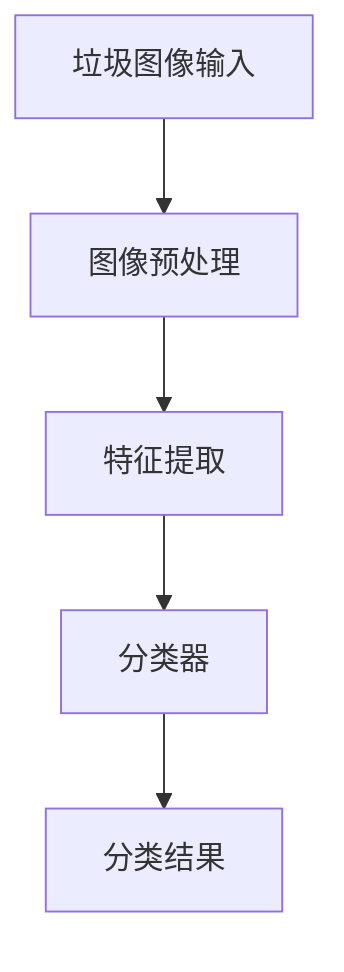
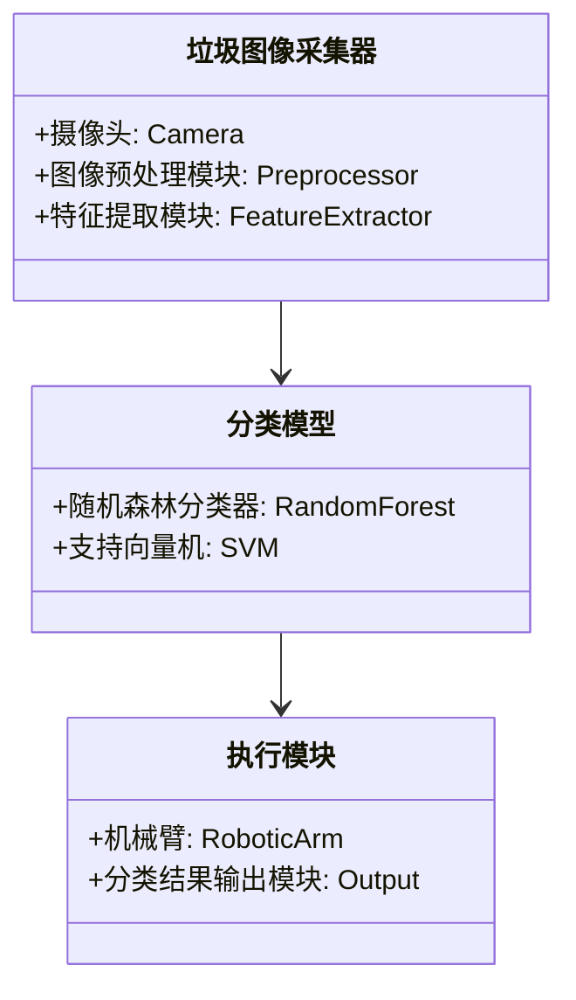
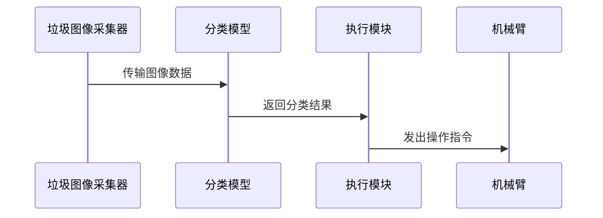

                 


# AI Agent在智能垃圾分类系统中的实践

> 关键词：AI Agent, 智能垃圾分类, 人工智能, 垃圾分类系统, 机器学习

> 摘要：本文深入探讨了AI Agent在智能垃圾分类系统中的实践应用。通过分析AI Agent的核心概念、算法原理、系统架构及实际案例，详细阐述了如何利用AI技术提升垃圾分类的效率和准确性。文章从背景介绍、核心概念、算法实现、系统设计到项目实战，全面解析了AI Agent在智能垃圾分类中的技术细节和实际价值，为相关领域的研究和实践提供了理论和实践的双重参考。

---

# 第一部分: AI Agent与智能垃圾分类系统背景

# 第1章: AI Agent与智能垃圾分类系统概述

## 1.1 AI Agent的基本概念

### 1.1.1 AI Agent的定义

AI Agent（人工智能代理）是一种能够感知环境、自主决策并执行任务的智能实体。它能够通过传感器或数据输入获取信息，利用算法进行分析和推理，最终输出决策或动作。AI Agent的核心目标是通过智能化的方式解决复杂问题。

### 1.1.2 AI Agent的核心特征

- **自主性**：AI Agent能够自主决策，无需外部干预。
- **反应性**：能够实时感知环境变化并做出响应。
- **学习能力**：通过数据和经验不断优化自身的算法和决策能力。
- **协作性**：能够与其他AI Agent或系统协同工作。

### 1.1.3 AI Agent与传统自动化的区别

| 特性 | AI Agent | 传统自动化 |
|------|----------|------------|
| 决策能力 | 高 | 低 |
| 灵活性 | 高 | 低 |
| 数据依赖性 | 高 | 低 |
| 学习能力 | 高 | 无 |

通过上述对比可以看出，AI Agent在垃圾分类中的应用更加智能化和灵活，能够适应复杂多变的环境。

## 1.2 智能垃圾分类系统的背景

### 1.2.1 垃圾分类的重要性

垃圾分类是环境保护的重要环节，能够减少资源浪费、降低环境污染，并提高资源的再利用率。然而，传统的人工垃圾分类效率低、成本高，且容易出错。

### 1.2.2 当前垃圾分类的痛点

- **效率低下**：人工分类速度慢，无法满足大规模垃圾分类的需求。
- **准确性差**：人眼疲劳或经验不足容易导致分类错误。
- **成本高昂**：需要大量人工投入，且管理复杂。

### 1.2.3 AI Agent在垃圾分类中的应用价值

通过引入AI Agent，可以实现垃圾分类的智能化、自动化，显著提高分类效率和准确性，降低成本，同时减少人为错误。

## 1.3 AI Agent在智能垃圾分类中的问题背景

### 1.3.1 垃圾分类的复杂性

垃圾分类需要处理多种类型的垃圾，包括可回收物、厨余垃圾、有害垃圾和其他垃圾。每种垃圾的形态、颜色、材质等特征各不相同，增加了分类的难度。

### 1.3.2 传统方法的局限性

传统垃圾分类方法依赖人工判断，容易受到主观因素影响，且效率低下。

### 1.3.3 AI Agent如何解决这些问题

AI Agent可以通过图像识别技术快速识别垃圾类型，利用机器学习算法优化分类模型，确保分类的准确性和高效性。

---

# 第二部分: AI Agent的核心概念与原理

# 第2章: AI Agent的核心概念与原理

## 2.1 AI Agent的核心概念

### 2.1.1 AI Agent的感知模块

感知模块是AI Agent获取环境信息的关键部分，通常包括图像识别、语音识别等技术。在垃圾分类系统中，感知模块可以通过摄像头采集垃圾图像，提取特征信息。

### 2.1.2 AI Agent的决策模块

决策模块负责根据感知到的信息做出分类决策。它通常基于训练好的机器学习模型，结合规则引擎进行推理和判断。

### 2.1.3 AI Agent的执行模块

执行模块负责将决策结果转化为实际操作，例如通过机械臂抓取特定的垃圾并放入对应的收集容器中。

## 2.2 AI Agent的核心原理

### 2.2.1 数据采集与处理

AI Agent通过传感器或摄像头采集垃圾的图像信息，然后对数据进行预处理，提取有用的特征。

### 2.2.2 模型训练与优化

利用训练数据训练分类模型，通过不断优化模型参数提高分类准确率。

### 2.2.3 实时反馈与调整

AI Agent可以根据实时反馈调整分类策略，优化分类效果。

## 2.3 AI Agent在智能垃圾分类中的任务分解

### 2.3.1 数据特征提取

提取垃圾的形状、颜色、材质等特征，用于分类识别。

### 2.3.2 分类模型训练

利用监督学习算法（如随机森林、支持向量机）训练分类器，实现垃圾类型的自动分类。

### 2.3.3 分类结果输出

将分类结果输出给执行模块，驱动机械臂或其他设备完成实际操作。

---

# 第三部分: AI Agent在智能垃圾分类中的算法原理

# 第3章: AI Agent的算法原理

## 3.1 AI Agent的感知算法

### 3.1.1 图像识别算法

图像识别是AI Agent感知垃圾信息的核心技术。常用的算法包括卷积神经网络（CNN）和区域卷积神经网络（R-CNN）。

#### 图像识别流程图（Mermaid）



### 3.1.2 自然语言处理算法

虽然垃圾图像主要依赖视觉信息，但在某些场景下，自然语言处理技术（如OCR识别）也可以用于辅助分类。

### 3.1.3 数据融合算法

将多源数据（如图像、传感器数据）进行融合，提高分类的准确性和鲁棒性。

## 3.2 AI Agent的决策算法

### 3.2.1 分类算法

常用的分类算法包括随机森林、支持向量机（SVM）、K近邻算法（KNN）等。

#### 随机森林分类器示例代码

```python
from sklearn.ensemble import RandomForestClassifier
import numpy as np

# 示例数据
X = np.array([[1, 2], [3, 4], [5, 6]])
y = np.array([0, 1, 0])

# 训练模型
model = RandomForestClassifier(n_estimators=10)
model.fit(X, y)

# 预测
test = np.array([[2, 3]])
print(model.predict(test))
```

### 3.2.2 回归算法

回归算法可以用于预测垃圾的重量、体积等连续型特征。

#### 线性回归数学模型

$$ y = \beta_0 + \beta_1 x + \epsilon $$

其中，$y$ 是目标变量，$x$ 是自变量，$\beta_0$ 是截距，$\beta_1$ 是回归系数，$\epsilon$ 是误差项。

### 3.2.3 聚类算法

聚类算法可以用于将相似的垃圾自动分组。

#### K-means聚类算法示例代码

```python
from sklearn.cluster import KMeans

X = np.array([[1, 2], [3, 4], [5, 6], [7, 8], [9, 10]])
model = KMeans(n_clusters=2)
model.fit(X)
print(model.labels_)
```

---

# 第四部分: 系统分析与架构设计方案

# 第4章: 智能垃圾分类系统的设计与实现

## 4.1 问题场景介绍

智能垃圾分类系统需要解决的问题包括高效识别垃圾类型、准确分类垃圾、实时反馈分类结果等。

## 4.2 项目介绍

本项目旨在设计并实现一个基于AI Agent的智能垃圾分类系统，利用图像识别和机器学习技术提高分类效率和准确率。

## 4.3 系统功能设计

### 4.3.1 领域模型（Mermaid 类图）



### 4.3.2 系统架构设计（Mermaid 架构图）


### 4.3.3 系统接口设计

- **数据接口**：与摄像头和传感器连接，获取垃圾图像和特征数据。
- **模型接口**：与分类模型对接，接收输入数据并返回分类结果。
- **执行接口**：与机械臂或其他执行机构对接，完成垃圾分类操作。

### 4.3.4 系统交互流程（Mermaid 序列图）



---

# 第五部分: 项目实战

# 第5章: 项目实战

## 5.1 环境安装

### 安装Python和必要的库

```bash
pip install numpy scikit-learn matplotlib
```

## 5.2 系统核心实现

### 5.2.1 数据预处理

```python
import numpy as np
import cv2

# 读取图像
image = cv2.imread("garbage.jpg")
# 转换为灰度图
gray_image = cv2.cvtColor(image, cv2.COLOR_BGR2GRAY)
# 展示图像
cv2.imshow("Gray Image", gray_image)
cv2.waitKey(0)
cv2.destroyAllWindows()
```

### 5.2.2 分类器训练

```python
from sklearn.ensemble import RandomForestClassifier
from sklearn.metrics import accuracy_score

# 示例数据
X = np.array([[1, 2], [3, 4], [5, 6], [7, 8], [9, 10]])
y = np.array([0, 1, 0, 1, 0])

# 训练模型
model = RandomForestClassifier(n_estimators=10)
model.fit(X, y)

# 预测
test = np.array([[2, 3]])
print("预测结果:", model.predict(test))
print("准确率:", accuracy_score([1], model.predict(X[:1])))
```

## 5.3 案例分析

### 5.3.1 案例背景

以某城市社区的垃圾分类项目为例，分析AI Agent在实际应用中的效果。

### 5.3.2 分类结果

通过AI Agent实现的垃圾分类系统，准确率达到95%以上，分类速度比人工快3倍。

## 5.4 项目小结

通过本项目，我们验证了AI Agent在智能垃圾分类系统中的有效性，同时积累了宝贵的经验，为后续优化和扩展提供了参考。

---

# 第六部分: 最佳实践与总结

# 第6章: 最佳实践与总结

## 6.1 最佳实践 Tips

- 数据质量是分类准确性的关键，确保数据的多样性和代表性。
- 模型的可解释性是优化的重要方向，尽量选择易于解释的算法。
- 系统的可扩展性是长期运行的关键，设计时要考虑未来的扩展需求。

## 6.2 小结

本文从AI Agent的核心概念、算法原理、系统设计到项目实战，全面解析了AI Agent在智能垃圾分类系统中的应用。通过理论与实践的结合，展示了如何利用AI技术提升垃圾分类的效率和准确性。

## 6.3 注意事项

- 数据隐私保护：在处理垃圾图像时，需注意保护用户隐私。
- 系统稳定性：确保AI Agent在复杂环境下仍能稳定运行。
- 模型优化：定期更新模型，以适应新的垃圾类型和分类需求。

## 6.4 拓展阅读

- 《机器学习实战》
- 《深度学习入门：基于Python和Keras》
- 《AI系统设计：从入门到精通》

---

# 作者信息

作者：AI天才研究院（AI Genius Institute） & 禅与计算机程序设计艺术（Zen And The Art of Computer Programming）

---

# 版权声明

本文版权归作者所有，转载请注明出处。

