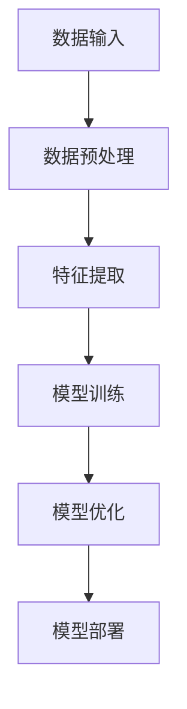
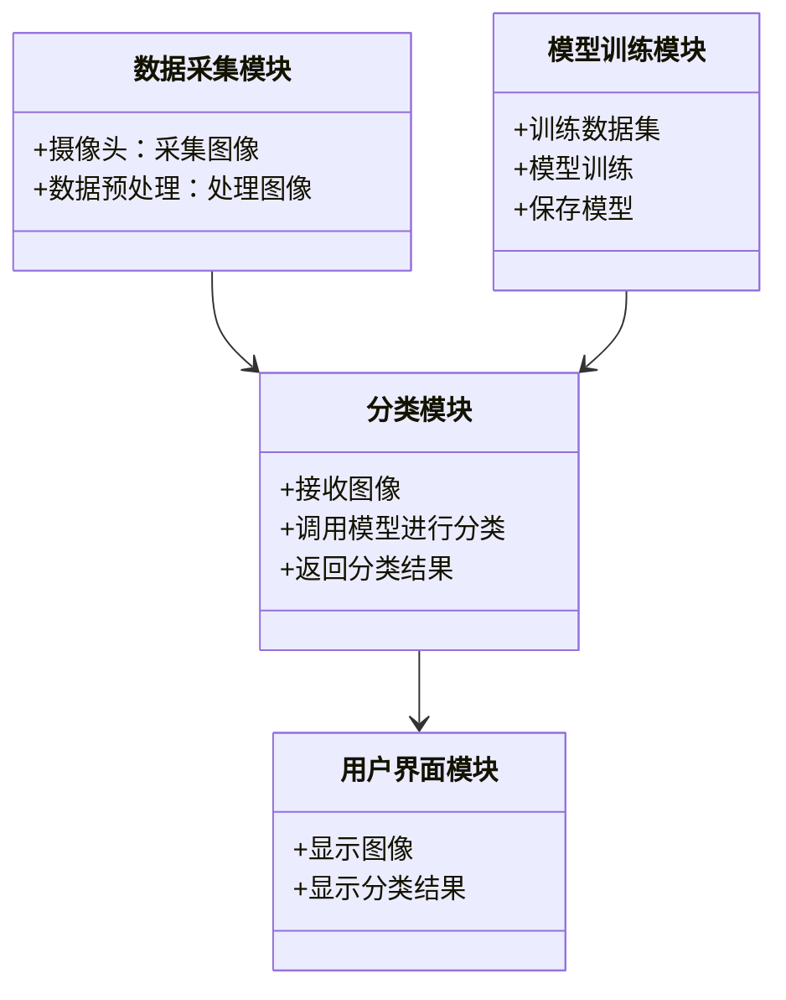
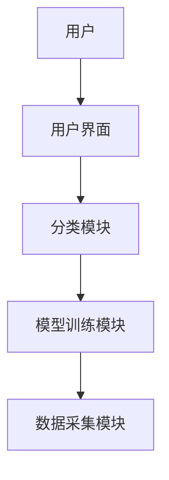
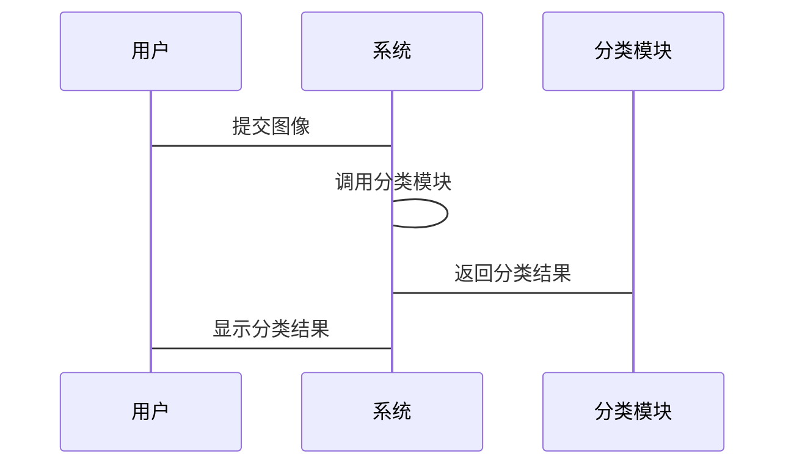

                 


```markdown
# AI Agent在智能垃圾分类识别中的实践

> 关键词：AI Agent，智能垃圾分类，机器学习，图像识别，算法优化

> 摘要：本文探讨了AI Agent在智能垃圾分类中的应用，从背景介绍到算法实现，详细分析了AI Agent在垃圾分类中的重要性、实现方法和实际案例，展示了如何通过AI技术提升垃圾分类效率和准确性。

---

# 第一部分: AI Agent在智能垃圾分类识别中的背景与概念

# 第1章: 智能垃圾分类识别的背景与问题

## 1.1 智能垃圾分类的背景
### 1.1.1 垃圾分类的现状与挑战
- 当前垃圾分类的必要性：资源浪费、环境污染
- 手工分类的低效性与高成本
- AI技术如何助力高效垃圾分类

### 1.1.2 AI技术在垃圾分类中的应用前景
- AI技术的优势：高精度、快速处理
- 智能垃圾分类系统的潜力

### 1.1.3 AI Agent在智能垃圾分类中的定位
- AI Agent的定义与特点
- AI Agent在垃圾分类系统中的角色

## 1.2 问题背景与描述
### 1.2.1 垃圾分类的重要性
- 环境保护的角度
- 资源回收的价值

### 1.2.2 当前垃圾分类的主要问题
- 分类标准不统一
- 人工成本高
- 分类错误率高

### 1.2.3 AI Agent在解决垃圾分类问题中的作用
- 自动化分类的优势
- 提高分类准确率和效率

## 1.3 问题解决与边界
### 1.3.1 AI Agent如何解决垃圾分类问题
- 数据采集与处理
- 模型训练与优化
- 实时分类与反馈

### 1.3.2 系统的边界与外延
- 系统功能边界
- 外部系统的接口

### 1.3.3 核心要素与组成结构
- 核心组件：数据采集模块、AI Agent、分类模型、用户界面

## 1.4 本章小结
- 总结本章内容，引出下文

---

# 第二部分: AI Agent的核心概念与原理

# 第2章: AI Agent的基本概念与原理

## 2.1 AI Agent的定义与特点
### 2.1.1 AI Agent的定义
- 自主性、反应性、目标导向

### 2.1.2 AI Agent的核心特点
- 可交互性
- 自适应性
- 可扩展性

### 2.1.3 AI Agent与传统AI的区别
- AI Agent的自主性和适应性

## 2.2 智能垃圾分类系统中的AI Agent架构
### 2.2.1 分层架构设计
- 数据层、算法层、应用层

### 2.2.2 组件之间的关系
- 数据采集模块、模型训练模块、实时分类模块

### 2.2.3 系统的可扩展性与灵活性
- 模块化设计的优势

## 2.3 AI Agent在垃圾分类中的核心功能
### 2.3.1 数据采集与处理
- 图像采集、数据预处理

### 2.3.2 模型训练与优化
- 算法选择、参数调优

### 2.3.3 实时识别与反馈
- 分类结果输出、用户反馈

## 2.4 本章小结
- 总结AI Agent的核心概念与功能

---

# 第三部分: AI Agent的算法原理与数学模型

# 第3章: 垃圾分类识别的算法原理

## 3.1 数据预处理与特征提取
### 3.1.1 数据清洗与标注
- 数据清洗的必要性
- 数据标注的技巧

### 3.1.2 特征提取方法
- 基于颜色、形状、纹理的特征提取

### 3.1.3 数据增强技术
- 数据扩增的方法：旋转、翻转、缩放

## 3.2 分类算法的选择与优化
### 3.2.1 支持向量机（SVM）原理
- SVM的数学推导
- SVM在图像分类中的应用

### 3.2.2 神经网络模型（CNN）原理
- CNN的卷积层、池化层工作原理
- 深度学习的优势

### 3.2.3 模型优化与调参
- 超参数调优方法
- 正则化技术

## 3.3 垃圾分类的数学模型
### 3.3.1 分类问题的数学表达
- 分类任务的损失函数
- 优化目标的数学表达

### 3.3.2 损失函数与优化目标
- 交叉熵损失函数的数学公式
- 梯度下降算法的优化过程

### 3.3.3 模型训练的数学推导
- 前向传播与反向传播的数学推导

## 3.4 算法流程图


## 3.5 本章小结
- 总结算法原理与优化方法

---

# 第四部分: 系统分析与架构设计

# 第4章: 智能垃圾分类系统的架构设计

## 4.1 系统功能需求分析
### 4.1.1 用户需求分析
- 系统用户类型：普通用户、管理员
- 用户需求：分类准确率、实时性、易用性

### 4.1.2 系统功能模块划分
- 数据采集模块、模型训练模块、分类模块、用户界面模块

### 4.1.3 功能优先级
- 核心功能与次要功能的划分

## 4.2 系统设计图
### 4.2.1 领域模型Mermaid类图


### 4.2.2 系统架构Mermaid架构图


### 4.2.3 数据流设计


## 4.3 交互流程设计
### 4.3.1 用户与系统交互流程


## 4.4 本章小结
- 总结系统架构设计与交互流程

---

# 第五部分: 项目实战

# 第5章: 智能垃圾分类系统的实现

## 5.1 项目环境与工具
### 5.1.1 环境配置
- Python版本：3.8及以上
- 深度学习框架：TensorFlow或PyTorch

### 5.1.2 开发工具
- IDE：PyCharm
- 版本控制：Git

## 5.2 系统核心实现
### 5.2.1 数据集准备
- 数据集来源：公开数据集（如COCO、ImageNet）
- 数据标注：使用标签工具（如LabelImg）

### 5.2.2 模型实现
```python
import tensorflow as tf
from tensorflow.keras import layers

model = tf.keras.Sequential([
    layers.Conv2D(32, (3,3), activation='relu', input_shape=(224, 224, 3)),
    layers.MaxPooling2D((2,2)),
    layers.Conv2D(64, (3,3), activation='relu'),
    layers.MaxPooling2D((2,2)),
    layers.Flatten(),
    layers.Dense(128, activation='relu'),
    layers.Dense(num_classes, activation='softmax')
])
```

### 5.2.3 模型训练与优化
```python
model.compile(optimizer='adam', loss='sparse_categorical_crossentropy', metrics=['accuracy'])
model.fit(train_dataset, epochs=10, validation_data=val_dataset)
```

### 5.2.4 模型部署与测试
```python
import cv2
import numpy as np

def predict_image(model, image_path):
    img = cv2.imread(image_path)
    img = cv2.resize(img, (224, 224))
    img = img[np.newaxis, ...]
    prediction = model.predict(img)
    return np.argmax(prediction[0])

predict_image(model, "test.jpg")
```

## 5.3 项目实战案例
### 5.3.1 数据集分析与处理
- 数据清洗、增强、划分训练集与测试集

### 5.3.2 模型训练与调优
- 超参数调优、模型评估

### 5.3.3 系统集成与测试
- 系统功能测试、性能优化

## 5.4 本章小结
- 总结项目实现的关键步骤与经验

---

# 第六部分: 总结与展望

# 第6章: 总结与展望

## 6.1 总结
- 本文的主要内容与成果
- AI Agent在垃圾分类中的应用价值

## 6.2 展望
- 技术改进方向：模型优化、算法创新
- 应用扩展：更多场景的应用，如工业废料分类

## 6.3 最佳实践Tips
- 数据质量的重要性
- 模型选择的策略
- 系统设计的模块化思维

## 6.4 本章小结
- 结束全文，展望未来

---

# 作者：AI天才研究院 & 禅与计算机程序设计艺术

---

通过以上目录，我们可以看到，文章从背景介绍到系统实现，全面而详细地探讨了AI Agent在智能垃圾分类中的应用。每一章节都深入分析了相关知识点，并通过实际案例和代码示例，帮助读者更好地理解和实践。
```

