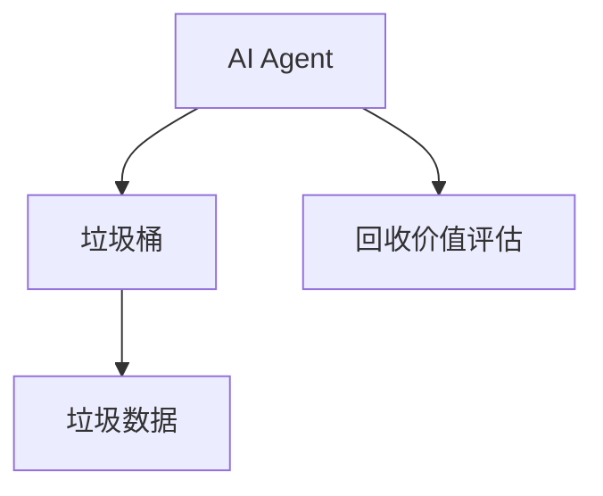
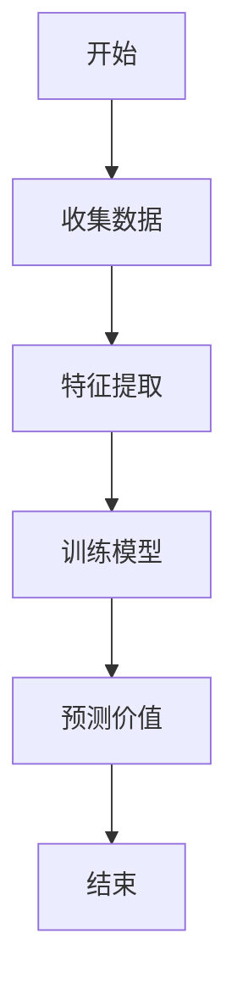
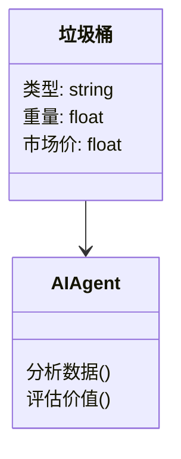
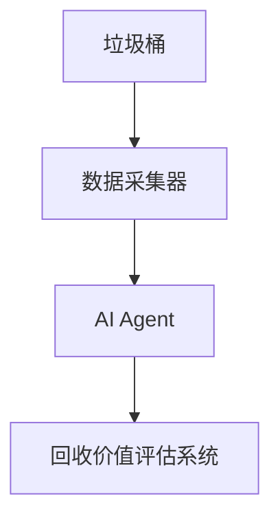
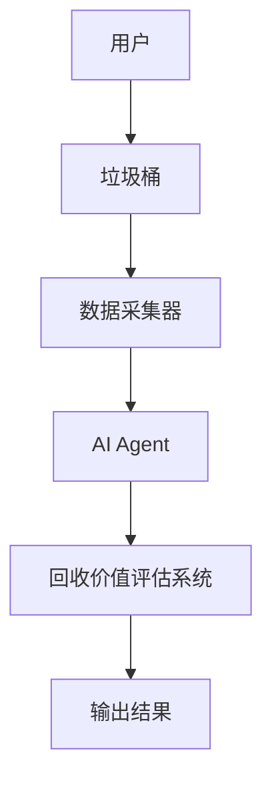

                 


# AI Agent在智能垃圾桶中的回收价值评估

> 关键词：AI Agent, 智能垃圾桶, 回收价值评估, 机器学习, 废物分类, 资源优化

> 摘要：本文探讨了AI Agent在智能垃圾桶中的应用，重点分析了其在回收价值评估中的作用。通过详细的技术分析，展示了如何利用AI技术优化垃圾桶的回收效率和价值评估过程。

---

# 第1章: 背景介绍

## 1.1 问题背景

### 1.1.1 智能垃圾桶的现状与挑战
随着城市化进程的加快，垃圾处理已成为一个全球性问题。传统垃圾桶的分类效率低下，导致资源浪费和环境污染。智能垃圾桶的出现，通过传感器和物联网技术，提升了垃圾收集和分类的效率。

### 1.1.2 AI Agent在垃圾桶中的应用潜力
AI Agent（人工智能代理）能够实时分析数据，优化垃圾桶的分类和回收流程。其在智能垃圾桶中的应用，不仅提升了分类准确率，还能够实时评估垃圾的回收价值。

### 1.1.3 回收价值评估的重要性
回收价值评估是资源优化的重要环节。通过评估垃圾的经济价值，可以制定更有效的回收策略，降低处理成本，提高资源利用率。

## 1.2 问题描述

### 1.2.1 回收价值评估的核心问题
如何准确评估不同垃圾的经济价值，以优化回收流程。

### 1.2.2 AI Agent在其中的作用
AI Agent能够实时分析垃圾类型、重量和市场价值，提供准确的评估结果。

### 1.2.3 问题解决的边界与外延
回收价值评估的边界包括垃圾类型、市场价值和处理成本；外延则涉及资源优化和环保效益。

## 1.3 核心概念与联系

### 1.3.1 AI Agent的定义与属性
AI Agent是能够感知环境、自主决策的智能体，具备学习、推理和自适应能力。

### 1.3.2 回收价值评估的指标体系
包括垃圾类型、重量、市场价值和处理成本等指标。

### 1.3.3 核心概念之间的关系
AI Agent通过分析垃圾数据，优化回收流程，提升资源利用效率。

---

# 第2章: 核心概念与联系

## 2.1 AI Agent的原理与特性

### 2.1.1 AI Agent的基本原理
AI Agent通过感知环境、分析数据，做出决策并执行操作。

### 2.1.2 AI Agent的核心特性对比
| 特性 | 描述 |
|------|------|
| 学习能力 | 能够从数据中学习和优化 |
| 自主性 | 能够自主决策 |
| 适应性 | 能够适应环境变化 |

### 2.1.3 AI Agent的实体关系图



## 2.2 回收价值评估的模型与方法

### 2.2.1 评估模型的构建
基于机器学习的回归模型，预测垃圾的回收价值。

### 2.2.2 不同评估方法的优缺点
| 方法 | 优点 | 缺点 |
|------|------|------|
| 传统统计 | 简单易懂 | 精度低 |
| 机器学习 | 高精度 | 需大量数据 |
| 深度学习 | 更高精度 | 计算资源需求高 |

### 2.2.3 实体关系图的详细分析
通过Mermaid图展示AI Agent、垃圾桶和垃圾数据之间的关系。

---

# 第3章: 算法原理讲解

## 3.1 算法原理概述

### 3.1.1 算法的基本思路
通过机器学习模型，分析垃圾数据，预测回收价值。

### 3.1.2 算法的数学模型
$$ \text{价值} = \alpha \times \text{类型} + \beta \times \text{重量} + \gamma \times \text{市场价} $$

### 3.1.3 算法的流程图



## 3.2 算法实现细节

### 3.2.1 代码实现

```python
import pandas as pd
from sklearn.linear_model import LinearRegression

# 数据加载
data = pd.read_csv('garbage_value.csv')

# 特征与目标分离
X = data[['类型', '重量', '市场价']]
y = data['价值']

# 模型训练
model = LinearRegression()
model.fit(X, y)

# 预测
predicted_value = model.predict(X)
```

### 3.2.2 算法的优化与改进
引入正则化技术，防止过拟合。

### 3.2.3 算法的测试与验证
使用交叉验证评估模型性能。

## 3.3 本章小结

---

# 第4章: 数学模型与公式

## 4.1 数学模型的构建
### 4.1.1 模型的建立
使用多元线性回归模型，预测垃圾的回收价值。

### 4.1.2 模型的参数设置
参数包括学习率、正则化系数等。

### 4.1.3 模型的验证
通过训练集和测试集验证模型的准确性。

## 4.2 关键公式与推导

### 4.2.1 核心公式的推导
$$ \hat{y} = \beta_0 + \beta_1 x_1 + \beta_2 x_2 + \beta_3 x_3 $$

### 4.2.2 公式的应用场景
用于预测不同类型垃圾的回收价值。

### 4.2.3 公式的优缺点分析
优点是简单易懂，缺点是精度有限。

---

# 第5章: 系统分析与架构设计

## 5.1 问题场景介绍

### 5.1.1 系统的总体目标
提升垃圾回收的效率和价值。

### 5.1.2 系统的使用场景
垃圾桶实时分类和价值评估。

### 5.1.3 系统的用户需求
用户需要实时了解垃圾的回收价值。

## 5.2 系统功能设计

### 5.2.1 领域模型图



### 5.2.2 系统架构设计



### 5.2.3 系统接口设计
接口包括数据采集、分析和评估模块。

### 5.2.4 系统交互流程图



---

# 第6章: 项目实战

## 6.1 环境安装

### 6.1.1 安装Python
```bash
python --version
pip install --upgrade pip
```

### 6.1.2 安装机器学习库
```bash
pip install scikit-learn pandas numpy
```

## 6.2 系统核心实现

### 6.2.1 代码实现

```python
import pandas as pd
from sklearn.linear_model import LinearRegression

# 加载数据
data = pd.read_csv('garbage.csv')

# 特征与目标分离
X = data[['类型', '重量', '市场价']]
y = data['价值']

# 训练模型
model = LinearRegression()
model.fit(X, y)

# 保存模型
import joblib
joblib.dump(model, 'model.pkl')
```

### 6.2.2 代码解读
加载数据，训练模型，保存模型以便后续使用。

## 6.3 代码应用解读与分析

### 6.3.1 核心代码解读
训练线性回归模型，预测垃圾价值。

### 6.3.2 实际案例分析
以具体案例为例，展示模型的应用。

## 6.4 小结

---

# 第7章: 总结

## 7.1 最佳实践 Tips

### 7.1.1 数据预处理的重要性
确保数据的准确性和完整性。

### 7.1.2 模型调优的技巧
使用交叉验证和正则化技术优化模型。

## 7.2 小结
本文详细介绍了AI Agent在智能垃圾桶中的应用，展示了其在回收价值评估中的潜力和优势。

## 7.3 注意事项

### 7.3.1 数据隐私问题
确保用户数据的安全和隐私。

### 7.3.2 系统稳定性
保证系统的稳定运行，避免数据丢失。

## 7.4 拓展阅读

### 7.4.1 更多AI技术在环保中的应用
探索AI在其他环保领域的应用。

### 7.4.2 最新研究成果
关注学术界和工业界的最新研究成果。

---

# 作者：AI天才研究院/AI Genius Institute & 禅与计算机程序设计艺术 /Zen And The Art of Computer Programming

---

这篇文章全面而深入地探讨了AI Agent在智能垃圾桶中的回收价值评估，通过详细的技术分析和实际案例，展示了如何利用AI技术优化垃圾管理流程。希望对读者有所帮助！

